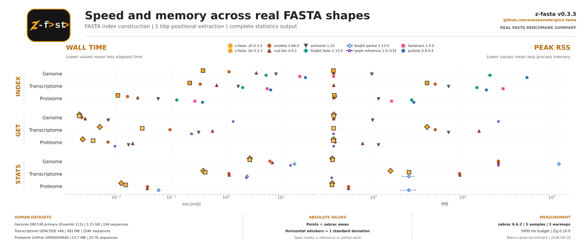
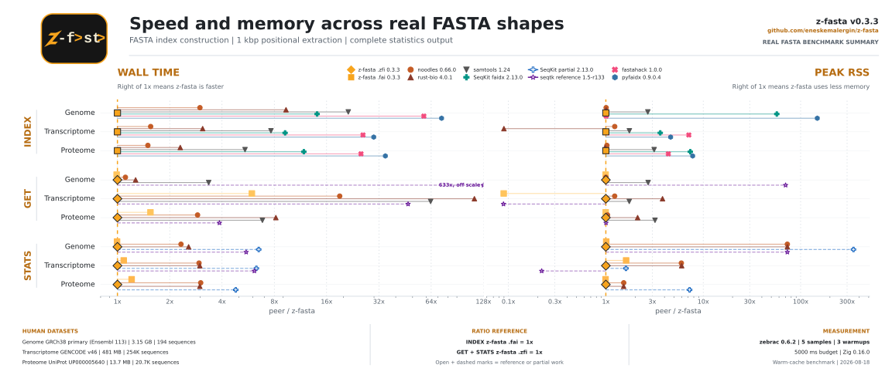
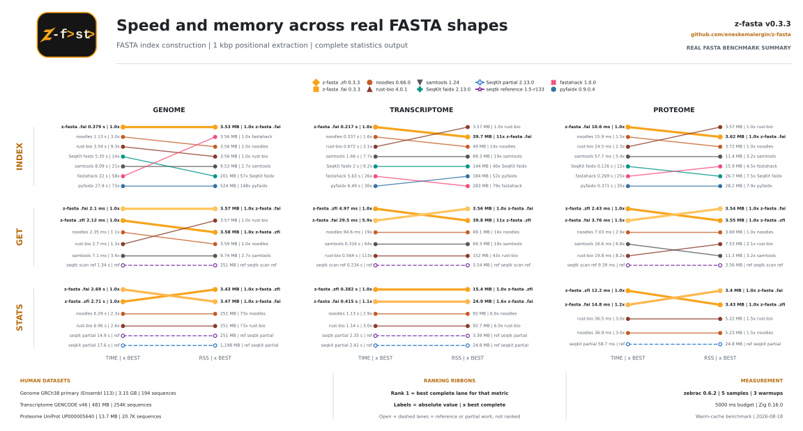

<!-- markdownlint-disable MD033 MD041 -->

# Benchmarking Framework

This is the benchmarking framework for z-fasta. I use it to compare z-fasta with the reference tools across indexing, sequence extraction, and stats. Each suite checks correctness first, then uses [zebrac](https://github.com/eneskemalergin/zebrac) to measure wall time, peak RSS, and page faults.

Zebrac is Linux-only. It is similar to `hyperfine`, but it also records process memory and page faults. It is the runner for the performance sections, not a dependency of z-fasta. The local runner is kept at `tools/zebrac`, separately from the peer-tool installer.

## Published reports

- [Index benchmark report](index/REPORT.md)
- [GET benchmark report](get/REPORT.md)
- [Stats benchmark report](stats/REPORT.md)

Each report describes its own methods, field coverage, correctness checks, measurements, and figures. The suites do not all compare the same operation: stats has complete wrapper lanes and partial SeqKit/Seqtk reference lanes, while GET and index have their own compatibility limits.

## How to run

Run these commands from the repository root:

```bash
bash bench/shared/download_data.sh   # fetch the REAL_* datasets once
zig build -Doptimize=ReleaseFast -Dstrip=true  # build the stripped z-fasta subject
tools/install.sh                     # build/install the local peer tools
bash bench/shared/install_tools.sh   # verify the local toolchain

# Full suite: correctness, performance, and report
bash bench/index/run.sh
bash bench/get/run.sh
bash bench/stats/run.sh

# Correctness only
bash bench/index/run.sh --skip-benchmarks --skip-messy --skip-report
bash bench/get/run.sh --skip-benchmarks --skip-report
bash bench/stats/run.sh --skip-benchmarks --skip-report
```

Each suite has one entrypoint: `bash bench/<index|get|stats>/run.sh`. It runs correctness first, then optional zebrac measurements, then writes `REPORT.md`. The suites have different default sample counts and warmups, so check `--help` or the generated report when those details matter.

The benchmark scripts resolve commands from `tools/bin/` by default. Set `SAMTOOLS`, `BEDTOOLS`, `SEQKIT`, or another tool variable when you intentionally want to compare a different executable. `bench/shared/install_tools.sh` only verifies the local bundle and pinned versions; it does not silently fall back to a command found elsewhere on `PATH`.

The common skips are `--skip-tests` (`--skip-verify`), `--skip-benchmarks` (`--skip-perf`), `--skip-report`, and `--skip-messy`. The last one skips messy performance work only. It does not skip messy correctness cases.

## How the tools are built

`tools/install.sh` is the central builder. The shared version coordinates live in [`tools/versions.sh`](../tools/versions.sh), and the installer uses those same values when it downloads, builds, verifies, and publishes the tools.

The installer builds [samtools](https://github.com/samtools/samtools) 1.24 against [HTSlib](https://github.com/samtools/htslib) 1.24, [bedtools](https://github.com/arq5x/bedtools2) 2.31.1, [seqtk](https://github.com/lh3/seqtk) 1.5-r133, and [fastahack](https://github.com/ekg/fastahack) 1.0.0 from their source archives or Git tag. It stages [SeqKit](https://github.com/shenwei356/seqkit) 2.13.0 from its Linux amd64 release binary rather than rebuilding it. It installs [pyfaidx](https://github.com/mdshw5/pyfaidx) 0.9.0.4 plus Matplotlib 3.10.6, pandas 3.0.1, and tabulate 0.10.0 into the local Python environment, then exposes its `faidx` command through `tools/bin/faidx`.

The published commands go under `tools/bin/`. HTSlib shared libraries go under `tools/lib/`. Downloaded sources stay under `tools/src/`, while compiler work, Cargo state, downloaded archives, and the Python package cache stay under `tools/build/`. The virtual environment is `tools/venv/`. The installer stages the compiled command set before publishing it, and samtools carries an origin-relative library path so the published command works without a system `LD_LIBRARY_PATH` setting.

The z-fasta binary is built separately with `zig build -Doptimize=ReleaseFast -Dstrip=true`. `ReleaseFast` selects the optimization mode; `-Dstrip=true` makes the size comparison use the intended stripped executable. Zebrac is also separate: `tools/install.sh` checks that `tools/zebrac` exists, but does not build it. This keeps the benchmark runner distinct from the tools being compared.

## Rust wrappers

[noodles](https://github.com/zaeleus/noodles) and [rust-bio](https://github.com/rust-bio/rust-bio) are Rust libraries, not matching standalone FASTA CLIs. I compile small release-mode adapters so they can participate in the same benchmark contract and emit the output needed by these suites.

The `noodles` binary uses noodles-fasta 0.66.0, including noodles' FAI indexer. The `rustbio` binary uses rust-bio 4.0.1 and its custom strict FAI scanner. Both adapters expose `index`, `get`, and `stats`; GET also covers the shared region, BED, names, and reverse-complement paths that the benchmark exercises. Their `stats` command re-parses clean FASTA and emits the agreed TSV fields. The shared formulas in [`tools/stats_peer.rs`](../tools/stats_peer.rs) are compiled into both binaries. That file is not another executable and the other peer tools do not use it.

These wrappers add argument parsing, indexing or index reading, output formatting, and the benchmark-specific stats path. Their timings and sizes therefore describe the complete wrapper CLIs, not the upstream Rust crates in isolation. The reports call out where a wrapper is custom or where a peer only covers part of the stats contract.

## Binary sizes

These are the executable files currently used by this checkout on Linux x86_64. The sizes are useful for comparing this local bundle, but they are not universal upstream sizes. Compiler versions, link mode, debug information, stripping, and dependency versions all change them. Every compiled executable in this table is stripped in the current bundle. The table is therefore a build comparison, not a ranking of the projects.

| command     | version or implementation                   |                      file size |
| ----------- | ------------------------------------------- | -----------------------------: |
| `z-fasta`   | 0.3.3, Zig `ReleaseFast`, stripped          |        490,056 bytes (479 KiB) |
| `noodles`   | noodles-fasta 0.66.0 wrapper                |        449,712 bytes (439 KiB) |
| `rustbio`   | rust-bio 4.0.1 wrapper                      |        492,712 bytes (481 KiB) |
| `samtools`  | 1.24 with HTSlib 1.24                       |        869,232 bytes (849 KiB) |
| `bedtools`  | 2.31.1                                      |     2,098,216 bytes (2.00 MiB) |
| `seqkit`    | 2.13.0, upstream Linux amd64 release binary |    20,078,754 bytes (19.2 MiB) |
| `seqtk`     | 1.5-r133                                    |        77,600 bytes (75.8 KiB) |
| `fastahack` | 1.0.0                                       |        89,664 bytes (87.6 KiB) |
| `faidx`     | pyfaidx 0.9.0.4                             | symlink, not a compiled binary |
| `zebrac`    | 0.6.2, static stripped binary               |        588,584 bytes (575 KiB) |

The `faidx` entry is intentionally not given a fake binary size: `tools/bin/faidx` is a 17-byte symlink into `tools/venv`, and the actual command is a Python entry point with its environment and installed package outside that link.

## What the numbers do and do not say

I tried to keep the timed paths direct. GET indexes are prepared before zebrac runs, and stats indexes are preloaded before the timed stats commands. The runners do not add an intentional sleep or throttle. Correctness runs remain separate from performance runs, and the reports record the zebrac samples, warmups, duration, tool versions, and workload metadata.

That still does not prove that every lane has identical overhead. The Rust adapters add a CLI and output layer by design. z-fasta has separate `.zfi` and `.fai` paths, and some peers only support a subset of the requested operation. A benchmark may also expose an implementation bottleneck or an accidental headroom that I have not found yet. Read the results as measurements of these concrete commands and inputs, with the scope notes in each report, rather than as a claim about the underlying libraries in the abstract.

Helpers live in `bench/shared/` (`tools.sh`, `zebrac_runner.sh`, `runner_common.sh`, `download_data.sh`, `install_tools.sh`, `generate_messy.py`, and `generate_scaling.py`). Generated fixtures under `bench/*/data/` and `bench/shared/cache/` are gitignored. Materialize them with `python3 bench/shared/generate_messy.py` and `python3 bench/shared/generate_scaling.py`; use `--force` after changing their parameters. After a full regeneration, commit each suite's `REPORT.md` with its `results/figures/*.png` files so the reports still render on GitHub.

GET messy performance is heavy. Use the skip flags while iterating, then run the full suites before a release tag.

---

## High-level benchmark summary figures

The individual reports above are the source for methods, correctness checks, commands, uncertainty, and the larger benchmark sections. I still wanted a smaller set of figures that gives me a useful overview before I open those reports. A single chart was not enough: absolute measurements, relative differences, and speed-memory tradeoffs answer different questions and can contradict each other in important ways.

These three views therefore use the same selected index, GET, and stats runs but organize them differently. Every view keeps wall time beside peak RSS, covers the same human genome, transcriptome, and proteome inputs, and identifies partial or reference work instead of quietly ranking it as equivalent. They are not three independent benchmark claims and they are not a combined winner score.

GitHub selects the dark or light SVG to match the reader's color scheme.

Regenerate the six SVGs from the selected raw runs configured in `summary/src/representation_common.py` with the existing local Python environment:

```bash
tools/venv/bin/python bench/summary/src/render_01_absolute_matrix.py
tools/venv/bin/python bench/summary/src/render_02_zfasta_reference.py
tools/venv/bin/python bench/summary/src/render_03_ranking_ribbons.py
```

### Absolute measurements

I use this view when I want to know the practical cost of a command. It shows the measured wall time in seconds and peak process memory in MB on logarithmic axes, with the tools kept in their real units rather than normalized to z-fasta. The points are zebrac means and the horizontal whiskers are one standard deviation.

This is the important counterweight to the ratio view: a large relative difference can still describe two very small absolute times, while similar runtimes can hide a large memory difference.

<picture>
  <source media="(prefers-color-scheme: dark)" srcset="summary/01-absolute-matrix-dark.svg">
  <source media="(prefers-color-scheme: light)" srcset="summary/01-absolute-matrix-light.svg">
  
</picture>

### z-fasta reference ratios

This view asks how far each measured lane sits from the relevant z-fasta path for the same task and dataset. Index uses z-fasta `.fai` as `1x`; GET and stats use z-fasta `.zfi` as `1x`. A peer to the right of `1x` took more time or memory than that baseline, while a point to the left used less.

Normalization makes the size of a difference easy to scan across workloads with very different absolute scales. It does not replace the absolute plot, and it does not turn partial stats or scan-based reference lanes into equivalent work; those lanes remain open and dashed.

<picture>
  <source media="(prefers-color-scheme: dark)" srcset="summary/02-zfasta-reference-dark.svg">
  <source media="(prefers-color-scheme: light)" srcset="summary/02-zfasta-reference-light.svg">
  
</picture>

### Ranking ribbons

The ribbons show whether a tool's position changes between speed and memory. Complete lanes are ranked independently for wall time and peak RSS within each task and dataset, then connected across the two rankings. Rank `1` is the best complete lane for that metric, and each label retains both the absolute value and the multiple over the best complete result.

I find this useful when a tool is fast but memory-heavy, or memory-flat but slower, because that tradeoff is visible as a crossing ribbon instead of being flattened into one score. Partial and reference lanes are displayed for context but remain outside the complete ranking.

<picture>
  <source media="(prefers-color-scheme: dark)" srcset="summary/03-ranking-ribbons-dark.svg">
  <source media="(prefers-color-scheme: light)" srcset="summary/03-ranking-ribbons-light.svg">
  
</picture>

All six light and dark SVGs are generated from the benchmark results and version coordinates in this repository. Regenerate the editable outputs from the repository root:

```bash
python3 bench/summary/src/render_01_absolute_matrix.py
python3 bench/summary/src/render_02_zfasta_reference.py
python3 bench/summary/src/render_03_ranking_ribbons.py
```
