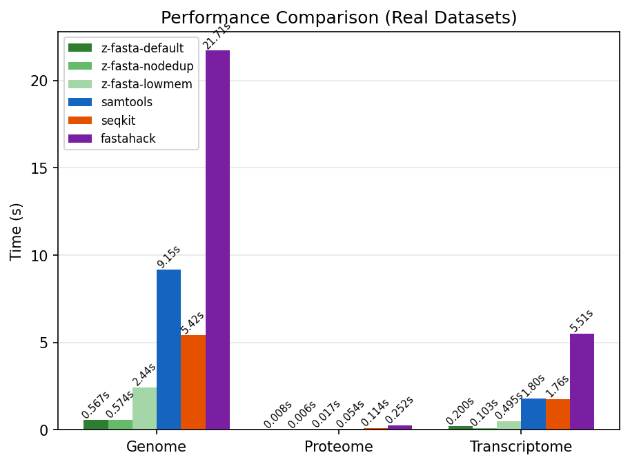
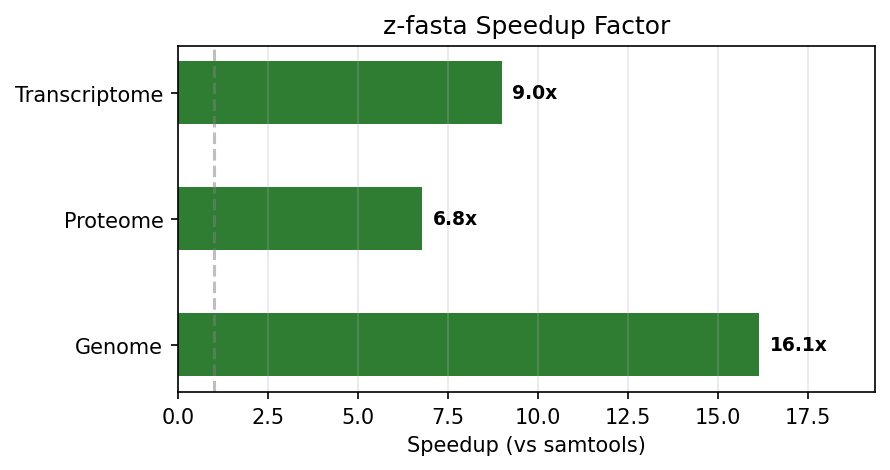
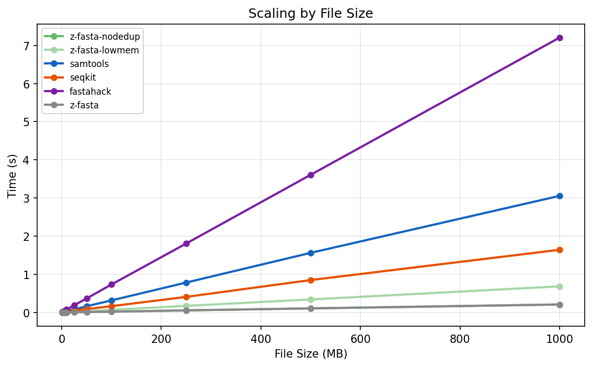
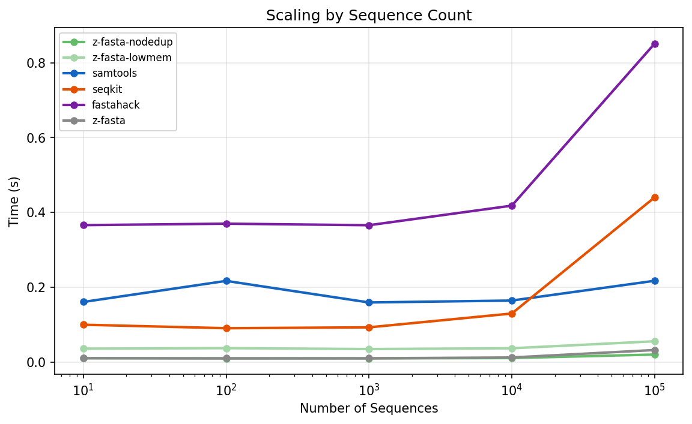
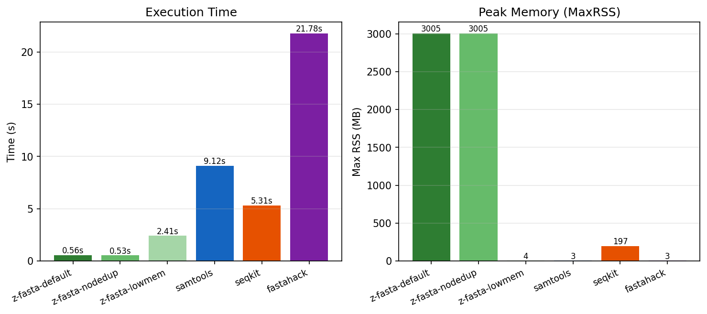
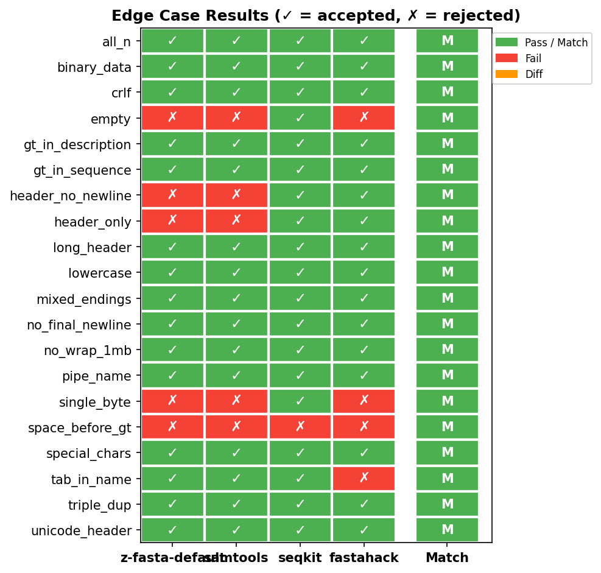

# z-fasta Benchmark Report

_Auto-generated by `generate_report.py`_

## Performance — Real Datasets

| dataset       | z-fasta-default | z-fasta-nodedup | z-fasta-lowmem  | samtools        | seqkit          | fastahack        |
| :------------ | :-------------- | :-------------- | :-------------- | :-------------- | :-------------- | :--------------- |
| Genome        | 0.5671s ±0.0158 | 0.5742s ±0.0070 | 2.4417s ±0.0053 | 9.1540s ±0.0353 | 5.4160s ±0.1000 | 21.7077s ±0.0202 |
| Proteome      | 0.0079s ±0.0005 | 0.0057s ±0.0000 | 0.0171s ±0.0001 | 0.0536s ±0.0001 | 0.1141s ±0.0038 | 0.2523s ±0.0021  |
| Transcriptome | 0.2000s ±0.0003 | 0.1030s ±0.0001 | 0.4953s ±0.0105 | 1.7974s ±0.0016 | 1.7628s ±0.0064 | 5.5079s ±0.0723  |

### Speedup vs samtools

| Dataset       | z-fasta-default vs samtools | z-fasta-nodedup vs samtools | z-fasta-lowmem vs samtools |
| :------------ | :-------------------------- | :-------------------------- | :------------------------- |
| Genome        | **16.1x**                   | **15.9x**                   | **3.7x**                   |
| Proteome      | **6.8x**                    | **9.4x**                    | **3.1x**                   |
| Transcriptome | **9.0x**                    | **17.5x**                   | **3.6x**                   |

## Scaling — File Size

| File Size | z-fasta-nodedup | z-fasta-lowmem | samtools | seqkit | fastahack | z-fasta |
| :-------- | --------------: | -------------: | -------: | -----: | --------: | ------: |
| 1 MB      |          0.0004 |         0.0015 |   0.0054 | 0.0175 |    0.0103 |  0.0005 |
| 5 MB      |          0.0010 |         0.0056 |   0.0201 | 0.0217 |    0.0390 |  0.0012 |
| 10 MB     |          0.0020 |         0.0090 |   0.0361 | 0.0304 |    0.0778 |  0.0024 |
| 25 MB     |          0.0058 |         0.0209 |   0.0835 | 0.0517 |    0.1874 |  0.0059 |
| 50 MB     |          0.0112 |         0.0359 |   0.1627 | 0.0890 |    0.3669 |  0.0115 |
| 100 MB    |          0.0210 |         0.0702 |   0.3166 | 0.1655 |    0.7337 |  0.0213 |
| 250 MB    |          0.0558 |         0.1736 |   0.7842 | 0.4086 |    1.8065 |  0.0553 |
| 500 MB    |          0.1080 |         0.3414 |   1.5624 | 0.8495 |    3.6080 |  0.1065 |
| 1000 MB   |          0.2104 |         0.6848 |   3.0563 | 1.6432 |    7.2046 |  0.2090 |

## Scaling — Sequence Count

| Sequences | z-fasta-nodedup | z-fasta-lowmem | samtools | seqkit | fastahack | z-fasta |
| :-------- | --------------: | -------------: | -------: | -----: | --------: | ------: |
| 10        |          0.0107 |         0.0362 |   0.1609 | 0.1001 |    0.3661 |  0.0107 |
| 100       |          0.0101 |         0.0375 |   0.2171 | 0.0908 |    0.3700 |  0.0103 |
| 1,000     |          0.0102 |         0.0351 |   0.1595 | 0.0931 |    0.3659 |  0.0104 |
| 10,000    |          0.0110 |         0.0372 |   0.1647 | 0.1300 |    0.4182 |  0.0126 |
| 100,000   |          0.0204 |         0.0559 |   0.2174 | 0.4404 |    0.8512 |  0.0325 |

## Memory Usage

| Tool            | Time (s) | MaxRSS (KB) | MaxRSS (MB) | Major Faults | Minor Faults |
| :-------------- | -------: | :---------- | ----------: | -----------: | :----------- |
| z-fasta-default |     0.56 | 3,077,416   |     3005.29 |            0 | 48,331       |
| z-fasta-nodedup |     0.53 | 3,077,416   |     3005.29 |            0 | 48,326       |
| z-fasta-lowmem  |     2.41 | 4,096       |        4.00 |            0 | 1,267        |
| samtools        |     9.12 | 3,364       |        3.29 |            0 | 315          |
| seqkit          |     5.31 | 201,584     |      196.86 |            0 | 641,441      |
| fastahack       |    21.78 | 3,420       |        3.34 |            0 | 383          |

> **Note:** MaxRSS from `/usr/bin/time -v` includes mmap'd pages. For mmap-based indexers (z-fasta-default, samtools), reported RSS reflects file size, not heap allocation. Use `--low-mem` for true streaming memory.
>
> **Page faults:** Major faults = blocking disk reads (should be ~0 on warm cache). Minor faults = non-blocking page mappings — a high count for mmap tools confirms the OS is seamlessly mapping file pages to RAM without blocking I/O.

## Edge Case Correctness

> **z-fasta vs samtools output match: 20 / 20**

| Test Case         | z-fasta-default | samtools | seqkit | fastahack | Match |
| :---------------- | :-------------- | :------- | :----- | :-------- | :---- |
| all_n             | ✓               | ✓        | ✓      | ✓         | MATCH |
| binary_data       | ✓               | ✓        | ✓      | ✓         | MATCH |
| crlf              | ✓               | ✓        | ✓      | ✓         | MATCH |
| empty             | ✗               | ✗        | ✓      | ✗         | MATCH |
| gt_in_description | ✓               | ✓        | ✓      | ✓         | MATCH |
| gt_in_sequence    | ✓               | ✓        | ✓      | ✓         | MATCH |
| header_no_newline | ✗               | ✗        | ✓      | ✓         | MATCH |
| header_only       | ✗               | ✗        | ✓      | ✓         | MATCH |
| long_header       | ✓               | ✓        | ✓      | ✓         | MATCH |
| lowercase         | ✓               | ✓        | ✓      | ✓         | MATCH |
| mixed_endings     | ✓               | ✓        | ✓      | ✓         | MATCH |
| no_final_newline  | ✓               | ✓        | ✓      | ✓         | MATCH |
| no_wrap_1mb       | ✓               | ✓        | ✓      | ✓         | MATCH |
| pipe_name         | ✓               | ✓        | ✓      | ✓         | MATCH |
| single_byte       | ✗               | ✗        | ✓      | ✗         | MATCH |
| space_before_gt   | ✗               | ✗        | ✗      | ✗         | MATCH |
| special_chars     | ✓               | ✓        | ✓      | ✓         | MATCH |
| tab_in_name       | ✓               | ✓        | ✓      | ✗         | MATCH |
| triple_dup        | ✓               | ✓        | ✓      | ✓         | MATCH |
| unicode_header    | ✓               | ✓        | ✓      | ✓         | MATCH |

## Tools Tested

| Tool            | Description                                         |
| --------------- | --------------------------------------------------- |
| z-fasta-default | Zig FASTA indexer (mmap + dedup, default)           |
| z-fasta-nodedup | z-fasta with `--no-dedup` (skip duplicate checking) |
| z-fasta-lowmem  | z-fasta with `--low-mem` (streaming, no mmap)       |
| samtools        | `samtools faidx` — industry standard                |
| seqkit          | `seqkit faidx` — Go bioinformatics toolkit          |
| fastahack       | `fastahack -i` — C++ FASTA indexer                  |
