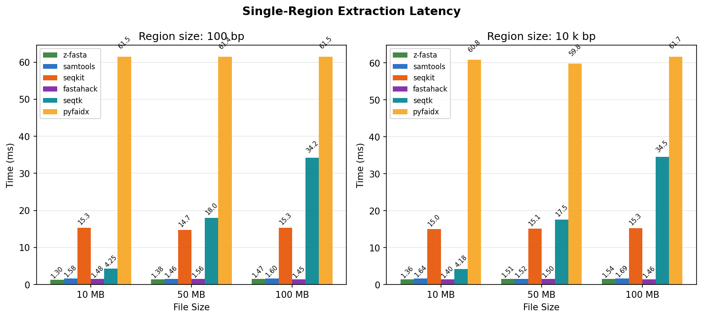
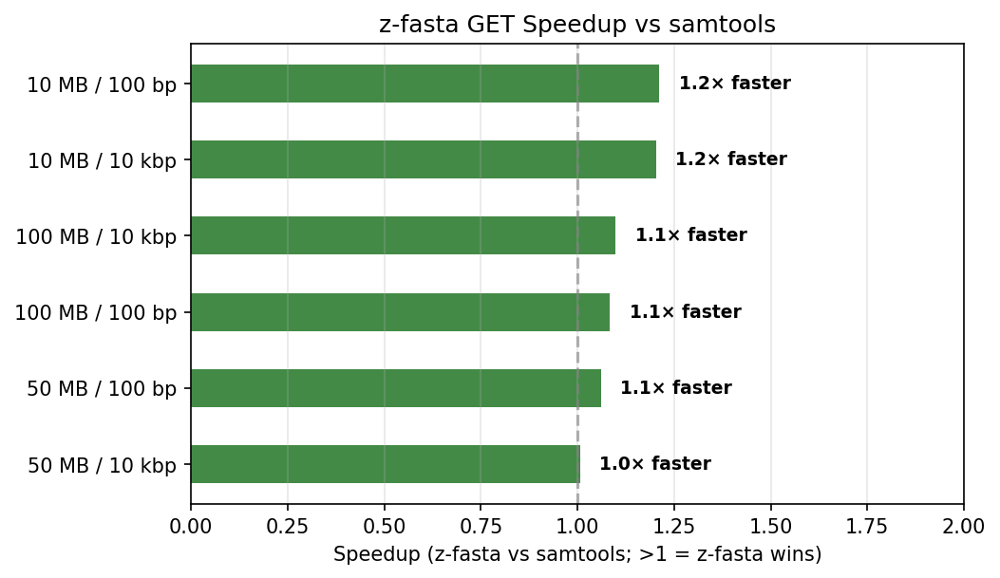
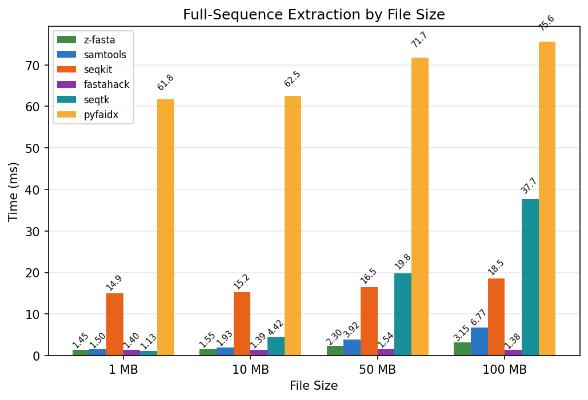
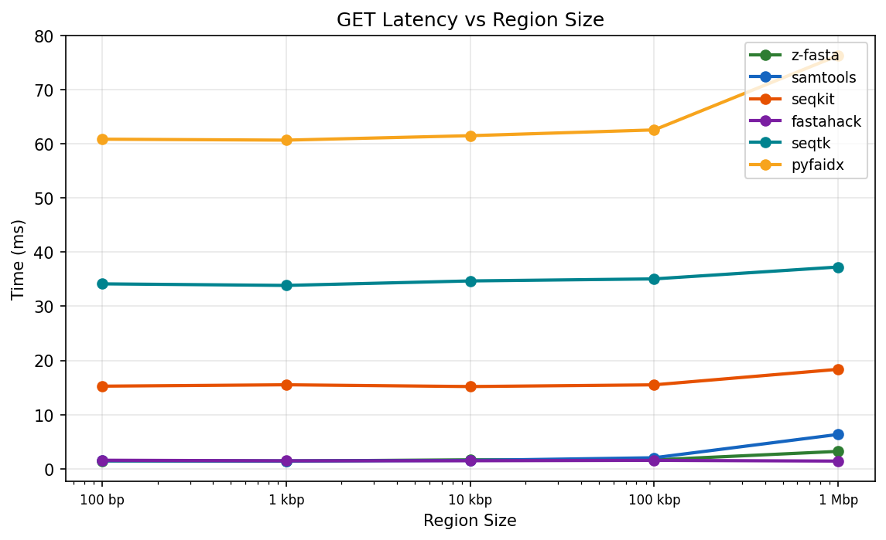
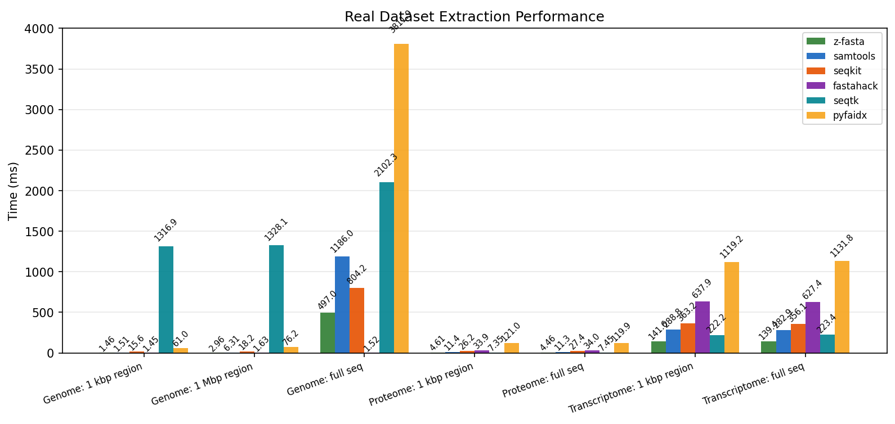

# z-fasta GET Benchmark Report

_Auto-generated by `generate_report.py`_

## Single-Region Extraction Latency

> All measurements on warm cache. Each benchmark extracts a region from the **middle** of the target file.

| benchmark       | z-fasta         | samtools        | seqkit          | fastahack       | seqtk           | pyfaidx         |
|:----------------|:----------------|:----------------|:----------------|:----------------|:----------------|:----------------|
| 10 MB / 10 kbp  | 0.0014s ±0.0000 | 0.0016s ±0.0001 | 0.0150s ±0.0004 | 0.0014s ±0.0001 | 0.0042s ±0.0001 | 0.0608s ±0.0012 |
| 10 MB / 100 bp  | 0.0013s ±0.0000 | 0.0016s ±0.0002 | 0.0153s ±0.0005 | 0.0015s ±0.0002 | 0.0042s ±0.0001 | 0.0615s ±0.0026 |
| 100 MB / 10 kbp | 0.0015s ±0.0001 | 0.0017s ±0.0003 | 0.0153s ±0.0005 | 0.0015s ±0.0001 | 0.0345s ±0.0005 | 0.0617s ±0.0015 |
| 100 MB / 100 bp | 0.0015s ±0.0000 | 0.0016s ±0.0001 | 0.0153s ±0.0004 | 0.0014s ±0.0001 | 0.0342s ±0.0005 | 0.0615s ±0.0012 |
| 50 MB / 10 kbp  | 0.0015s ±0.0000 | 0.0015s ±0.0000 | 0.0151s ±0.0004 | 0.0015s ±0.0001 | 0.0175s ±0.0004 | 0.0598s ±0.0010 |
| 50 MB / 100 bp  | 0.0014s ±0.0001 | 0.0015s ±0.0001 | 0.0147s ±0.0007 | 0.0016s ±0.0005 | 0.0180s ±0.0019 | 0.0614s ±0.0011 |

> **Interpretation:** z-fasta small-region extraction is startup-dominated: the measured path is O(1) index lookup + `pread`, with ~1-2 ms end-to-end CLI latency on this host. seqkit carries a ~14 ms Go runtime startup cost that dominates at small regions. fastahack and samtools are in the same low-millisecond range for indexed single-region access.

### Speedup vs samtools

| Benchmark       | z-fasta vs samtools   |
|:----------------|:----------------------|
| 10 MB / 10 kbp  | **1.2×**              |
| 10 MB / 100 bp  | **1.2×**              |
| 100 MB / 10 kbp | **1.1×**              |
| 100 MB / 100 bp | **1.1×**              |
| 50 MB / 10 kbp  | **1.0×**              |
| 50 MB / 100 bp  | **1.1×**              |

## Full-Sequence Extraction

| benchmark     | z-fasta         | samtools        | seqkit          | fastahack       | seqtk           | pyfaidx         |
|:--------------|:----------------|:----------------|:----------------|:----------------|:----------------|:----------------|
| 1 MB (full)   | 0.0014s ±0.0003 | 0.0015s ±0.0001 | 0.0149s ±0.0003 | 0.0014s ±0.0001 | 0.0011s ±0.0000 | 0.0618s ±0.0021 |
| 10 MB (full)  | 0.0016s ±0.0001 | 0.0019s ±0.0000 | 0.0152s ±0.0007 | 0.0014s ±0.0001 | 0.0044s ±0.0001 | 0.0625s ±0.0011 |
| 100 MB (full) | 0.0031s ±0.0001 | 0.0068s ±0.0001 | 0.0185s ±0.0004 | 0.0014s ±0.0001 | 0.0377s ±0.0008 | 0.0756s ±0.0004 |
| 50 MB (full)  | 0.0023s ±0.0001 | 0.0039s ±0.0001 | 0.0165s ±0.0006 | 0.0015s ±0.0003 | 0.0198s ±0.0016 | 0.0717s ±0.0041 |

### Speedup vs samtools (and fastahack)

| Benchmark     | z-fasta vs samtools   | z-fasta vs fastahack     |
|:--------------|:----------------------|:-------------------------|
| 1 MB (full)   | **1.0×**              | 0.97× (fastahack faster) |
| 10 MB (full)  | **1.2×**              | 0.90× (fastahack faster) |
| 100 MB (full) | **2.1×**              | 0.44× (fastahack faster) |
| 50 MB (full)  | **1.7×**              | 0.67× (fastahack faster) |

> **Note:** fastahack is faster than z-fasta for large full-sequence extraction (≥50 MB). fastahack uses a simpler unbuffered write path while z-fasta's buffered I/O adds overhead proportional to sequence length. This is an optimization target for a future release.

## Region-Size Scaling

| Region Size   |   z-fasta |   samtools |   seqkit |   fastahack |   seqtk |   pyfaidx |
|:--------------|----------:|-----------:|---------:|------------:|--------:|----------:|
| 100 bp        |    0.0015 |     0.0015 |   0.0153 |      0.0016 |  0.0341 |    0.0608 |
| 1 kbp         |    0.0014 |     0.0014 |   0.0155 |      0.0015 |  0.0339 |    0.0607 |
| 10 kbp        |    0.0017 |     0.0015 |   0.0152 |      0.0015 |  0.0347 |    0.0615 |
| 100 kbp       |    0.0016 |     0.0020 |   0.0155 |      0.0016 |  0.0351 |    0.0626 |
| 1 Mbp         |    0.0032 |     0.0063 |   0.0184 |      0.0014 |  0.0373 |    0.0763 |

> **Interpretation:** Latency is O(1) up to ~10 kbp. Process startup and index lookup dominate below that threshold. Above ~100 kbp it grows linearly with region size as the I/O read cost dominates. fastahack's output advantage grows with region size due to its simpler write path.

## Real Dataset Extraction

| benchmark                   | z-fasta         | samtools        | seqkit          | fastahack       | seqtk           | pyfaidx         |
|:----------------------------|:----------------|:----------------|:----------------|:----------------|:----------------|:----------------|
| Genome: 1 Mbp region        | 0.0030s ±0.0001 | 0.0063s ±0.0000 | 0.0182s ±0.0008 | 0.0016s ±0.0004 | 1.3281s ±0.0116 | 0.0762s ±0.0017 |
| Genome: 1 kbp region        | 0.0015s ±0.0001 | 0.0015s ±0.0001 | 0.0156s ±0.0004 | 0.0014s ±0.0001 | 1.3169s ±0.0158 | 0.0610s ±0.0021 |
| Genome: full seq            | 0.4970s ±0.0193 | 1.1860s ±0.0044 | 0.8042s ±0.0145 | 0.0015s ±0.0001 | 2.1023s ±0.0087 | 3.8119s ±0.0108 |
| Proteome: 1 kbp region      | 0.0046s ±0.0003 | 0.0114s ±0.0002 | 0.0262s ±0.0006 | 0.0339s ±0.0005 | 0.0074s ±0.0003 | 0.1210s ±0.0030 |
| Proteome: full seq          | 0.0045s ±0.0005 | 0.0113s ±0.0003 | 0.0274s ±0.0010 | 0.0340s ±0.0004 | 0.0074s ±0.0001 | 0.1199s ±0.0004 |
| Transcriptome: 1 kbp region | 0.1416s ±0.0017 | 0.2888s ±0.0104 | 0.3632s ±0.0023 | 0.6379s ±0.0109 | 0.2222s ±0.0033 | 1.1192s ±0.0186 |
| Transcriptome: full seq     | 0.1394s ±0.0018 | 0.2829s ±0.0061 | 0.3561s ±0.0096 | 0.6274s ±0.0164 | 0.2234s ±0.0030 | 1.1318s ±0.0234 |

## Memory Usage

> RSS measured with `/usr/bin/time -v`. For mmap-based tools (z-fasta, samtools, fastahack) RSS reflects file pages mapped by the OS, not heap allocation. `Major Faults` should be ~0 on warm cache.

| Tool      | Region   |   Time (s) | MaxRSS (KB)   |   Maj. Faults |
|:----------|:---------|-----------:|:--------------|--------------:|
| z-fasta   | small    |     0.0000 | 7,192         |             0 |
| samtools  | small    |     0.0000 | 3,604         |             0 |
| seqkit    | small    |     0.0100 | 18,268        |             0 |
| fastahack | small    |     0.0000 | 3,472         |             0 |
| seqtk     | small    |     0.0300 | 3,376         |             0 |
| pyfaidx   | small    |     0.0600 | 17,352        |             0 |
| z-fasta   | large    |     0.0000 | 8,220         |             0 |
| samtools  | large    |     0.0000 | 4,140         |             0 |
| seqkit    | large    |     0.0100 | 19,908        |             0 |
| fastahack | large    |     0.0000 | 3,412         |             0 |
| seqtk     | large    |     0.0300 | 3,392         |             0 |
| pyfaidx   | large    |     0.0700 | 19,396        |             0 |
| z-fasta   | full     |     0.0000 | 8,220         |             0 |
| samtools  | full     |     0.0000 | 4,112         |             0 |
| seqkit    | full     |     0.0100 | 20,720        |             0 |
| fastahack | full     |     0.0000 | 3,412         |             0 |
| seqtk     | full     |     0.0300 | 3,464         |             0 |
| pyfaidx   | full     |     0.0700 | 19,408        |             0 |

## Multi-Region Extraction (v0.2.4)

> Time to extract N regions in a single CLI call, loading the index once and streaming all results to stdout. z-fasta uses O(1) offset lookup per region. samtools re-parses its FAI header per call but otherwise uses the same mmap strategy. seqtk scan time dominates because it has no index.

|   Regions | z-fasta   | samtools   | seqtk    |
|----------:|:----------|:-----------|:---------|
|         1 | 145.4 ms  | 286.4 ms   | 221.7 ms |
|        10 | 139.3 ms  | 286.5 ms   | 226.5 ms |
|        50 | 141.7 ms  | 279.9 ms   | 223.5 ms |
|       100 | 137.3 ms  | 288.2 ms   | 228.0 ms |

### Speedup vs samtools (multi-region)

|   Regions |   z-fasta (ms) |   samtools (ms) | Speedup   |
|----------:|---------------:|----------------:|:----------|
|         1 |          145.4 |           286.4 | **2.0x**  |
|        10 |          139.3 |           286.5 | **2.1x**  |
|        50 |          141.7 |           279.9 | **2.0x**  |
|       100 |          137.3 |           288.2 | **2.1x**  |

> **Note:** seqtk does not use an index for region extraction. It performs a full-file scan for every call regardless of region count, so its time is roughly constant here and reflects file I/O cost, not region count. It is listed for reference only.
