<!-- markdownlint-disable MD024 MD032 MD033 MD036 MD041 MD049 -->

# z-fasta GET Benchmark Report

_Auto-generated by `bench/get/generate_report.py` from zebrac results._

## Overview

This report compares `z-fasta get` to other FASTA region fetch tools on preloaded `.zfi` and `.fai` sidecars. Wall time, peak RSS, and page faults come from the same zebrac samples for every tool in each section.

Other timed tools are **peers**: they perform the same GET work (named regions, multi-region batches, or BED batch fetch) on the same fixtures. Charts label peer ratios as **peer / z-fasta**. **Reference lanes** (seqtk positional, multi-region subprocess loops) use different invocation patterns and appear hatched when present.

**Performance:** positional extraction (wall time, RSS, page faults vs region size), multi-region batching (N=1, 10, 100, 1,000; one get with N×1 kbp regions), and BED batch (`get --bed`; 10–10,000 rows × 1 kbp; three-panel grouped bars per metric) on each REAL dataset present in this run, RC overhead on nucleotide datasets, and z-fasta messy vs uniform GET pairs on verify fixtures.

**Correctness:** `bench/get/verify.sh` (not timed here) checks byte-identical output against golden fixtures.

**Tool order in charts:** z-fasta, noodles, rust-bio, samtools, fastahack (on `full seq`), then reference lanes (seqtk positional; multi seqtk/fastahack loops omitted from default timed runs). **bedtools** is timed in **Performance: BED batch** (`bedtools getfasta`); it is not a positional or multi-region peer because those workloads use region/name syntax, not BED files.

**Multi-region reference loops** (seqtk, fastahack: one subprocess per region) are **omitted from default timed runs** because wall time grows linearly with N and largely duplicates positional seqtk reference data. Set `GET_MULTI_REFERENCE=1` in `run.sh` for a one-off reference sweep.

**pyfaidx** is omitted from timed runs: Python per-call overhead makes it much slower on these fixtures, which would dominate charts and lengthen reruns. Enable it in `run.sh` if needed.

**fastahack** positional timing uses `fastahack -r` on **`full seq`** rows (whole-entry fetch on bounded sequences; see fixture notes in `run.sh`).

**seqtk (ref)** positional timing pipes one region via stdin on each call with no persistent index. It appears in charts with hatched bars. On large indexed FASTA files (e.g. Genome), seqtk rescans the whole file each call, so log-scale wall-time charts compress indexed tools near the bottom; compare indexed peers within each region, not bar height vs seqtk.

_Messy GET used higher zebrac sampling (50 runs, 10 warmup, 30000 ms) because timings are sub-millisecond._

## Run Provenance

Run **`20260708_125228`** used **zebrac** in **warm** mode: 10 measured samples, 3 warmup passes, 5000 ms minimum per sample.

- **Subject:** z-fasta 0.2.9 (Zig; default `.zfi` get, `.fai` lane, chunk modes in tables)

- **Runner:** zebrac 0.6.0

- **Artifacts:** `results/perf_pos_20260708_125228/` positional extraction; `results/perf_multi_20260708_125228/` multi-region scaling; `results/perf_bed_20260708_125228/` BED batch; `results/perf_rc_20260708_125228/` RC overhead; `results/messy_20260708_125228/` messy FASTA; metadata in `results/metadata_20260708_125228.jsonl`

- **Messy GET zebrac:** 50 samples, 10 warmup, 30000 ms (headline sections use 10/3/5000 ms).

**Data used** (human reference files in `bench/shared/data/`; fetch with `bench/shared/download_data.sh`):
- **Genome** (`REAL_Genome.fa`): Homo sapiens GRCh38 primary assembly (Ensembl release 113). 194 sequences, 3.10 Gbp total, 2.93 GiB on disk.
- **Transcriptome** (`REAL_Transcriptome.fa`): Homo sapiens GENCODE v46 transcript sequences. 254,070 transcripts, 444 Mbp total, 458.7 MiB on disk.
- **Proteome** (`REAL_Proteome.fasta`): Homo sapiens UniProt reference proteome UP000005640. 20,659 proteins, 11.5 M residues total, 13.1 MiB on disk.

**Peers in this run** (same GET task; versions captured at benchmark time; vendored pins in `bench/shared/install_tools.sh`):
- **samtools** (C): samtools 1.13 via `samtools faidx region` (from `samtools --version`)
- **bedtools** (C++): bedtools v2.30.0 via `bedtools getfasta` (from `bedtools --version`)
- **noodles** (Rust): noodles-fasta 0.61 (wrapper) via `tools/noodles_wrapper get` (from noodles-fasta crate in `tools/noodles_wrapper/Cargo.toml`; pin 0.61)
- **rust-bio** (Rust): rust-bio 2.3 (custom indexer wrapper) via `tools/rustbio_wrapper get` (from bio crate in `tools/rustbio_wrapper/Cargo.toml`; pin 2.3)
- **fastahack** (C++): fastahack 1.0.0 (directory pin) via `fastahack region` (from directory pin `tools/fastahack-1.0.0/`; pin 1.0.0)
- **seqtk** (C): seqtk 1.5-r133 via `seqtk subseq (reference loop)` (from `seqtk 2>&1`)

Indexes (`.zfi` / `.fai`) are built once in preload before timed GET commands. Timed commands do not delete sidecars.

## Performance: Positional extraction

Positional GET on preloaded indexes. Three panels (Genome, Proteome, Transcriptome) with grouped bars per region size. **`full seq`** is a whole-entry fetch on a bounded sequence (Genome ≤1 kbp; Transcriptome/Proteome medium entries, not titin). Tool order: z-fasta, noodles, rust-bio, samtools, fastahack (when present), seqtk (ref).

**Table 1:** Wall time (mean ± stddev, seconds). Lower is better. Same tool order as the figure.

| dataset_region           | z-fasta         | noodles         | rust-bio        | samtools        | fastahack       | seqtk (ref)     |
|:-------------------------|:----------------|:----------------|:----------------|:----------------|:----------------|:----------------|
| Genome / 1 kbp           | 0.0021s ±0.0000 | 0.0024s ±0.0001 | 0.0025s ±0.0001 | 0.0031s ±0.0001 | nan             | 1.2988s ±0.0054 |
| Genome / 10 kbp          | 0.0022s ±0.0001 | 0.0024s ±0.0001 | 0.0026s ±0.0001 | 0.0031s ±0.0001 | nan             | 1.3033s ±0.0146 |
| Genome / 100 bp          | 0.0023s ±0.0002 | 0.0026s ±0.0002 | 0.0026s ±0.0002 | 0.0032s ±0.0001 | nan             | 1.3322s ±0.0771 |
| Genome / full seq        | 0.0022s ±0.0001 | 0.0024s ±0.0001 | 0.0026s ±0.0001 | 0.0031s ±0.0001 | 0.0031s ±0.0001 | 1.3044s ±0.0097 |
| Proteome / 1 kbp         | 0.0028s ±0.0001 | 0.0067s ±0.0001 | 0.0201s ±0.0007 | 0.0130s ±0.0007 | nan             | 0.0095s ±0.0008 |
| Proteome / 10 kbp        | 0.0027s ±0.0002 | 0.0067s ±0.0002 | 0.0196s ±0.0004 | 0.0127s ±0.0001 | nan             | 0.0095s ±0.0005 |
| Proteome / 100 bp        | 0.0027s ±0.0003 | 0.0068s ±0.0002 | 0.0200s ±0.0006 | 0.0130s ±0.0003 | nan             | 0.0093s ±0.0003 |
| Proteome / full seq      | 0.0027s ±0.0002 | 0.0066s ±0.0001 | 0.0193s ±0.0003 | 0.0126s ±0.0002 | 0.0350s ±0.0003 | 0.0089s ±0.0001 |
| Transcriptome / 1 kbp    | 0.0042s ±0.0002 | 0.0879s ±0.0015 | 0.5477s ±0.0135 | 0.2980s ±0.0078 | nan             | 0.2218s ±0.0017 |
| Transcriptome / 10 kbp   | 0.0044s ±0.0003 | 0.0881s ±0.0014 | 0.5336s ±0.0079 | 0.2880s ±0.0038 | nan             | 0.2214s ±0.0021 |
| Transcriptome / 100 bp   | 0.0042s ±0.0002 | 0.0872s ±0.0011 | 0.5266s ±0.0069 | 0.2878s ±0.0074 | nan             | 0.2235s ±0.0031 |
| Transcriptome / full seq | 0.0130s ±0.0002 | 0.0872s ±0.0015 | 0.5354s ±0.0097 | 0.2811s ±0.0035 | 0.6287s ±0.0090 | 0.2204s ±0.0028 |

<strong>Table 2:</strong> Output throughput (Mbp/s) from metadata <code>output_bases</code> and wall time. Higher is better. Same tools and order as Table 1.

| dataset_region           | z-fasta    | noodles     | rust-bio    | samtools    | fastahack   | seqtk (ref)   |
|:-------------------------|:-----------|:------------|:------------|:------------|:------------|:--------------|
| Genome / 1 kbp           | 0.47 Mbp/s | 0.42 Mbp/s  | 0.39 Mbp/s  | 0.32 Mbp/s  | nan         | 0.001 Mbp/s   |
| Genome / 10 kbp          | 4.50 Mbp/s | 4.11 Mbp/s  | 3.88 Mbp/s  | 3.18 Mbp/s  | nan         | 0.008 Mbp/s   |
| Genome / 100 bp          | 0.04 Mbp/s | 0.04 Mbp/s  | 0.04 Mbp/s  | 0.03 Mbp/s  | nan         | 0.000 Mbp/s   |
| Genome / full seq        | 0.44 Mbp/s | 0.40 Mbp/s  | 0.37 Mbp/s  | 0.32 Mbp/s  | 0.32 Mbp/s  | 0.001 Mbp/s   |
| Proteome / 1 kbp         | 0.36 Mbp/s | 0.15 Mbp/s  | 0.05 Mbp/s  | 0.08 Mbp/s  | nan         | 0.11 Mbp/s    |
| Proteome / 10 kbp        | 3.74 Mbp/s | 1.50 Mbp/s  | 0.51 Mbp/s  | 0.78 Mbp/s  | nan         | 1.06 Mbp/s    |
| Proteome / 100 bp        | 0.04 Mbp/s | 0.01 Mbp/s  | 0.005 Mbp/s | 0.008 Mbp/s | nan         | 0.01 Mbp/s    |
| Proteome / full seq      | 0.18 Mbp/s | 0.08 Mbp/s  | 0.03 Mbp/s  | 0.04 Mbp/s  | 0.01 Mbp/s  | 0.06 Mbp/s    |
| Transcriptome / 1 kbp    | 0.24 Mbp/s | 0.01 Mbp/s  | 0.002 Mbp/s | 0.003 Mbp/s | nan         | 0.005 Mbp/s   |
| Transcriptome / 10 kbp   | 2.26 Mbp/s | 0.11 Mbp/s  | 0.02 Mbp/s  | 0.03 Mbp/s  | nan         | 0.05 Mbp/s    |
| Transcriptome / 100 bp   | 0.02 Mbp/s | 0.001 Mbp/s | 0.000 Mbp/s | 0.000 Mbp/s | nan         | 0.000 Mbp/s   |
| Transcriptome / full seq | 0.08 Mbp/s | 0.01 Mbp/s  | 0.002 Mbp/s | 0.004 Mbp/s | 0.002 Mbp/s | 0.005 Mbp/s   |

<strong>Table 3:</strong> z-fasta vs each peer. Speedup = peer wall time ÷ z-fasta wall time (higher = z-fasta faster). Includes reference lanes. Same ratios as bar labels on Figure 1.

| Dataset / region         | z-fasta vs   | z-fasta   | Peer    | Speedup   |
|:-------------------------|:-------------|:----------|:--------|:----------|
| Genome / 1 kbp           | noodles      | 0.0021s   | 0.0024s | 1.13×     |
| Genome / 1 kbp           | rust-bio     | 0.0021s   | 0.0025s | 1.20×     |
| Genome / 1 kbp           | samtools     | 0.0021s   | 0.0031s | 1.46×     |
| Genome / 1 kbp           | seqtk (ref)  | 0.0021s   | 1.2988s | 612×      |
| Genome / 10 kbp          | noodles      | 0.0022s   | 0.0024s | 1.10×     |
| Genome / 10 kbp          | rust-bio     | 0.0022s   | 0.0026s | 1.16×     |
| Genome / 10 kbp          | samtools     | 0.0022s   | 0.0031s | 1.41×     |
| Genome / 10 kbp          | seqtk (ref)  | 0.0022s   | 1.3033s | 586×      |
| Genome / 100 bp          | noodles      | 0.0023s   | 0.0026s | 1.14×     |
| Genome / 100 bp          | rust-bio     | 0.0023s   | 0.0026s | 1.16×     |
| Genome / 100 bp          | samtools     | 0.0023s   | 0.0032s | 1.40×     |
| Genome / 100 bp          | seqtk (ref)  | 0.0023s   | 1.3322s | 591×      |
| Genome / full seq        | noodles      | 0.0022s   | 0.0024s | 1.09×     |
| Genome / full seq        | rust-bio     | 0.0022s   | 0.0026s | 1.17×     |
| Genome / full seq        | samtools     | 0.0022s   | 0.0031s | 1.38×     |
| Genome / full seq        | fastahack    | 0.0022s   | 0.0031s | 1.37×     |
| Genome / full seq        | seqtk (ref)  | 0.0022s   | 1.3044s | 586×      |
| Proteome / 1 kbp         | noodles      | 0.0028s   | 0.0067s | 2.4×      |
| Proteome / 1 kbp         | rust-bio     | 0.0028s   | 0.0201s | 7.2×      |
| Proteome / 1 kbp         | samtools     | 0.0028s   | 0.0130s | 4.7×      |
| Proteome / 1 kbp         | seqtk (ref)  | 0.0028s   | 0.0095s | 3.4×      |
| Proteome / 10 kbp        | noodles      | 0.0027s   | 0.0067s | 2.5×      |
| Proteome / 10 kbp        | rust-bio     | 0.0027s   | 0.0196s | 7.3×      |
| Proteome / 10 kbp        | samtools     | 0.0027s   | 0.0127s | 4.8×      |
| Proteome / 10 kbp        | seqtk (ref)  | 0.0027s   | 0.0095s | 3.5×      |
| Proteome / 100 bp        | noodles      | 0.0027s   | 0.0068s | 2.5×      |
| Proteome / 100 bp        | rust-bio     | 0.0027s   | 0.0200s | 7.5×      |
| Proteome / 100 bp        | samtools     | 0.0027s   | 0.0130s | 4.9×      |
| Proteome / 100 bp        | seqtk (ref)  | 0.0027s   | 0.0093s | 3.5×      |
| Proteome / full seq      | noodles      | 0.0027s   | 0.0066s | 2.4×      |
| Proteome / full seq      | rust-bio     | 0.0027s   | 0.0193s | 7.1×      |
| Proteome / full seq      | samtools     | 0.0027s   | 0.0126s | 4.6×      |
| Proteome / full seq      | fastahack    | 0.0027s   | 0.0350s | 12.9×     |
| Proteome / full seq      | seqtk (ref)  | 0.0027s   | 0.0089s | 3.3×      |
| Transcriptome / 1 kbp    | noodles      | 0.0042s   | 0.0879s | 21.1×     |
| Transcriptome / 1 kbp    | rust-bio     | 0.0042s   | 0.5477s | 131×      |
| Transcriptome / 1 kbp    | samtools     | 0.0042s   | 0.2980s | 71.5×     |
| Transcriptome / 1 kbp    | seqtk (ref)  | 0.0042s   | 0.2218s | 53.2×     |
| Transcriptome / 10 kbp   | noodles      | 0.0044s   | 0.0881s | 19.9×     |
| Transcriptome / 10 kbp   | rust-bio     | 0.0044s   | 0.5336s | 121×      |
| Transcriptome / 10 kbp   | samtools     | 0.0044s   | 0.2880s | 65.1×     |
| Transcriptome / 10 kbp   | seqtk (ref)  | 0.0044s   | 0.2214s | 50.1×     |
| Transcriptome / 100 bp   | noodles      | 0.0042s   | 0.0872s | 20.7×     |
| Transcriptome / 100 bp   | rust-bio     | 0.0042s   | 0.5266s | 125×      |
| Transcriptome / 100 bp   | samtools     | 0.0042s   | 0.2878s | 68.4×     |
| Transcriptome / 100 bp   | seqtk (ref)  | 0.0042s   | 0.2235s | 53.1×     |
| Transcriptome / full seq | noodles      | 0.0130s   | 0.0872s | 6.7×      |
| Transcriptome / full seq | rust-bio     | 0.0130s   | 0.5354s | 41.1×     |
| Transcriptome / full seq | samtools     | 0.0130s   | 0.2811s | 21.6×     |
| Transcriptome / full seq | fastahack    | 0.0130s   | 0.6287s | 48.2×     |
| Transcriptome / full seq | seqtk (ref)  | 0.0130s   | 0.2204s | 16.9×     |

**Figure 1:** Table 1 as grouped bars (log y). Hatched bars = seqtk (ref). Bar labels = peer / z-fasta (indexed peers).

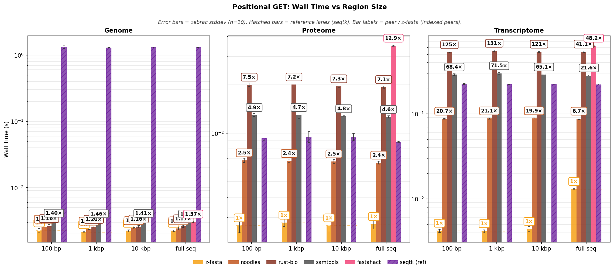

**Reading Figure 1**
- Three panels: Genome, Proteome, Transcriptome.
- **Bars:** zebrac mean wall time. Error bars are one standard deviation.
- **Legend order:** z-fasta, noodles, rust-bio, samtools, fastahack, seqtk (ref).
- **Hatched bars:** seqtk (ref) has no index and rescans the FASTA each call.
- **On large FASTA files:** seqtk (ref) can dominate log-scale y-axis; compare indexed tools within each region, not bar height vs seqtk.
- **Bar labels:** `1×` on z-fasta; other labels = peer / z-fasta (indexed peers only). Details in Table 3.

## Memory Usage: Positional extraction

Same zebrac samples as **Performance: Positional extraction**.

### Peak RSS

zebrac starts a new process for each sample and records peak RSS when it exits (`ru_maxrss`). Table and figure show the mean across samples.

**Table 4:** Peak RSS (MB, zebrac mean). Same tool order as Performance.

| dataset_region           | z-fasta   | noodles   | rust-bio   | samtools   | fastahack   | seqtk (ref)   |
|:-------------------------|:----------|:----------|:-----------|:-----------|:------------|:--------------|
| Genome / 1 kbp           | 3.37 MB   | 3.42 MB   | 3.39 MB    | 3.40 MB    | nan         | 239.41 MB     |
| Genome / 10 kbp          | 3.37 MB   | 3.42 MB   | 3.38 MB    | 3.41 MB    | nan         | 239.43 MB     |
| Genome / 100 bp          | 3.40 MB   | 3.38 MB   | 3.39 MB    | 3.36 MB    | nan         | 239.41 MB     |
| Genome / full seq        | 8.05 MB   | 3.39 MB   | 3.36 MB    | 3.41 MB    | 3.56 MB     | 239.41 MB     |
| Proteome / 1 kbp         | 14.47 MB  | 3.53 MB   | 7.28 MB    | 5.24 MB    | nan         | 3.43 MB       |
| Proteome / 10 kbp        | 14.48 MB  | 3.49 MB   | 7.28 MB    | 5.27 MB    | nan         | 3.42 MB       |
| Proteome / 100 bp        | 14.46 MB  | 3.51 MB   | 7.27 MB    | 5.26 MB    | nan         | 3.38 MB       |
| Proteome / full seq      | 14.50 MB  | 3.53 MB   | 7.31 MB    | 5.28 MB    | 8.32 MB     | 3.40 MB       |
| Transcriptome / 1 kbp    | 48.85 MB  | 46.84 MB  | 145.07 MB  | 60.50 MB   | nan         | 3.39 MB       |
| Transcriptome / 10 kbp   | 48.85 MB  | 46.77 MB  | 145.13 MB  | 60.53 MB   | nan         | 3.38 MB       |
| Transcriptome / 100 bp   | 48.85 MB  | 46.82 MB  | 145.01 MB  | 60.45 MB   | nan         | 3.42 MB       |
| Transcriptome / full seq | 397.41 MB | 46.84 MB  | 145.11 MB  | 60.54 MB   | 136.41 MB   | 3.42 MB       |

<strong>Table 5:</strong> z-fasta vs each peer. RSS × = peer peak RSS ÷ z-fasta peak RSS. Same ratios as bar labels on Figure 2.

| Dataset / region         | z-fasta vs   | z-fasta   | Peer      | RSS ×   |
|:-------------------------|:-------------|:----------|:----------|:--------|
| Genome / 1 kbp           | noodles      | 3.37 MB   | 3.42 MB   | 1.02×   |
| Genome / 1 kbp           | rust-bio     | 3.37 MB   | 3.39 MB   | 1.01×   |
| Genome / 1 kbp           | samtools     | 3.37 MB   | 3.40 MB   | 1.01×   |
| Genome / 1 kbp           | seqtk (ref)  | 3.37 MB   | 239.41 MB | 71.1×   |
| Genome / 10 kbp          | noodles      | 3.37 MB   | 3.42 MB   | 1.01×   |
| Genome / 10 kbp          | rust-bio     | 3.37 MB   | 3.38 MB   | 1.00×   |
| Genome / 10 kbp          | samtools     | 3.37 MB   | 3.41 MB   | 1.01×   |
| Genome / 10 kbp          | seqtk (ref)  | 3.37 MB   | 239.43 MB | 71.0×   |
| Genome / 100 bp          | noodles      | 3.40 MB   | 3.38 MB   | 0.99×   |
| Genome / 100 bp          | rust-bio     | 3.40 MB   | 3.39 MB   | 1.00×   |
| Genome / 100 bp          | samtools     | 3.40 MB   | 3.36 MB   | 0.99×   |
| Genome / 100 bp          | seqtk (ref)  | 3.40 MB   | 239.41 MB | 70.4×   |
| Genome / full seq        | noodles      | 8.05 MB   | 3.39 MB   | 0.42×   |
| Genome / full seq        | rust-bio     | 8.05 MB   | 3.36 MB   | 0.42×   |
| Genome / full seq        | samtools     | 8.05 MB   | 3.41 MB   | 0.42×   |
| Genome / full seq        | fastahack    | 8.05 MB   | 3.56 MB   | 0.44×   |
| Genome / full seq        | seqtk (ref)  | 8.05 MB   | 239.41 MB | 29.8×   |
| Proteome / 1 kbp         | noodles      | 14.47 MB  | 3.53 MB   | 0.24×   |
| Proteome / 1 kbp         | rust-bio     | 14.47 MB  | 7.28 MB   | 0.50×   |
| Proteome / 1 kbp         | samtools     | 14.47 MB  | 5.24 MB   | 0.36×   |
| Proteome / 1 kbp         | seqtk (ref)  | 14.47 MB  | 3.43 MB   | 0.24×   |
| Proteome / 10 kbp        | noodles      | 14.48 MB  | 3.49 MB   | 0.24×   |
| Proteome / 10 kbp        | rust-bio     | 14.48 MB  | 7.28 MB   | 0.50×   |
| Proteome / 10 kbp        | samtools     | 14.48 MB  | 5.27 MB   | 0.36×   |
| Proteome / 10 kbp        | seqtk (ref)  | 14.48 MB  | 3.42 MB   | 0.24×   |
| Proteome / 100 bp        | noodles      | 14.46 MB  | 3.51 MB   | 0.24×   |
| Proteome / 100 bp        | rust-bio     | 14.46 MB  | 7.27 MB   | 0.50×   |
| Proteome / 100 bp        | samtools     | 14.46 MB  | 5.26 MB   | 0.36×   |
| Proteome / 100 bp        | seqtk (ref)  | 14.46 MB  | 3.38 MB   | 0.23×   |
| Proteome / full seq      | noodles      | 14.50 MB  | 3.53 MB   | 0.24×   |
| Proteome / full seq      | rust-bio     | 14.50 MB  | 7.31 MB   | 0.50×   |
| Proteome / full seq      | samtools     | 14.50 MB  | 5.28 MB   | 0.36×   |
| Proteome / full seq      | fastahack    | 14.50 MB  | 8.32 MB   | 0.57×   |
| Proteome / full seq      | seqtk (ref)  | 14.50 MB  | 3.40 MB   | 0.23×   |
| Transcriptome / 1 kbp    | noodles      | 48.85 MB  | 46.84 MB  | 0.96×   |
| Transcriptome / 1 kbp    | rust-bio     | 48.85 MB  | 145.07 MB | 3.0×    |
| Transcriptome / 1 kbp    | samtools     | 48.85 MB  | 60.50 MB  | 1.24×   |
| Transcriptome / 1 kbp    | seqtk (ref)  | 48.85 MB  | 3.39 MB   | 0.069×  |
| Transcriptome / 10 kbp   | noodles      | 48.85 MB  | 46.77 MB  | 0.96×   |
| Transcriptome / 10 kbp   | rust-bio     | 48.85 MB  | 145.13 MB | 3.0×    |
| Transcriptome / 10 kbp   | samtools     | 48.85 MB  | 60.53 MB  | 1.24×   |
| Transcriptome / 10 kbp   | seqtk (ref)  | 48.85 MB  | 3.38 MB   | 0.069×  |
| Transcriptome / 100 bp   | noodles      | 48.85 MB  | 46.82 MB  | 0.96×   |
| Transcriptome / 100 bp   | rust-bio     | 48.85 MB  | 145.01 MB | 3.0×    |
| Transcriptome / 100 bp   | samtools     | 48.85 MB  | 60.45 MB  | 1.24×   |
| Transcriptome / 100 bp   | seqtk (ref)  | 48.85 MB  | 3.42 MB   | 0.070×  |
| Transcriptome / full seq | noodles      | 397.41 MB | 46.84 MB  | 0.12×   |
| Transcriptome / full seq | rust-bio     | 397.41 MB | 145.11 MB | 0.37×   |
| Transcriptome / full seq | samtools     | 397.41 MB | 60.54 MB  | 0.15×   |
| Transcriptome / full seq | fastahack    | 397.41 MB | 136.41 MB | 0.34×   |
| Transcriptome / full seq | seqtk (ref)  | 397.41 MB | 3.42 MB   | 0.0086× |

**Figure 2:** Table 4 as grouped bars. Bar labels = RSS × (peer / z-fasta; see Table 5).

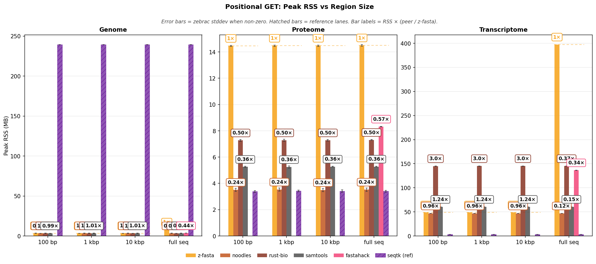

**Reading Figure 2**
- Same three-panel layout as positional wall time; linear y-axis (MB).
- `1×` on z-fasta; other labels = peer / z-fasta.
- Details in Table 5.

## Page Faults: Positional extraction

Same zebrac samples again.

### Page faults

A **minor** fault maps a page without reading disk. A **major** fault reads from disk. zebrac reports both per run, like wall time.

**Table 6:** Minor page faults (zebrac mean). Same tool order as Performance.

| dataset_region           |   z-fasta |   noodles |   rust-bio |   samtools |   fastahack |   seqtk (ref) |
|:-------------------------|----------:|----------:|-----------:|-----------:|------------:|--------------:|
| Genome / 1 kbp           |       315 |       297 |        307 |        394 |         nan |        61,176 |
| Genome / 10 kbp          |       317 |       303 |        313 |        391 |         nan |        61,177 |
| Genome / 100 bp          |       311 |       298 |        306 |        394 |         nan |        61,176 |
| Genome / full seq        |       359 |       297 |        307 |        376 |         355 |        61,177 |
| Proteome / 1 kbp         |       417 |       738 |      2,059 |        983 |         nan |           385 |
| Proteome / 10 kbp        |       418 |       745 |      2,067 |        984 |         nan |           389 |
| Proteome / 100 bp        |       412 |       737 |      2,060 |        983 |         nan |           387 |
| Proteome / full seq      |       415 |       737 |      2,060 |        981 |        1872 |           389 |
| Transcriptome / 1 kbp    |       618 |    11,798 |     41,135 |     15,123 |         nan |           482 |
| Transcriptome / 10 kbp   |       622 |    11,802 |     41,135 |     15,124 |         nan |           482 |
| Transcriptome / 100 bp   |       619 |    11,799 |     41,135 |     15,122 |         nan |           482 |
| Transcriptome / full seq |     3,406 |    11,799 |     41,135 |     15,124 |       36476 |           480 |

<strong>Table 7:</strong> z-fasta vs each peer. Faults × = peer minor faults / z-fasta minor faults. Same ratios as bar labels on Figure 3.

| Dataset / region         | z-fasta vs   |   z-fasta |   Peer | Faults ×   |
|:-------------------------|:-------------|----------:|-------:|:-----------|
| Genome / 1 kbp           | noodles      |       315 |    297 | 0.94×      |
| Genome / 1 kbp           | rust-bio     |       315 |    307 | 0.98×      |
| Genome / 1 kbp           | samtools     |       315 |    394 | 1.25×      |
| Genome / 1 kbp           | seqtk (ref)  |       315 | 61,176 | 194×       |
| Genome / 10 kbp          | noodles      |       317 |    303 | 0.96×      |
| Genome / 10 kbp          | rust-bio     |       317 |    313 | 0.99×      |
| Genome / 10 kbp          | samtools     |       317 |    391 | 1.23×      |
| Genome / 10 kbp          | seqtk (ref)  |       317 | 61,177 | 192×       |
| Genome / 100 bp          | noodles      |       311 |    298 | 0.96×      |
| Genome / 100 bp          | rust-bio     |       311 |    306 | 0.98×      |
| Genome / 100 bp          | samtools     |       311 |    394 | 1.27×      |
| Genome / 100 bp          | seqtk (ref)  |       311 | 61,176 | 197×       |
| Genome / full seq        | noodles      |       359 |    297 | 0.83×      |
| Genome / full seq        | rust-bio     |       359 |    307 | 0.85×      |
| Genome / full seq        | samtools     |       359 |    376 | 1.05×      |
| Genome / full seq        | fastahack    |       359 |    355 | 0.99×      |
| Genome / full seq        | seqtk (ref)  |       359 | 61,177 | 170×       |
| Proteome / 1 kbp         | noodles      |       417 |    738 | 1.77×      |
| Proteome / 1 kbp         | rust-bio     |       417 |  2,059 | 4.9×       |
| Proteome / 1 kbp         | samtools     |       417 |    983 | 2.4×       |
| Proteome / 1 kbp         | seqtk (ref)  |       417 |    385 | 0.92×      |
| Proteome / 10 kbp        | noodles      |       418 |    745 | 1.78×      |
| Proteome / 10 kbp        | rust-bio     |       418 |  2,067 | 4.9×       |
| Proteome / 10 kbp        | samtools     |       418 |    984 | 2.4×       |
| Proteome / 10 kbp        | seqtk (ref)  |       418 |    389 | 0.93×      |
| Proteome / 100 bp        | noodles      |       412 |    737 | 1.79×      |
| Proteome / 100 bp        | rust-bio     |       412 |  2,060 | 5.0×       |
| Proteome / 100 bp        | samtools     |       412 |    983 | 2.4×       |
| Proteome / 100 bp        | seqtk (ref)  |       412 |    387 | 0.94×      |
| Proteome / full seq      | noodles      |       415 |    737 | 1.78×      |
| Proteome / full seq      | rust-bio     |       415 |  2,060 | 5.0×       |
| Proteome / full seq      | samtools     |       415 |    981 | 2.4×       |
| Proteome / full seq      | fastahack    |       415 |  1,872 | 4.5×       |
| Proteome / full seq      | seqtk (ref)  |       415 |    389 | 0.94×      |
| Transcriptome / 1 kbp    | noodles      |       618 | 11,798 | 19.1×      |
| Transcriptome / 1 kbp    | rust-bio     |       618 | 41,135 | 66.5×      |
| Transcriptome / 1 kbp    | samtools     |       618 | 15,123 | 24.5×      |
| Transcriptome / 1 kbp    | seqtk (ref)  |       618 |    482 | 0.78×      |
| Transcriptome / 10 kbp   | noodles      |       622 | 11,802 | 19.0×      |
| Transcriptome / 10 kbp   | rust-bio     |       622 | 41,135 | 66.1×      |
| Transcriptome / 10 kbp   | samtools     |       622 | 15,124 | 24.3×      |
| Transcriptome / 10 kbp   | seqtk (ref)  |       622 |    482 | 0.78×      |
| Transcriptome / 100 bp   | noodles      |       619 | 11,799 | 19.1×      |
| Transcriptome / 100 bp   | rust-bio     |       619 | 41,135 | 66.5×      |
| Transcriptome / 100 bp   | samtools     |       619 | 15,122 | 24.4×      |
| Transcriptome / 100 bp   | seqtk (ref)  |       619 |    482 | 0.78×      |
| Transcriptome / full seq | noodles      |     3,406 | 11,799 | 3.5×       |
| Transcriptome / full seq | rust-bio     |     3,406 | 41,135 | 12.1×      |
| Transcriptome / full seq | samtools     |     3,406 | 15,124 | 4.4×       |
| Transcriptome / full seq | fastahack    |     3,406 | 36,476 | 10.7×      |
| Transcriptome / full seq | seqtk (ref)  |     3,406 |    480 | 0.14×      |

<strong>Table 8:</strong> Major page faults.

| dataset_region           |   z-fasta |   noodles |   rust-bio |   samtools |   fastahack |   seqtk (ref) |
|:-------------------------|----------:|----------:|-----------:|-----------:|------------:|--------------:|
| Genome / 1 kbp           |         0 |         0 |          0 |          0 |         nan |             0 |
| Genome / 10 kbp          |         0 |         0 |          0 |          0 |         nan |             0 |
| Genome / 100 bp          |         0 |         0 |          0 |          0 |         nan |             0 |
| Genome / full seq        |         0 |         0 |          0 |          0 |           0 |             0 |
| Proteome / 1 kbp         |         0 |         0 |          0 |          0 |         nan |             0 |
| Proteome / 10 kbp        |         0 |         0 |          0 |          0 |         nan |             0 |
| Proteome / 100 bp        |         0 |         0 |          0 |          0 |         nan |             0 |
| Proteome / full seq      |         0 |         0 |          0 |          0 |           0 |             0 |
| Transcriptome / 1 kbp    |         0 |         0 |          0 |          0 |         nan |             0 |
| Transcriptome / 10 kbp   |         0 |         0 |          0 |          0 |         nan |             0 |
| Transcriptome / 100 bp   |         0 |         0 |          0 |          0 |         nan |             0 |
| Transcriptome / full seq |         0 |         0 |          0 |          0 |           0 |             0 |

**Figure 3:** Table 6 as grouped bars (log y). Bar labels = Faults × (peer / z-fasta; see Table 7).

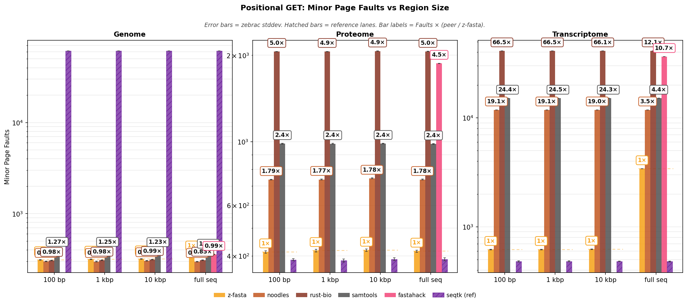

**Reading Figure 3**
- Same three-panel layout as positional wall time.
- `1×` on z-fasta; other labels = peer / z-fasta.
- Details in Table 7.

## Performance: Multi-region scaling

One `get` invocation fetches **N regions × 1 kbp each** (e.g. N=100 → 100 kbp ≈ 0.1 Mb output). Timed on Genome, Proteome, Transcriptome with **N=1, N=10, N=100, N=1,000** (log-spaced). Three figure panels (Genome, Proteome, Transcriptome); panel width follows each dataset's N count. At **N≥16**, z-fasta uses `lookup_full_map` (N=100 and N=1,000 here; N=1 and N=10 use the lighter index path — see `getter.zig`). Genome omits N=1,000 (fewer eligible 1 kbp regions in the fixture). Reference loops (seqtk, fastahack) are omitted from default timed runs. Chart/table tool order: z-fasta, noodles, rust-bio, samtools.

**Table 9:** Wall time (mean ± stddev, seconds). Rows sorted by dataset then N. Lower is better. Same tool order as the figure.

| Dataset / N             | z-fasta         | noodles         | rust-bio        | samtools        |
|:------------------------|:----------------|:----------------|:----------------|:----------------|
| Genome / N=1            | 0.0023s ±0.0001 | 0.0024s ±0.0000 | 0.0025s ±0.0000 | 0.0031s ±0.0001 |
| Genome / N=10           | 0.0026s ±0.0002 | 0.0026s ±0.0001 | 0.0027s ±0.0001 | 0.0033s ±0.0001 |
| Genome / N=100          | 0.0035s ±0.0004 | 0.0029s ±0.0001 | 0.0029s ±0.0000 | 0.0042s ±0.0001 |
| Proteome / N=1          | 0.0031s ±0.0003 | 0.0071s ±0.0004 | 0.0202s ±0.0005 | 0.0131s ±0.0007 |
| Proteome / N=10         | 0.0039s ±0.0005 | 0.0074s ±0.0001 | 0.0204s ±0.0006 | 0.0132s ±0.0004 |
| Proteome / N=100        | 0.0049s ±0.0006 | 0.0109s ±0.0003 | 0.0207s ±0.0005 | 0.0140s ±0.0002 |
| Proteome / N=1,000      | 0.0110s ±0.0006 | 0.0489s ±0.0005 | 0.0241s ±0.0005 | 0.0232s ±0.0007 |
| Transcriptome / N=1     | 0.0050s ±0.0001 | 0.0863s ±0.0004 | 0.5351s ±0.0111 | 0.2774s ±0.0024 |
| Transcriptome / N=10    | 0.0239s ±0.0004 | 0.0894s ±0.0007 | 0.5358s ±0.0058 | 0.2858s ±0.0049 |
| Transcriptome / N=100   | 0.0633s ±0.0015 | 0.1224s ±0.0023 | 0.5305s ±0.0103 | 0.2858s ±0.0059 |
| Transcriptome / N=1,000 | 0.0702s ±0.0006 | 0.4316s ±0.0224 | 0.5569s ±0.0149 | 0.3108s ±0.0172 |

<strong>Table 10:</strong> Output throughput (Mbp/s) from metadata <code>output_bases</code> ÷ wall time. Higher is better. Same rows and tool order as Table 9.

| Dataset / N             | z-fasta    | noodles    | rust-bio    | samtools    |
|:------------------------|:-----------|:-----------|:------------|:------------|
| Genome / N=1            | 0.44 Mbp/s | 0.42 Mbp/s | 0.39 Mbp/s  | 0.33 Mbp/s  |
| Genome / N=10           | 3.92 Mbp/s | 3.88 Mbp/s | 3.75 Mbp/s  | 3.05 Mbp/s  |
| Genome / N=100          | 28.4 Mbp/s | 34.1 Mbp/s | 34.7 Mbp/s  | 24.0 Mbp/s  |
| Proteome / N=1          | 0.33 Mbp/s | 0.14 Mbp/s | 0.05 Mbp/s  | 0.08 Mbp/s  |
| Proteome / N=10         | 2.58 Mbp/s | 1.36 Mbp/s | 0.49 Mbp/s  | 0.75 Mbp/s  |
| Proteome / N=100        | 20.5 Mbp/s | 9.14 Mbp/s | 4.83 Mbp/s  | 7.14 Mbp/s  |
| Proteome / N=1,000      | 91.2 Mbp/s | 20.5 Mbp/s | 41.5 Mbp/s  | 43.0 Mbp/s  |
| Transcriptome / N=1     | 0.20 Mbp/s | 0.01 Mbp/s | 0.002 Mbp/s | 0.004 Mbp/s |
| Transcriptome / N=10    | 0.42 Mbp/s | 0.11 Mbp/s | 0.02 Mbp/s  | 0.03 Mbp/s  |
| Transcriptome / N=100   | 1.58 Mbp/s | 0.82 Mbp/s | 0.19 Mbp/s  | 0.35 Mbp/s  |
| Transcriptome / N=1,000 | 14.3 Mbp/s | 2.32 Mbp/s | 1.80 Mbp/s  | 3.22 Mbp/s  |

<strong>Table 11:</strong> z-fasta vs each peer. Speedup = peer wall time ÷ z-fasta wall time (higher = z-fasta faster). Same ratios as bar labels on Figure 4.

| Dataset / N             | z-fasta vs   | z-fasta   | Peer    | Speedup   |
|:------------------------|:-------------|:----------|:--------|:----------|
| Genome / N=1            | noodles      | 0.0023s   | 0.0024s | 1.04×     |
| Genome / N=1            | rust-bio     | 0.0023s   | 0.0025s | 1.12×     |
| Genome / N=1            | samtools     | 0.0023s   | 0.0031s | 1.35×     |
| Genome / N=10           | noodles      | 0.0026s   | 0.0026s | 1.01×     |
| Genome / N=10           | rust-bio     | 0.0026s   | 0.0027s | 1.05×     |
| Genome / N=10           | samtools     | 0.0026s   | 0.0033s | 1.29×     |
| Genome / N=100          | noodles      | 0.0035s   | 0.0029s | 0.83×     |
| Genome / N=100          | rust-bio     | 0.0035s   | 0.0029s | 0.82×     |
| Genome / N=100          | samtools     | 0.0035s   | 0.0042s | 1.18×     |
| Proteome / N=1          | noodles      | 0.0031s   | 0.0071s | 2.3×      |
| Proteome / N=1          | rust-bio     | 0.0031s   | 0.0202s | 6.6×      |
| Proteome / N=1          | samtools     | 0.0031s   | 0.0131s | 4.3×      |
| Proteome / N=10         | noodles      | 0.0039s   | 0.0074s | 1.90×     |
| Proteome / N=10         | rust-bio     | 0.0039s   | 0.0204s | 5.3×      |
| Proteome / N=10         | samtools     | 0.0039s   | 0.0132s | 3.4×      |
| Proteome / N=100        | noodles      | 0.0049s   | 0.0109s | 2.2×      |
| Proteome / N=100        | rust-bio     | 0.0049s   | 0.0207s | 4.2×      |
| Proteome / N=100        | samtools     | 0.0049s   | 0.0140s | 2.9×      |
| Proteome / N=1,000      | noodles      | 0.0110s   | 0.0489s | 4.5×      |
| Proteome / N=1,000      | rust-bio     | 0.0110s   | 0.0241s | 2.2×      |
| Proteome / N=1,000      | samtools     | 0.0110s   | 0.0232s | 2.1×      |
| Transcriptome / N=1     | noodles      | 0.0050s   | 0.0863s | 17.2×     |
| Transcriptome / N=1     | rust-bio     | 0.0050s   | 0.5351s | 107×      |
| Transcriptome / N=1     | samtools     | 0.0050s   | 0.2774s | 55.5×     |
| Transcriptome / N=10    | noodles      | 0.0239s   | 0.0894s | 3.7×      |
| Transcriptome / N=10    | rust-bio     | 0.0239s   | 0.5358s | 22.4×     |
| Transcriptome / N=10    | samtools     | 0.0239s   | 0.2858s | 12.0×     |
| Transcriptome / N=100   | noodles      | 0.0633s   | 0.1224s | 1.94×     |
| Transcriptome / N=100   | rust-bio     | 0.0633s   | 0.5305s | 8.4×      |
| Transcriptome / N=100   | samtools     | 0.0633s   | 0.2858s | 4.5×      |
| Transcriptome / N=1,000 | noodles      | 0.0702s   | 0.4316s | 6.2×      |
| Transcriptome / N=1,000 | rust-bio     | 0.0702s   | 0.5569s | 7.9×      |
| Transcriptome / N=1,000 | samtools     | 0.0702s   | 0.3108s | 4.4×      |

**Figure 4:** Table 9 as grouped bars (log y). Bar labels = peer / z-fasta (indexed peers).

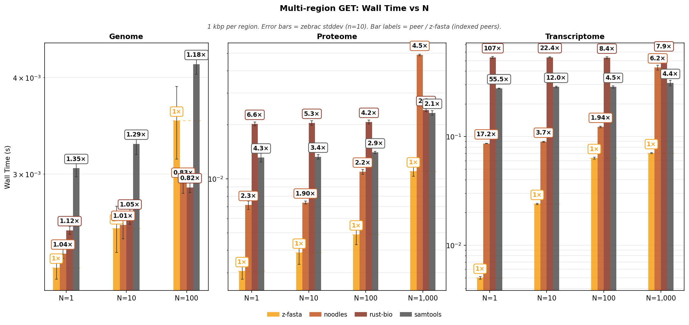

**Reading Figure 4**
- Three panels: Genome, Proteome, Transcriptome (N on x-axis).
- **Bars:** zebrac mean wall time. Error bars = one standard deviation.
- **Legend order:** z-fasta, noodles, rust-bio, samtools.
- **Bar labels:** `1×` on z-fasta; other labels = peer / z-fasta (indexed peers only). Details in Table 11.

## Memory Usage: Multi-region scaling

Same zebrac samples as **Performance: Multi-region scaling**.

### Peak RSS

zebrac starts a new process for each sample and records peak RSS when it exits (`ru_maxrss`). Table and figure show the mean across samples.

**Table 12:** Peak RSS (MB, zebrac mean). Same tool order as Performance.

| Dataset / N             | z-fasta   | noodles   | rust-bio   | samtools   |
|:------------------------|:----------|:----------|:-----------|:-----------|
| Genome / N=1            | 8.05 MB   | 3.39 MB   | 3.37 MB    | 3.39 MB    |
| Genome / N=10           | 11.42 MB  | 3.39 MB   | 3.42 MB    | 3.40 MB    |
| Genome / N=100          | 13.25 MB  | 3.41 MB   | 3.43 MB    | 3.40 MB    |
| Proteome / N=1          | 14.46 MB  | 3.55 MB   | 7.29 MB    | 5.27 MB    |
| Proteome / N=10         | 14.49 MB  | 3.56 MB   | 7.27 MB    | 5.29 MB    |
| Proteome / N=100        | 15.73 MB  | 3.55 MB   | 7.29 MB    | 5.28 MB    |
| Proteome / N=1,000      | 18.73 MB  | 3.78 MB   | 7.41 MB    | 5.27 MB    |
| Transcriptome / N=1     | 82.48 MB  | 46.73 MB  | 145.08 MB  | 60.53 MB   |
| Transcriptome / N=10    | 464.48 MB | 46.70 MB  | 145.13 MB  | 60.52 MB   |
| Transcriptome / N=100   | 481.73 MB | 46.77 MB  | 145.10 MB  | 60.48 MB   |
| Transcriptome / N=1,000 | 484.98 MB | 47.11 MB  | 145.36 MB  | 60.52 MB   |

<strong>Table 13:</strong> z-fasta vs each peer. RSS × = peer peak RSS ÷ z-fasta peak RSS. Same ratios as bar labels on Figure 5.

| Dataset / N             | z-fasta vs   | z-fasta   | Peer      | RSS ×   |
|:------------------------|:-------------|:----------|:----------|:--------|
| Genome / N=1            | noodles      | 8.05 MB   | 3.39 MB   | 0.42×   |
| Genome / N=1            | rust-bio     | 8.05 MB   | 3.37 MB   | 0.42×   |
| Genome / N=1            | samtools     | 8.05 MB   | 3.39 MB   | 0.42×   |
| Genome / N=10           | noodles      | 11.42 MB  | 3.39 MB   | 0.30×   |
| Genome / N=10           | rust-bio     | 11.42 MB  | 3.42 MB   | 0.30×   |
| Genome / N=10           | samtools     | 11.42 MB  | 3.40 MB   | 0.30×   |
| Genome / N=100          | noodles      | 13.25 MB  | 3.41 MB   | 0.26×   |
| Genome / N=100          | rust-bio     | 13.25 MB  | 3.43 MB   | 0.26×   |
| Genome / N=100          | samtools     | 13.25 MB  | 3.40 MB   | 0.26×   |
| Proteome / N=1          | noodles      | 14.46 MB  | 3.55 MB   | 0.25×   |
| Proteome / N=1          | rust-bio     | 14.46 MB  | 7.29 MB   | 0.50×   |
| Proteome / N=1          | samtools     | 14.46 MB  | 5.27 MB   | 0.36×   |
| Proteome / N=10         | noodles      | 14.49 MB  | 3.56 MB   | 0.25×   |
| Proteome / N=10         | rust-bio     | 14.49 MB  | 7.27 MB   | 0.50×   |
| Proteome / N=10         | samtools     | 14.49 MB  | 5.29 MB   | 0.37×   |
| Proteome / N=100        | noodles      | 15.73 MB  | 3.55 MB   | 0.23×   |
| Proteome / N=100        | rust-bio     | 15.73 MB  | 7.29 MB   | 0.46×   |
| Proteome / N=100        | samtools     | 15.73 MB  | 5.28 MB   | 0.34×   |
| Proteome / N=1,000      | noodles      | 18.73 MB  | 3.78 MB   | 0.20×   |
| Proteome / N=1,000      | rust-bio     | 18.73 MB  | 7.41 MB   | 0.40×   |
| Proteome / N=1,000      | samtools     | 18.73 MB  | 5.27 MB   | 0.28×   |
| Transcriptome / N=1     | noodles      | 82.48 MB  | 46.73 MB  | 0.57×   |
| Transcriptome / N=1     | rust-bio     | 82.48 MB  | 145.08 MB | 1.76×   |
| Transcriptome / N=1     | samtools     | 82.48 MB  | 60.53 MB  | 0.73×   |
| Transcriptome / N=10    | noodles      | 464.48 MB | 46.70 MB  | 0.10×   |
| Transcriptome / N=10    | rust-bio     | 464.48 MB | 145.13 MB | 0.31×   |
| Transcriptome / N=10    | samtools     | 464.48 MB | 60.52 MB  | 0.13×   |
| Transcriptome / N=100   | noodles      | 481.73 MB | 46.77 MB  | 0.097×  |
| Transcriptome / N=100   | rust-bio     | 481.73 MB | 145.10 MB | 0.30×   |
| Transcriptome / N=100   | samtools     | 481.73 MB | 60.48 MB  | 0.13×   |
| Transcriptome / N=1,000 | noodles      | 484.98 MB | 47.11 MB  | 0.097×  |
| Transcriptome / N=1,000 | rust-bio     | 484.98 MB | 145.36 MB | 0.30×   |
| Transcriptome / N=1,000 | samtools     | 484.98 MB | 60.52 MB  | 0.12×   |

**Figure 5:** Table 12 as grouped bars (linear y, MB). Bar labels = RSS × (see Table 13).

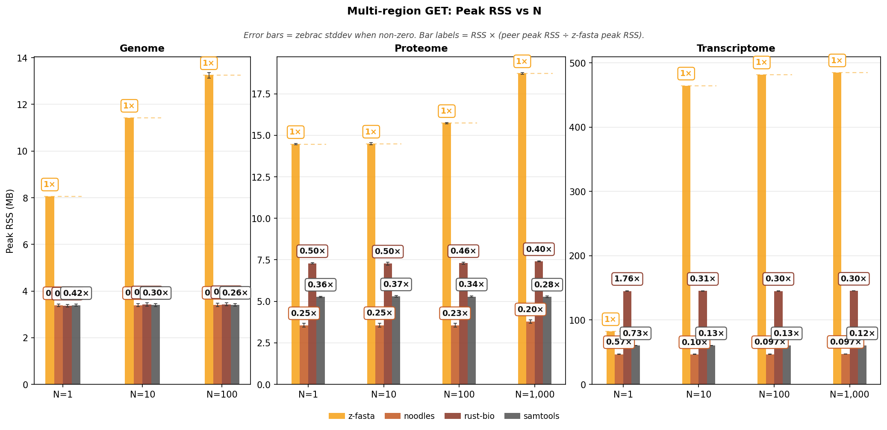

**Reading Figure 5**
- Three panels: Genome, Proteome, Transcriptome (N on x-axis).
- **Bars:** zebrac mean peak RSS. Error bars when stddev is non-zero. Linear y-axis (MB).
- **Legend order:** z-fasta, noodles, rust-bio, samtools.
- **Bar labels:** `1×` on z-fasta; other labels = RSS × (peer peak RSS ÷ z-fasta peak RSS). Details in Table 13.

## Page Faults: Multi-region scaling

Same zebrac samples as **Performance: Multi-region scaling**.

### Page faults

A **minor** fault maps a page without reading disk. A **major** fault reads from disk. zebrac reports both per run, like wall time.

**Table 14:** Minor page faults (zebrac mean). Same tool order as Performance.

| Dataset / N             |   z-fasta |   noodles |   rust-bio |   samtools |
|:------------------------|----------:|----------:|-----------:|-----------:|
| Genome / N=1            |       365 |       301 |        310 |        394 |
| Genome / N=10           |       397 |       305 |        312 |        393 |
| Genome / N=100          |       527 |       323 |        329 |        392 |
| Proteome / N=1          |       418 |       741 |      2,065 |        983 |
| Proteome / N=10         |       424 |       746 |      2,069 |        982 |
| Proteome / N=100        |       746 |       770 |      2,089 |        982 |
| Proteome / N=1,000      |     1,672 |       935 |      2,243 |        983 |
| Transcriptome / N=1     |       888 |    11,799 |     41,136 |     15,122 |
| Transcriptome / N=10    |     3,958 |    11,807 |     41,141 |     15,124 |
| Transcriptome / N=100   |     7,351 |    11,862 |     41,194 |     15,123 |
| Transcriptome / N=1,000 |     8,698 |    12,433 |     41,758 |     15,122 |

<strong>Table 15:</strong> z-fasta vs each peer. Faults × = peer minor faults ÷ z-fasta minor faults. Same ratios as bar labels on Figure 6.

| Dataset / N             | z-fasta vs   |   z-fasta |   Peer | Faults ×   |
|:------------------------|:-------------|----------:|-------:|:-----------|
| Genome / N=1            | noodles      |       365 |    301 | 0.83×      |
| Genome / N=1            | rust-bio     |       365 |    310 | 0.85×      |
| Genome / N=1            | samtools     |       365 |    394 | 1.08×      |
| Genome / N=10           | noodles      |       397 |    305 | 0.77×      |
| Genome / N=10           | rust-bio     |       397 |    312 | 0.78×      |
| Genome / N=10           | samtools     |       397 |    393 | 0.99×      |
| Genome / N=100          | noodles      |       527 |    323 | 0.61×      |
| Genome / N=100          | rust-bio     |       527 |    329 | 0.63×      |
| Genome / N=100          | samtools     |       527 |    392 | 0.74×      |
| Proteome / N=1          | noodles      |       418 |    741 | 1.77×      |
| Proteome / N=1          | rust-bio     |       418 |  2,065 | 4.9×       |
| Proteome / N=1          | samtools     |       418 |    983 | 2.4×       |
| Proteome / N=10         | noodles      |       424 |    746 | 1.76×      |
| Proteome / N=10         | rust-bio     |       424 |  2,069 | 4.9×       |
| Proteome / N=10         | samtools     |       424 |    982 | 2.3×       |
| Proteome / N=100        | noodles      |       746 |    770 | 1.03×      |
| Proteome / N=100        | rust-bio     |       746 |  2,089 | 2.8×       |
| Proteome / N=100        | samtools     |       746 |    982 | 1.32×      |
| Proteome / N=1,000      | noodles      |     1,672 |    935 | 0.56×      |
| Proteome / N=1,000      | rust-bio     |     1,672 |  2,243 | 1.34×      |
| Proteome / N=1,000      | samtools     |     1,672 |    983 | 0.59×      |
| Transcriptome / N=1     | noodles      |       888 | 11,799 | 13.3×      |
| Transcriptome / N=1     | rust-bio     |       888 | 41,136 | 46.3×      |
| Transcriptome / N=1     | samtools     |       888 | 15,122 | 17.0×      |
| Transcriptome / N=10    | noodles      |     3,958 | 11,807 | 3.0×       |
| Transcriptome / N=10    | rust-bio     |     3,958 | 41,141 | 10.4×      |
| Transcriptome / N=10    | samtools     |     3,958 | 15,124 | 3.8×       |
| Transcriptome / N=100   | noodles      |     7,351 | 11,862 | 1.61×      |
| Transcriptome / N=100   | rust-bio     |     7,351 | 41,194 | 5.6×       |
| Transcriptome / N=100   | samtools     |     7,351 | 15,123 | 2.1×       |
| Transcriptome / N=1,000 | noodles      |     8,698 | 12,433 | 1.43×      |
| Transcriptome / N=1,000 | rust-bio     |     8,698 | 41,758 | 4.8×       |
| Transcriptome / N=1,000 | samtools     |     8,698 | 15,122 | 1.74×      |

<strong>Table 16:</strong> Major page faults (all zero for this run).

| Dataset / N             |   z-fasta |   noodles |   rust-bio |   samtools |
|:------------------------|----------:|----------:|-----------:|-----------:|
| Genome / N=1            |         0 |         0 |          0 |          0 |
| Genome / N=10           |         0 |         0 |          0 |          0 |
| Genome / N=100          |         0 |         0 |          0 |          0 |
| Proteome / N=1          |         0 |         0 |          0 |          0 |
| Proteome / N=10         |         0 |         0 |          0 |          0 |
| Proteome / N=100        |         0 |         0 |          0 |          0 |
| Proteome / N=1,000      |         0 |         0 |          0 |          0 |
| Transcriptome / N=1     |         0 |         0 |          0 |          0 |
| Transcriptome / N=10    |         0 |         0 |          0 |          0 |
| Transcriptome / N=100   |         0 |         0 |          0 |          0 |
| Transcriptome / N=1,000 |         0 |         0 |          0 |          0 |

**Figure 6:** Table 14 as grouped bars (log y). Bar labels = Faults × (see Table 15).

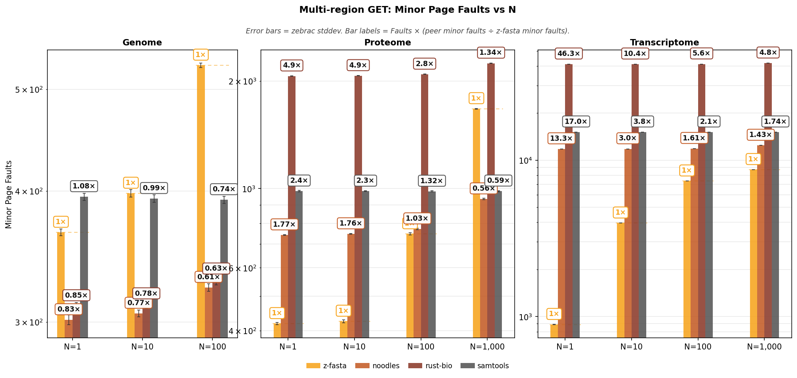

**Reading Figure 6**
- Three panels: Genome, Proteome, Transcriptome (N on x-axis).
- **Bars:** zebrac mean minor page faults. Log y-axis.
- **Legend order:** z-fasta, noodles, rust-bio, samtools.
- **Bar labels:** `1×` on z-fasta; other labels = Faults × (peer minor faults ÷ z-fasta minor faults). Details in Table 15.

## Performance: BED batch

`z-fasta get --bed` on Genome, Proteome, Transcriptome. Each BED row fetches **1 kbp** (sweep: 10 rows (0.01 Mb), 100 rows (0.10 Mb), 1,000 rows (1.0 Mb), 10,000 rows (10 Mb)). Three figure panels (Genome, Proteome, Transcriptome); grouped bars per row count. Headline z-fasta is plain `get --bed` with CLI default **`--chunk-size 4096`** (internal batching; not `--chunk-size -1` read-whole-file or `--chunk-size 1`). Table 20 compares z-fasta `--chunk-size` settings when those lanes ran; headline chart uses **default `--chunk-size 4096` only**. Chart/table tool order: z-fasta, noodles, rust-bio, samtools, bedtools.

**Table 17:** Wall time (mean ± stddev, seconds). Rows sorted by dataset then BED row count. Lower is better. Same tool order as the figure.

| Dataset / BED rows                  | z-fasta         | noodles         | rust-bio        | samtools        | bedtools        |
|:------------------------------------|:----------------|:----------------|:----------------|:----------------|:----------------|
| Genome / 10 rows (0.01 Mb)          | 0.0024s ±0.0002 | 0.0025s ±0.0001 | 0.0025s ±0.0001 | 0.0032s ±0.0001 | 0.0036s ±0.0001 |
| Genome / 100 rows (0.10 Mb)         | 0.0030s ±0.0001 | 0.0028s ±0.0001 | 0.0027s ±0.0001 | 0.0041s ±0.0001 | 0.0040s ±0.0001 |
| Genome / 1,000 rows (1.0 Mb)        | 0.0072s ±0.0002 | 0.0058s ±0.0001 | 0.0049s ±0.0002 | 0.0127s ±0.0003 | 0.0077s ±0.0001 |
| Genome / 10,000 rows (10 Mb)        | 0.0535s ±0.0021 | 0.0362s ±0.0004 | 0.0248s ±0.0003 | 0.0955s ±0.0007 | 0.0435s ±0.0007 |
| Proteome / 10 rows (0.01 Mb)        | 0.0040s ±0.0004 | 0.0073s ±0.0003 | 0.0116s ±0.0006 | 0.0129s ±0.0002 | 0.0358s ±0.0003 |
| Proteome / 100 rows (0.10 Mb)       | 0.0047s ±0.0004 | 0.0109s ±0.0002 | 0.0110s ±0.0001 | 0.0145s ±0.0008 | 0.0363s ±0.0003 |
| Proteome / 1,000 rows (1.0 Mb)      | 0.0084s ±0.0003 | 0.0477s ±0.0002 | 0.0133s ±0.0003 | 0.0225s ±0.0002 | 0.0400s ±0.0004 |
| Proteome / 10,000 rows (10 Mb)      | 0.0500s ±0.0001 | 0.4163s ±0.0024 | 0.0353s ±0.0013 | 0.1157s ±0.0027 | 0.0750s ±0.0008 |
| Transcriptome / 10 rows (0.01 Mb)   | 0.0609s ±0.0005 | 0.0900s ±0.0006 | 0.2786s ±0.0034 | 0.2883s ±0.0075 | 0.5631s ±0.0059 |
| Transcriptome / 100 rows (0.10 Mb)  | 0.0620s ±0.0004 | 0.1169s ±0.0013 | 0.2854s ±0.0036 | 0.2820s ±0.0022 | 0.5721s ±0.0134 |
| Transcriptome / 1,000 rows (1.0 Mb) | 0.0663s ±0.0009 | 0.4210s ±0.0108 | 0.2844s ±0.0094 | 0.2945s ±0.0052 | 0.5749s ±0.0113 |
| Transcriptome / 10,000 rows (10 Mb) | 0.1145s ±0.0020 | 3.3735s ±0.0514 | 0.3072s ±0.0043 | 0.4033s ±0.0140 | 0.6247s ±0.0058 |

<strong>Table 18:</strong> Output throughput (Mbp/s) from metadata <code>output_bases</code> ÷ wall time. Higher is better. Same rows and tool order as Table 17.

| Dataset / BED rows                  | z-fasta     | noodles     | rust-bio    | samtools    | bedtools    |
|:------------------------------------|:------------|:------------|:------------|:------------|:------------|
| Genome / 10 rows (0.01 Mb)          | 4.10 Mbp/s  | 4.02 Mbp/s  | 3.99 Mbp/s  | 3.12 Mbp/s  | 2.78 Mbp/s  |
| Genome / 100 rows (0.10 Mb)         | 33.6 Mbp/s  | 35.7 Mbp/s  | 36.9 Mbp/s  | 24.7 Mbp/s  | 25.3 Mbp/s  |
| Genome / 1,000 rows (1.0 Mb)        | 138.2 Mbp/s | 171.8 Mbp/s | 205.2 Mbp/s | 79.0 Mbp/s  | 129.1 Mbp/s |
| Genome / 10,000 rows (10 Mb)        | 186.8 Mbp/s | 275.9 Mbp/s | 403.0 Mbp/s | 104.7 Mbp/s | 229.9 Mbp/s |
| Proteome / 10 rows (0.01 Mb)        | 2.48 Mbp/s  | 1.36 Mbp/s  | 0.87 Mbp/s  | 0.77 Mbp/s  | 0.28 Mbp/s  |
| Proteome / 100 rows (0.10 Mb)       | 21.4 Mbp/s  | 9.17 Mbp/s  | 9.10 Mbp/s  | 6.89 Mbp/s  | 2.76 Mbp/s  |
| Proteome / 1,000 rows (1.0 Mb)      | 118.9 Mbp/s | 21.0 Mbp/s  | 75.0 Mbp/s  | 44.4 Mbp/s  | 25.0 Mbp/s  |
| Proteome / 10,000 rows (10 Mb)      | 200.0 Mbp/s | 24.0 Mbp/s  | 283.2 Mbp/s | 86.5 Mbp/s  | 133.4 Mbp/s |
| Transcriptome / 10 rows (0.01 Mb)   | 0.16 Mbp/s  | 0.11 Mbp/s  | 0.04 Mbp/s  | 0.03 Mbp/s  | 0.02 Mbp/s  |
| Transcriptome / 100 rows (0.10 Mb)  | 1.61 Mbp/s  | 0.86 Mbp/s  | 0.35 Mbp/s  | 0.35 Mbp/s  | 0.17 Mbp/s  |
| Transcriptome / 1,000 rows (1.0 Mb) | 15.1 Mbp/s  | 2.38 Mbp/s  | 3.52 Mbp/s  | 3.40 Mbp/s  | 1.74 Mbp/s  |
| Transcriptome / 10,000 rows (10 Mb) | 87.3 Mbp/s  | 2.96 Mbp/s  | 32.6 Mbp/s  | 24.8 Mbp/s  | 16.0 Mbp/s  |

<strong>Table 19:</strong> z-fasta vs each peer. Speedup = peer wall time ÷ z-fasta wall time (higher = z-fasta faster). Same ratios as bar labels on Figure 7.

| Dataset / BED rows                  | z-fasta vs   | z-fasta   | Peer    | Speedup   |
|:------------------------------------|:-------------|:----------|:--------|:----------|
| Genome / 10 rows (0.01 Mb)          | noodles      | 0.0024s   | 0.0025s | 1.02×     |
| Genome / 10 rows (0.01 Mb)          | rust-bio     | 0.0024s   | 0.0025s | 1.03×     |
| Genome / 10 rows (0.01 Mb)          | samtools     | 0.0024s   | 0.0032s | 1.31×     |
| Genome / 10 rows (0.01 Mb)          | bedtools     | 0.0024s   | 0.0036s | 1.47×     |
| Genome / 100 rows (0.10 Mb)         | noodles      | 0.0030s   | 0.0028s | 0.94×     |
| Genome / 100 rows (0.10 Mb)         | rust-bio     | 0.0030s   | 0.0027s | 0.91×     |
| Genome / 100 rows (0.10 Mb)         | samtools     | 0.0030s   | 0.0041s | 1.36×     |
| Genome / 100 rows (0.10 Mb)         | bedtools     | 0.0030s   | 0.0040s | 1.33×     |
| Genome / 1,000 rows (1.0 Mb)        | noodles      | 0.0072s   | 0.0058s | 0.80×     |
| Genome / 1,000 rows (1.0 Mb)        | rust-bio     | 0.0072s   | 0.0049s | 0.67×     |
| Genome / 1,000 rows (1.0 Mb)        | samtools     | 0.0072s   | 0.0127s | 1.75×     |
| Genome / 1,000 rows (1.0 Mb)        | bedtools     | 0.0072s   | 0.0077s | 1.07×     |
| Genome / 10,000 rows (10 Mb)        | noodles      | 0.0535s   | 0.0362s | 0.68×     |
| Genome / 10,000 rows (10 Mb)        | rust-bio     | 0.0535s   | 0.0248s | 0.46×     |
| Genome / 10,000 rows (10 Mb)        | samtools     | 0.0535s   | 0.0955s | 1.78×     |
| Genome / 10,000 rows (10 Mb)        | bedtools     | 0.0535s   | 0.0435s | 0.81×     |
| Proteome / 10 rows (0.01 Mb)        | noodles      | 0.0040s   | 0.0073s | 1.82×     |
| Proteome / 10 rows (0.01 Mb)        | rust-bio     | 0.0040s   | 0.0116s | 2.9×      |
| Proteome / 10 rows (0.01 Mb)        | samtools     | 0.0040s   | 0.0129s | 3.2×      |
| Proteome / 10 rows (0.01 Mb)        | bedtools     | 0.0040s   | 0.0358s | 8.9×      |
| Proteome / 100 rows (0.10 Mb)       | noodles      | 0.0047s   | 0.0109s | 2.3×      |
| Proteome / 100 rows (0.10 Mb)       | rust-bio     | 0.0047s   | 0.0110s | 2.4×      |
| Proteome / 100 rows (0.10 Mb)       | samtools     | 0.0047s   | 0.0145s | 3.1×      |
| Proteome / 100 rows (0.10 Mb)       | bedtools     | 0.0047s   | 0.0363s | 7.8×      |
| Proteome / 1,000 rows (1.0 Mb)      | noodles      | 0.0084s   | 0.0477s | 5.7×      |
| Proteome / 1,000 rows (1.0 Mb)      | rust-bio     | 0.0084s   | 0.0133s | 1.58×     |
| Proteome / 1,000 rows (1.0 Mb)      | samtools     | 0.0084s   | 0.0225s | 2.7×      |
| Proteome / 1,000 rows (1.0 Mb)      | bedtools     | 0.0084s   | 0.0400s | 4.8×      |
| Proteome / 10,000 rows (10 Mb)      | noodles      | 0.0500s   | 0.4163s | 8.3×      |
| Proteome / 10,000 rows (10 Mb)      | rust-bio     | 0.0500s   | 0.0353s | 0.71×     |
| Proteome / 10,000 rows (10 Mb)      | samtools     | 0.0500s   | 0.1157s | 2.3×      |
| Proteome / 10,000 rows (10 Mb)      | bedtools     | 0.0500s   | 0.0750s | 1.50×     |
| Transcriptome / 10 rows (0.01 Mb)   | noodles      | 0.0609s   | 0.0900s | 1.48×     |
| Transcriptome / 10 rows (0.01 Mb)   | rust-bio     | 0.0609s   | 0.2786s | 4.6×      |
| Transcriptome / 10 rows (0.01 Mb)   | samtools     | 0.0609s   | 0.2883s | 4.7×      |
| Transcriptome / 10 rows (0.01 Mb)   | bedtools     | 0.0609s   | 0.5631s | 9.3×      |
| Transcriptome / 100 rows (0.10 Mb)  | noodles      | 0.0620s   | 0.1169s | 1.89×     |
| Transcriptome / 100 rows (0.10 Mb)  | rust-bio     | 0.0620s   | 0.2854s | 4.6×      |
| Transcriptome / 100 rows (0.10 Mb)  | samtools     | 0.0620s   | 0.2820s | 4.5×      |
| Transcriptome / 100 rows (0.10 Mb)  | bedtools     | 0.0620s   | 0.5721s | 9.2×      |
| Transcriptome / 1,000 rows (1.0 Mb) | noodles      | 0.0663s   | 0.4210s | 6.3×      |
| Transcriptome / 1,000 rows (1.0 Mb) | rust-bio     | 0.0663s   | 0.2844s | 4.3×      |
| Transcriptome / 1,000 rows (1.0 Mb) | samtools     | 0.0663s   | 0.2945s | 4.4×      |
| Transcriptome / 1,000 rows (1.0 Mb) | bedtools     | 0.0663s   | 0.5749s | 8.7×      |
| Transcriptome / 10,000 rows (10 Mb) | noodles      | 0.1145s   | 3.3735s | 29.5×     |
| Transcriptome / 10,000 rows (10 Mb) | rust-bio     | 0.1145s   | 0.3072s | 2.7×      |
| Transcriptome / 10,000 rows (10 Mb) | samtools     | 0.1145s   | 0.4033s | 3.5×      |
| Transcriptome / 10,000 rows (10 Mb) | bedtools     | 0.1145s   | 0.6247s | 5.5×      |

<strong>Table 20:</strong> z-fasta chunk-size comparison (default 4096 vs -1 vs 1; not in Figure 7).

| Dataset / BED rows                  | z-fasta (--chunk-size 4096)   | z-fasta --chunk-size -1   | z-fasta --chunk-size 1   |
|:------------------------------------|:------------------------------|:--------------------------|:-------------------------|
| Genome / 10 rows (0.01 Mb)          | 0.0024s ±0.0002               | 0.0024s ±0.0001           | 0.0025s ±0.0001          |
| Genome / 100 rows (0.10 Mb)         | 0.0030s ±0.0001               | 0.0029s ±0.0001           | 0.0034s ±0.0001          |
| Genome / 1,000 rows (1.0 Mb)        | 0.0072s ±0.0002               | 0.0071s ±0.0002           | nan                      |
| Genome / 10,000 rows (10 Mb)        | 0.0535s ±0.0021               | 0.0559s ±0.0012           | nan                      |
| Proteome / 10 rows (0.01 Mb)        | 0.0040s ±0.0004               | 0.0044s ±0.0006           | 0.0040s ±0.0003          |
| Proteome / 100 rows (0.10 Mb)       | 0.0047s ±0.0004               | 0.0042s ±0.0003           | 0.0050s ±0.0004          |
| Proteome / 1,000 rows (1.0 Mb)      | 0.0084s ±0.0003               | 0.0083s ±0.0001           | nan                      |
| Proteome / 10,000 rows (10 Mb)      | 0.0500s ±0.0001               | 0.0529s ±0.0010           | nan                      |
| Transcriptome / 10 rows (0.01 Mb)   | 0.0609s ±0.0005               | 0.0612s ±0.0007           | 0.0619s ±0.0008          |
| Transcriptome / 100 rows (0.10 Mb)  | 0.0620s ±0.0004               | 0.0622s ±0.0005           | 0.0626s ±0.0007          |
| Transcriptome / 1,000 rows (1.0 Mb) | 0.0663s ±0.0009               | 0.0667s ±0.0014           | nan                      |
| Transcriptome / 10,000 rows (10 Mb) | 0.1145s ±0.0020               | 0.1149s ±0.0006           | nan                      |

**Figure 7:** Table 17 as grouped bars (log y). Bar labels = peer / z-fasta (indexed peers + bedtools).

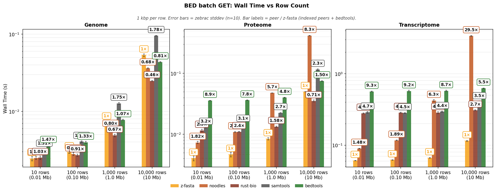

**Reading Figure 7**
- Three panels: Genome, Proteome, Transcriptome (BED row count on x-axis).
- **Bars:** zebrac mean wall time. Error bars = one standard deviation.
- **Legend order:** z-fasta, noodles, rust-bio, samtools, bedtools.
- **Headline z-fasta:** default `--chunk-size 4096` only.
- **Bar labels:** `1×` on z-fasta; other labels = peer / z-fasta (indexed peers + bedtools). Details in Table 19.

## Memory Usage: BED batch

Same zebrac samples as **Performance: BED batch**.

### Peak RSS

zebrac starts a new process for each sample and records peak RSS when it exits (`ru_maxrss`). Table and figure show the mean across samples.

**Table 21:** Peak RSS (MB, zebrac mean). Same tool order as Performance.

| Dataset / BED rows                  | z-fasta   | noodles   | rust-bio   | samtools   | bedtools   |
|:------------------------------------|:----------|:----------|:-----------|:-----------|:-----------|
| Genome / 10 rows (0.01 Mb)          | 11.05 MB  | 3.39 MB   | 3.37 MB    | 3.40 MB    | 5.60 MB    |
| Genome / 100 rows (0.10 Mb)         | 13.47 MB  | 3.38 MB   | 3.38 MB    | 3.41 MB    | 9.71 MB    |
| Genome / 1,000 rows (1.0 Mb)        | 33.05 MB  | 3.41 MB   | 3.42 MB    | 3.38 MB    | 30.35 MB   |
| Genome / 10,000 rows (10 Mb)        | 184.06 MB | 3.40 MB   | 3.39 MB    | 3.42 MB    | 179.19 MB  |
| Proteome / 10 rows (0.01 Mb)        | 15.40 MB  | 3.60 MB   | 5.23 MB    | 5.29 MB    | 11.08 MB   |
| Proteome / 100 rows (0.10 Mb)       | 15.91 MB  | 3.53 MB   | 5.49 MB    | 5.30 MB    | 18.07 MB   |
| Proteome / 1,000 rows (1.0 Mb)      | 18.86 MB  | 3.54 MB   | 5.52 MB    | 5.29 MB    | 23.04 MB   |
| Proteome / 10,000 rows (10 Mb)      | 29.45 MB  | 3.62 MB   | 5.51 MB    | 5.29 MB    | 23.10 MB   |
| Transcriptome / 10 rows (0.01 Mb)   | 481.16 MB | 46.83 MB  | 95.70 MB   | 60.53 MB   | 142.72 MB  |
| Transcriptome / 100 rows (0.10 Mb)  | 481.61 MB | 46.82 MB  | 95.65 MB   | 60.54 MB   | 153.64 MB  |
| Transcriptome / 1,000 rows (1.0 Mb) | 484.91 MB | 46.72 MB  | 95.67 MB   | 60.57 MB   | 252.16 MB  |
| Transcriptome / 10,000 rows (10 Mb) | 496.56 MB | 46.77 MB  | 95.71 MB   | 60.54 MB   | 561.12 MB  |

<strong>Table 22:</strong> z-fasta vs each peer. RSS × = peer peak RSS ÷ z-fasta peak RSS. Same ratios as bar labels on Figure 8.

| Dataset / BED rows                  | z-fasta vs   | z-fasta   | Peer      | RSS ×   |
|:------------------------------------|:-------------|:----------|:----------|:--------|
| Genome / 10 rows (0.01 Mb)          | noodles      | 11.05 MB  | 3.39 MB   | 0.31×   |
| Genome / 10 rows (0.01 Mb)          | rust-bio     | 11.05 MB  | 3.37 MB   | 0.30×   |
| Genome / 10 rows (0.01 Mb)          | samtools     | 11.05 MB  | 3.40 MB   | 0.31×   |
| Genome / 10 rows (0.01 Mb)          | bedtools     | 11.05 MB  | 5.60 MB   | 0.51×   |
| Genome / 100 rows (0.10 Mb)         | noodles      | 13.47 MB  | 3.38 MB   | 0.25×   |
| Genome / 100 rows (0.10 Mb)         | rust-bio     | 13.47 MB  | 3.38 MB   | 0.25×   |
| Genome / 100 rows (0.10 Mb)         | samtools     | 13.47 MB  | 3.41 MB   | 0.25×   |
| Genome / 100 rows (0.10 Mb)         | bedtools     | 13.47 MB  | 9.71 MB   | 0.72×   |
| Genome / 1,000 rows (1.0 Mb)        | noodles      | 33.05 MB  | 3.41 MB   | 0.10×   |
| Genome / 1,000 rows (1.0 Mb)        | rust-bio     | 33.05 MB  | 3.42 MB   | 0.10×   |
| Genome / 1,000 rows (1.0 Mb)        | samtools     | 33.05 MB  | 3.38 MB   | 0.10×   |
| Genome / 1,000 rows (1.0 Mb)        | bedtools     | 33.05 MB  | 30.35 MB  | 0.92×   |
| Genome / 10,000 rows (10 Mb)        | noodles      | 184.06 MB | 3.40 MB   | 0.018×  |
| Genome / 10,000 rows (10 Mb)        | rust-bio     | 184.06 MB | 3.39 MB   | 0.018×  |
| Genome / 10,000 rows (10 Mb)        | samtools     | 184.06 MB | 3.42 MB   | 0.019×  |
| Genome / 10,000 rows (10 Mb)        | bedtools     | 184.06 MB | 179.19 MB | 0.97×   |
| Proteome / 10 rows (0.01 Mb)        | noodles      | 15.40 MB  | 3.60 MB   | 0.23×   |
| Proteome / 10 rows (0.01 Mb)        | rust-bio     | 15.40 MB  | 5.23 MB   | 0.34×   |
| Proteome / 10 rows (0.01 Mb)        | samtools     | 15.40 MB  | 5.29 MB   | 0.34×   |
| Proteome / 10 rows (0.01 Mb)        | bedtools     | 15.40 MB  | 11.08 MB  | 0.72×   |
| Proteome / 100 rows (0.10 Mb)       | noodles      | 15.91 MB  | 3.53 MB   | 0.22×   |
| Proteome / 100 rows (0.10 Mb)       | rust-bio     | 15.91 MB  | 5.49 MB   | 0.34×   |
| Proteome / 100 rows (0.10 Mb)       | samtools     | 15.91 MB  | 5.30 MB   | 0.33×   |
| Proteome / 100 rows (0.10 Mb)       | bedtools     | 15.91 MB  | 18.07 MB  | 1.14×   |
| Proteome / 1,000 rows (1.0 Mb)      | noodles      | 18.86 MB  | 3.54 MB   | 0.19×   |
| Proteome / 1,000 rows (1.0 Mb)      | rust-bio     | 18.86 MB  | 5.52 MB   | 0.29×   |
| Proteome / 1,000 rows (1.0 Mb)      | samtools     | 18.86 MB  | 5.29 MB   | 0.28×   |
| Proteome / 1,000 rows (1.0 Mb)      | bedtools     | 18.86 MB  | 23.04 MB  | 1.22×   |
| Proteome / 10,000 rows (10 Mb)      | noodles      | 29.45 MB  | 3.62 MB   | 0.12×   |
| Proteome / 10,000 rows (10 Mb)      | rust-bio     | 29.45 MB  | 5.51 MB   | 0.19×   |
| Proteome / 10,000 rows (10 Mb)      | samtools     | 29.45 MB  | 5.29 MB   | 0.18×   |
| Proteome / 10,000 rows (10 Mb)      | bedtools     | 29.45 MB  | 23.10 MB  | 0.78×   |
| Transcriptome / 10 rows (0.01 Mb)   | noodles      | 481.16 MB | 46.83 MB  | 0.097×  |
| Transcriptome / 10 rows (0.01 Mb)   | rust-bio     | 481.16 MB | 95.70 MB  | 0.20×   |
| Transcriptome / 10 rows (0.01 Mb)   | samtools     | 481.16 MB | 60.53 MB  | 0.13×   |
| Transcriptome / 10 rows (0.01 Mb)   | bedtools     | 481.16 MB | 142.72 MB | 0.30×   |
| Transcriptome / 100 rows (0.10 Mb)  | noodles      | 481.61 MB | 46.82 MB  | 0.097×  |
| Transcriptome / 100 rows (0.10 Mb)  | rust-bio     | 481.61 MB | 95.65 MB  | 0.20×   |
| Transcriptome / 100 rows (0.10 Mb)  | samtools     | 481.61 MB | 60.54 MB  | 0.13×   |
| Transcriptome / 100 rows (0.10 Mb)  | bedtools     | 481.61 MB | 153.64 MB | 0.32×   |
| Transcriptome / 1,000 rows (1.0 Mb) | noodles      | 484.91 MB | 46.72 MB  | 0.096×  |
| Transcriptome / 1,000 rows (1.0 Mb) | rust-bio     | 484.91 MB | 95.67 MB  | 0.20×   |
| Transcriptome / 1,000 rows (1.0 Mb) | samtools     | 484.91 MB | 60.57 MB  | 0.12×   |
| Transcriptome / 1,000 rows (1.0 Mb) | bedtools     | 484.91 MB | 252.16 MB | 0.52×   |
| Transcriptome / 10,000 rows (10 Mb) | noodles      | 496.56 MB | 46.77 MB  | 0.094×  |
| Transcriptome / 10,000 rows (10 Mb) | rust-bio     | 496.56 MB | 95.71 MB  | 0.19×   |
| Transcriptome / 10,000 rows (10 Mb) | samtools     | 496.56 MB | 60.54 MB  | 0.12×   |
| Transcriptome / 10,000 rows (10 Mb) | bedtools     | 496.56 MB | 561.12 MB | 1.13×   |

**Figure 8:** Table 21 as grouped bars (linear y, MB). Bar labels = RSS × (see Table 22).

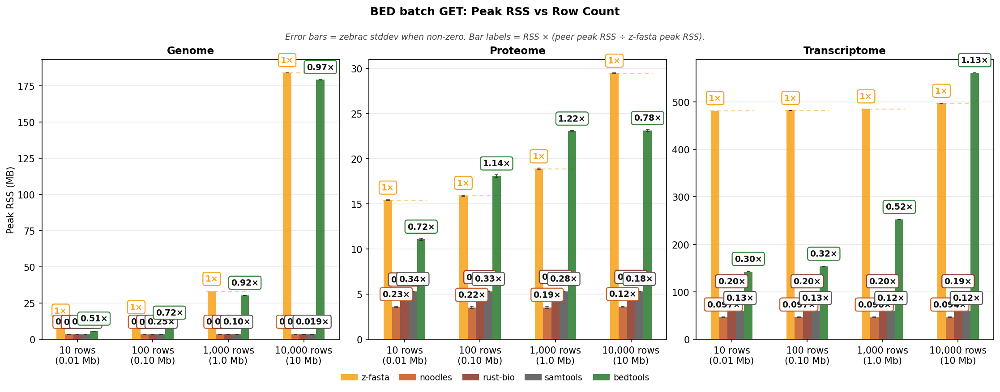

**Reading Figure 8**
- Three panels: Genome, Proteome, Transcriptome (BED row count on x-axis).
- **Bars:** zebrac mean peak RSS. Error bars when stddev is non-zero. Linear y-axis (MB).
- **Legend order:** z-fasta, noodles, rust-bio, samtools, bedtools.
- **Bar labels:** `1×` on z-fasta; other labels = RSS × (peer peak RSS ÷ z-fasta peak RSS). Details in Table 22.

## Page Faults: BED batch

Same zebrac samples as **Performance: BED batch**.

### Page faults

A **minor** fault maps a page without reading disk. A **major** fault reads from disk. zebrac reports both per run, like wall time.

**Table 23:** Minor page faults (zebrac mean). Same tool order as Performance.

| Dataset / BED rows                  |   z-fasta |   noodles |   rust-bio |   samtools |   bedtools |
|:------------------------------------|----------:|----------:|-----------:|-----------:|-----------:|
| Genome / 10 rows (0.01 Mb)          |       390 |       304 |        309 |        394 |        414 |
| Genome / 100 rows (0.10 Mb)         |       512 |       306 |        308 |        394 |        451 |
| Genome / 1,000 rows (1.0 Mb)        |     1,430 |       308 |        310 |        395 |        612 |
| Genome / 10,000 rows (10 Mb)        |    10,443 |       310 |        309 |        396 |      1,807 |
| Proteome / 10 rows (0.01 Mb)        |       622 |       744 |      1,409 |        983 |      2,014 |
| Proteome / 100 rows (0.10 Mb)       |       728 |       747 |      1,412 |        985 |      2,076 |
| Proteome / 1,000 rows (1.0 Mb)      |     1,521 |       750 |      1,410 |        982 |      2,116 |
| Proteome / 10,000 rows (10 Mb)      |     9,402 |       751 |      1,410 |        983 |      2,118 |
| Transcriptome / 10 rows (0.01 Mb)   |     7,186 |    11,804 |     28,256 |     15,124 |     37,528 |
| Transcriptome / 100 rows (0.10 Mb)  |     7,297 |    11,806 |     28,257 |     15,123 |     37,617 |
| Transcriptome / 1,000 rows (1.0 Mb) |     8,142 |    11,813 |     28,259 |     15,123 |     38,407 |
| Transcriptome / 10,000 rows (10 Mb) |    16,536 |    11,822 |     28,270 |     15,125 |     40,879 |

<strong>Table 24:</strong> z-fasta vs each peer. Faults × = peer minor faults ÷ z-fasta minor faults. Same ratios as bar labels on Figure 9.

| Dataset / BED rows                  | z-fasta vs   |   z-fasta |   Peer | Faults ×   |
|:------------------------------------|:-------------|----------:|-------:|:-----------|
| Genome / 10 rows (0.01 Mb)          | noodles      |       390 |    304 | 0.78×      |
| Genome / 10 rows (0.01 Mb)          | rust-bio     |       390 |    309 | 0.79×      |
| Genome / 10 rows (0.01 Mb)          | samtools     |       390 |    394 | 1.01×      |
| Genome / 10 rows (0.01 Mb)          | bedtools     |       390 |    414 | 1.06×      |
| Genome / 100 rows (0.10 Mb)         | noodles      |       512 |    306 | 0.60×      |
| Genome / 100 rows (0.10 Mb)         | rust-bio     |       512 |    308 | 0.60×      |
| Genome / 100 rows (0.10 Mb)         | samtools     |       512 |    394 | 0.77×      |
| Genome / 100 rows (0.10 Mb)         | bedtools     |       512 |    451 | 0.88×      |
| Genome / 1,000 rows (1.0 Mb)        | noodles      |     1,430 |    308 | 0.22×      |
| Genome / 1,000 rows (1.0 Mb)        | rust-bio     |     1,430 |    310 | 0.22×      |
| Genome / 1,000 rows (1.0 Mb)        | samtools     |     1,430 |    395 | 0.28×      |
| Genome / 1,000 rows (1.0 Mb)        | bedtools     |     1,430 |    612 | 0.43×      |
| Genome / 10,000 rows (10 Mb)        | noodles      |    10,443 |    310 | 0.030×     |
| Genome / 10,000 rows (10 Mb)        | rust-bio     |    10,443 |    309 | 0.030×     |
| Genome / 10,000 rows (10 Mb)        | samtools     |    10,443 |    396 | 0.038×     |
| Genome / 10,000 rows (10 Mb)        | bedtools     |    10,443 |  1,807 | 0.17×      |
| Proteome / 10 rows (0.01 Mb)        | noodles      |       622 |    744 | 1.20×      |
| Proteome / 10 rows (0.01 Mb)        | rust-bio     |       622 |  1,409 | 2.3×       |
| Proteome / 10 rows (0.01 Mb)        | samtools     |       622 |    983 | 1.58×      |
| Proteome / 10 rows (0.01 Mb)        | bedtools     |       622 |  2,014 | 3.2×       |
| Proteome / 100 rows (0.10 Mb)       | noodles      |       728 |    747 | 1.03×      |
| Proteome / 100 rows (0.10 Mb)       | rust-bio     |       728 |  1,412 | 1.94×      |
| Proteome / 100 rows (0.10 Mb)       | samtools     |       728 |    985 | 1.35×      |
| Proteome / 100 rows (0.10 Mb)       | bedtools     |       728 |  2,076 | 2.9×       |
| Proteome / 1,000 rows (1.0 Mb)      | noodles      |     1,521 |    750 | 0.49×      |
| Proteome / 1,000 rows (1.0 Mb)      | rust-bio     |     1,521 |  1,410 | 0.93×      |
| Proteome / 1,000 rows (1.0 Mb)      | samtools     |     1,521 |    982 | 0.65×      |
| Proteome / 1,000 rows (1.0 Mb)      | bedtools     |     1,521 |  2,116 | 1.39×      |
| Proteome / 10,000 rows (10 Mb)      | noodles      |     9,402 |    751 | 0.080×     |
| Proteome / 10,000 rows (10 Mb)      | rust-bio     |     9,402 |  1,410 | 0.15×      |
| Proteome / 10,000 rows (10 Mb)      | samtools     |     9,402 |    983 | 0.10×      |
| Proteome / 10,000 rows (10 Mb)      | bedtools     |     9,402 |  2,118 | 0.23×      |
| Transcriptome / 10 rows (0.01 Mb)   | noodles      |     7,186 | 11,804 | 1.64×      |
| Transcriptome / 10 rows (0.01 Mb)   | rust-bio     |     7,186 | 28,256 | 3.9×       |
| Transcriptome / 10 rows (0.01 Mb)   | samtools     |     7,186 | 15,124 | 2.1×       |
| Transcriptome / 10 rows (0.01 Mb)   | bedtools     |     7,186 | 37,528 | 5.2×       |
| Transcriptome / 100 rows (0.10 Mb)  | noodles      |     7,297 | 11,806 | 1.62×      |
| Transcriptome / 100 rows (0.10 Mb)  | rust-bio     |     7,297 | 28,257 | 3.9×       |
| Transcriptome / 100 rows (0.10 Mb)  | samtools     |     7,297 | 15,123 | 2.1×       |
| Transcriptome / 100 rows (0.10 Mb)  | bedtools     |     7,297 | 37,617 | 5.2×       |
| Transcriptome / 1,000 rows (1.0 Mb) | noodles      |     8,142 | 11,813 | 1.45×      |
| Transcriptome / 1,000 rows (1.0 Mb) | rust-bio     |     8,142 | 28,259 | 3.5×       |
| Transcriptome / 1,000 rows (1.0 Mb) | samtools     |     8,142 | 15,123 | 1.86×      |
| Transcriptome / 1,000 rows (1.0 Mb) | bedtools     |     8,142 | 38,407 | 4.7×       |
| Transcriptome / 10,000 rows (10 Mb) | noodles      |    16,536 | 11,822 | 0.71×      |
| Transcriptome / 10,000 rows (10 Mb) | rust-bio     |    16,536 | 28,270 | 1.71×      |
| Transcriptome / 10,000 rows (10 Mb) | samtools     |    16,536 | 15,125 | 0.91×      |
| Transcriptome / 10,000 rows (10 Mb) | bedtools     |    16,536 | 40,879 | 2.5×       |

<strong>Table 25:</strong> Major page faults (all zero for this run).

| Dataset / BED rows                  |   z-fasta |   noodles |   rust-bio |   samtools |   bedtools |
|:------------------------------------|----------:|----------:|-----------:|-----------:|-----------:|
| Genome / 10 rows (0.01 Mb)          |         0 |         0 |          0 |          0 |          0 |
| Genome / 100 rows (0.10 Mb)         |         0 |         0 |          0 |          0 |          0 |
| Genome / 1,000 rows (1.0 Mb)        |         0 |         0 |          0 |          0 |          0 |
| Genome / 10,000 rows (10 Mb)        |         0 |         0 |          0 |          0 |          0 |
| Proteome / 10 rows (0.01 Mb)        |         0 |         0 |          0 |          0 |          0 |
| Proteome / 100 rows (0.10 Mb)       |         0 |         0 |          0 |          0 |          0 |
| Proteome / 1,000 rows (1.0 Mb)      |         0 |         0 |          0 |          0 |          0 |
| Proteome / 10,000 rows (10 Mb)      |         0 |         0 |          0 |          0 |          0 |
| Transcriptome / 10 rows (0.01 Mb)   |         0 |         0 |          0 |          0 |          0 |
| Transcriptome / 100 rows (0.10 Mb)  |         0 |         0 |          0 |          0 |          0 |
| Transcriptome / 1,000 rows (1.0 Mb) |         0 |         0 |          0 |          0 |          0 |
| Transcriptome / 10,000 rows (10 Mb) |         0 |         0 |          0 |          0 |          0 |

**Figure 9:** Table 23 as grouped bars (log y). Bar labels = Faults × (see Table 24).

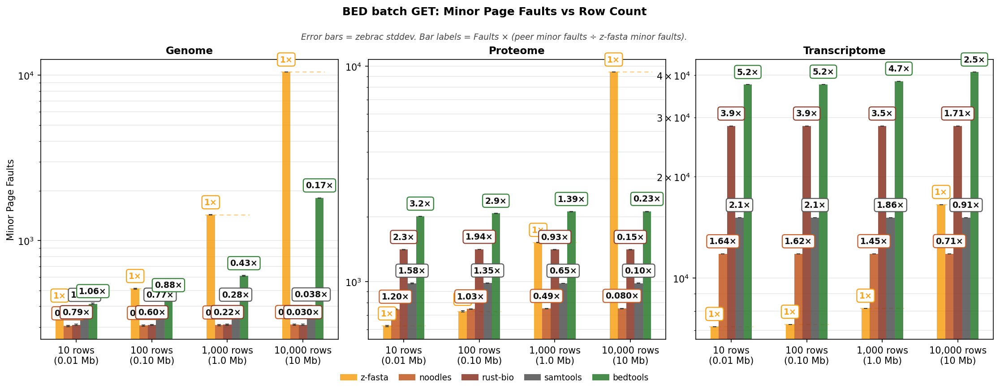

**Reading Figure 9**
- Three panels: Genome, Proteome, Transcriptome (BED row count on x-axis).
- **Bars:** zebrac mean minor page faults. Log y-axis.
- **Legend order:** z-fasta, noodles, rust-bio, samtools, bedtools.
- **Bar labels:** `1×` on z-fasta; other labels = Faults × (peer minor faults ÷ z-fasta minor faults). Details in Table 24.

## RC overhead

Orientation transforms on a fixed **1 kbp** mid slice (`1kbp_mid`) on **Genome, Transcriptome** only. **Proteome is excluded:** protein records have no reverse-complement semantics, so `--rc` and `--complement-only` do not apply; `--reverse-only` only permutes amino-acid characters and adds negligible overhead vs plain GET, so it is not a meaningful benchmark axis. **X-axis = dataset** (Genome, Transcriptome); **bar color = tool/lane** (same layout as z-fasta mode comparison). Figure facets are wall time, peak RSS, and minor page faults. Primary comparison: z-fasta plain vs `--rc`. RC-capable peers use native `--rc`; seqtk (ref) uses `subseq` + `seq -r` (no index).

**Table 26:** Wall time (mean ± stddev, seconds).

| dataset       | z-fasta         | z-fasta --rc    | z-fasta --complement-only   | z-fasta --reverse-only   | noodles --rc    | rust-bio --rc   | seqtk (ref)     |
|:--------------|:----------------|:----------------|:----------------------------|:-------------------------|:----------------|:----------------|:----------------|
| Genome        | 0.0022s ±0.0001 | 0.0023s ±0.0001 | 0.0023s ±0.0001             | 0.0021s ±0.0001          | 0.0024s ±0.0001 | 0.0026s ±0.0001 | 1.3123s ±0.0090 |
| Transcriptome | 0.0040s ±0.0002 | 0.0047s ±0.0002 | 0.0046s ±0.0001             | 0.0041s ±0.0002          | 0.0873s ±0.0005 | 0.5338s ±0.0070 | 0.2208s ±0.0017 |

**Table 27:** Peak RSS (MB).

| dataset       | z-fasta   | z-fasta --rc   | z-fasta --complement-only   | z-fasta --reverse-only   | noodles --rc   | rust-bio --rc   | seqtk (ref)   |
|:--------------|:----------|:---------------|:----------------------------|:-------------------------|:---------------|:----------------|:--------------|
| Genome        | 3.38 MB   | 3.40 MB        | 3.39 MB                     | 3.41 MB                  | 3.38 MB        | 3.40 MB         | 239.41 MB     |
| Transcriptome | 48.85 MB  | 49.11 MB       | 49.11 MB                    | 48.85 MB                 | 46.78 MB       | 145.10 MB       | 3.39 MB       |

**Table 28:** Minor page faults.

| dataset       |   z-fasta |   z-fasta --rc |   z-fasta --complement-only |   z-fasta --reverse-only |   noodles --rc |   rust-bio --rc |   seqtk (ref) |
|:--------------|----------:|---------------:|----------------------------:|-------------------------:|---------------:|----------------:|--------------:|
| Genome        |       314 |            314 |                         315 |                      315 |            297 |             306 |        61,321 |
| Transcriptome |       622 |            624 |                         623 |                      623 |         11,799 |          41,138 |           630 |

<strong>Table 29:</strong> Output throughput (Mbp/s).

| dataset       | z-fasta    | z-fasta --rc   | z-fasta --complement-only   | z-fasta --reverse-only   | noodles --rc   | rust-bio --rc   | seqtk (ref)   |
|:--------------|:-----------|:---------------|:----------------------------|:-------------------------|:---------------|:----------------|:--------------|
| Genome        | 0.46 Mbp/s | 0.43 Mbp/s     | 0.43 Mbp/s                  | 0.47 Mbp/s               | 0.42 Mbp/s     | 0.39 Mbp/s      | 0.001 Mbp/s   |
| Transcriptome | 0.25 Mbp/s | 0.21 Mbp/s     | 0.22 Mbp/s                  | 0.25 Mbp/s               | 0.01 Mbp/s     | 0.002 Mbp/s     | 0.005 Mbp/s   |

**Table 30:** z-fasta RC self-overhead (`--rc` / plain).

| dataset       | z-fasta --rc / plain   |
|:--------------|:-----------------------|
| Genome        | 1.061×                 |
| Transcriptome | 1.172×                 |

<strong>Table 31:</strong> RC peers vs z-fasta --rc. Ratio = peer wall time ÷ z-fasta wall time (baseline = z-fasta --rc).

| Dataset       | z-fasta vs    | z-fasta --rc   | Peer    | Time ×   |
|:--------------|:--------------|:---------------|:--------|:---------|
| Genome        | noodles --rc  | 0.0023s        | 0.0024s | 1.04×    |
| Genome        | rust-bio --rc | 0.0023s        | 0.0026s | 1.11×    |
| Transcriptome | noodles --rc  | 0.0047s        | 0.0873s | 18.5×    |
| Transcriptome | rust-bio --rc | 0.0047s        | 0.5338s | 113×     |

**Figure 10:** Tables 26, 27, and 28 as grouped bars (datasets on x-axis; tool color from legend).

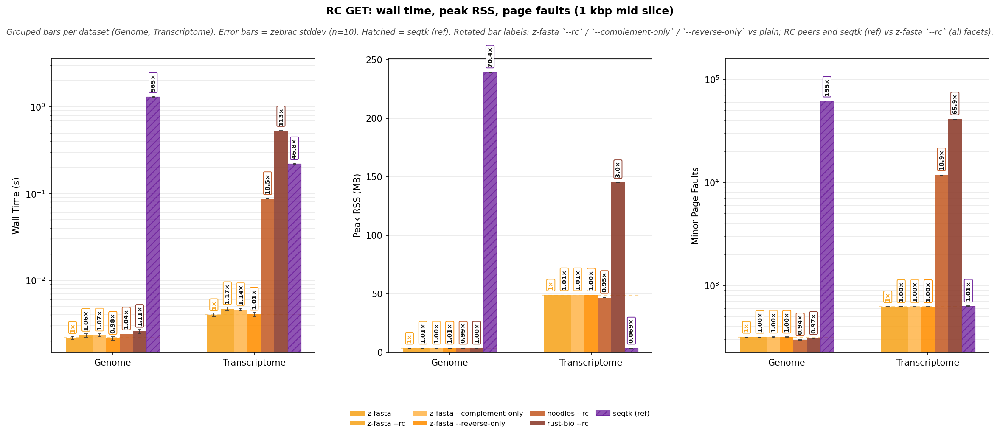

**Reading Figure 10**
- **Facets:** wall time (log y) | peak RSS (linear) | minor page faults (log y).
- **X-axis:** Genome, Transcriptome (Proteome omitted; see section intro).
- **Bar colors:** one lane per tool (legend below figure).
- **Bar labels (rotated):** plain = `1×` baseline; z-fasta `--rc`, `--complement-only`, `--reverse-only` vs plain; noodles/rust-bio `--rc` and seqtk (ref) vs z-fasta `--rc`. Same ratio rules on wall time, peak RSS, and page faults.
- **Hatched bars:** seqtk (ref) when that lane ran.

## z-fasta Mode Comparison

z-fasta default (`.zfi`) vs `.fai` lane on **1kbp_mid**. The `.fai` lane stashes `.zfi` once per region outside the zebrac sample (see `run.sh`); native `.fai` tools do not pay that cost. Transcriptome **~7.6×** is mostly **index load**, not the 1 kbp fetch: the `.fai` path parses **~254k** tab-separated lines and mmaps a **~33 MiB** `.fai` on every zebrac sample, while `.zfi` mmaps a **~9.7 MiB** binary index with no line parsing. Genome (**194** seqs) and Proteome (**~21k**) pay far less parse overhead. Single-region GET uses `records_only` (no hash map); lookup is O(n) on both paths, so startup parse cost dominates on large catalogs.

**Table 32:** Wall time per dataset (Genome, Proteome, Transcriptome).

| dataset       | z-fasta         | z-fasta (.fai)   |
|:--------------|:----------------|:-----------------|
| Genome        | 0.0021s ±0.0000 | 0.0022s ±0.0001  |
| Proteome      | 0.0028s ±0.0001 | 0.0037s ±0.0001  |
| Transcriptome | 0.0042s ±0.0002 | 0.0316s ±0.0014  |

<strong>Table 33:</strong> default vs `.fai` lane.

| Dataset       | z-fasta vs     | z-fasta   | z-fasta (.fai)   | Time ×   |
|:--------------|:---------------|:----------|:-----------------|:---------|
| Genome        | z-fasta (.fai) | 0.0021s   | 0.0022s          | 1.03×    |
| Transcriptome | z-fasta (.fai) | 0.0042s   | 0.0316s          | 7.6×     |
| Proteome      | z-fasta (.fai) | 0.0028s   | 0.0037s          | 1.34×    |

**Figure 11:** Wall time for Table 32.

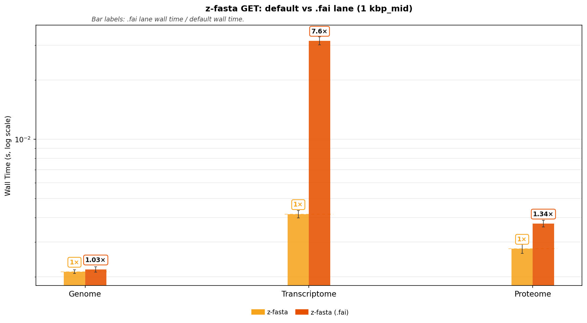

**Reading Figure 11**
- Grouped bars: wall time per dataset.
- Bar labels match Table 33 (`.fai` lane / default).

## Messy FASTA GET (z-fasta only)

Paired `get` on proteome-derived messy fixtures in `bench/shared/messy_variants/` (4 layout variants, ~20k sequences each). Each workload extracts the same TITIN sub-regions from a **uniform** (`validate --fix`) and **messy** (side-table `.zfi`) copy of each file. Spans are defined in `bench/get/messy_perf.json`. Index build stays outside zebrac. Zebrac used **50** samples, **10** warmup, **30000 ms** minimum per lane. Peers are omitted.

**Why ratio charts:** Figures plot **messy / uniform**; dashed line = parity (1.0×). Figure 12 quotes the headline span `titin_mid`. Figure 13 summarizes all spans (median bar, min-max whiskers, `titin_mid` diamond) to show overhead tracks layout type, not extraction length. Collapsible Table below has per-span microseconds and ratios.

**Table 34:** Perf spans × variants (16 timed pairs).

| variant             | span      | region                                      |   bases | purpose                                           | headline   |
|:--------------------|:----------|:--------------------------------------------|--------:|:--------------------------------------------------|:-----------|
| mixed_widths        | titin_1k  | sp&#124;Q8WZ42&#124;TITIN_HUMAN:1-1000      |    1000 | 1 kbp N-terminal on TITIN                         |            |
| mixed_widths        | titin_10k | sp&#124;Q8WZ42&#124;TITIN_HUMAN:1-10000     |   10000 | 10 kbp N-terminal on TITIN                        |            |
| mixed_widths        | titin_mid | sp&#124;Q8WZ42&#124;TITIN_HUMAN:500-2500    |    2001 | 2 kbp interior slice (headline side-table stress) | yes        |
| mixed_widths        | titin_40k | sp&#124;Q8WZ42&#124;TITIN_HUMAN:10000-50000 |   40001 | 40 kbp mid-protein slice                          |            |
| trailing_whitespace | titin_1k  | sp&#124;Q8WZ42&#124;TITIN_HUMAN:1-1000      |    1000 | 1 kbp N-terminal on TITIN                         |            |
| trailing_whitespace | titin_10k | sp&#124;Q8WZ42&#124;TITIN_HUMAN:1-10000     |   10000 | 10 kbp N-terminal on TITIN                        |            |
| trailing_whitespace | titin_mid | sp&#124;Q8WZ42&#124;TITIN_HUMAN:500-2500    |    2001 | 2 kbp interior slice (headline side-table stress) | yes        |
| trailing_whitespace | titin_40k | sp&#124;Q8WZ42&#124;TITIN_HUMAN:10000-50000 |   40001 | 40 kbp mid-protein slice                          |            |
| crlf_endings        | titin_1k  | sp&#124;Q8WZ42&#124;TITIN_HUMAN:1-1000      |    1000 | 1 kbp N-terminal on TITIN                         |            |
| crlf_endings        | titin_10k | sp&#124;Q8WZ42&#124;TITIN_HUMAN:1-10000     |   10000 | 10 kbp N-terminal on TITIN                        |            |
| crlf_endings        | titin_mid | sp&#124;Q8WZ42&#124;TITIN_HUMAN:500-2500    |    2001 | 2 kbp interior slice (headline side-table stress) | yes        |
| crlf_endings        | titin_40k | sp&#124;Q8WZ42&#124;TITIN_HUMAN:10000-50000 |   40001 | 40 kbp mid-protein slice                          |            |
| all_messy           | titin_1k  | sp&#124;Q8WZ42&#124;TITIN_HUMAN:1-1000      |    1000 | 1 kbp N-terminal on TITIN                         |            |
| all_messy           | titin_10k | sp&#124;Q8WZ42&#124;TITIN_HUMAN:1-10000     |   10000 | 10 kbp N-terminal on TITIN                        |            |
| all_messy           | titin_mid | sp&#124;Q8WZ42&#124;TITIN_HUMAN:500-2500    |    2001 | 2 kbp interior slice (headline side-table stress) | yes        |
| all_messy           | titin_40k | sp&#124;Q8WZ42&#124;TITIN_HUMAN:10000-50000 |   40001 | 40 kbp mid-protein slice                          |            |

**Reading Table 34**
- **span** = short id from `messy_perf.json`.
- **region** = full `z-fasta get` region argument (`&#124;` = `|` in UniProt ids).
- **headline** = `titin_mid` (same slice on every variant file).

**Table 35:** Headline span `titin_mid` messy / uniform.

| variant             | span      | metric         | uniform   | messy     | messy / uniform   |
|:--------------------|:----------|:---------------|:----------|:----------|:------------------|
| mixed_widths        | titin_mid | wall time ×    | 2414.0 µs | 2690.4 µs | 1.115×            |
| mixed_widths        | titin_mid | peak RSS ×     | 14.54 MB  | 16.68 MB  | 1.147×            |
| mixed_widths        | titin_mid | minor faults × | 316       | 412       | 1.303×            |
| trailing_whitespace | titin_mid | wall time ×    | 2538.5 µs | 2885.4 µs | 1.137×            |
| trailing_whitespace | titin_mid | peak RSS ×     | 14.54 MB  | 16.82 MB  | 1.156×            |
| trailing_whitespace | titin_mid | minor faults × | 318       | 413       | 1.300×            |
| crlf_endings        | titin_mid | wall time ×    | 2326.0 µs | 2562.7 µs | 1.102×            |
| crlf_endings        | titin_mid | peak RSS ×     | 14.54 MB  | 14.81 MB  | 1.019×            |
| crlf_endings        | titin_mid | minor faults × | 317       | 415       | 1.309×            |
| all_messy           | titin_mid | wall time ×    | 2409.8 µs | 2561.8 µs | 1.063×            |
| all_messy           | titin_mid | peak RSS ×     | 14.54 MB  | 16.78 MB  | 1.154×            |
| all_messy           | titin_mid | minor faults × | 317       | 412       | 1.299×            |

**Figure 12:** Headline span `titin_mid` ratios (Table 35).

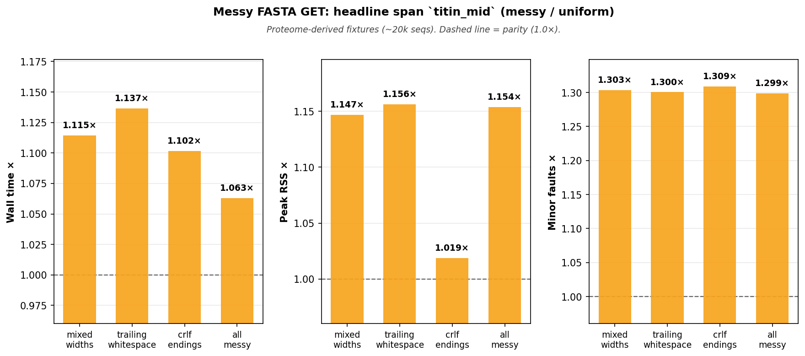

**Reading Figure 12**
- Three panels: wall time, peak RSS, minor page faults (messy / uniform).
- One bar per layout variant at the headline slice `titin_mid`.

**Figure 13:** Layout overhead stable across spans (see Table 36).

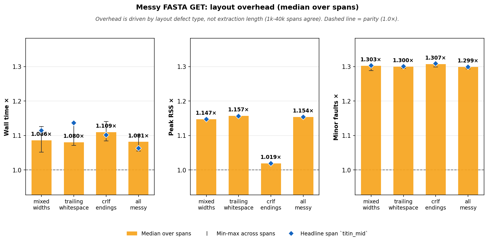

**Reading Figure 13**
- Bar = median messy / uniform ratio over all perf spans.
- Whiskers = min-max across spans (tight whiskers = span-insensitive overhead).
- Diamond = headline span `titin_mid` (links back to Figure 12).

<strong>Table 36:</strong> All spans: wall (µs), RSS ×, faults × (per-span drill-down).

| variant             | span      | region                                      |   bases | uniform wall     | messy wall       | wall ×   | RSS ×   | faults ×   |
|:--------------------|:----------|:--------------------------------------------|--------:|:-----------------|:-----------------|:---------|:--------|:-----------|
| mixed_widths        | titin_1k  | sp&#124;Q8WZ42&#124;TITIN_HUMAN:1-1000      |    1000 | 2415.4 µs ±190.8 | 2719.5 µs ±197.3 | 1.126×   | 1.147×  | 1.303×     |
| mixed_widths        | titin_10k | sp&#124;Q8WZ42&#124;TITIN_HUMAN:1-10000     |   10000 | 2511.3 µs ±242.2 | 2653.6 µs ±212.0 | 1.057×   | 1.147×  | 1.302×     |
| mixed_widths        | titin_mid | sp&#124;Q8WZ42&#124;TITIN_HUMAN:500-2500    |    2001 | 2414.0 µs ±199.5 | 2690.4 µs ±190.2 | 1.115×   | 1.147×  | 1.303×     |
| mixed_widths        | titin_40k | sp&#124;Q8WZ42&#124;TITIN_HUMAN:10000-50000 |   40001 | 2520.9 µs ±213.8 | 2650.2 µs ±205.2 | 1.051×   | 1.147×  | 1.288×     |
| trailing_whitespace | titin_1k  | sp&#124;Q8WZ42&#124;TITIN_HUMAN:1-1000      |    1000 | 2368.0 µs ±212.5 | 2564.4 µs ±138.0 | 1.083×   | 1.157×  | 1.300×     |
| trailing_whitespace | titin_10k | sp&#124;Q8WZ42&#124;TITIN_HUMAN:1-10000     |   10000 | 2382.8 µs ±200.9 | 2566.9 µs ±138.4 | 1.077×   | 1.156×  | 1.300×     |
| trailing_whitespace | titin_mid | sp&#124;Q8WZ42&#124;TITIN_HUMAN:500-2500    |    2001 | 2538.5 µs ±258.8 | 2885.4 µs ±317.4 | 1.137×   | 1.156×  | 1.300×     |
| trailing_whitespace | titin_40k | sp&#124;Q8WZ42&#124;TITIN_HUMAN:10000-50000 |   40001 | 2456.1 µs ±304.7 | 2630.1 µs ±154.4 | 1.071×   | 1.157×  | 1.295×     |
| crlf_endings        | titin_1k  | sp&#124;Q8WZ42&#124;TITIN_HUMAN:1-1000      |    1000 | 2340.2 µs ±378.3 | 2669.3 µs ±200.3 | 1.141×   | 1.019×  | 1.306×     |
| crlf_endings        | titin_10k | sp&#124;Q8WZ42&#124;TITIN_HUMAN:1-10000     |   10000 | 2419.9 µs ±202.3 | 2624.0 µs ±147.6 | 1.084×   | 1.019×  | 1.310×     |
| crlf_endings        | titin_mid | sp&#124;Q8WZ42&#124;TITIN_HUMAN:500-2500    |    2001 | 2326.0 µs ±190.7 | 2562.7 µs ±134.1 | 1.102×   | 1.019×  | 1.309×     |
| crlf_endings        | titin_40k | sp&#124;Q8WZ42&#124;TITIN_HUMAN:10000-50000 |   40001 | 2413.5 µs ±244.3 | 2695.2 µs ±223.5 | 1.117×   | 1.019×  | 1.299×     |
| all_messy           | titin_1k  | sp&#124;Q8WZ42&#124;TITIN_HUMAN:1-1000      |    1000 | 2451.2 µs ±200.1 | 2695.4 µs ±181.6 | 1.100×   | 1.154×  | 1.300×     |
| all_messy           | titin_10k | sp&#124;Q8WZ42&#124;TITIN_HUMAN:1-10000     |   10000 | 2425.6 µs ±205.4 | 2671.3 µs ±161.4 | 1.101×   | 1.154×  | 1.299×     |
| all_messy           | titin_mid | sp&#124;Q8WZ42&#124;TITIN_HUMAN:500-2500    |    2001 | 2409.8 µs ±263.6 | 2561.8 µs ±184.7 | 1.063×   | 1.154×  | 1.299×     |
| all_messy           | titin_40k | sp&#124;Q8WZ42&#124;TITIN_HUMAN:10000-50000 |   40001 | 2484.2 µs ±257.6 | 2620.4 µs ±188.2 | 1.055×   | 1.154×  | 1.294×     |

