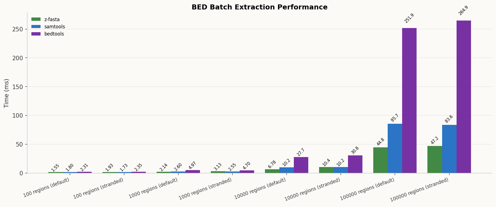
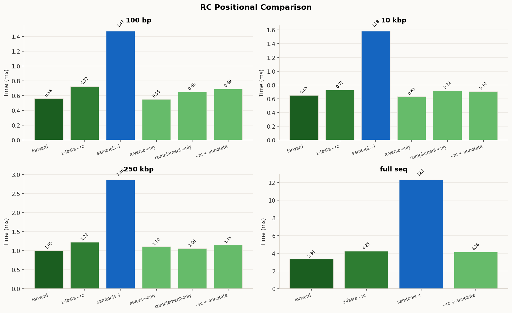
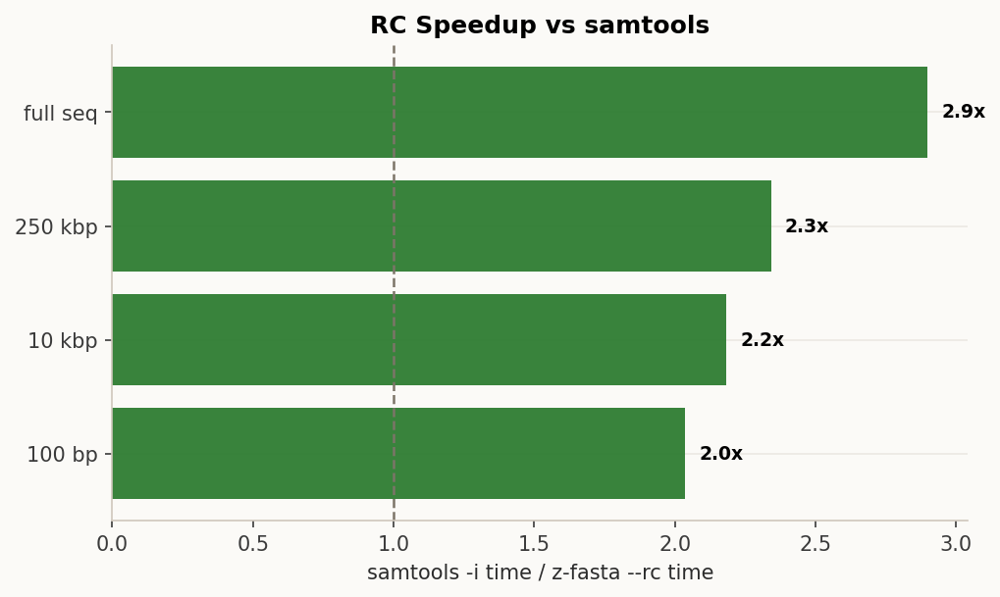
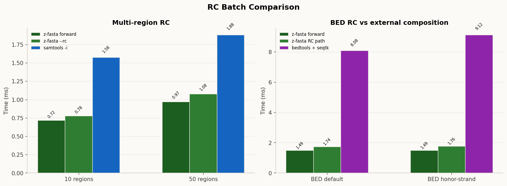

<!-- markdownlint-disable MD012 MD024 -->

# z-fasta GET Benchmark Report

_Auto-generated by `generate_report.py`_

## Run Context

> Report anchored to run bundle `20260515_004405` so all sections come from one benchmark family instead of mixing timestamps.
>
> Runs: `5` | Warmup: `1` | Mode: `warm` | Produced: `single, fullseq, bed, memory, multi, scale_region, real, rc_review`

## Single-Region Extraction Latency

> All measurements on warm cache. Each benchmark extracts a region from the **middle** of the target file.

| Workload        | z-fasta          | samtools         | seqkit            | fastahack        | seqtk             | pyfaidx           | samtools / z-fasta   | best alt / z-fasta   |
|:----------------|:-----------------|:-----------------|:------------------|:-----------------|:------------------|:------------------|:---------------------|:---------------------|
| 10 MB / 100 bp  | 1.21 ms +/- 0.15 | 1.52 ms +/- 0.09 | 15.01 ms +/- 0.34 | 1.38 ms +/- 0.11 | 4.62 ms +/- 0.07  | 61.31 ms +/- 0.80 | **1.3x**             | **1.1x** fastahack   |
| 10 MB / 10 kbp  | 1.22 ms +/- 0.11 | 1.68 ms +/- 0.17 | 15.37 ms +/- 0.17 | 1.35 ms +/- 0.06 | 4.79 ms +/- 0.28  | 61.40 ms +/- 1.10 | **1.4x**             | **1.1x** fastahack   |
| 50 MB / 100 bp  | 1.27 ms +/- 0.08 | 1.43 ms +/- 0.04 | 14.41 ms +/- 0.34 | 1.37 ms +/- 0.08 | 18.32 ms +/- 0.26 | 58.47 ms +/- 0.16 | **1.1x**             | **1.1x** fastahack   |
| 50 MB / 10 kbp  | 1.21 ms +/- 0.03 | 1.47 ms +/- 0.02 | 15.10 ms +/- 0.48 | 1.50 ms +/- 0.09 | 18.68 ms +/- 0.31 | 59.29 ms +/- 0.28 | **1.2x**             | **1.2x** samtools    |
| 100 MB / 100 bp | 1.30 ms +/- 0.07 | 1.42 ms +/- 0.05 | 15.71 ms +/- 1.01 | 1.39 ms +/- 0.10 | 37.32 ms +/- 2.63 | 63.97 ms +/- 1.70 | **1.1x**             | **1.1x** fastahack   |
| 100 MB / 10 kbp | 1.37 ms +/- 0.09 | 1.48 ms +/- 0.10 | 16.25 ms +/- 1.08 | 1.59 ms +/- 0.11 | 36.68 ms +/- 1.04 | 66.49 ms +/- 3.18 | **1.1x**             | **1.1x** samtools    |

> **Interpretation:** z-fasta small-region extraction is startup-dominated: the measured path is O(1) index lookup + `pread`, with ~1-2 ms end-to-end CLI latency on this host. seqkit carries a ~14 ms Go runtime startup cost that dominates at small regions. fastahack and samtools are in the same low-millisecond range for indexed single-region access.

## Full-Sequence Extraction

| Workload      | z-fasta          | samtools         | seqkit            | fastahack        | seqtk             | pyfaidx           | samtools / z-fasta   | best alt / z-fasta   |
|:--------------|:-----------------|:-----------------|:------------------|:-----------------|:------------------|:------------------|:---------------------|:---------------------|
| 1 MB (full)   | 0.57 ms +/- 0.02 | 1.50 ms +/- 0.09 | 15.91 ms +/- 0.76 | 1.84 ms +/- 0.39 | 1.36 ms +/- 0.08  | 61.72 ms +/- 1.48 | **2.6x**             | **2.4x** seqtk       |
| 10 MB (full)  | 1.42 ms +/- 0.10 | 1.99 ms +/- 0.10 | 15.69 ms +/- 0.52 | 1.44 ms +/- 0.15 | 5.12 ms +/- 0.37  | 62.85 ms +/- 1.47 | **1.4x**             | **1.0x** fastahack   |
| 50 MB (full)  | 2.16 ms +/- 0.20 | 4.12 ms +/- 0.13 | 17.16 ms +/- 0.50 | 1.45 ms +/- 0.08 | 20.61 ms +/- 0.33 | 74.91 ms +/- 3.58 | **1.9x**             | 0.67x fastahack      |
| 100 MB (full) | 2.91 ms +/- 0.09 | 6.67 ms +/- 0.19 | 19.34 ms +/- 1.69 | 1.48 ms +/- 0.11 | 42.64 ms +/- 3.16 | 84.53 ms +/- 8.03 | **2.3x**             | 0.51x fastahack      |

> **Note:** fastahack is faster than z-fasta for large full-sequence extraction (≥50 MB). fastahack uses a simpler unbuffered write path while z-fasta's buffered I/O adds overhead proportional to sequence length. This is an optimization target for a future release.

## Region-Size Scaling

| Workload   | z-fasta          | samtools         | seqkit            | fastahack        | seqtk             | pyfaidx           | samtools / z-fasta   | best alt / z-fasta   |
|:-----------|:-----------------|:-----------------|:------------------|:-----------------|:------------------|:------------------|:---------------------|:---------------------|
| 100 bp     | 1.28 ms +/- 0.23 | 1.61 ms +/- 0.29 | 17.52 ms +/- 1.84 | 1.57 ms +/- 0.07 | 38.00 ms +/- 0.79 | 65.68 ms +/- 4.48 | **1.3x**             | **1.2x** fastahack   |
| 1000 bp    | 1.28 ms +/- 0.08 | 1.51 ms +/- 0.15 | 15.81 ms +/- 0.98 | 1.55 ms +/- 0.19 | 38.13 ms +/- 4.50 | 62.41 ms +/- 1.81 | **1.2x**             | **1.2x** samtools    |
| 10000 bp   | 1.47 ms +/- 0.15 | 1.63 ms +/- 0.09 | 17.36 ms +/- 2.52 | 1.77 ms +/- 0.23 | 37.44 ms +/- 0.30 | 62.05 ms +/- 1.34 | **1.1x**             | **1.1x** samtools    |
| 100000 bp  | 1.48 ms +/- 0.10 | 2.30 ms +/- 0.29 | 15.36 ms +/- 0.68 | 1.34 ms +/- 0.09 | 36.69 ms +/- 2.60 | 63.63 ms +/- 4.33 | **1.6x**             | 0.91x fastahack      |
| 1000000 bp | 2.84 ms +/- 0.10 | 6.65 ms +/- 0.84 | 18.27 ms +/- 0.47 | 1.39 ms +/- 0.10 | 38.41 ms +/- 0.42 | 76.46 ms +/- 2.34 | **2.3x**             | 0.49x fastahack      |

> **Interpretation:** Latency is O(1) up to ~10 kbp. Process startup and index lookup dominate below that threshold. Above ~100 kbp it grows linearly with region size as the I/O read cost dominates. fastahack's output advantage grows with region size due to its simpler write path.

## Multi-Region Extraction

> Time to extract N regions in a single CLI call, loading the index once and streaming all results to stdout. z-fasta uses O(1) offset lookup per region while samtools and seqtk pay higher per-call overhead.

| Workload    | z-fasta           | samtools            | seqtk              | samtools / z-fasta   | best alt / z-fasta   |
|:------------|:------------------|:--------------------|:-------------------|:---------------------|:---------------------|
| 1 region    | 28.67 ms +/- 0.60 | 309.26 ms +/- 17.92 | 224.06 ms +/- 3.44 | **10.8x**            | **7.8x** seqtk       |
| 10 regions  | 36.67 ms +/- 0.33 | 276.16 ms +/- 2.61  | 226.10 ms +/- 3.13 | **7.5x**             | **6.2x** seqtk       |
| 50 regions  | 72.69 ms +/- 3.26 | 320.00 ms +/- 7.29  | 227.56 ms +/- 5.54 | **4.4x**             | **3.1x** seqtk       |
| 100 regions | 70.27 ms +/- 2.10 | 303.83 ms +/- 13.07 | 233.96 ms +/- 8.54 | **4.3x**             | **3.3x** seqtk       |

> **Note:** seqtk does not use an index for region extraction. It performs a full-file scan for every call regardless of region count, so its time is roughly constant here and reflects file I/O cost, not region count.

## BED Batch Extraction

> Synthetic BED batches of 100, 1K, 10K, and 100K regions on a single indexed FASTA. `z-fasta` runs with `--bed` and an explicit chunk size that forces multi-batch processing. `samtools faidx -r` ignores strand, so the stranded rows isolate reverse-complement overhead for `z-fasta` and `bedtools getfasta -s`.

| Workload                  | z-fasta           | samtools          | bedtools           | samtools / z-fasta   | best alt / z-fasta   |
|:--------------------------|:------------------|:------------------|:-------------------|:---------------------|:---------------------|
| 100 regions (default)     | 1.55 ms +/- 0.12  | 1.80 ms +/- 0.07  | 2.31 ms +/- 0.14   | **1.2x**             | **1.2x** samtools    |
| 100 regions (stranded)    | 1.93 ms +/- 0.11  | 1.73 ms +/- 0.10  | 2.35 ms +/- 0.13   | 0.89x                | 0.89x samtools       |
| 1000 regions (default)    | 2.14 ms +/- 0.22  | 2.60 ms +/- 0.17  | 4.97 ms +/- 0.59   | **1.2x**             | **1.2x** samtools    |
| 1000 regions (stranded)   | 3.13 ms +/- 0.14  | 2.55 ms +/- 0.14  | 4.70 ms +/- 0.16   | 0.81x                | 0.81x samtools       |
| 10000 regions (default)   | 6.78 ms +/- 0.12  | 10.17 ms +/- 0.56 | 27.71 ms +/- 0.38  | **1.5x**             | **1.5x** samtools    |
| 10000 regions (stranded)  | 10.35 ms +/- 0.52 | 10.23 ms +/- 0.27 | 30.79 ms +/- 1.60  | 0.99x                | 0.99x samtools       |
| 100000 regions (default)  | 44.77 ms +/- 0.73 | 85.67 ms +/- 1.48 | 251.93 ms +/- 3.24 | **1.9x**             | **1.9x** samtools    |
| 100000 regions (stranded) | 47.24 ms +/- 0.96 | 83.59 ms +/- 0.58 | 264.93 ms +/- 3.23 | **1.8x**             | **1.8x** samtools    |

## Reverse / Complement Orientation

> Correctness lives in `verify_rc.sh`; this section tracks the runtime and RSS cost of shipped orientation modes and compares them against external RC-capable baselines where those paths exist.

### Positional RC Summary

| Workload      | z-fasta forward   | z-fasta --rc     | samtools -i       | reverse-only     | complement-only   | --rc + annotate   | RC / forward   | samtools / z-fasta --rc   |
|:--------------|:------------------|:-----------------|:------------------|:-----------------|:------------------|:------------------|:---------------|:--------------------------|
| 100 bp region | 0.56 ms +/- 0.03  | 0.72 ms +/- 0.09 | 1.47 ms +/- 0.13  | 0.55 ms +/- 0.06 | 0.65 ms +/- 0.06  | 0.69 ms +/- 0.07  | **1.3x**       | **2.0x**                  |
| 10 kbp region | 0.65 ms +/- 0.12  | 0.73 ms +/- 0.09 | 1.58 ms +/- 0.14  | 0.63 ms +/- 0.10 | 0.72 ms +/- 0.10  | 0.70 ms +/- 0.06  | **1.1x**       | **2.2x**                  |
| large region  | 1.00 ms +/- 0.06  | 1.22 ms +/- 0.10 | 2.86 ms +/- 0.11  | 1.10 ms +/- 0.07 | 1.06 ms +/- 0.05  | 1.15 ms +/- 0.07  | **1.2x**       | **2.3x**                  |
| full sequence | 3.36 ms +/- 0.08  | 4.25 ms +/- 0.08 | 12.31 ms +/- 0.10 | -                | -                 | 4.16 ms +/- 0.06  | **1.3x**       | **2.9x**                  |

### Batch RC Summary

| Workload          | z-fasta forward   | z-fasta --rc     | baseline         | RC / forward   | baseline / z-fasta --rc   |
|:------------------|:------------------|:-----------------|:-----------------|:---------------|:--------------------------|
| multi-region (10) | 0.72 ms +/- 0.08  | 0.78 ms +/- 0.06 | 1.58 ms +/- 0.09 | **1.1x**       | **2.0x**                  |
| multi-region (50) | 0.97 ms +/- 0.11  | 1.08 ms +/- 0.10 | 1.88 ms +/- 0.13 | **1.1x**       | **1.7x**                  |
| BED default       | 1.49 ms +/- 0.05  | 1.74 ms +/- 0.09 | 8.08 ms +/- 0.16 | **1.2x**       | **4.6x**                  |
| BED honor-strand  | 1.49 ms +/- 0.05  | 1.76 ms +/- 0.09 | 9.12 ms +/- 0.27 | **1.2x**       | **5.2x**                  |

### RC Takeaways

- Large-region `--rc` stays in the same low-millisecond class as forward extraction and remains **2.3×** faster than the local `samtools faidx -i` baseline on the synthetic review slice.
- BED `--honor-strand --rc` remains a single-pass path and is **5.2×** faster than the local `bedtools getfasta -s | seqtk seq -r` composition on the review slice.
- The checked-in RC review harness is quick by default so these comparisons can be rerun in the normal edit loop rather than as a separate long-lived benchmark session.

### RC RSS Snapshot

| Mode                                   | Elapsed   | MaxRSS (KB)   | vs z-fasta --rc   |
|:---------------------------------------|:----------|:--------------|:------------------|
| z-fasta forward                        | 0:00.00   | 1,064         | 1.00x             |
| z-fasta --rc                           | 0:00.00   | 1,068         | **1.0x**          |
| z-fasta --rc --annotate-rc             | 0:00.00   | 1,104         | **1.0x**          |
| multi-region forward                   | 0:00.00   | 2,624         | **2.5x**          |
| multi-region z-fasta --rc              | 0:00.00   | 2,620         | **2.5x**          |
| BED forward                            | 0:00.00   | 1,892         | **1.8x**          |
| BED honor-strand + z-fasta --rc        | 0:00.00   | 2,096         | **2.0x**          |
| samtools -i                            | 0:00.00   | 3,612         | **3.4x**          |
| multi-region samtools -i               | 0:00.00   | 3,344         | **3.1x**          |
| BED honor-strand + bedtools + seqtk rc | 0:00.00   | 5,652         | **5.3x**          |

## Real Dataset Extraction

| Workload                    | z-fasta            | samtools             | seqkit              | fastahack           | seqtk                | pyfaidx              | samtools / z-fasta   | best alt / z-fasta   |
|:----------------------------|:-------------------|:---------------------|:--------------------|:--------------------|:---------------------|:---------------------|:---------------------|:---------------------|
| Genome: 1 kbp region        | 1.29 ms +/- 0.10   | 1.86 ms +/- 0.19     | 17.01 ms +/- 1.07   | 2.15 ms +/- 0.13    | 1356.45 ms +/- 17.84 | 66.62 ms +/- 2.03    | **1.4x**             | **1.4x** samtools    |
| Genome: 1 Mbp region        | 2.97 ms +/- 0.21   | 7.14 ms +/- 0.37     | 20.31 ms +/- 1.02   | 1.43 ms +/- 0.01    | 1335.74 ms +/- 26.02 | 82.88 ms +/- 4.41    | **2.4x**             | 0.48x fastahack      |
| Genome: full seq            | 327.75 ms +/- 7.30 | 1222.16 ms +/- 34.35 | 854.93 ms +/- 38.69 | 1.61 ms +/- 0.10    | 2138.06 ms +/- 26.46 | 3906.58 ms +/- 50.78 | **3.7x**             | 0.00x fastahack      |
| Transcriptome: 1 kbp region | 29.07 ms +/- 0.73  | 298.54 ms +/- 13.01  | 371.17 ms +/- 20.17 | 648.83 ms +/- 26.66 | 225.00 ms +/- 3.11   | 1119.19 ms +/- 6.15  | **10.3x**            | **7.7x** seqtk       |
| Transcriptome: full seq     | 29.54 ms +/- 0.57  | 284.58 ms +/- 6.99   | 383.64 ms +/- 23.90 | 699.43 ms +/- 41.78 | 237.81 ms +/- 9.16   | 1150.78 ms +/- 41.07 | **9.6x**             | **8.0x** seqtk       |
| Proteome: 1 kbp region      | 1.83 ms +/- 0.28   | 11.71 ms +/- 0.80    | 27.79 ms +/- 0.75   | 35.68 ms +/- 2.16   | 7.51 ms +/- 0.16     | 131.21 ms +/- 4.51   | **6.4x**             | **4.1x** seqtk       |
| Proteome: full seq          | 1.73 ms +/- 0.25   | 11.73 ms +/- 0.27    | 27.62 ms +/- 2.16   | 36.20 ms +/- 1.20   | 7.92 ms +/- 1.20     | 129.22 ms +/- 0.75   | **6.8x**             | **4.6x** seqtk       |

## Memory Usage

> RSS measured with `/usr/bin/time -v`. For mmap-based tools (z-fasta, samtools, fastahack) RSS reflects file pages mapped by the OS, not heap allocation. `Major Faults` should be ~0 on warm cache.

| Region   | z-fasta RSS   | samtools RSS   | samtools / z-fasta RSS   | lowest alt / z-fasta RSS   |
|:---------|:--------------|:---------------|:-------------------------|:---------------------------|
| small    | 6,952 KB      | 3,404 KB       | 0.49x                    | 0.48x seqtk                |
| large    | 7,976 KB      | 4,124 KB       | 0.52x                    | 0.43x seqtk                |
| full     | 7,976 KB      | 4,128 KB       | 0.52x                    | 0.42x seqtk                |

### Detailed Memory Table

| Tool      | Region   |   Time (s) | MaxRSS (KB)   |   Maj. Faults |
|:----------|:---------|-----------:|:--------------|--------------:|
| z-fasta   | small    |     0.0000 | 6,952         |             0 |
| samtools  | small    |     0.0000 | 3,404         |             0 |
| seqkit    | small    |     0.0100 | 18,320        |             0 |
| fastahack | small    |     0.0000 | 3,396         |             0 |
| seqtk     | small    |     0.0300 | 3,352         |             0 |
| pyfaidx   | small    |     0.0600 | 17,412        |             0 |
| z-fasta   | large    |     0.0000 | 7,976         |             0 |
| samtools  | large    |     0.0000 | 4,124         |             0 |
| seqkit    | large    |     0.0200 | 20,736        |             0 |
| fastahack | large    |     0.0000 | 3,596         |             0 |
| seqtk     | large    |     0.0300 | 3,404         |             0 |
| pyfaidx   | large    |     0.0700 | 19,644        |             0 |
| z-fasta   | full     |     0.0000 | 7,976         |             0 |
| samtools  | full     |     0.0000 | 4,128         |             0 |
| seqkit    | full     |     0.0200 | 21,184        |             0 |
| fastahack | full     |     0.0000 | 3,408         |             0 |
| seqtk     | full     |     0.0400 | 3,376         |             0 |
| pyfaidx   | full     |     0.0700 | 19,684        |             0 |
