<!-- markdownlint-disable MD024 MD032 MD033 MD036 MD041 MD049 -->

# z-fasta GET Benchmark Report

_Auto-generated by `bench/get/generate_report.py` from zebrac results._

## Overview

This report compares `z-fasta get` to other FASTA region fetch tools on preloaded indexes. `.zfi` is z-fasta's first-class format and the baseline for every ratio. For compatibility, z-fasta also reads standard `.fai` indexes; that path remains competitive and is sometimes faster or more memory-efficient. Wall time, peak RSS, and page faults come from the same zebrac samples for every tool in each section.

Other timed tools are **peers**: they perform the same GET work (named regions, multi-region batches, or BED batch fetch) on the same fixtures. Charts label peer ratios as **peer / z-fasta (.zfi)**. **Reference lanes** (seqtk positional, multi-region subprocess loops) use different invocation patterns and appear hatched when present.

**Performance:** positional extraction (wall time, RSS, page faults vs region size), multi-region batching (N=1, 10, 100, 1,000; one get with N×1 kbp regions), and BED batch (`get --bed`; 10–10,000 rows × 1 kbp; three-panel grouped bars per metric) on each REAL dataset present in this run, RC overhead on nucleotide datasets, and z-fasta messy vs uniform GET pairs on verify fixtures.

**Correctness:** `bench/get/run.sh` (not timed here) checks byte-identical output against golden fixtures.

**Tool order in charts:** z-fasta (.zfi), then z-fasta (.fai) when captured, followed by noodles, rust-bio, samtools, fastahack (on `full seq`), then reference lanes (seqtk positional; multi seqtk/fastahack loops omitted from default timed runs). **bedtools** is timed in **Performance: BED batch** (`bedtools getfasta`); it is not a positional or multi-region peer because those workloads use region/name syntax, not BED files.

**Multi-region reference loops** (seqtk, fastahack: one subprocess per region) are **omitted from default timed runs** because wall time grows linearly with N and largely duplicates positional seqtk reference data. Set `GET_MULTI_REFERENCE=1` in `run.sh` for a one-off reference sweep.

**fastahack** positional timing uses `fastahack -r` on **`full seq`** rows (whole-entry fetch on bounded sequences; see fixture notes in `run.sh`).

**seqtk (ref)** positional timing pipes one region via stdin on each call with no persistent index. It appears in charts with hatched bars. On large indexed FASTA files (e.g. Genome), seqtk rescans the whole file each call, so log-scale wall-time charts compress indexed tools near the bottom; compare indexed peers within each region, not bar height vs seqtk.

**Verify:** `bench/get/run.sh` correctness passed **418** checks before this perf run.

_Messy GET used higher zebrac sampling (50 runs, 10 warmup, 30000 ms) because timings are sub-millisecond._

## Run Provenance

Run **`20261007_091005`** used **zebrac** in **warm** mode: 5 measured samples, 3 warmup passes, 5000 ms budget per command.

- **Subject:** z-fasta 0.3.4 (Zig; default `.zfi` get and `.fai` lane)

- **Runner:** zebrac 0.6.2

- **Artifacts:** `results/perf_pos_20261007_091005/` positional extraction; `results/perf_multi_20261007_091005/` multi-region scaling; `results/perf_bed_20261007_091005/` BED batch; `results/perf_rc_20261007_091005/` RC overhead; `results/messy_20261007_091005/` messy FASTA; metadata in `results/metadata_20261007_091005.jsonl`

- **Messy GET zebrac:** 50 samples, 10 warmup, 30000 ms (headline sections use 5/3/5000 ms).

**Datasets**

- **Genome:** Homo sapiens GRCh38 primary assembly (Ensembl release 113).
- **Transcriptome:** Homo sapiens GENCODE v46 transcript sequences.
- **Proteome:** Homo sapiens UniProt reference proteome UP000005640.

**Peers in this run** (same GET task; versions captured at benchmark time; vendored pins in `bench/shared/tools.sh` / `tools/`):
- **samtools** (C): samtools 1.24 via `samtools faidx region` (from `samtools --version`; pin 1.24)
- **bedtools** (C++): bedtools v2.31.1 via `bedtools getfasta` (from `bedtools --version`; pin 2.31.1)
- **noodles** (Rust): noodles-fasta 0.66.0 (wrapper) via `tools/noodles_wrapper get` (from noodles-fasta crate in `tools/noodles_wrapper/Cargo.toml`; pin 0.66.0)
- **rust-bio** (Rust): rust-bio 4.0.1 (custom indexer wrapper) via `tools/rustbio_wrapper get` (from bio crate in `tools/rustbio_wrapper/Cargo.toml`; pin 4.0.1)
- **fastahack** (C++): fastahack 1.0.0 (local tool bundle) via `fastahack region` (from local binary `tools/bin/fastahack`; pin 1.0.0)
- **seqtk** (C): seqtk 1.5-r133 via `seqtk subseq (reference loop)` (from `seqtk 2>&1`)

Private `.zfi` and `.fai` views are prepared before timed GET commands. Timed commands do not create, remove, or replace shared sidecars.

**0.3.4 regression check:** Comparing this run with `20260818_070223` flags eight transcriptome `.zfi` timing cells using thresholds of more than 10% and 1 ms for wall time, or more than 10% and 1 MiB for RSS. The eight cells contain seven distinct commands; plain 1 kbp extraction appears in both positional and RC sections. The historical runs are separate measurements, so their differences do not isolate code changes.

An additional same-host comparison uses `main` at `389f041` and the merged code at `1a2f7f1`, both built with Zig 0.16.0 from `PATH`, ReleaseFast, and stripping. Both read the same fresh `.zfi`. Stdout, stderr, and exit status match for all seven commands. Each command has four fixed ABBA blocks with two warmups and nine samples per block, giving 18 measured samples per binary. No samples are discarded. Raw results: `results/control_get_20261007_091005.json`.

| Transcriptome `.zfi` command | main wall (ms) | 0.3.4 wall (ms) | Time change | main RSS (MiB) | 0.3.4 RSS (MiB) |
| --- | ---: | ---: | ---: | ---: | ---: |
| multi-region N=1 | 7.045 | 7.169 | +1.76% | 31.027 | 31.027 |
| positional 100 bp | 5.909 | 5.981 | +1.21% | 22.277 | 22.527 |
| positional 10 kbp | 5.934 | 6.080 | +2.46% | 22.277 | 22.499 |
| positional 1 kbp | 6.008 | 5.990 | -0.30% | 22.277 | 22.500 |
| complement-only | 5.873 | 6.014 | +2.40% | 22.277 | 22.527 |
| reverse-complement | 5.916 | 5.933 | +0.29% | 22.277 | 22.527 |
| reverse-only | 5.866 | 5.951 | +1.45% | 22.277 | 22.527 |

The same-host comparison stays below both thresholds. It records small changes rather than proving zero regressions. The slower historical timing cells remain in the published tables; the additional check does not replace them.

## Performance: Positional extraction

Positional GET on preloaded indexes. Three panels (Genome, Transcriptome, Proteome) with grouped bars per region size. **`full seq`** is a whole-entry fetch on a bounded sequence (Genome ≤1 kbp; Transcriptome/Proteome medium entries, not titin). Tool order: z-fasta (.zfi), z-fasta (.fai), noodles, rust-bio, samtools, fastahack, seqtk (ref).

**Table 1:** Wall time (mean ± stddev, seconds). Lower is better. Same tool order as the figure.

| dataset_region           | z-fasta (.zfi)   | z-fasta (.fai)   | noodles         | rust-bio        | samtools        | fastahack       | seqtk (ref)     |
|:-------------------------|:-----------------|:-----------------|:----------------|:----------------|:----------------|:----------------|:----------------|
| Genome / 100 bp          | 0.0025s ±0.0001  | 0.0025s ±0.0001  | 0.0027s ±0.0001 | 0.0030s ±0.0001 | 0.0081s ±0.0003 | nan             | 1.3626s ±0.0057 |
| Genome / 1 kbp           | 0.0024s ±0.0000  | 0.0026s ±0.0002  | 0.0028s ±0.0002 | 0.0031s ±0.0001 | 0.0081s ±0.0004 | nan             | 1.3681s ±0.0065 |
| Genome / 10 kbp          | 0.0024s ±0.0000  | 0.0025s ±0.0001  | 0.0028s ±0.0001 | 0.0032s ±0.0003 | 0.0081s ±0.0004 | nan             | 1.3646s ±0.0062 |
| Genome / full seq        | 0.0024s ±0.0000  | 0.0028s ±0.0000  | 0.0028s ±0.0002 | 0.0031s ±0.0001 | 0.0080s ±0.0003 | 0.0036s ±0.0001 | 1.3700s ±0.0032 |
| Transcriptome / 100 bp   | 0.0063s ±0.0003  | 0.0293s ±0.0004  | 0.0889s ±0.0013 | 0.5354s ±0.0122 | 0.2853s ±0.0041 | nan             | 0.2204s ±0.0012 |
| Transcriptome / 1 kbp    | 0.0063s ±0.0002  | 0.0293s ±0.0001  | 0.0890s ±0.0011 | 0.5300s ±0.0106 | 0.2898s ±0.0016 | nan             | 0.2191s ±0.0013 |
| Transcriptome / 10 kbp   | 0.0065s ±0.0003  | 0.0294s ±0.0002  | 0.0899s ±0.0021 | 0.5257s ±0.0063 | 0.2914s ±0.0047 | nan             | 0.2300s ±0.0247 |
| Transcriptome / full seq | 0.0050s ±0.0003  | 0.0292s ±0.0002  | 0.0880s ±0.0010 | 0.5199s ±0.0053 | 0.2850s ±0.0041 | 0.6002s ±0.0224 | 0.2196s ±0.0015 |
| Proteome / 100 bp        | 0.0027s ±0.0001  | 0.0042s ±0.0001  | 0.0073s ±0.0001 | 0.0206s ±0.0002 | 0.0178s ±0.0005 | nan             | 0.0101s ±0.0008 |
| Proteome / 1 kbp         | 0.0027s ±0.0001  | 0.0042s ±0.0001  | 0.0072s ±0.0001 | 0.0200s ±0.0002 | 0.0173s ±0.0003 | nan             | 0.0101s ±0.0007 |
| Proteome / 10 kbp        | 0.0027s ±0.0001  | 0.0041s ±0.0001  | 0.0072s ±0.0002 | 0.0202s ±0.0002 | 0.0170s ±0.0002 | nan             | 0.0100s ±0.0008 |
| Proteome / full seq      | 0.0027s ±0.0001  | 0.0041s ±0.0001  | 0.0072s ±0.0001 | 0.0204s ±0.0004 | 0.0177s ±0.0003 | 0.0317s ±0.0009 | 0.0098s ±0.0002 |

<strong>Table 2:</strong> Output throughput (Mbp/s) from metadata <code>output_bases</code> and wall time. Higher is better. Same tools and order as Table 1.

| dataset_region           | z-fasta (.zfi)   | z-fasta (.fai)   | noodles     | rust-bio    | samtools    | fastahack   | seqtk (ref)   |
|:-------------------------|:-----------------|:-----------------|:------------|:------------|:------------|:------------|:--------------|
| Genome / 100 bp          | 0.04 Mbp/s       | 0.04 Mbp/s       | 0.04 Mbp/s  | 0.03 Mbp/s  | 0.01 Mbp/s  | nan         | 0.000 Mbp/s   |
| Genome / 1 kbp           | 0.42 Mbp/s       | 0.39 Mbp/s       | 0.35 Mbp/s  | 0.32 Mbp/s  | 0.12 Mbp/s  | nan         | 0.001 Mbp/s   |
| Genome / 10 kbp          | 4.20 Mbp/s       | 4.06 Mbp/s       | 3.57 Mbp/s  | 3.11 Mbp/s  | 1.24 Mbp/s  | nan         | 0.007 Mbp/s   |
| Genome / full seq        | 0.40 Mbp/s       | 0.35 Mbp/s       | 0.35 Mbp/s  | 0.32 Mbp/s  | 0.12 Mbp/s  | 0.27 Mbp/s  | 0.001 Mbp/s   |
| Transcriptome / 100 bp   | 0.02 Mbp/s       | 0.003 Mbp/s      | 0.001 Mbp/s | 0.000 Mbp/s | 0.000 Mbp/s | nan         | 0.000 Mbp/s   |
| Transcriptome / 1 kbp    | 0.16 Mbp/s       | 0.03 Mbp/s       | 0.01 Mbp/s  | 0.002 Mbp/s | 0.003 Mbp/s | nan         | 0.005 Mbp/s   |
| Transcriptome / 10 kbp   | 1.55 Mbp/s       | 0.34 Mbp/s       | 0.11 Mbp/s  | 0.02 Mbp/s  | 0.03 Mbp/s  | nan         | 0.04 Mbp/s    |
| Transcriptome / full seq | 0.20 Mbp/s       | 0.03 Mbp/s       | 0.01 Mbp/s  | 0.002 Mbp/s | 0.004 Mbp/s | 0.002 Mbp/s | 0.005 Mbp/s   |
| Proteome / 100 bp        | 0.04 Mbp/s       | 0.02 Mbp/s       | 0.01 Mbp/s  | 0.005 Mbp/s | 0.006 Mbp/s | nan         | 0.010 Mbp/s   |
| Proteome / 1 kbp         | 0.37 Mbp/s       | 0.24 Mbp/s       | 0.14 Mbp/s  | 0.05 Mbp/s  | 0.06 Mbp/s  | nan         | 0.10 Mbp/s    |
| Proteome / 10 kbp        | 3.70 Mbp/s       | 2.43 Mbp/s       | 1.39 Mbp/s  | 0.50 Mbp/s  | 0.59 Mbp/s  | nan         | 1.00 Mbp/s    |
| Proteome / full seq      | 0.18 Mbp/s       | 0.12 Mbp/s       | 0.07 Mbp/s  | 0.02 Mbp/s  | 0.03 Mbp/s  | 0.02 Mbp/s  | 0.05 Mbp/s    |

<strong>Table 3:</strong> z-fasta (.zfi) vs each peer. Speedup = peer wall time ÷ z-fasta wall time (higher = z-fasta faster). Includes reference lanes. Same ratios as bar labels on Figure 1.

| Dataset / region         | z-fasta (.zfi) vs   | z-fasta (.zfi)   | Peer    | Speedup   |
|:-------------------------|:--------------------|:-----------------|:--------|:----------|
| Genome / 100 bp          | z-fasta (.fai)      | 0.0025s          | 0.0025s | 0.99x     |
| Genome / 100 bp          | noodles             | 0.0025s          | 0.0027s | 1.09x     |
| Genome / 100 bp          | rust-bio            | 0.0025s          | 0.0030s | 1.19x     |
| Genome / 100 bp          | samtools            | 0.0025s          | 0.0081s | 3.3x      |
| Genome / 100 bp          | seqtk (ref)         | 0.0025s          | 1.3626s | 547x      |
| Genome / 1 kbp           | z-fasta (.fai)      | 0.0024s          | 0.0026s | 1.07x     |
| Genome / 1 kbp           | noodles             | 0.0024s          | 0.0028s | 1.19x     |
| Genome / 1 kbp           | rust-bio            | 0.0024s          | 0.0031s | 1.29x     |
| Genome / 1 kbp           | samtools            | 0.0024s          | 0.0081s | 3.4x      |
| Genome / 1 kbp           | seqtk (ref)         | 0.0024s          | 1.3681s | 575x      |
| Genome / 10 kbp          | z-fasta (.fai)      | 0.0024s          | 0.0025s | 1.03x     |
| Genome / 10 kbp          | noodles             | 0.0024s          | 0.0028s | 1.18x     |
| Genome / 10 kbp          | rust-bio            | 0.0024s          | 0.0032s | 1.35x     |
| Genome / 10 kbp          | samtools            | 0.0024s          | 0.0081s | 3.4x      |
| Genome / 10 kbp          | seqtk (ref)         | 0.0024s          | 1.3646s | 573x      |
| Genome / full seq        | z-fasta (.fai)      | 0.0024s          | 0.0028s | 1.16x     |
| Genome / full seq        | noodles             | 0.0024s          | 0.0028s | 1.15x     |
| Genome / full seq        | rust-bio            | 0.0024s          | 0.0031s | 1.27x     |
| Genome / full seq        | samtools            | 0.0024s          | 0.0080s | 3.3x      |
| Genome / full seq        | fastahack           | 0.0024s          | 0.0036s | 1.48x     |
| Genome / full seq        | seqtk (ref)         | 0.0024s          | 1.3700s | 569x      |
| Transcriptome / 100 bp   | z-fasta (.fai)      | 0.0063s          | 0.0293s | 4.6x      |
| Transcriptome / 100 bp   | noodles             | 0.0063s          | 0.0889s | 14.0x     |
| Transcriptome / 100 bp   | rust-bio            | 0.0063s          | 0.5354s | 84.4x     |
| Transcriptome / 100 bp   | samtools            | 0.0063s          | 0.2853s | 45.0x     |
| Transcriptome / 100 bp   | seqtk (ref)         | 0.0063s          | 0.2204s | 34.7x     |
| Transcriptome / 1 kbp    | z-fasta (.fai)      | 0.0063s          | 0.0293s | 4.7x      |
| Transcriptome / 1 kbp    | noodles             | 0.0063s          | 0.0890s | 14.2x     |
| Transcriptome / 1 kbp    | rust-bio            | 0.0063s          | 0.5300s | 84.6x     |
| Transcriptome / 1 kbp    | samtools            | 0.0063s          | 0.2898s | 46.3x     |
| Transcriptome / 1 kbp    | seqtk (ref)         | 0.0063s          | 0.2191s | 35.0x     |
| Transcriptome / 10 kbp   | z-fasta (.fai)      | 0.0065s          | 0.0294s | 4.5x      |
| Transcriptome / 10 kbp   | noodles             | 0.0065s          | 0.0899s | 13.9x     |
| Transcriptome / 10 kbp   | rust-bio            | 0.0065s          | 0.5257s | 81.4x     |
| Transcriptome / 10 kbp   | samtools            | 0.0065s          | 0.2914s | 45.1x     |
| Transcriptome / 10 kbp   | seqtk (ref)         | 0.0065s          | 0.2300s | 35.6x     |
| Transcriptome / full seq | z-fasta (.fai)      | 0.0050s          | 0.0292s | 5.8x      |
| Transcriptome / full seq | noodles             | 0.0050s          | 0.0880s | 17.6x     |
| Transcriptome / full seq | rust-bio            | 0.0050s          | 0.5199s | 104x      |
| Transcriptome / full seq | samtools            | 0.0050s          | 0.2850s | 56.9x     |
| Transcriptome / full seq | fastahack           | 0.0050s          | 0.6002s | 120x      |
| Transcriptome / full seq | seqtk (ref)         | 0.0050s          | 0.2196s | 43.8x     |
| Proteome / 100 bp        | z-fasta (.fai)      | 0.0027s          | 0.0042s | 1.54x     |
| Proteome / 100 bp        | noodles             | 0.0027s          | 0.0073s | 2.7x      |
| Proteome / 100 bp        | rust-bio            | 0.0027s          | 0.0206s | 7.6x      |
| Proteome / 100 bp        | samtools            | 0.0027s          | 0.0178s | 6.6x      |
| Proteome / 100 bp        | seqtk (ref)         | 0.0027s          | 0.0101s | 3.7x      |
| Proteome / 1 kbp         | z-fasta (.fai)      | 0.0027s          | 0.0042s | 1.57x     |
| Proteome / 1 kbp         | noodles             | 0.0027s          | 0.0072s | 2.7x      |
| Proteome / 1 kbp         | rust-bio            | 0.0027s          | 0.0200s | 7.5x      |
| Proteome / 1 kbp         | samtools            | 0.0027s          | 0.0173s | 6.5x      |
| Proteome / 1 kbp         | seqtk (ref)         | 0.0027s          | 0.0101s | 3.8x      |
| Proteome / 10 kbp        | z-fasta (.fai)      | 0.0027s          | 0.0041s | 1.52x     |
| Proteome / 10 kbp        | noodles             | 0.0027s          | 0.0072s | 2.6x      |
| Proteome / 10 kbp        | rust-bio            | 0.0027s          | 0.0202s | 7.4x      |
| Proteome / 10 kbp        | samtools            | 0.0027s          | 0.0170s | 6.3x      |
| Proteome / 10 kbp        | seqtk (ref)         | 0.0027s          | 0.0100s | 3.7x      |
| Proteome / full seq      | z-fasta (.fai)      | 0.0027s          | 0.0041s | 1.51x     |
| Proteome / full seq      | noodles             | 0.0027s          | 0.0072s | 2.7x      |
| Proteome / full seq      | rust-bio            | 0.0027s          | 0.0204s | 7.5x      |
| Proteome / full seq      | samtools            | 0.0027s          | 0.0177s | 6.5x      |
| Proteome / full seq      | fastahack           | 0.0027s          | 0.0317s | 11.7x     |
| Proteome / full seq      | seqtk (ref)         | 0.0027s          | 0.0098s | 3.6x      |

**Figure 1:** Table 1 as grouped bars (log y). Hatched bars = seqtk (ref). Bar labels = peer / z-fasta (.zfi) (indexed peers).

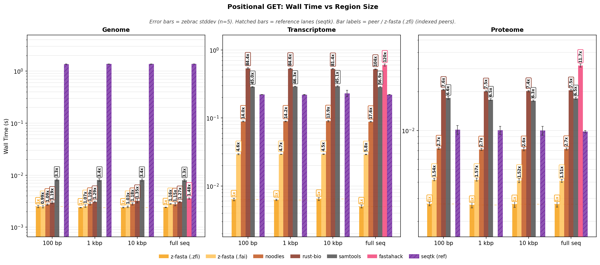

**Reading Figure 1**
- Three panels: Genome, Transcriptome, Proteome.
- **Bars:** zebrac mean wall time. Error bars are one standard deviation.
- **Legend order:** z-fasta (.zfi), z-fasta (.fai), noodles, rust-bio, samtools, fastahack, seqtk (ref).
- **Hatched bars:** seqtk (ref) has no index and rescans the FASTA each call.
- **On large FASTA files:** seqtk (ref) can dominate log-scale y-axis; compare indexed tools within each region, not bar height vs seqtk.
- **Bar labels:** `1×` on z-fasta (.zfi); other labels = peer / z-fasta (.zfi) (indexed peers only). Details in Table 3.

## Memory Usage: Positional extraction

Same zebrac samples as **Performance: Positional extraction**.

### Peak RSS

zebrac starts a new process for each sample and records peak RSS when it exits (`ru_maxrss`). Table and figure show the mean across samples.

**Table 4:** Peak RSS (MiB, zebrac mean). Same tool order as Performance.

| dataset_region           | z-fasta (.zfi)   | z-fasta (.fai)   | noodles   | rust-bio   | samtools   | fastahack   | seqtk (ref)   |
|:-------------------------|:-----------------|:-----------------|:----------|:-----------|:-----------|:------------|:--------------|
| Genome / 100 bp          | 3.39 MiB         | 3.32 MiB         | 3.36 MiB  | 3.45 MiB   | 9.59 MiB   | nan         | 239.98 MiB    |
| Genome / 1 kbp           | 3.38 MiB         | 3.38 MiB         | 3.41 MiB  | 3.44 MiB   | 9.56 MiB   | nan         | 240.09 MiB    |
| Genome / 10 kbp          | 3.33 MiB         | 3.35 MiB         | 3.41 MiB  | 3.36 MiB   | 9.59 MiB   | nan         | 240.00 MiB    |
| Genome / full seq        | 3.41 MiB         | 3.44 MiB         | 3.31 MiB  | 3.46 MiB   | 9.55 MiB   | 3.99 MiB    | 240.01 MiB    |
| Transcriptome / 100 bp   | 22.53 MiB        | 3.31 MiB         | 46.81 MiB | 144.97 MiB | 66.13 MiB  | nan         | 3.34 MiB      |
| Transcriptome / 1 kbp    | 22.53 MiB        | 3.30 MiB         | 46.81 MiB | 144.98 MiB | 66.02 MiB  | nan         | 3.32 MiB      |
| Transcriptome / 10 kbp   | 22.53 MiB        | 3.43 MiB         | 46.80 MiB | 145.00 MiB | 66.22 MiB  | nan         | 3.42 MiB      |
| Transcriptome / full seq | 10.59 MiB        | 3.43 MiB         | 46.88 MiB | 145.07 MiB | 66.17 MiB  | 136.71 MiB  | 3.38 MiB      |
| Proteome / 100 bp        | 3.37 MiB         | 3.36 MiB         | 3.63 MiB  | 7.37 MiB   | 10.99 MiB  | nan         | 3.43 MiB      |
| Proteome / 1 kbp         | 3.34 MiB         | 3.37 MiB         | 3.63 MiB  | 7.39 MiB   | 10.97 MiB  | nan         | 3.41 MiB      |
| Proteome / 10 kbp        | 3.26 MiB         | 3.31 MiB         | 3.63 MiB  | 7.30 MiB   | 10.98 MiB  | nan         | 3.36 MiB      |
| Proteome / full seq      | 3.33 MiB         | 3.44 MiB         | 3.64 MiB  | 7.32 MiB   | 10.92 MiB  | 8.98 MiB    | 3.43 MiB      |

<strong>Table 5:</strong> z-fasta (.zfi) vs each peer. RSS × = peer peak RSS ÷ z-fasta peak RSS. Same ratios as bar labels on Figure 2.

| Dataset / region         | z-fasta (.zfi) vs   | z-fasta (.zfi)   | Peer       | RSS ×   |
|:-------------------------|:--------------------|:-----------------|:-----------|:--------|
| Genome / 100 bp          | z-fasta (.fai)      | 3.39 MiB         | 3.32 MiB   | 0.98x   |
| Genome / 100 bp          | noodles             | 3.39 MiB         | 3.36 MiB   | 0.99x   |
| Genome / 100 bp          | rust-bio            | 3.39 MiB         | 3.45 MiB   | 1.02x   |
| Genome / 100 bp          | samtools            | 3.39 MiB         | 9.59 MiB   | 2.8x    |
| Genome / 100 bp          | seqtk (ref)         | 3.39 MiB         | 239.98 MiB | 70.9x   |
| Genome / 1 kbp           | z-fasta (.fai)      | 3.38 MiB         | 3.38 MiB   | 1.00x   |
| Genome / 1 kbp           | noodles             | 3.38 MiB         | 3.41 MiB   | 1.01x   |
| Genome / 1 kbp           | rust-bio            | 3.38 MiB         | 3.44 MiB   | 1.02x   |
| Genome / 1 kbp           | samtools            | 3.38 MiB         | 9.56 MiB   | 2.8x    |
| Genome / 1 kbp           | seqtk (ref)         | 3.38 MiB         | 240.09 MiB | 71.0x   |
| Genome / 10 kbp          | z-fasta (.fai)      | 3.33 MiB         | 3.35 MiB   | 1.01x   |
| Genome / 10 kbp          | noodles             | 3.33 MiB         | 3.41 MiB   | 1.02x   |
| Genome / 10 kbp          | rust-bio            | 3.33 MiB         | 3.36 MiB   | 1.01x   |
| Genome / 10 kbp          | samtools            | 3.33 MiB         | 9.59 MiB   | 2.9x    |
| Genome / 10 kbp          | seqtk (ref)         | 3.33 MiB         | 240.00 MiB | 72.1x   |
| Genome / full seq        | z-fasta (.fai)      | 3.41 MiB         | 3.44 MiB   | 1.01x   |
| Genome / full seq        | noodles             | 3.41 MiB         | 3.31 MiB   | 0.97x   |
| Genome / full seq        | rust-bio            | 3.41 MiB         | 3.46 MiB   | 1.01x   |
| Genome / full seq        | samtools            | 3.41 MiB         | 9.55 MiB   | 2.8x    |
| Genome / full seq        | fastahack           | 3.41 MiB         | 3.99 MiB   | 1.17x   |
| Genome / full seq        | seqtk (ref)         | 3.41 MiB         | 240.01 MiB | 70.3x   |
| Transcriptome / 100 bp   | z-fasta (.fai)      | 22.53 MiB        | 3.31 MiB   | 0.15x   |
| Transcriptome / 100 bp   | noodles             | 22.53 MiB        | 46.81 MiB  | 2.1x    |
| Transcriptome / 100 bp   | rust-bio            | 22.53 MiB        | 144.97 MiB | 6.4x    |
| Transcriptome / 100 bp   | samtools            | 22.53 MiB        | 66.13 MiB  | 2.9x    |
| Transcriptome / 100 bp   | seqtk (ref)         | 22.53 MiB        | 3.34 MiB   | 0.15x   |
| Transcriptome / 1 kbp    | z-fasta (.fai)      | 22.53 MiB        | 3.30 MiB   | 0.15x   |
| Transcriptome / 1 kbp    | noodles             | 22.53 MiB        | 46.81 MiB  | 2.1x    |
| Transcriptome / 1 kbp    | rust-bio            | 22.53 MiB        | 144.98 MiB | 6.4x    |
| Transcriptome / 1 kbp    | samtools            | 22.53 MiB        | 66.02 MiB  | 2.9x    |
| Transcriptome / 1 kbp    | seqtk (ref)         | 22.53 MiB        | 3.32 MiB   | 0.15x   |
| Transcriptome / 10 kbp   | z-fasta (.fai)      | 22.53 MiB        | 3.43 MiB   | 0.15x   |
| Transcriptome / 10 kbp   | noodles             | 22.53 MiB        | 46.80 MiB  | 2.1x    |
| Transcriptome / 10 kbp   | rust-bio            | 22.53 MiB        | 145.00 MiB | 6.4x    |
| Transcriptome / 10 kbp   | samtools            | 22.53 MiB        | 66.22 MiB  | 2.9x    |
| Transcriptome / 10 kbp   | seqtk (ref)         | 22.53 MiB        | 3.42 MiB   | 0.15x   |
| Transcriptome / full seq | z-fasta (.fai)      | 10.59 MiB        | 3.43 MiB   | 0.32x   |
| Transcriptome / full seq | noodles             | 10.59 MiB        | 46.88 MiB  | 4.4x    |
| Transcriptome / full seq | rust-bio            | 10.59 MiB        | 145.07 MiB | 13.7x   |
| Transcriptome / full seq | samtools            | 10.59 MiB        | 66.17 MiB  | 6.2x    |
| Transcriptome / full seq | fastahack           | 10.59 MiB        | 136.71 MiB | 12.9x   |
| Transcriptome / full seq | seqtk (ref)         | 10.59 MiB        | 3.38 MiB   | 0.32x   |
| Proteome / 100 bp        | z-fasta (.fai)      | 3.37 MiB         | 3.36 MiB   | 1.00x   |
| Proteome / 100 bp        | noodles             | 3.37 MiB         | 3.63 MiB   | 1.08x   |
| Proteome / 100 bp        | rust-bio            | 3.37 MiB         | 7.37 MiB   | 2.2x    |
| Proteome / 100 bp        | samtools            | 3.37 MiB         | 10.99 MiB  | 3.3x    |
| Proteome / 100 bp        | seqtk (ref)         | 3.37 MiB         | 3.43 MiB   | 1.02x   |
| Proteome / 1 kbp         | z-fasta (.fai)      | 3.34 MiB         | 3.37 MiB   | 1.01x   |
| Proteome / 1 kbp         | noodles             | 3.34 MiB         | 3.63 MiB   | 1.09x   |
| Proteome / 1 kbp         | rust-bio            | 3.34 MiB         | 7.39 MiB   | 2.2x    |
| Proteome / 1 kbp         | samtools            | 3.34 MiB         | 10.97 MiB  | 3.3x    |
| Proteome / 1 kbp         | seqtk (ref)         | 3.34 MiB         | 3.41 MiB   | 1.02x   |
| Proteome / 10 kbp        | z-fasta (.fai)      | 3.26 MiB         | 3.31 MiB   | 1.02x   |
| Proteome / 10 kbp        | noodles             | 3.26 MiB         | 3.63 MiB   | 1.11x   |
| Proteome / 10 kbp        | rust-bio            | 3.26 MiB         | 7.30 MiB   | 2.2x    |
| Proteome / 10 kbp        | samtools            | 3.26 MiB         | 10.98 MiB  | 3.4x    |
| Proteome / 10 kbp        | seqtk (ref)         | 3.26 MiB         | 3.36 MiB   | 1.03x   |
| Proteome / full seq      | z-fasta (.fai)      | 3.33 MiB         | 3.44 MiB   | 1.04x   |
| Proteome / full seq      | noodles             | 3.33 MiB         | 3.64 MiB   | 1.09x   |
| Proteome / full seq      | rust-bio            | 3.33 MiB         | 7.32 MiB   | 2.2x    |
| Proteome / full seq      | samtools            | 3.33 MiB         | 10.92 MiB  | 3.3x    |
| Proteome / full seq      | fastahack           | 3.33 MiB         | 8.98 MiB   | 2.7x    |
| Proteome / full seq      | seqtk (ref)         | 3.33 MiB         | 3.43 MiB   | 1.03x   |

**Figure 2:** Table 4 as grouped bars. Bar labels = RSS × (peer / z-fasta (.zfi); see Table 5).

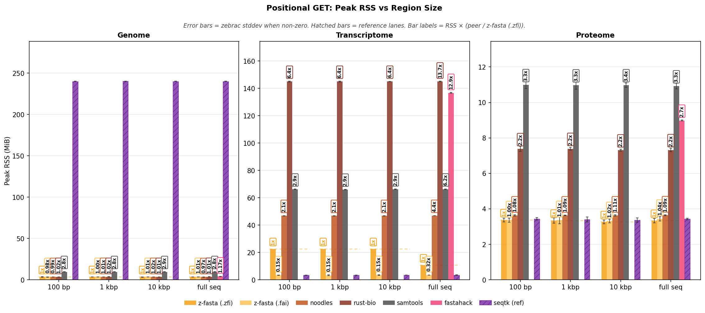

**Reading Figure 2**
- Same three-panel layout as positional wall time; linear y-axis (MiB).
- `1×` on z-fasta (.zfi); other labels = peer / z-fasta (.zfi).
- Details in Table 5.

## Page Faults: Positional extraction

Same zebrac samples again.

### Page faults

A **minor** fault maps a page without reading disk. A **major** fault reads from disk. zebrac reports both per run, like wall time.

**Table 6:** Minor page faults (zebrac mean). Same tool order as Performance.

| dataset_region           |   z-fasta (.zfi) |   z-fasta (.fai) |   noodles |   rust-bio |   samtools |   fastahack |   seqtk (ref) |
|:-------------------------|-----------------:|-----------------:|----------:|-----------:|-----------:|------------:|--------------:|
| Genome / 100 bp          |              323 |              327 |       321 |        334 |        827 |         nan |        61,349 |
| Genome / 1 kbp           |              324 |              332 |       322 |        334 |        824 |         nan |        61,349 |
| Genome / 10 kbp          |              331 |              333 |       328 |        340 |        823 |         nan |        61,351 |
| Genome / full seq        |              324 |              327 |       319 |        338 |        808 |         387 |        61,347 |
| Transcriptome / 100 bp   |              674 |              342 |    11,823 |     41,160 |     15,551 |         nan |           651 |
| Transcriptome / 1 kbp    |              678 |              342 |    11,823 |     41,162 |     15,556 |         nan |           655 |
| Transcriptome / 10 kbp   |              682 |              351 |    11,829 |     41,162 |     15,556 |         nan |           657 |
| Transcriptome / full seq |              486 |              345 |    11,821 |     41,162 |     15,554 |       36502 |           656 |
| Proteome / 100 bp        |              332 |              339 |       762 |      2,086 |      1,416 |         nan |           514 |
| Proteome / 1 kbp         |              334 |              341 |       762 |      2,091 |      1,413 |         nan |           514 |
| Proteome / 10 kbp        |              339 |              347 |       768 |      2,094 |      1,410 |         nan |           511 |
| Proteome / full seq      |              331 |              342 |       762 |      2,090 |      1,414 |        1867 |           514 |

<strong>Table 7:</strong> z-fasta (.zfi) vs each peer. Faults × = peer minor faults / z-fasta minor faults. Same ratios as bar labels on Figure 3.

| Dataset / region         | z-fasta (.zfi) vs   |   z-fasta (.zfi) |   Peer | Faults ×   |
|:-------------------------|:--------------------|-----------------:|-------:|:-----------|
| Genome / 100 bp          | z-fasta (.fai)      |              323 |    327 | 1.01x      |
| Genome / 100 bp          | noodles             |              323 |    321 | 1.00x      |
| Genome / 100 bp          | rust-bio            |              323 |    334 | 1.04x      |
| Genome / 100 bp          | samtools            |              323 |    827 | 2.6x       |
| Genome / 100 bp          | seqtk (ref)         |              323 | 61,349 | 190x       |
| Genome / 1 kbp           | z-fasta (.fai)      |              324 |    332 | 1.03x      |
| Genome / 1 kbp           | noodles             |              324 |    322 | 0.99x      |
| Genome / 1 kbp           | rust-bio            |              324 |    334 | 1.03x      |
| Genome / 1 kbp           | samtools            |              324 |    824 | 2.5x       |
| Genome / 1 kbp           | seqtk (ref)         |              324 | 61,349 | 189x       |
| Genome / 10 kbp          | z-fasta (.fai)      |              331 |    333 | 1.01x      |
| Genome / 10 kbp          | noodles             |              331 |    328 | 0.99x      |
| Genome / 10 kbp          | rust-bio            |              331 |    340 | 1.03x      |
| Genome / 10 kbp          | samtools            |              331 |    823 | 2.5x       |
| Genome / 10 kbp          | seqtk (ref)         |              331 | 61,351 | 185x       |
| Genome / full seq        | z-fasta (.fai)      |              324 |    327 | 1.01x      |
| Genome / full seq        | noodles             |              324 |    319 | 0.98x      |
| Genome / full seq        | rust-bio            |              324 |    338 | 1.04x      |
| Genome / full seq        | samtools            |              324 |    808 | 2.5x       |
| Genome / full seq        | fastahack           |              324 |    387 | 1.19x      |
| Genome / full seq        | seqtk (ref)         |              324 | 61,347 | 189x       |
| Transcriptome / 100 bp   | z-fasta (.fai)      |              674 |    342 | 0.51x      |
| Transcriptome / 100 bp   | noodles             |              674 | 11,823 | 17.5x      |
| Transcriptome / 100 bp   | rust-bio            |              674 | 41,160 | 61.0x      |
| Transcriptome / 100 bp   | samtools            |              674 | 15,551 | 23.1x      |
| Transcriptome / 100 bp   | seqtk (ref)         |              674 |    651 | 0.97x      |
| Transcriptome / 1 kbp    | z-fasta (.fai)      |              678 |    342 | 0.50x      |
| Transcriptome / 1 kbp    | noodles             |              678 | 11,823 | 17.4x      |
| Transcriptome / 1 kbp    | rust-bio            |              678 | 41,162 | 60.7x      |
| Transcriptome / 1 kbp    | samtools            |              678 | 15,556 | 22.9x      |
| Transcriptome / 1 kbp    | seqtk (ref)         |              678 |    655 | 0.97x      |
| Transcriptome / 10 kbp   | z-fasta (.fai)      |              682 |    351 | 0.52x      |
| Transcriptome / 10 kbp   | noodles             |              682 | 11,829 | 17.3x      |
| Transcriptome / 10 kbp   | rust-bio            |              682 | 41,162 | 60.4x      |
| Transcriptome / 10 kbp   | samtools            |              682 | 15,556 | 22.8x      |
| Transcriptome / 10 kbp   | seqtk (ref)         |              682 |    657 | 0.96x      |
| Transcriptome / full seq | z-fasta (.fai)      |              486 |    345 | 0.71x      |
| Transcriptome / full seq | noodles             |              486 | 11,821 | 24.3x      |
| Transcriptome / full seq | rust-bio            |              486 | 41,162 | 84.6x      |
| Transcriptome / full seq | samtools            |              486 | 15,554 | 32.0x      |
| Transcriptome / full seq | fastahack           |              486 | 36,502 | 75.0x      |
| Transcriptome / full seq | seqtk (ref)         |              486 |    656 | 1.35x      |
| Proteome / 100 bp        | z-fasta (.fai)      |              332 |    339 | 1.02x      |
| Proteome / 100 bp        | noodles             |              332 |    762 | 2.3x       |
| Proteome / 100 bp        | rust-bio            |              332 |  2,086 | 6.3x       |
| Proteome / 100 bp        | samtools            |              332 |  1,416 | 4.3x       |
| Proteome / 100 bp        | seqtk (ref)         |              332 |    514 | 1.55x      |
| Proteome / 1 kbp         | z-fasta (.fai)      |              334 |    341 | 1.02x      |
| Proteome / 1 kbp         | noodles             |              334 |    762 | 2.3x       |
| Proteome / 1 kbp         | rust-bio            |              334 |  2,091 | 6.3x       |
| Proteome / 1 kbp         | samtools            |              334 |  1,413 | 4.2x       |
| Proteome / 1 kbp         | seqtk (ref)         |              334 |    514 | 1.54x      |
| Proteome / 10 kbp        | z-fasta (.fai)      |              339 |    347 | 1.02x      |
| Proteome / 10 kbp        | noodles             |              339 |    768 | 2.3x       |
| Proteome / 10 kbp        | rust-bio            |              339 |  2,094 | 6.2x       |
| Proteome / 10 kbp        | samtools            |              339 |  1,410 | 4.2x       |
| Proteome / 10 kbp        | seqtk (ref)         |              339 |    511 | 1.51x      |
| Proteome / full seq      | z-fasta (.fai)      |              331 |    342 | 1.03x      |
| Proteome / full seq      | noodles             |              331 |    762 | 2.3x       |
| Proteome / full seq      | rust-bio            |              331 |  2,090 | 6.3x       |
| Proteome / full seq      | samtools            |              331 |  1,414 | 4.3x       |
| Proteome / full seq      | fastahack           |              331 |  1,867 | 5.6x       |
| Proteome / full seq      | seqtk (ref)         |              331 |    514 | 1.56x      |

<strong>Table 8:</strong> Major page faults.

| dataset_region           |   z-fasta (.zfi) |   z-fasta (.fai) |   noodles |   rust-bio |   samtools |   fastahack |   seqtk (ref) |
|:-------------------------|-----------------:|-----------------:|----------:|-----------:|-----------:|------------:|--------------:|
| Genome / 100 bp          |                0 |                0 |         0 |          0 |          0 |         nan |             0 |
| Genome / 1 kbp           |                0 |                0 |         0 |          0 |          0 |         nan |             0 |
| Genome / 10 kbp          |                0 |                0 |         0 |          0 |          0 |         nan |             0 |
| Genome / full seq        |                0 |                0 |         0 |          0 |          0 |           0 |             0 |
| Transcriptome / 100 bp   |                0 |                0 |         0 |          0 |          0 |         nan |             0 |
| Transcriptome / 1 kbp    |                0 |                0 |         0 |          0 |          0 |         nan |             0 |
| Transcriptome / 10 kbp   |                0 |                0 |         0 |          0 |          0 |         nan |             0 |
| Transcriptome / full seq |                0 |                0 |         0 |          0 |          0 |           0 |             0 |
| Proteome / 100 bp        |                0 |                0 |         0 |          0 |          0 |         nan |             0 |
| Proteome / 1 kbp         |                0 |                0 |         0 |          0 |          0 |         nan |             0 |
| Proteome / 10 kbp        |                0 |                0 |         0 |          0 |          0 |         nan |             0 |
| Proteome / full seq      |                0 |                0 |         0 |          0 |          0 |           0 |             0 |

**Figure 3:** Table 6 as grouped bars (log y). Bar labels = Faults × (peer / z-fasta (.zfi); see Table 7).

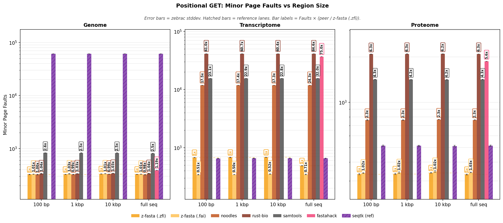

**Reading Figure 3**
- Same three-panel layout as positional wall time.
- `1×` on z-fasta (.zfi); other labels = peer / z-fasta (.zfi).
- Details in Table 7.

## Performance: Multi-region scaling

One `get` invocation fetches **N regions × 1 kbp each** (e.g. N=100 → 100 kbp ≈ 0.1 Mb output). Timed on Genome, Transcriptome, Proteome with **N=1, N=10, N=100, N=1,000** (log-spaced). Three figure panels (Genome, Transcriptome, Proteome); panel width follows each dataset's N count. Genome omits N=1,000 (fewer eligible 1 kbp regions in the fixture). Reference loops (seqtk, fastahack) are omitted from default timed runs. Chart/table tool order: z-fasta (.zfi), z-fasta (.fai), noodles, rust-bio, samtools.

**Table 9:** Wall time (mean ± stddev, seconds). Rows sorted by dataset then N. Lower is better. Same tool order as the figure.

| Dataset / N             | z-fasta (.zfi)   | z-fasta (.fai)   | noodles         | rust-bio        | samtools        |
|:------------------------|:-----------------|:-----------------|:----------------|:----------------|:----------------|
| Genome / N=1            | 0.0025s ±0.0002  | 0.0026s ±0.0002  | 0.0027s ±0.0001 | 0.0031s ±0.0004 | 0.0079s ±0.0002 |
| Genome / N=10           | 0.0025s ±0.0001  | 0.0025s ±0.0001  | 0.0028s ±0.0001 | 0.0030s ±0.0001 | 0.0079s ±0.0001 |
| Genome / N=100          | 0.0028s ±0.0001  | 0.0029s ±0.0001  | 0.0033s ±0.0001 | 0.0034s ±0.0001 | 0.0083s ±0.0001 |
| Transcriptome / N=1     | 0.0075s ±0.0001  | 0.0294s ±0.0003  | 0.0898s ±0.0007 | 0.5362s ±0.0076 | 0.2882s ±0.0044 |
| Transcriptome / N=10    | 0.0271s ±0.0004  | 0.0325s ±0.0003  | 0.0918s ±0.0003 | 0.5273s ±0.0083 | 0.2897s ±0.0078 |
| Transcriptome / N=100   | 0.0275s ±0.0012  | 0.0342s ±0.0001  | 0.1267s ±0.0012 | 0.5240s ±0.0041 | 0.2890s ±0.0065 |
| Transcriptome / N=1,000 | 0.0353s ±0.0011  | 0.0400s ±0.0003  | 0.4220s ±0.0113 | 0.5371s ±0.0149 | 0.2976s ±0.0077 |
| Proteome / N=1          | 0.0028s ±0.0001  | 0.0042s ±0.0002  | 0.0072s ±0.0001 | 0.0202s ±0.0003 | 0.0171s ±0.0001 |
| Proteome / N=10         | 0.0036s ±0.0001  | 0.0044s ±0.0002  | 0.0076s ±0.0002 | 0.0202s ±0.0002 | 0.0174s ±0.0004 |
| Proteome / N=100        | 0.0039s ±0.0001  | 0.0048s ±0.0001  | 0.0124s ±0.0001 | 0.0206s ±0.0002 | 0.0181s ±0.0002 |
| Proteome / N=1,000      | 0.0073s ±0.0002  | 0.0084s ±0.0002  | 0.0574s ±0.0005 | 0.0253s ±0.0012 | 0.0251s ±0.0005 |

<strong>Table 10:</strong> Output throughput (Mbp/s) from metadata <code>output_bases</code> ÷ wall time. Higher is better. Same rows and tool order as Table 9.

| Dataset / N             | z-fasta (.zfi)   | z-fasta (.fai)   | noodles    | rust-bio    | samtools    |
|:------------------------|:-----------------|:-----------------|:-----------|:------------|:------------|
| Genome / N=1            | 0.39 Mbp/s       | 0.38 Mbp/s       | 0.37 Mbp/s | 0.32 Mbp/s  | 0.13 Mbp/s  |
| Genome / N=10           | 3.95 Mbp/s       | 4.04 Mbp/s       | 3.57 Mbp/s | 3.31 Mbp/s  | 1.27 Mbp/s  |
| Genome / N=100          | 35.5 Mbp/s       | 34.3 Mbp/s       | 30.5 Mbp/s | 29.5 Mbp/s  | 12.0 Mbp/s  |
| Transcriptome / N=1     | 0.13 Mbp/s       | 0.03 Mbp/s       | 0.01 Mbp/s | 0.002 Mbp/s | 0.003 Mbp/s |
| Transcriptome / N=10    | 0.37 Mbp/s       | 0.31 Mbp/s       | 0.11 Mbp/s | 0.02 Mbp/s  | 0.03 Mbp/s  |
| Transcriptome / N=100   | 3.64 Mbp/s       | 2.92 Mbp/s       | 0.79 Mbp/s | 0.19 Mbp/s  | 0.35 Mbp/s  |
| Transcriptome / N=1,000 | 28.3 Mbp/s       | 25.0 Mbp/s       | 2.37 Mbp/s | 1.86 Mbp/s  | 3.36 Mbp/s  |
| Proteome / N=1          | 0.36 Mbp/s       | 0.24 Mbp/s       | 0.14 Mbp/s | 0.05 Mbp/s  | 0.06 Mbp/s  |
| Proteome / N=10         | 2.75 Mbp/s       | 2.27 Mbp/s       | 1.31 Mbp/s | 0.49 Mbp/s  | 0.58 Mbp/s  |
| Proteome / N=100        | 25.6 Mbp/s       | 20.7 Mbp/s       | 8.09 Mbp/s | 4.85 Mbp/s  | 5.51 Mbp/s  |
| Proteome / N=1,000      | 137.7 Mbp/s      | 119.2 Mbp/s      | 17.4 Mbp/s | 39.6 Mbp/s  | 39.9 Mbp/s  |

<strong>Table 11:</strong> z-fasta (.zfi) vs each peer. Speedup = peer wall time ÷ z-fasta wall time (higher = z-fasta faster). Same ratios as bar labels on Figure 4.

| Dataset / N             | z-fasta (.zfi) vs   | z-fasta (.zfi)   | Peer    | Speedup   |
|:------------------------|:--------------------|:-----------------|:--------|:----------|
| Genome / N=1            | z-fasta (.fai)      | 0.0025s          | 0.0026s | 1.04x     |
| Genome / N=1            | noodles             | 0.0025s          | 0.0027s | 1.07x     |
| Genome / N=1            | rust-bio            | 0.0025s          | 0.0031s | 1.24x     |
| Genome / N=1            | samtools            | 0.0025s          | 0.0079s | 3.1x      |
| Genome / N=10           | z-fasta (.fai)      | 0.0025s          | 0.0025s | 0.98x     |
| Genome / N=10           | noodles             | 0.0025s          | 0.0028s | 1.11x     |
| Genome / N=10           | rust-bio            | 0.0025s          | 0.0030s | 1.19x     |
| Genome / N=10           | samtools            | 0.0025s          | 0.0079s | 3.1x      |
| Genome / N=100          | z-fasta (.fai)      | 0.0028s          | 0.0029s | 1.04x     |
| Genome / N=100          | noodles             | 0.0028s          | 0.0033s | 1.16x     |
| Genome / N=100          | rust-bio            | 0.0028s          | 0.0034s | 1.20x     |
| Genome / N=100          | samtools            | 0.0028s          | 0.0083s | 3.0x      |
| Transcriptome / N=1     | z-fasta (.fai)      | 0.0075s          | 0.0294s | 3.9x      |
| Transcriptome / N=1     | noodles             | 0.0075s          | 0.0898s | 12.0x     |
| Transcriptome / N=1     | rust-bio            | 0.0075s          | 0.5362s | 71.8x     |
| Transcriptome / N=1     | samtools            | 0.0075s          | 0.2882s | 38.6x     |
| Transcriptome / N=10    | z-fasta (.fai)      | 0.0271s          | 0.0325s | 1.20x     |
| Transcriptome / N=10    | noodles             | 0.0271s          | 0.0918s | 3.4x      |
| Transcriptome / N=10    | rust-bio            | 0.0271s          | 0.5273s | 19.5x     |
| Transcriptome / N=10    | samtools            | 0.0271s          | 0.2897s | 10.7x     |
| Transcriptome / N=100   | z-fasta (.fai)      | 0.0275s          | 0.0342s | 1.25x     |
| Transcriptome / N=100   | noodles             | 0.0275s          | 0.1267s | 4.6x      |
| Transcriptome / N=100   | rust-bio            | 0.0275s          | 0.5240s | 19.1x     |
| Transcriptome / N=100   | samtools            | 0.0275s          | 0.2890s | 10.5x     |
| Transcriptome / N=1,000 | z-fasta (.fai)      | 0.0353s          | 0.0400s | 1.13x     |
| Transcriptome / N=1,000 | noodles             | 0.0353s          | 0.4220s | 11.9x     |
| Transcriptome / N=1,000 | rust-bio            | 0.0353s          | 0.5371s | 15.2x     |
| Transcriptome / N=1,000 | samtools            | 0.0353s          | 0.2976s | 8.4x      |
| Proteome / N=1          | z-fasta (.fai)      | 0.0028s          | 0.0042s | 1.50x     |
| Proteome / N=1          | noodles             | 0.0028s          | 0.0072s | 2.6x      |
| Proteome / N=1          | rust-bio            | 0.0028s          | 0.0202s | 7.3x      |
| Proteome / N=1          | samtools            | 0.0028s          | 0.0171s | 6.2x      |
| Proteome / N=10         | z-fasta (.fai)      | 0.0036s          | 0.0044s | 1.21x     |
| Proteome / N=10         | noodles             | 0.0036s          | 0.0076s | 2.1x      |
| Proteome / N=10         | rust-bio            | 0.0036s          | 0.0202s | 5.6x      |
| Proteome / N=10         | samtools            | 0.0036s          | 0.0174s | 4.8x      |
| Proteome / N=100        | z-fasta (.fai)      | 0.0039s          | 0.0048s | 1.24x     |
| Proteome / N=100        | noodles             | 0.0039s          | 0.0124s | 3.2x      |
| Proteome / N=100        | rust-bio            | 0.0039s          | 0.0206s | 5.3x      |
| Proteome / N=100        | samtools            | 0.0039s          | 0.0181s | 4.6x      |
| Proteome / N=1,000      | z-fasta (.fai)      | 0.0073s          | 0.0084s | 1.15x     |
| Proteome / N=1,000      | noodles             | 0.0073s          | 0.0574s | 7.9x      |
| Proteome / N=1,000      | rust-bio            | 0.0073s          | 0.0253s | 3.5x      |
| Proteome / N=1,000      | samtools            | 0.0073s          | 0.0251s | 3.5x      |

**Figure 4:** Table 9 as grouped bars (log y). Bar labels = peer / z-fasta (.zfi) (indexed peers).

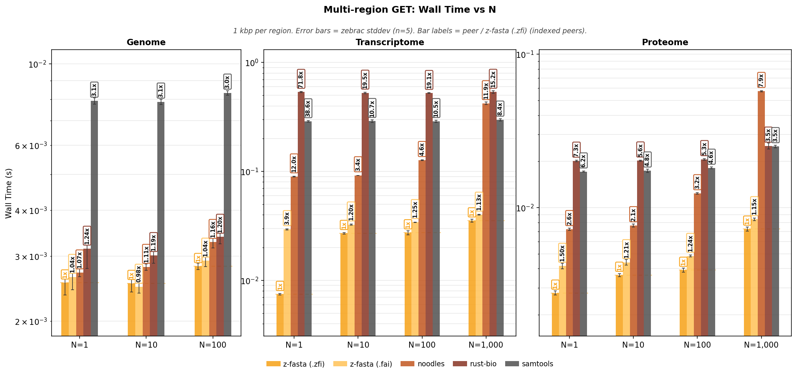

**Reading Figure 4**
- Three panels: Genome, Transcriptome, Proteome (N on x-axis).
- **Bars:** zebrac mean wall time. Error bars = one standard deviation.
- **Legend order:** z-fasta (.zfi), z-fasta (.fai), noodles, rust-bio, samtools.
- **Bar labels:** `1×` on z-fasta (.zfi); other labels = peer / z-fasta (.zfi) (indexed peers only). Details in Table 11.

## Memory Usage: Multi-region scaling

Same zebrac samples as **Performance: Multi-region scaling**.

### Peak RSS

zebrac starts a new process for each sample and records peak RSS when it exits (`ru_maxrss`). Table and figure show the mean across samples.

**Table 12:** Peak RSS (MiB, zebrac mean). Same tool order as Performance.

| Dataset / N             | z-fasta (.zfi)   | z-fasta (.fai)   | noodles   | rust-bio   | samtools   |
|:------------------------|:-----------------|:-----------------|:----------|:-----------|:-----------|
| Genome / N=1            | 3.35 MiB         | 3.41 MiB         | 3.39 MiB  | 3.38 MiB   | 9.64 MiB   |
| Genome / N=10           | 3.43 MiB         | 3.44 MiB         | 3.39 MiB  | 3.34 MiB   | 9.58 MiB   |
| Genome / N=100          | 3.47 MiB         | 3.38 MiB         | 3.36 MiB  | 3.48 MiB   | 9.57 MiB   |
| Transcriptome / N=1     | 31.03 MiB        | 3.42 MiB         | 46.80 MiB | 145.05 MiB | 65.94 MiB  |
| Transcriptome / N=10    | 48.53 MiB        | 3.45 MiB         | 46.89 MiB | 145.02 MiB | 66.04 MiB  |
| Transcriptome / N=100   | 48.53 MiB        | 3.32 MiB         | 46.87 MiB | 144.96 MiB | 66.01 MiB  |
| Transcriptome / N=1,000 | 48.78 MiB        | 4.39 MiB         | 47.14 MiB | 145.11 MiB | 66.01 MiB  |
| Proteome / N=1          | 3.34 MiB         | 3.42 MiB         | 3.63 MiB  | 7.33 MiB   | 11.07 MiB  |
| Proteome / N=10         | 3.41 MiB         | 3.49 MiB         | 3.59 MiB  | 7.38 MiB   | 10.81 MiB  |
| Proteome / N=100        | 3.41 MiB         | 3.41 MiB         | 3.61 MiB  | 7.36 MiB   | 11.02 MiB  |
| Proteome / N=1,000      | 3.57 MiB         | 3.69 MiB         | 3.90 MiB  | 7.40 MiB   | 10.83 MiB  |

<strong>Table 13:</strong> z-fasta (.zfi) vs each peer. RSS × = peer peak RSS ÷ z-fasta peak RSS. Same ratios as bar labels on Figure 5.

| Dataset / N             | z-fasta (.zfi) vs   | z-fasta (.zfi)   | Peer       | RSS ×   |
|:------------------------|:--------------------|:-----------------|:-----------|:--------|
| Genome / N=1            | z-fasta (.fai)      | 3.35 MiB         | 3.41 MiB   | 1.02x   |
| Genome / N=1            | noodles             | 3.35 MiB         | 3.39 MiB   | 1.01x   |
| Genome / N=1            | rust-bio            | 3.35 MiB         | 3.38 MiB   | 1.01x   |
| Genome / N=1            | samtools            | 3.35 MiB         | 9.64 MiB   | 2.9x    |
| Genome / N=10           | z-fasta (.fai)      | 3.43 MiB         | 3.44 MiB   | 1.00x   |
| Genome / N=10           | noodles             | 3.43 MiB         | 3.39 MiB   | 0.99x   |
| Genome / N=10           | rust-bio            | 3.43 MiB         | 3.34 MiB   | 0.97x   |
| Genome / N=10           | samtools            | 3.43 MiB         | 9.58 MiB   | 2.8x    |
| Genome / N=100          | z-fasta (.fai)      | 3.47 MiB         | 3.38 MiB   | 0.97x   |
| Genome / N=100          | noodles             | 3.47 MiB         | 3.36 MiB   | 0.97x   |
| Genome / N=100          | rust-bio            | 3.47 MiB         | 3.48 MiB   | 1.00x   |
| Genome / N=100          | samtools            | 3.47 MiB         | 9.57 MiB   | 2.8x    |
| Transcriptome / N=1     | z-fasta (.fai)      | 31.03 MiB        | 3.42 MiB   | 0.11x   |
| Transcriptome / N=1     | noodles             | 31.03 MiB        | 46.80 MiB  | 1.51x   |
| Transcriptome / N=1     | rust-bio            | 31.03 MiB        | 145.05 MiB | 4.7x    |
| Transcriptome / N=1     | samtools            | 31.03 MiB        | 65.94 MiB  | 2.1x    |
| Transcriptome / N=10    | z-fasta (.fai)      | 48.53 MiB        | 3.45 MiB   | 0.071x  |
| Transcriptome / N=10    | noodles             | 48.53 MiB        | 46.89 MiB  | 0.97x   |
| Transcriptome / N=10    | rust-bio            | 48.53 MiB        | 145.02 MiB | 3.0x    |
| Transcriptome / N=10    | samtools            | 48.53 MiB        | 66.04 MiB  | 1.36x   |
| Transcriptome / N=100   | z-fasta (.fai)      | 48.53 MiB        | 3.32 MiB   | 0.068x  |
| Transcriptome / N=100   | noodles             | 48.53 MiB        | 46.87 MiB  | 0.97x   |
| Transcriptome / N=100   | rust-bio            | 48.53 MiB        | 144.96 MiB | 3.0x    |
| Transcriptome / N=100   | samtools            | 48.53 MiB        | 66.01 MiB  | 1.36x   |
| Transcriptome / N=1,000 | z-fasta (.fai)      | 48.78 MiB        | 4.39 MiB   | 0.090x  |
| Transcriptome / N=1,000 | noodles             | 48.78 MiB        | 47.14 MiB  | 0.97x   |
| Transcriptome / N=1,000 | rust-bio            | 48.78 MiB        | 145.11 MiB | 3.0x    |
| Transcriptome / N=1,000 | samtools            | 48.78 MiB        | 66.01 MiB  | 1.35x   |
| Proteome / N=1          | z-fasta (.fai)      | 3.34 MiB         | 3.42 MiB   | 1.02x   |
| Proteome / N=1          | noodles             | 3.34 MiB         | 3.63 MiB   | 1.09x   |
| Proteome / N=1          | rust-bio            | 3.34 MiB         | 7.33 MiB   | 2.2x    |
| Proteome / N=1          | samtools            | 3.34 MiB         | 11.07 MiB  | 3.3x    |
| Proteome / N=10         | z-fasta (.fai)      | 3.41 MiB         | 3.49 MiB   | 1.02x   |
| Proteome / N=10         | noodles             | 3.41 MiB         | 3.59 MiB   | 1.05x   |
| Proteome / N=10         | rust-bio            | 3.41 MiB         | 7.38 MiB   | 2.2x    |
| Proteome / N=10         | samtools            | 3.41 MiB         | 10.81 MiB  | 3.2x    |
| Proteome / N=100        | z-fasta (.fai)      | 3.41 MiB         | 3.41 MiB   | 1.00x   |
| Proteome / N=100        | noodles             | 3.41 MiB         | 3.61 MiB   | 1.06x   |
| Proteome / N=100        | rust-bio            | 3.41 MiB         | 7.36 MiB   | 2.2x    |
| Proteome / N=100        | samtools            | 3.41 MiB         | 11.02 MiB  | 3.2x    |
| Proteome / N=1,000      | z-fasta (.fai)      | 3.57 MiB         | 3.69 MiB   | 1.03x   |
| Proteome / N=1,000      | noodles             | 3.57 MiB         | 3.90 MiB   | 1.09x   |
| Proteome / N=1,000      | rust-bio            | 3.57 MiB         | 7.40 MiB   | 2.1x    |
| Proteome / N=1,000      | samtools            | 3.57 MiB         | 10.83 MiB  | 3.0x    |

**Figure 5:** Table 12 as grouped bars (linear y, MiB). Bar labels = RSS × (see Table 13).

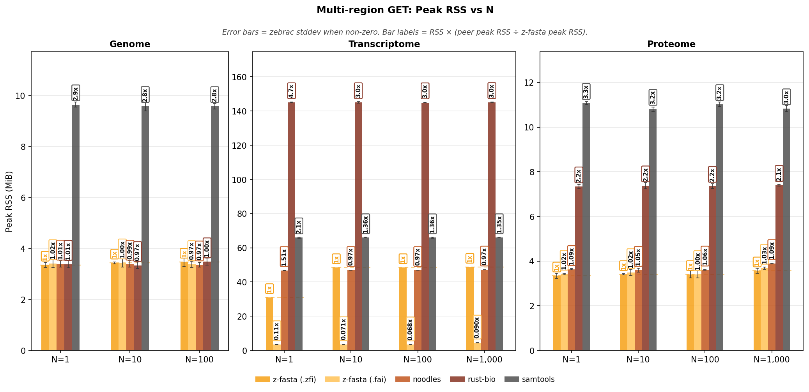

**Reading Figure 5**
- Three panels: Genome, Transcriptome, Proteome (N on x-axis).
- **Bars:** zebrac mean peak RSS. Error bars when stddev is non-zero. Linear y-axis (MiB).
- **Legend order:** z-fasta (.zfi), z-fasta (.fai), noodles, rust-bio, samtools.
- **Bar labels:** `1×` on z-fasta (.zfi); other labels = RSS × (peer peak RSS ÷ z-fasta peak RSS). Details in Table 13.

## Page Faults: Multi-region scaling

Same zebrac samples as **Performance: Multi-region scaling**.

### Page faults

A **minor** fault maps a page without reading disk. A **major** fault reads from disk. zebrac reports both per run, like wall time.

**Table 14:** Minor page faults (zebrac mean). Same tool order as Performance.

| Dataset / N             |   z-fasta (.zfi) |   z-fasta (.fai) |   noodles |   rust-bio |   samtools |
|:------------------------|-----------------:|-----------------:|----------:|-----------:|-----------:|
| Genome / N=1            |              322 |              328 |       319 |        333 |        826 |
| Genome / N=10           |              331 |              332 |       324 |        333 |        826 |
| Genome / N=100          |              361 |              365 |       337 |        352 |        824 |
| Transcriptome / N=1     |              811 |              342 |    11,821 |     41,159 |     15,555 |
| Transcriptome / N=10    |            3,620 |              352 |    11,827 |     41,166 |     15,549 |
| Transcriptome / N=100   |            3,680 |              410 |    11,876 |     41,208 |     15,552 |
| Transcriptome / N=1,000 |            4,267 |            1,048 |    12,468 |     41,793 |     15,552 |
| Proteome / N=1          |              329 |              338 |       761 |      2,089 |      1,416 |
| Proteome / N=10         |              507 |              348 |       766 |      2,091 |      1,412 |
| Proteome / N=100        |              538 |              380 |       783 |      2,112 |      1,417 |
| Proteome / N=1,000      |              725 |              596 |       950 |      2,271 |      1,411 |

<strong>Table 15:</strong> z-fasta (.zfi) vs each peer. Faults × = peer minor faults ÷ z-fasta minor faults. Same ratios as bar labels on Figure 6.

| Dataset / N             | z-fasta (.zfi) vs   |   z-fasta (.zfi) |   Peer | Faults ×   |
|:------------------------|:--------------------|-----------------:|-------:|:-----------|
| Genome / N=1            | z-fasta (.fai)      |              322 |    328 | 1.02x      |
| Genome / N=1            | noodles             |              322 |    319 | 0.99x      |
| Genome / N=1            | rust-bio            |              322 |    333 | 1.03x      |
| Genome / N=1            | samtools            |              322 |    826 | 2.6x       |
| Genome / N=10           | z-fasta (.fai)      |              331 |    332 | 1.00x      |
| Genome / N=10           | noodles             |              331 |    324 | 0.98x      |
| Genome / N=10           | rust-bio            |              331 |    333 | 1.01x      |
| Genome / N=10           | samtools            |              331 |    826 | 2.5x       |
| Genome / N=100          | z-fasta (.fai)      |              361 |    365 | 1.01x      |
| Genome / N=100          | noodles             |              361 |    337 | 0.93x      |
| Genome / N=100          | rust-bio            |              361 |    352 | 0.98x      |
| Genome / N=100          | samtools            |              361 |    824 | 2.3x       |
| Transcriptome / N=1     | z-fasta (.fai)      |              811 |    342 | 0.42x      |
| Transcriptome / N=1     | noodles             |              811 | 11,821 | 14.6x      |
| Transcriptome / N=1     | rust-bio            |              811 | 41,159 | 50.7x      |
| Transcriptome / N=1     | samtools            |              811 | 15,555 | 19.2x      |
| Transcriptome / N=10    | z-fasta (.fai)      |            3,620 |    352 | 0.097x     |
| Transcriptome / N=10    | noodles             |            3,620 | 11,827 | 3.3x       |
| Transcriptome / N=10    | rust-bio            |            3,620 | 41,166 | 11.4x      |
| Transcriptome / N=10    | samtools            |            3,620 | 15,549 | 4.3x       |
| Transcriptome / N=100   | z-fasta (.fai)      |            3,680 |    410 | 0.11x      |
| Transcriptome / N=100   | noodles             |            3,680 | 11,876 | 3.2x       |
| Transcriptome / N=100   | rust-bio            |            3,680 | 41,208 | 11.2x      |
| Transcriptome / N=100   | samtools            |            3,680 | 15,552 | 4.2x       |
| Transcriptome / N=1,000 | z-fasta (.fai)      |            4,267 |  1,048 | 0.25x      |
| Transcriptome / N=1,000 | noodles             |            4,267 | 12,468 | 2.9x       |
| Transcriptome / N=1,000 | rust-bio            |            4,267 | 41,793 | 9.8x       |
| Transcriptome / N=1,000 | samtools            |            4,267 | 15,552 | 3.6x       |
| Proteome / N=1          | z-fasta (.fai)      |              329 |    338 | 1.03x      |
| Proteome / N=1          | noodles             |              329 |    761 | 2.3x       |
| Proteome / N=1          | rust-bio            |              329 |  2,089 | 6.3x       |
| Proteome / N=1          | samtools            |              329 |  1,416 | 4.3x       |
| Proteome / N=10         | z-fasta (.fai)      |              507 |    348 | 0.69x      |
| Proteome / N=10         | noodles             |              507 |    766 | 1.51x      |
| Proteome / N=10         | rust-bio            |              507 |  2,091 | 4.1x       |
| Proteome / N=10         | samtools            |              507 |  1,412 | 2.8x       |
| Proteome / N=100        | z-fasta (.fai)      |              538 |    380 | 0.71x      |
| Proteome / N=100        | noodles             |              538 |    783 | 1.46x      |
| Proteome / N=100        | rust-bio            |              538 |  2,112 | 3.9x       |
| Proteome / N=100        | samtools            |              538 |  1,417 | 2.6x       |
| Proteome / N=1,000      | z-fasta (.fai)      |              725 |    596 | 0.82x      |
| Proteome / N=1,000      | noodles             |              725 |    950 | 1.31x      |
| Proteome / N=1,000      | rust-bio            |              725 |  2,271 | 3.1x       |
| Proteome / N=1,000      | samtools            |              725 |  1,411 | 1.94x      |

<strong>Table 16:</strong> Major page faults (all zero for this run).

| Dataset / N             |   z-fasta (.zfi) |   z-fasta (.fai) |   noodles |   rust-bio |   samtools |
|:------------------------|-----------------:|-----------------:|----------:|-----------:|-----------:|
| Genome / N=1            |                0 |                0 |         0 |          0 |          0 |
| Genome / N=10           |                0 |                0 |         0 |          0 |          0 |
| Genome / N=100          |                0 |                0 |         0 |          0 |          0 |
| Transcriptome / N=1     |                0 |                0 |         0 |          0 |          0 |
| Transcriptome / N=10    |                0 |                0 |         0 |          0 |          0 |
| Transcriptome / N=100   |                0 |                0 |         0 |          0 |          0 |
| Transcriptome / N=1,000 |                0 |                0 |         0 |          0 |          0 |
| Proteome / N=1          |                0 |                0 |         0 |          0 |          0 |
| Proteome / N=10         |                0 |                0 |         0 |          0 |          0 |
| Proteome / N=100        |                0 |                0 |         0 |          0 |          0 |
| Proteome / N=1,000      |                0 |                0 |         0 |          0 |          0 |

**Figure 6:** Table 14 as grouped bars (log y). Bar labels = Faults × (see Table 15).

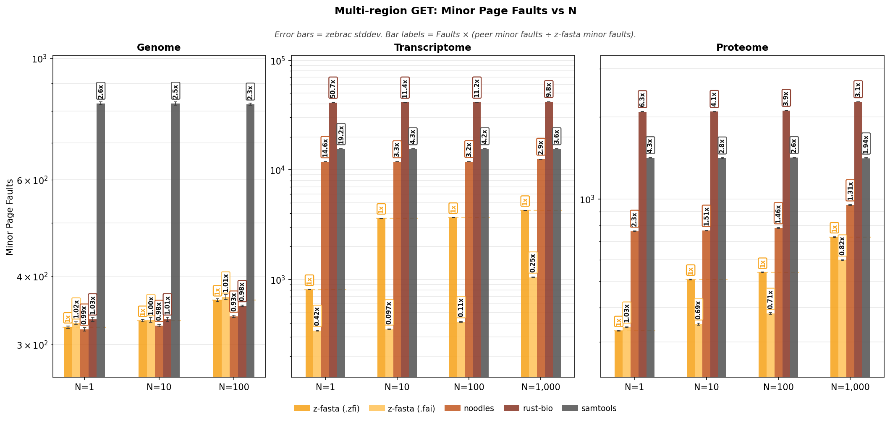

**Reading Figure 6**
- Three panels: Genome, Transcriptome, Proteome (N on x-axis).
- **Bars:** zebrac mean minor page faults. Log y-axis.
- **Legend order:** z-fasta (.zfi), z-fasta (.fai), noodles, rust-bio, samtools.
- **Bar labels:** `1×` on z-fasta (.zfi); other labels = Faults × (peer minor faults ÷ z-fasta minor faults). Details in Table 15.

## Performance: BED batch

`z-fasta get --bed` on Genome, Transcriptome, Proteome. Each BED row fetches **1 kbp** (sweep: 10 rows (0.01 Mb), 100 rows (0.10 Mb), 1,000 rows (1.0 Mb), 10,000 rows (10 Mb)). Three figure panels (Genome, Transcriptome, Proteome); grouped bars per row count. Chart/table tool order: z-fasta (.zfi), z-fasta (.fai), noodles, rust-bio, samtools, bedtools.

**Table 17:** Wall time (mean ± stddev, seconds). Rows sorted by dataset then BED row count. Lower is better. Same tool order as the figure.

| Dataset / BED rows                  | z-fasta (.zfi)   | z-fasta (.fai)   | noodles         | rust-bio        | samtools        | bedtools        |
|:------------------------------------|:-----------------|:-----------------|:----------------|:----------------|:----------------|:----------------|
| Genome / 10 rows (0.01 Mb)          | 0.0025s ±0.0001  | 0.0025s ±0.0001  | 0.0028s ±0.0001 | 0.0030s ±0.0005 | 0.0077s ±0.0002 | 0.0040s ±0.0002 |
| Genome / 100 rows (0.10 Mb)         | 0.0027s ±0.0001  | 0.0028s ±0.0002  | 0.0034s ±0.0005 | 0.0032s ±0.0001 | 0.0085s ±0.0002 | 0.0051s ±0.0001 |
| Genome / 1,000 rows (1.0 Mb)        | 0.0041s ±0.0002  | 0.0041s ±0.0001  | 0.0066s ±0.0003 | 0.0052s ±0.0001 | 0.0141s ±0.0008 | 0.0159s ±0.0004 |
| Genome / 10,000 rows (10 Mb)        | 0.0166s ±0.0001  | 0.0168s ±0.0003  | 0.0386s ±0.0003 | 0.0260s ±0.0002 | 0.0644s ±0.0004 | 0.1196s ±0.0004 |
| Transcriptome / 10 rows (0.01 Mb)   | 0.0147s ±0.0002  | 0.0294s ±0.0002  | 0.0933s ±0.0017 | 0.3000s ±0.0052 | 0.2880s ±0.0046 | 0.6079s ±0.0092 |
| Transcriptome / 100 rows (0.10 Mb)  | 0.0149s ±0.0003  | 0.0300s ±0.0002  | 0.1268s ±0.0015 | 0.2962s ±0.0084 | 0.2867s ±0.0036 | 0.6023s ±0.0083 |
| Transcriptome / 1,000 rows (1.0 Mb) | 0.0172s ±0.0002  | 0.0320s ±0.0004  | 0.4401s ±0.0151 | 0.2993s ±0.0058 | 0.2988s ±0.0045 | 0.6337s ±0.0138 |
| Transcriptome / 10,000 rows (10 Mb) | 0.0366s ±0.0005  | 0.0510s ±0.0007  | 3.5370s ±0.0714 | 0.3252s ±0.0082 | 0.3643s ±0.0036 | 0.7513s ±0.0161 |
| Proteome / 10 rows (0.01 Mb)        | 0.0033s ±0.0001  | 0.0042s ±0.0002  | 0.0079s ±0.0002 | 0.0115s ±0.0001 | 0.0174s ±0.0005 | 0.0255s ±0.0004 |
| Proteome / 100 rows (0.10 Mb)       | 0.0034s ±0.0001  | 0.0045s ±0.0001  | 0.0122s ±0.0003 | 0.0119s ±0.0003 | 0.0180s ±0.0001 | 0.0268s ±0.0003 |
| Proteome / 1,000 rows (1.0 Mb)      | 0.0051s ±0.0001  | 0.0062s ±0.0003  | 0.0581s ±0.0004 | 0.0143s ±0.0002 | 0.0250s ±0.0005 | 0.0402s ±0.0007 |
| Proteome / 10,000 rows (10 Mb)      | 0.0187s ±0.0005  | 0.0195s ±0.0004  | 0.5156s ±0.0022 | 0.0364s ±0.0010 | 0.0883s ±0.0009 | 0.1612s ±0.0027 |

<strong>Table 18:</strong> Output throughput (Mbp/s) from metadata <code>output_bases</code> ÷ wall time. Higher is better. Same rows and tool order as Table 17.

| Dataset / BED rows                  | z-fasta (.zfi)   | z-fasta (.fai)   | noodles     | rust-bio    | samtools    | bedtools   |
|:------------------------------------|:-----------------|:-----------------|:------------|:------------|:------------|:-----------|
| Genome / 10 rows (0.01 Mb)          | 4.02 Mbp/s       | 4.04 Mbp/s       | 3.57 Mbp/s  | 3.36 Mbp/s  | 1.31 Mbp/s  | 2.47 Mbp/s |
| Genome / 100 rows (0.10 Mb)         | 36.8 Mbp/s       | 35.4 Mbp/s       | 29.0 Mbp/s  | 31.3 Mbp/s  | 11.8 Mbp/s  | 19.7 Mbp/s |
| Genome / 1,000 rows (1.0 Mb)        | 244.7 Mbp/s      | 242.7 Mbp/s      | 151.9 Mbp/s | 194.2 Mbp/s | 71.1 Mbp/s  | 63.1 Mbp/s |
| Genome / 10,000 rows (10 Mb)        | 601.6 Mbp/s      | 595.5 Mbp/s      | 258.9 Mbp/s | 384.9 Mbp/s | 155.3 Mbp/s | 83.6 Mbp/s |
| Transcriptome / 10 rows (0.01 Mb)   | 0.68 Mbp/s       | 0.34 Mbp/s       | 0.11 Mbp/s  | 0.03 Mbp/s  | 0.03 Mbp/s  | 0.02 Mbp/s |
| Transcriptome / 100 rows (0.10 Mb)  | 6.72 Mbp/s       | 3.33 Mbp/s       | 0.79 Mbp/s  | 0.34 Mbp/s  | 0.35 Mbp/s  | 0.17 Mbp/s |
| Transcriptome / 1,000 rows (1.0 Mb) | 58.3 Mbp/s       | 31.2 Mbp/s       | 2.27 Mbp/s  | 3.34 Mbp/s  | 3.35 Mbp/s  | 1.58 Mbp/s |
| Transcriptome / 10,000 rows (10 Mb) | 273.0 Mbp/s      | 196.0 Mbp/s      | 2.83 Mbp/s  | 30.8 Mbp/s  | 27.4 Mbp/s  | 13.3 Mbp/s |
| Proteome / 10 rows (0.01 Mb)        | 3.07 Mbp/s       | 2.39 Mbp/s       | 1.26 Mbp/s  | 0.87 Mbp/s  | 0.57 Mbp/s  | 0.39 Mbp/s |
| Proteome / 100 rows (0.10 Mb)       | 29.1 Mbp/s       | 22.4 Mbp/s       | 8.17 Mbp/s  | 8.42 Mbp/s  | 5.56 Mbp/s  | 3.74 Mbp/s |
| Proteome / 1,000 rows (1.0 Mb)      | 195.8 Mbp/s      | 160.4 Mbp/s      | 17.2 Mbp/s  | 70.1 Mbp/s  | 40.1 Mbp/s  | 24.9 Mbp/s |
| Proteome / 10,000 rows (10 Mb)      | 534.2 Mbp/s      | 511.5 Mbp/s      | 19.4 Mbp/s  | 274.8 Mbp/s | 113.2 Mbp/s | 62.0 Mbp/s |

<strong>Table 19:</strong> z-fasta (.zfi) vs each peer. Speedup = peer wall time ÷ z-fasta wall time (higher = z-fasta faster). Same ratios as bar labels on Figure 7.

| Dataset / BED rows                  | z-fasta (.zfi) vs   | z-fasta (.zfi)   | Peer    | Speedup   |
|:------------------------------------|:--------------------|:-----------------|:--------|:----------|
| Genome / 10 rows (0.01 Mb)          | z-fasta (.fai)      | 0.0025s          | 0.0025s | 1.00x     |
| Genome / 10 rows (0.01 Mb)          | noodles             | 0.0025s          | 0.0028s | 1.13x     |
| Genome / 10 rows (0.01 Mb)          | rust-bio            | 0.0025s          | 0.0030s | 1.20x     |
| Genome / 10 rows (0.01 Mb)          | samtools            | 0.0025s          | 0.0077s | 3.1x      |
| Genome / 10 rows (0.01 Mb)          | bedtools            | 0.0025s          | 0.0040s | 1.62x     |
| Genome / 100 rows (0.10 Mb)         | z-fasta (.fai)      | 0.0027s          | 0.0028s | 1.04x     |
| Genome / 100 rows (0.10 Mb)         | noodles             | 0.0027s          | 0.0034s | 1.27x     |
| Genome / 100 rows (0.10 Mb)         | rust-bio            | 0.0027s          | 0.0032s | 1.17x     |
| Genome / 100 rows (0.10 Mb)         | samtools            | 0.0027s          | 0.0085s | 3.1x      |
| Genome / 100 rows (0.10 Mb)         | bedtools            | 0.0027s          | 0.0051s | 1.86x     |
| Genome / 1,000 rows (1.0 Mb)        | z-fasta (.fai)      | 0.0041s          | 0.0041s | 1.01x     |
| Genome / 1,000 rows (1.0 Mb)        | noodles             | 0.0041s          | 0.0066s | 1.61x     |
| Genome / 1,000 rows (1.0 Mb)        | rust-bio            | 0.0041s          | 0.0052s | 1.26x     |
| Genome / 1,000 rows (1.0 Mb)        | samtools            | 0.0041s          | 0.0141s | 3.4x      |
| Genome / 1,000 rows (1.0 Mb)        | bedtools            | 0.0041s          | 0.0159s | 3.9x      |
| Genome / 10,000 rows (10 Mb)        | z-fasta (.fai)      | 0.0166s          | 0.0168s | 1.01x     |
| Genome / 10,000 rows (10 Mb)        | noodles             | 0.0166s          | 0.0386s | 2.3x      |
| Genome / 10,000 rows (10 Mb)        | rust-bio            | 0.0166s          | 0.0260s | 1.56x     |
| Genome / 10,000 rows (10 Mb)        | samtools            | 0.0166s          | 0.0644s | 3.9x      |
| Genome / 10,000 rows (10 Mb)        | bedtools            | 0.0166s          | 0.1196s | 7.2x      |
| Transcriptome / 10 rows (0.01 Mb)   | z-fasta (.fai)      | 0.0147s          | 0.0294s | 2.0x      |
| Transcriptome / 10 rows (0.01 Mb)   | noodles             | 0.0147s          | 0.0933s | 6.4x      |
| Transcriptome / 10 rows (0.01 Mb)   | rust-bio            | 0.0147s          | 0.3000s | 20.4x     |
| Transcriptome / 10 rows (0.01 Mb)   | samtools            | 0.0147s          | 0.2880s | 19.6x     |
| Transcriptome / 10 rows (0.01 Mb)   | bedtools            | 0.0147s          | 0.6079s | 41.4x     |
| Transcriptome / 100 rows (0.10 Mb)  | z-fasta (.fai)      | 0.0149s          | 0.0300s | 2.0x      |
| Transcriptome / 100 rows (0.10 Mb)  | noodles             | 0.0149s          | 0.1268s | 8.5x      |
| Transcriptome / 100 rows (0.10 Mb)  | rust-bio            | 0.0149s          | 0.2962s | 19.9x     |
| Transcriptome / 100 rows (0.10 Mb)  | samtools            | 0.0149s          | 0.2867s | 19.3x     |
| Transcriptome / 100 rows (0.10 Mb)  | bedtools            | 0.0149s          | 0.6023s | 40.5x     |
| Transcriptome / 1,000 rows (1.0 Mb) | z-fasta (.fai)      | 0.0172s          | 0.0320s | 1.87x     |
| Transcriptome / 1,000 rows (1.0 Mb) | noodles             | 0.0172s          | 0.4401s | 25.6x     |
| Transcriptome / 1,000 rows (1.0 Mb) | rust-bio            | 0.0172s          | 0.2993s | 17.4x     |
| Transcriptome / 1,000 rows (1.0 Mb) | samtools            | 0.0172s          | 0.2988s | 17.4x     |
| Transcriptome / 1,000 rows (1.0 Mb) | bedtools            | 0.0172s          | 0.6337s | 36.9x     |
| Transcriptome / 10,000 rows (10 Mb) | z-fasta (.fai)      | 0.0366s          | 0.0510s | 1.39x     |
| Transcriptome / 10,000 rows (10 Mb) | noodles             | 0.0366s          | 3.5370s | 96.6x     |
| Transcriptome / 10,000 rows (10 Mb) | rust-bio            | 0.0366s          | 0.3252s | 8.9x      |
| Transcriptome / 10,000 rows (10 Mb) | samtools            | 0.0366s          | 0.3643s | 9.9x      |
| Transcriptome / 10,000 rows (10 Mb) | bedtools            | 0.0366s          | 0.7513s | 20.5x     |
| Proteome / 10 rows (0.01 Mb)        | z-fasta (.fai)      | 0.0033s          | 0.0042s | 1.29x     |
| Proteome / 10 rows (0.01 Mb)        | noodles             | 0.0033s          | 0.0079s | 2.4x      |
| Proteome / 10 rows (0.01 Mb)        | rust-bio            | 0.0033s          | 0.0115s | 3.5x      |
| Proteome / 10 rows (0.01 Mb)        | samtools            | 0.0033s          | 0.0174s | 5.3x      |
| Proteome / 10 rows (0.01 Mb)        | bedtools            | 0.0033s          | 0.0255s | 7.8x      |
| Proteome / 100 rows (0.10 Mb)       | z-fasta (.fai)      | 0.0034s          | 0.0045s | 1.30x     |
| Proteome / 100 rows (0.10 Mb)       | noodles             | 0.0034s          | 0.0122s | 3.6x      |
| Proteome / 100 rows (0.10 Mb)       | rust-bio            | 0.0034s          | 0.0119s | 3.4x      |
| Proteome / 100 rows (0.10 Mb)       | samtools            | 0.0034s          | 0.0180s | 5.2x      |
| Proteome / 100 rows (0.10 Mb)       | bedtools            | 0.0034s          | 0.0268s | 7.8x      |
| Proteome / 1,000 rows (1.0 Mb)      | z-fasta (.fai)      | 0.0051s          | 0.0062s | 1.22x     |
| Proteome / 1,000 rows (1.0 Mb)      | noodles             | 0.0051s          | 0.0581s | 11.4x     |
| Proteome / 1,000 rows (1.0 Mb)      | rust-bio            | 0.0051s          | 0.0143s | 2.8x      |
| Proteome / 1,000 rows (1.0 Mb)      | samtools            | 0.0051s          | 0.0250s | 4.9x      |
| Proteome / 1,000 rows (1.0 Mb)      | bedtools            | 0.0051s          | 0.0402s | 7.9x      |
| Proteome / 10,000 rows (10 Mb)      | z-fasta (.fai)      | 0.0187s          | 0.0195s | 1.04x     |
| Proteome / 10,000 rows (10 Mb)      | noodles             | 0.0187s          | 0.5156s | 27.5x     |
| Proteome / 10,000 rows (10 Mb)      | rust-bio            | 0.0187s          | 0.0364s | 1.94x     |
| Proteome / 10,000 rows (10 Mb)      | samtools            | 0.0187s          | 0.0883s | 4.7x      |
| Proteome / 10,000 rows (10 Mb)      | bedtools            | 0.0187s          | 0.1612s | 8.6x      |

**Figure 7:** Table 17 as grouped bars (log y). Bar labels = peer / z-fasta (.zfi) (indexed peers + bedtools).

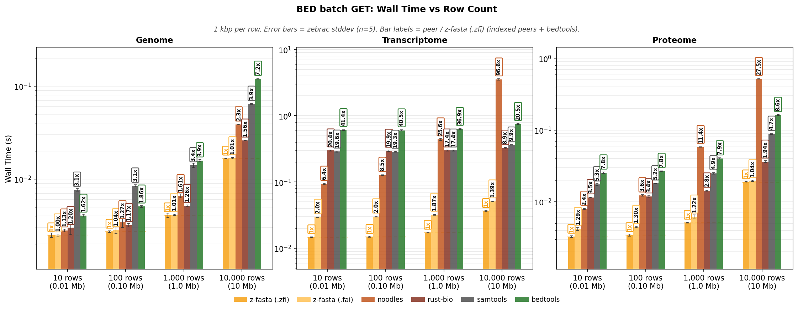

**Reading Figure 7**
- Three panels: Genome, Transcriptome, Proteome (BED row count on x-axis).
- **Bars:** zebrac mean wall time. Error bars = one standard deviation.
- **Legend order:** z-fasta (.zfi), z-fasta (.fai), noodles, rust-bio, samtools, bedtools.
- **Bar labels:** `1×` on z-fasta (.zfi); other labels = peer / z-fasta (.zfi) (indexed peers + bedtools). Details in Table 19.

## Memory Usage: BED batch

Same zebrac samples as **Performance: BED batch**.

### Peak RSS

zebrac starts a new process for each sample and records peak RSS when it exits (`ru_maxrss`). Table and figure show the mean across samples.

**Table 20:** Peak RSS (MiB, zebrac mean). Same tool order as Performance.

| Dataset / BED rows                  | z-fasta (.zfi)   | z-fasta (.fai)   | noodles   | rust-bio   | samtools   | bedtools   |
|:------------------------------------|:-----------------|:-----------------|:----------|:-----------|:-----------|:-----------|
| Genome / 10 rows (0.01 Mb)          | 3.46 MiB         | 3.30 MiB         | 3.38 MiB  | 3.33 MiB   | 9.52 MiB   | 5.81 MiB   |
| Genome / 100 rows (0.10 Mb)         | 3.41 MiB         | 3.34 MiB         | 3.35 MiB  | 3.33 MiB   | 9.62 MiB   | 5.73 MiB   |
| Genome / 1,000 rows (1.0 Mb)        | 3.44 MiB         | 3.43 MiB         | 3.38 MiB  | 3.41 MiB   | 9.54 MiB   | 5.77 MiB   |
| Genome / 10,000 rows (10 Mb)        | 3.46 MiB         | 3.35 MiB         | 3.31 MiB  | 3.33 MiB   | 9.57 MiB   | 5.55 MiB   |
| Transcriptome / 10 rows (0.01 Mb)   | 3.32 MiB         | 3.45 MiB         | 46.83 MiB | 95.50 MiB  | 65.98 MiB  | 188.37 MiB |
| Transcriptome / 100 rows (0.10 Mb)  | 3.37 MiB         | 3.52 MiB         | 46.75 MiB | 95.62 MiB  | 66.26 MiB  | 188.43 MiB |
| Transcriptome / 1,000 rows (1.0 Mb) | 3.33 MiB         | 3.42 MiB         | 46.82 MiB | 95.72 MiB  | 65.87 MiB  | 188.28 MiB |
| Transcriptome / 10,000 rows (10 Mb) | 5.56 MiB         | 5.51 MiB         | 46.88 MiB | 95.56 MiB  | 66.02 MiB  | 188.26 MiB |
| Proteome / 10 rows (0.01 Mb)        | 3.32 MiB         | 3.27 MiB         | 3.63 MiB  | 5.31 MiB   | 11.03 MiB  | 12.69 MiB  |
| Proteome / 100 rows (0.10 Mb)       | 3.42 MiB         | 3.40 MiB         | 3.66 MiB  | 5.56 MiB   | 10.97 MiB  | 12.67 MiB  |
| Proteome / 1,000 rows (1.0 Mb)      | 3.27 MiB         | 3.47 MiB         | 3.63 MiB  | 5.61 MiB   | 10.96 MiB  | 12.59 MiB  |
| Proteome / 10,000 rows (10 Mb)      | 3.42 MiB         | 3.40 MiB         | 3.60 MiB  | 5.53 MiB   | 11.02 MiB  | 12.57 MiB  |

<strong>Table 21:</strong> z-fasta (.zfi) vs each peer. RSS × = peer peak RSS ÷ z-fasta peak RSS. Same ratios as bar labels on Figure 8.

| Dataset / BED rows                  | z-fasta (.zfi) vs   | z-fasta (.zfi)   | Peer       | RSS ×   |
|:------------------------------------|:--------------------|:-----------------|:-----------|:--------|
| Genome / 10 rows (0.01 Mb)          | z-fasta (.fai)      | 3.46 MiB         | 3.30 MiB   | 0.95x   |
| Genome / 10 rows (0.01 Mb)          | noodles             | 3.46 MiB         | 3.38 MiB   | 0.98x   |
| Genome / 10 rows (0.01 Mb)          | rust-bio            | 3.46 MiB         | 3.33 MiB   | 0.96x   |
| Genome / 10 rows (0.01 Mb)          | samtools            | 3.46 MiB         | 9.52 MiB   | 2.8x    |
| Genome / 10 rows (0.01 Mb)          | bedtools            | 3.46 MiB         | 5.81 MiB   | 1.68x   |
| Genome / 100 rows (0.10 Mb)         | z-fasta (.fai)      | 3.41 MiB         | 3.34 MiB   | 0.98x   |
| Genome / 100 rows (0.10 Mb)         | noodles             | 3.41 MiB         | 3.35 MiB   | 0.98x   |
| Genome / 100 rows (0.10 Mb)         | rust-bio            | 3.41 MiB         | 3.33 MiB   | 0.98x   |
| Genome / 100 rows (0.10 Mb)         | samtools            | 3.41 MiB         | 9.62 MiB   | 2.8x    |
| Genome / 100 rows (0.10 Mb)         | bedtools            | 3.41 MiB         | 5.73 MiB   | 1.68x   |
| Genome / 1,000 rows (1.0 Mb)        | z-fasta (.fai)      | 3.44 MiB         | 3.43 MiB   | 1.00x   |
| Genome / 1,000 rows (1.0 Mb)        | noodles             | 3.44 MiB         | 3.38 MiB   | 0.98x   |
| Genome / 1,000 rows (1.0 Mb)        | rust-bio            | 3.44 MiB         | 3.41 MiB   | 0.99x   |
| Genome / 1,000 rows (1.0 Mb)        | samtools            | 3.44 MiB         | 9.54 MiB   | 2.8x    |
| Genome / 1,000 rows (1.0 Mb)        | bedtools            | 3.44 MiB         | 5.77 MiB   | 1.68x   |
| Genome / 10,000 rows (10 Mb)        | z-fasta (.fai)      | 3.46 MiB         | 3.35 MiB   | 0.97x   |
| Genome / 10,000 rows (10 Mb)        | noodles             | 3.46 MiB         | 3.31 MiB   | 0.96x   |
| Genome / 10,000 rows (10 Mb)        | rust-bio            | 3.46 MiB         | 3.33 MiB   | 0.96x   |
| Genome / 10,000 rows (10 Mb)        | samtools            | 3.46 MiB         | 9.57 MiB   | 2.8x    |
| Genome / 10,000 rows (10 Mb)        | bedtools            | 3.46 MiB         | 5.55 MiB   | 1.60x   |
| Transcriptome / 10 rows (0.01 Mb)   | z-fasta (.fai)      | 3.32 MiB         | 3.45 MiB   | 1.04x   |
| Transcriptome / 10 rows (0.01 Mb)   | noodles             | 3.32 MiB         | 46.83 MiB  | 14.1x   |
| Transcriptome / 10 rows (0.01 Mb)   | rust-bio            | 3.32 MiB         | 95.50 MiB  | 28.8x   |
| Transcriptome / 10 rows (0.01 Mb)   | samtools            | 3.32 MiB         | 65.98 MiB  | 19.9x   |
| Transcriptome / 10 rows (0.01 Mb)   | bedtools            | 3.32 MiB         | 188.37 MiB | 56.8x   |
| Transcriptome / 100 rows (0.10 Mb)  | z-fasta (.fai)      | 3.37 MiB         | 3.52 MiB   | 1.05x   |
| Transcriptome / 100 rows (0.10 Mb)  | noodles             | 3.37 MiB         | 46.75 MiB  | 13.9x   |
| Transcriptome / 100 rows (0.10 Mb)  | rust-bio            | 3.37 MiB         | 95.62 MiB  | 28.4x   |
| Transcriptome / 100 rows (0.10 Mb)  | samtools            | 3.37 MiB         | 66.26 MiB  | 19.7x   |
| Transcriptome / 100 rows (0.10 Mb)  | bedtools            | 3.37 MiB         | 188.43 MiB | 56.0x   |
| Transcriptome / 1,000 rows (1.0 Mb) | z-fasta (.fai)      | 3.33 MiB         | 3.42 MiB   | 1.03x   |
| Transcriptome / 1,000 rows (1.0 Mb) | noodles             | 3.33 MiB         | 46.82 MiB  | 14.1x   |
| Transcriptome / 1,000 rows (1.0 Mb) | rust-bio            | 3.33 MiB         | 95.72 MiB  | 28.7x   |
| Transcriptome / 1,000 rows (1.0 Mb) | samtools            | 3.33 MiB         | 65.87 MiB  | 19.8x   |
| Transcriptome / 1,000 rows (1.0 Mb) | bedtools            | 3.33 MiB         | 188.28 MiB | 56.5x   |
| Transcriptome / 10,000 rows (10 Mb) | z-fasta (.fai)      | 5.56 MiB         | 5.51 MiB   | 0.99x   |
| Transcriptome / 10,000 rows (10 Mb) | noodles             | 5.56 MiB         | 46.88 MiB  | 8.4x    |
| Transcriptome / 10,000 rows (10 Mb) | rust-bio            | 5.56 MiB         | 95.56 MiB  | 17.2x   |
| Transcriptome / 10,000 rows (10 Mb) | samtools            | 5.56 MiB         | 66.02 MiB  | 11.9x   |
| Transcriptome / 10,000 rows (10 Mb) | bedtools            | 5.56 MiB         | 188.26 MiB | 33.9x   |
| Proteome / 10 rows (0.01 Mb)        | z-fasta (.fai)      | 3.32 MiB         | 3.27 MiB   | 0.98x   |
| Proteome / 10 rows (0.01 Mb)        | noodles             | 3.32 MiB         | 3.63 MiB   | 1.09x   |
| Proteome / 10 rows (0.01 Mb)        | rust-bio            | 3.32 MiB         | 5.31 MiB   | 1.60x   |
| Proteome / 10 rows (0.01 Mb)        | samtools            | 3.32 MiB         | 11.03 MiB  | 3.3x    |
| Proteome / 10 rows (0.01 Mb)        | bedtools            | 3.32 MiB         | 12.69 MiB  | 3.8x    |
| Proteome / 100 rows (0.10 Mb)       | z-fasta (.fai)      | 3.42 MiB         | 3.40 MiB   | 0.99x   |
| Proteome / 100 rows (0.10 Mb)       | noodles             | 3.42 MiB         | 3.66 MiB   | 1.07x   |
| Proteome / 100 rows (0.10 Mb)       | rust-bio            | 3.42 MiB         | 5.56 MiB   | 1.62x   |
| Proteome / 100 rows (0.10 Mb)       | samtools            | 3.42 MiB         | 10.97 MiB  | 3.2x    |
| Proteome / 100 rows (0.10 Mb)       | bedtools            | 3.42 MiB         | 12.67 MiB  | 3.7x    |
| Proteome / 1,000 rows (1.0 Mb)      | z-fasta (.fai)      | 3.27 MiB         | 3.47 MiB   | 1.06x   |
| Proteome / 1,000 rows (1.0 Mb)      | noodles             | 3.27 MiB         | 3.63 MiB   | 1.11x   |
| Proteome / 1,000 rows (1.0 Mb)      | rust-bio            | 3.27 MiB         | 5.61 MiB   | 1.71x   |
| Proteome / 1,000 rows (1.0 Mb)      | samtools            | 3.27 MiB         | 10.96 MiB  | 3.3x    |
| Proteome / 1,000 rows (1.0 Mb)      | bedtools            | 3.27 MiB         | 12.59 MiB  | 3.8x    |
| Proteome / 10,000 rows (10 Mb)      | z-fasta (.fai)      | 3.42 MiB         | 3.40 MiB   | 1.00x   |
| Proteome / 10,000 rows (10 Mb)      | noodles             | 3.42 MiB         | 3.60 MiB   | 1.05x   |
| Proteome / 10,000 rows (10 Mb)      | rust-bio            | 3.42 MiB         | 5.53 MiB   | 1.62x   |
| Proteome / 10,000 rows (10 Mb)      | samtools            | 3.42 MiB         | 11.02 MiB  | 3.2x    |
| Proteome / 10,000 rows (10 Mb)      | bedtools            | 3.42 MiB         | 12.57 MiB  | 3.7x    |

**Figure 8:** Table 20 as grouped bars (linear y, MiB). Bar labels = RSS × (see Table 21).

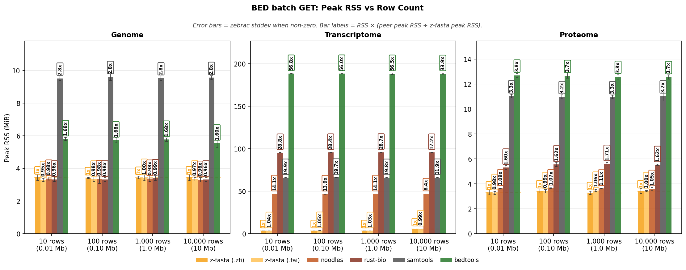

**Reading Figure 8**
- Three panels: Genome, Transcriptome, Proteome (BED row count on x-axis).
- **Bars:** zebrac mean peak RSS. Error bars when stddev is non-zero. Linear y-axis (MiB).
- **Legend order:** z-fasta (.zfi), z-fasta (.fai), noodles, rust-bio, samtools, bedtools.
- **Bar labels:** `1×` on z-fasta (.zfi); other labels = RSS × (peer peak RSS ÷ z-fasta peak RSS). Details in Table 21.

## Page Faults: BED batch

Same zebrac samples as **Performance: BED batch**.

### Page faults

A **minor** fault maps a page without reading disk. A **major** fault reads from disk. zebrac reports both per run, like wall time.

**Table 22:** Minor page faults (zebrac mean). Same tool order as Performance.

| Dataset / BED rows                  |   z-fasta (.zfi) |   z-fasta (.fai) |   noodles |   rust-bio |   samtools |   bedtools |
|:------------------------------------|-----------------:|-----------------:|----------:|-----------:|-----------:|-----------:|
| Genome / 10 rows (0.01 Mb)          |              336 |              338 |       325 |        335 |        822 |        464 |
| Genome / 100 rows (0.10 Mb)         |              355 |              356 |       328 |        334 |        826 |        462 |
| Genome / 1,000 rows (1.0 Mb)        |              395 |              398 |       337 |        334 |        826 |        464 |
| Genome / 10,000 rows (10 Mb)        |              497 |              495 |       334 |        334 |        823 |        463 |
| Transcriptome / 10 rows (0.01 Mb)   |              367 |              353 |    11,825 |     28,282 |     15,553 |     49,260 |
| Transcriptome / 100 rows (0.10 Mb)  |              395 |              382 |    11,834 |     28,283 |     15,552 |     49,259 |
| Transcriptome / 1,000 rows (1.0 Mb) |              587 |              572 |    11,841 |     28,285 |     15,552 |     49,259 |
| Transcriptome / 10,000 rows (10 Mb) |            1,888 |            1,874 |    11,854 |     28,297 |     15,551 |     49,259 |
| Proteome / 10 rows (0.01 Mb)        |              364 |              351 |       767 |      1,435 |      1,412 |      2,387 |
| Proteome / 100 rows (0.10 Mb)       |              388 |              374 |       773 |      1,436 |      1,411 |      2,386 |
| Proteome / 1,000 rows (1.0 Mb)      |              473 |              458 |       773 |      1,436 |      1,413 |      2,388 |
| Proteome / 10,000 rows (10 Mb)      |              744 |              728 |       780 |      1,437 |      1,413 |      2,388 |

<strong>Table 23:</strong> z-fasta (.zfi) vs each peer. Faults × = peer minor faults ÷ z-fasta minor faults. Same ratios as bar labels on Figure 9.

| Dataset / BED rows                  | z-fasta (.zfi) vs   |   z-fasta (.zfi) |   Peer | Faults ×   |
|:------------------------------------|:--------------------|-----------------:|-------:|:-----------|
| Genome / 10 rows (0.01 Mb)          | z-fasta (.fai)      |              336 |    338 | 1.00x      |
| Genome / 10 rows (0.01 Mb)          | noodles             |              336 |    325 | 0.97x      |
| Genome / 10 rows (0.01 Mb)          | rust-bio            |              336 |    335 | 0.99x      |
| Genome / 10 rows (0.01 Mb)          | samtools            |              336 |    822 | 2.4x       |
| Genome / 10 rows (0.01 Mb)          | bedtools            |              336 |    464 | 1.38x      |
| Genome / 100 rows (0.10 Mb)         | z-fasta (.fai)      |              355 |    356 | 1.00x      |
| Genome / 100 rows (0.10 Mb)         | noodles             |              355 |    328 | 0.92x      |
| Genome / 100 rows (0.10 Mb)         | rust-bio            |              355 |    334 | 0.94x      |
| Genome / 100 rows (0.10 Mb)         | samtools            |              355 |    826 | 2.3x       |
| Genome / 100 rows (0.10 Mb)         | bedtools            |              355 |    462 | 1.30x      |
| Genome / 1,000 rows (1.0 Mb)        | z-fasta (.fai)      |              395 |    398 | 1.01x      |
| Genome / 1,000 rows (1.0 Mb)        | noodles             |              395 |    337 | 0.85x      |
| Genome / 1,000 rows (1.0 Mb)        | rust-bio            |              395 |    334 | 0.84x      |
| Genome / 1,000 rows (1.0 Mb)        | samtools            |              395 |    826 | 2.1x       |
| Genome / 1,000 rows (1.0 Mb)        | bedtools            |              395 |    464 | 1.17x      |
| Genome / 10,000 rows (10 Mb)        | z-fasta (.fai)      |              497 |    495 | 1.00x      |
| Genome / 10,000 rows (10 Mb)        | noodles             |              497 |    334 | 0.67x      |
| Genome / 10,000 rows (10 Mb)        | rust-bio            |              497 |    334 | 0.67x      |
| Genome / 10,000 rows (10 Mb)        | samtools            |              497 |    823 | 1.65x      |
| Genome / 10,000 rows (10 Mb)        | bedtools            |              497 |    463 | 0.93x      |
| Transcriptome / 10 rows (0.01 Mb)   | z-fasta (.fai)      |              367 |    353 | 0.96x      |
| Transcriptome / 10 rows (0.01 Mb)   | noodles             |              367 | 11,825 | 32.2x      |
| Transcriptome / 10 rows (0.01 Mb)   | rust-bio            |              367 | 28,282 | 76.9x      |
| Transcriptome / 10 rows (0.01 Mb)   | samtools            |              367 | 15,553 | 42.3x      |
| Transcriptome / 10 rows (0.01 Mb)   | bedtools            |              367 | 49,260 | 134x       |
| Transcriptome / 100 rows (0.10 Mb)  | z-fasta (.fai)      |              395 |    382 | 0.97x      |
| Transcriptome / 100 rows (0.10 Mb)  | noodles             |              395 | 11,834 | 30.0x      |
| Transcriptome / 100 rows (0.10 Mb)  | rust-bio            |              395 | 28,283 | 71.6x      |
| Transcriptome / 100 rows (0.10 Mb)  | samtools            |              395 | 15,552 | 39.4x      |
| Transcriptome / 100 rows (0.10 Mb)  | bedtools            |              395 | 49,259 | 125x       |
| Transcriptome / 1,000 rows (1.0 Mb) | z-fasta (.fai)      |              587 |    572 | 0.97x      |
| Transcriptome / 1,000 rows (1.0 Mb) | noodles             |              587 | 11,841 | 20.2x      |
| Transcriptome / 1,000 rows (1.0 Mb) | rust-bio            |              587 | 28,285 | 48.2x      |
| Transcriptome / 1,000 rows (1.0 Mb) | samtools            |              587 | 15,552 | 26.5x      |
| Transcriptome / 1,000 rows (1.0 Mb) | bedtools            |              587 | 49,259 | 83.9x      |
| Transcriptome / 10,000 rows (10 Mb) | z-fasta (.fai)      |            1,888 |  1,874 | 0.99x      |
| Transcriptome / 10,000 rows (10 Mb) | noodles             |            1,888 | 11,854 | 6.3x       |
| Transcriptome / 10,000 rows (10 Mb) | rust-bio            |            1,888 | 28,297 | 15.0x      |
| Transcriptome / 10,000 rows (10 Mb) | samtools            |            1,888 | 15,551 | 8.2x       |
| Transcriptome / 10,000 rows (10 Mb) | bedtools            |            1,888 | 49,259 | 26.1x      |
| Proteome / 10 rows (0.01 Mb)        | z-fasta (.fai)      |              364 |    351 | 0.96x      |
| Proteome / 10 rows (0.01 Mb)        | noodles             |              364 |    767 | 2.1x       |
| Proteome / 10 rows (0.01 Mb)        | rust-bio            |              364 |  1,435 | 3.9x       |
| Proteome / 10 rows (0.01 Mb)        | samtools            |              364 |  1,412 | 3.9x       |
| Proteome / 10 rows (0.01 Mb)        | bedtools            |              364 |  2,387 | 6.5x       |
| Proteome / 100 rows (0.10 Mb)       | z-fasta (.fai)      |              388 |    374 | 0.96x      |
| Proteome / 100 rows (0.10 Mb)       | noodles             |              388 |    773 | 1.99x      |
| Proteome / 100 rows (0.10 Mb)       | rust-bio            |              388 |  1,436 | 3.7x       |
| Proteome / 100 rows (0.10 Mb)       | samtools            |              388 |  1,411 | 3.6x       |
| Proteome / 100 rows (0.10 Mb)       | bedtools            |              388 |  2,386 | 6.2x       |
| Proteome / 1,000 rows (1.0 Mb)      | z-fasta (.fai)      |              473 |    458 | 0.97x      |
| Proteome / 1,000 rows (1.0 Mb)      | noodles             |              473 |    773 | 1.63x      |
| Proteome / 1,000 rows (1.0 Mb)      | rust-bio            |              473 |  1,436 | 3.0x       |
| Proteome / 1,000 rows (1.0 Mb)      | samtools            |              473 |  1,413 | 3.0x       |
| Proteome / 1,000 rows (1.0 Mb)      | bedtools            |              473 |  2,388 | 5.0x       |
| Proteome / 10,000 rows (10 Mb)      | z-fasta (.fai)      |              744 |    728 | 0.98x      |
| Proteome / 10,000 rows (10 Mb)      | noodles             |              744 |    780 | 1.05x      |
| Proteome / 10,000 rows (10 Mb)      | rust-bio            |              744 |  1,437 | 1.93x      |
| Proteome / 10,000 rows (10 Mb)      | samtools            |              744 |  1,413 | 1.90x      |
| Proteome / 10,000 rows (10 Mb)      | bedtools            |              744 |  2,388 | 3.2x       |

<strong>Table 24:</strong> Major page faults (all zero for this run).

| Dataset / BED rows                  |   z-fasta (.zfi) |   z-fasta (.fai) |   noodles |   rust-bio |   samtools |   bedtools |
|:------------------------------------|-----------------:|-----------------:|----------:|-----------:|-----------:|-----------:|
| Genome / 10 rows (0.01 Mb)          |                0 |                0 |         0 |          0 |          0 |          0 |
| Genome / 100 rows (0.10 Mb)         |                0 |                0 |         0 |          0 |          0 |          0 |
| Genome / 1,000 rows (1.0 Mb)        |                0 |                0 |         0 |          0 |          0 |          0 |
| Genome / 10,000 rows (10 Mb)        |                0 |                0 |         0 |          0 |          0 |          0 |
| Transcriptome / 10 rows (0.01 Mb)   |                0 |                0 |         0 |          0 |          0 |          0 |
| Transcriptome / 100 rows (0.10 Mb)  |                0 |                0 |         0 |          0 |          0 |          0 |
| Transcriptome / 1,000 rows (1.0 Mb) |                0 |                0 |         0 |          0 |          0 |          0 |
| Transcriptome / 10,000 rows (10 Mb) |                0 |                0 |         0 |          0 |          0 |          0 |
| Proteome / 10 rows (0.01 Mb)        |                0 |                0 |         0 |          0 |          0 |          0 |
| Proteome / 100 rows (0.10 Mb)       |                0 |                0 |         0 |          0 |          0 |          0 |
| Proteome / 1,000 rows (1.0 Mb)      |                0 |                0 |         0 |          0 |          0 |          0 |
| Proteome / 10,000 rows (10 Mb)      |                0 |                0 |         0 |          0 |          0 |          0 |

**Figure 9:** Table 22 as grouped bars (log y). Bar labels = Faults × (see Table 23).

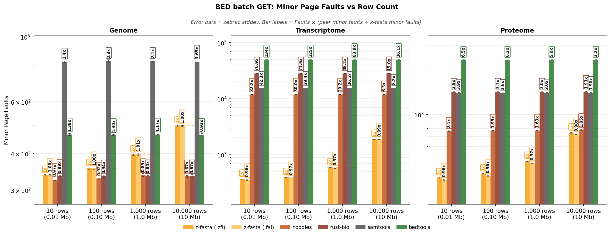

**Reading Figure 9**
- Three panels: Genome, Transcriptome, Proteome (BED row count on x-axis).
- **Bars:** zebrac mean minor page faults. Log y-axis.
- **Legend order:** z-fasta (.zfi), z-fasta (.fai), noodles, rust-bio, samtools, bedtools.
- **Bar labels:** `1×` on z-fasta (.zfi); other labels = Faults × (peer minor faults ÷ z-fasta minor faults). Details in Table 23.

## RC overhead

Orientation transforms on a fixed **1 kbp** mid slice (`1kbp_mid`) on **Genome, Transcriptome** only. **Proteome is excluded:** protein records have no reverse-complement semantics, so `--rc` and `--complement-only` do not apply; `--reverse-only` only permutes amino-acid characters and adds negligible overhead vs plain GET, so it is not a meaningful benchmark axis. **X-axis = dataset** (Genome, Transcriptome); **bar color = tool/lane**. Figure facets are wall time, peak RSS, and minor page faults. Primary comparison: z-fasta (.zfi) plain vs `--rc`. The z-fasta (.fai) RC lane uses the same command and output contract through the compatible index. Other RC-capable peers use native `--rc`; seqtk (ref) uses `subseq` + `seq -r` (no index).

**Table 25:** Wall time (mean ± stddev, seconds).

| dataset       | z-fasta (.zfi)   | z-fasta (.zfi) --rc   | z-fasta (.fai) --rc   | z-fasta (.zfi) --complement-only   | z-fasta (.zfi) --reverse-only   | noodles --rc    | rust-bio --rc   | seqtk (ref)     |
|:--------------|:-----------------|:----------------------|:----------------------|:-----------------------------------|:--------------------------------|:----------------|:----------------|:----------------|
| Genome        | 0.0025s ±0.0001  | 0.0028s ±0.0001       | 0.0024s ±0.0000       | 0.0024s ±0.0001                    | 0.0026s ±0.0001                 | 0.0027s ±0.0001 | 0.0030s ±0.0001 | 1.3715s ±0.0049 |
| Transcriptome | 0.0060s ±0.0002  | 0.0064s ±0.0004       | 0.0290s ±0.0003       | 0.0063s ±0.0001                    | 0.0058s ±0.0002                 | 0.0898s ±0.0005 | 0.5238s ±0.0033 | 0.2193s ±0.0006 |

**Table 26:** Peak RSS (MiB).

| dataset       | z-fasta (.zfi)   | z-fasta (.zfi) --rc   | z-fasta (.fai) --rc   | z-fasta (.zfi) --complement-only   | z-fasta (.zfi) --reverse-only   | noodles --rc   | rust-bio --rc   | seqtk (ref)   |
|:--------------|:-----------------|:----------------------|:----------------------|:-----------------------------------|:--------------------------------|:---------------|:----------------|:--------------|
| Genome        | 3.38 MiB         | 3.47 MiB              | 3.36 MiB              | 3.38 MiB                           | 3.38 MiB                        | 3.49 MiB       | 3.47 MiB        | 239.94 MiB    |
| Transcriptome | 22.53 MiB        | 22.47 MiB             | 3.43 MiB              | 22.53 MiB                          | 22.53 MiB                       | 46.63 MiB      | 144.88 MiB      | 3.25 MiB      |

**Table 27:** Minor page faults.

| dataset       |   z-fasta (.zfi) |   z-fasta (.zfi) --rc |   z-fasta (.fai) --rc |   z-fasta (.zfi) --complement-only |   z-fasta (.zfi) --reverse-only |   noodles --rc |   rust-bio --rc |   seqtk (ref) |
|:--------------|-----------------:|----------------------:|----------------------:|-----------------------------------:|--------------------------------:|---------------:|----------------:|--------------:|
| Genome        |              325 |                   326 |                   329 |                                326 |                             325 |            321 |             338 |        61,490 |
| Transcriptome |              677 |                   676 |                   345 |                                676 |                             674 |         11,824 |          41,163 |           795 |

<strong>Table 28:</strong> Output throughput (Mbp/s).

| dataset       | z-fasta (.zfi)   | z-fasta (.zfi) --rc   | z-fasta (.fai) --rc   | z-fasta (.zfi) --complement-only   | z-fasta (.zfi) --reverse-only   | noodles --rc   | rust-bio --rc   | seqtk (ref)   |
|:--------------|:-----------------|:----------------------|:----------------------|:-----------------------------------|:--------------------------------|:---------------|:----------------|:--------------|
| Genome        | 0.41 Mbp/s       | 0.36 Mbp/s            | 0.42 Mbp/s            | 0.41 Mbp/s                         | 0.39 Mbp/s                      | 0.37 Mbp/s     | 0.33 Mbp/s      | 0.001 Mbp/s   |
| Transcriptome | 0.17 Mbp/s       | 0.16 Mbp/s            | 0.03 Mbp/s            | 0.16 Mbp/s                         | 0.17 Mbp/s                      | 0.01 Mbp/s     | 0.002 Mbp/s     | 0.005 Mbp/s   |

**Table 29:** z-fasta RC self-overhead (`--rc` / plain).

| dataset       | z-fasta --rc / plain   |
|:--------------|:-----------------------|
| Genome        | 1.120×                 |
| Transcriptome | 1.066×                 |

<strong>Table 30:</strong> RC peers vs z-fasta (.zfi) --rc. Ratio = peer wall time / z-fasta (.zfi) --rc wall time.

| Dataset       | z-fasta (.zfi) --rc vs   | z-fasta (.zfi) --rc   | Peer    | Time ×   |
|:--------------|:-------------------------|:----------------------|:--------|:---------|
| Genome        | z-fasta (.fai) --rc      | 0.0028s               | 0.0024s | 0.86x    |
| Genome        | noodles --rc             | 0.0028s               | 0.0027s | 0.98x    |
| Genome        | rust-bio --rc            | 0.0028s               | 0.0030s | 1.10x    |
| Transcriptome | z-fasta (.fai) --rc      | 0.0064s               | 0.0290s | 4.5x     |
| Transcriptome | noodles --rc             | 0.0064s               | 0.0898s | 14.0x    |
| Transcriptome | rust-bio --rc            | 0.0064s               | 0.5238s | 81.4x    |

**Figure 10:** Tables 25, 26, and 27 as grouped bars (datasets on x-axis; tool color from legend).

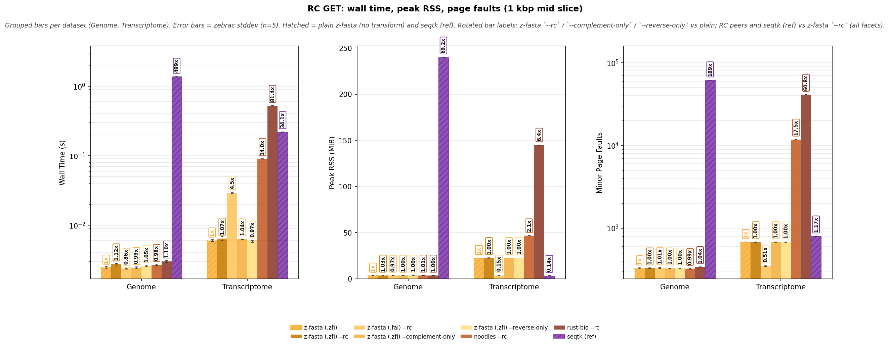

**Reading Figure 10**
- **Facets:** wall time (log y) | peak RSS (linear) | minor page faults (log y).
- **X-axis:** Genome, Transcriptome (Proteome omitted; see section intro).
- **Bar colors:** one lane per tool (legend below figure).
- **Bar labels (rotated):** plain = `1×` baseline; z-fasta (.zfi) `--rc`, `--complement-only`, and `--reverse-only` vs plain; z-fasta (.fai), noodles, rust-bio, and seqtk (ref) RC lanes vs z-fasta (.zfi) `--rc`. Same ratio rules apply to wall time, peak RSS, and page faults.
- **Hatched bars:** plain z-fasta (no transform) and seqtk (ref).

## Messy FASTA GET (z-fasta only)

Paired `get` on proteome-derived messy fixtures in `bench/shared/cache/messy_perf/` (4 layout variants, ~20k sequences each). Each workload extracts the same TITIN sub-regions from a **uniform** (`validate --fix`) and **messy** (side-table `.zfi`) copy of each file. Spans are defined in `bench/get/messy_perf.json`. Index build stays outside zebrac. Zebrac used **50** samples, **10** warmup, **30000 ms** minimum per lane. Peers are omitted.

**Why ratio charts:** Figures plot **messy / uniform**; dashed line = parity (1.0×). Figure 11 quotes the headline span `titin_mid`. Figure 12 summarizes all spans (median bar, min-max whiskers, `titin_mid` diamond) to show overhead tracks layout type, not extraction length. Collapsible Table below has per-span microseconds and ratios.

**Table 31:** Perf spans × variants (16 timed pairs).

| variant             | span      | region                                      |   bases | purpose                                                | headline   |
|:--------------------|:----------|:--------------------------------------------|--------:|:-------------------------------------------------------|:-----------|
| mixed_widths        | titin_1k  | sp&#124;Q8WZ42&#124;TITIN_HUMAN:1-1000      |    1000 | 1 kbp N-terminal on TITIN                              |            |
| mixed_widths        | titin_10k | sp&#124;Q8WZ42&#124;TITIN_HUMAN:1-10000     |   10000 | 10 kbp N-terminal on TITIN                             |            |
| mixed_widths        | titin_mid | sp&#124;Q8WZ42&#124;TITIN_HUMAN:500-2500    |    2001 | 2 kbp interior slice (headline side-table stress)      | yes        |
| mixed_widths        | titin_40k | sp&#124;Q8WZ42&#124;TITIN_HUMAN:10000-30000 |   20001 | 20 kbp mid-protein slice (within current TITIN length) |            |
| trailing_whitespace | titin_1k  | sp&#124;Q8WZ42&#124;TITIN_HUMAN:1-1000      |    1000 | 1 kbp N-terminal on TITIN                              |            |
| trailing_whitespace | titin_10k | sp&#124;Q8WZ42&#124;TITIN_HUMAN:1-10000     |   10000 | 10 kbp N-terminal on TITIN                             |            |
| trailing_whitespace | titin_mid | sp&#124;Q8WZ42&#124;TITIN_HUMAN:500-2500    |    2001 | 2 kbp interior slice (headline side-table stress)      | yes        |
| trailing_whitespace | titin_40k | sp&#124;Q8WZ42&#124;TITIN_HUMAN:10000-30000 |   20001 | 20 kbp mid-protein slice (within current TITIN length) |            |
| mixed_crlf          | titin_1k  | sp&#124;Q8WZ42&#124;TITIN_HUMAN:1-1000      |    1000 | 1 kbp N-terminal on TITIN                              |            |
| mixed_crlf          | titin_10k | sp&#124;Q8WZ42&#124;TITIN_HUMAN:1-10000     |   10000 | 10 kbp N-terminal on TITIN                             |            |
| mixed_crlf          | titin_mid | sp&#124;Q8WZ42&#124;TITIN_HUMAN:500-2500    |    2001 | 2 kbp interior slice (headline side-table stress)      | yes        |
| mixed_crlf          | titin_40k | sp&#124;Q8WZ42&#124;TITIN_HUMAN:10000-30000 |   20001 | 20 kbp mid-protein slice (within current TITIN length) |            |
| all_messy           | titin_1k  | sp&#124;Q8WZ42&#124;TITIN_HUMAN:1-1000      |    1000 | 1 kbp N-terminal on TITIN                              |            |
| all_messy           | titin_10k | sp&#124;Q8WZ42&#124;TITIN_HUMAN:1-10000     |   10000 | 10 kbp N-terminal on TITIN                             |            |
| all_messy           | titin_mid | sp&#124;Q8WZ42&#124;TITIN_HUMAN:500-2500    |    2001 | 2 kbp interior slice (headline side-table stress)      | yes        |
| all_messy           | titin_40k | sp&#124;Q8WZ42&#124;TITIN_HUMAN:10000-30000 |   20001 | 20 kbp mid-protein slice (within current TITIN length) |            |

**Reading Table 31**
- **span** = short id from `messy_perf.json`.
- **region** = full `z-fasta get` region argument (`&#124;` = `|` in UniProt ids).
- **headline** = `titin_mid` (same slice on every variant file).

**Table 32:** Headline span `titin_mid` messy / uniform.

| variant             | span      | metric         | uniform   | messy     | messy / uniform   |
|:--------------------|:----------|:---------------|:----------|:----------|:------------------|
| mixed_widths        | titin_mid | wall time ×    | 2645.0 µs | 3178.9 µs | 1.202×            |
| mixed_widths        | titin_mid | peak RSS ×     | 3.37 MiB  | 7.23 MiB  | 2.146×            |
| mixed_widths        | titin_mid | minor faults × | 333       | 355       | 1.066×            |
| trailing_whitespace | titin_mid | wall time ×    | 2617.2 µs | 3206.0 µs | 1.225×            |
| trailing_whitespace | titin_mid | peak RSS ×     | 3.41 MiB  | 7.51 MiB  | 2.201×            |
| trailing_whitespace | titin_mid | minor faults × | 333       | 357       | 1.070×            |
| mixed_crlf          | titin_mid | wall time ×    | 2638.2 µs | 3271.8 µs | 1.240×            |
| mixed_crlf          | titin_mid | peak RSS ×     | 3.40 MiB  | 7.96 MiB  | 2.346×            |
| mixed_crlf          | titin_mid | minor faults × | 333       | 358       | 1.074×            |
| all_messy           | titin_mid | wall time ×    | 2677.2 µs | 3237.2 µs | 1.209×            |
| all_messy           | titin_mid | peak RSS ×     | 3.39 MiB  | 7.25 MiB  | 2.139×            |
| all_messy           | titin_mid | minor faults × | 332       | 355       | 1.069×            |

**Figure 11:** Headline span `titin_mid` ratios (Table 32).

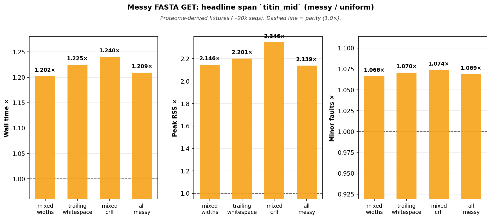

**Reading Figure 11**
- Three panels: wall time, peak RSS, minor page faults (messy / uniform).
- One bar per layout variant at the headline slice `titin_mid`.

**Figure 12:** Layout overhead stable across spans (see Table 33).

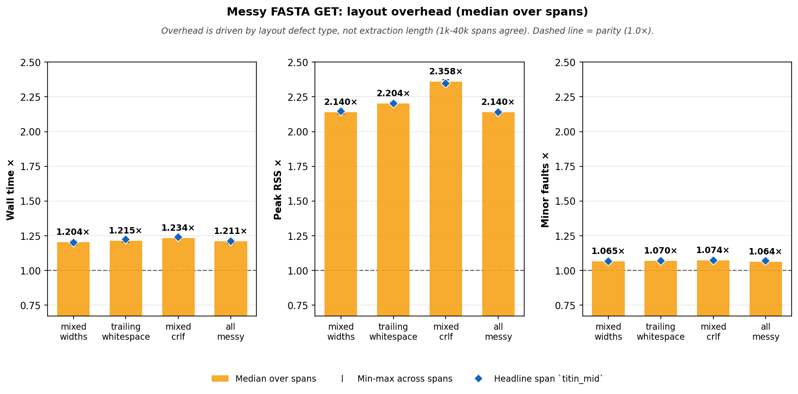

**Reading Figure 12**
- Bar = median messy / uniform ratio over all perf spans.
- Whiskers = min-max across spans (tight whiskers = span-insensitive overhead).
- Diamond = headline span `titin_mid` (links back to Figure 11).

<strong>Table 33:</strong> All spans: wall (µs), RSS ×, faults × (per-span drill-down).

| variant             | span      | region                                      |   bases | uniform wall     | messy wall       | wall ×   | RSS ×   | faults ×   |
|:--------------------|:----------|:--------------------------------------------|--------:|:-----------------|:-----------------|:---------|:--------|:-----------|
| mixed_widths        | titin_1k  | sp&#124;Q8WZ42&#124;TITIN_HUMAN:1-1000      |    1000 | 2630.3 µs ±93.9  | 3170.2 µs ±143.3 | 1.205×   | 2.125×  | 1.065×     |
| mixed_widths        | titin_10k | sp&#124;Q8WZ42&#124;TITIN_HUMAN:1-10000     |   10000 | 2616.2 µs ±108.3 | 3177.4 µs ±146.9 | 1.214×   | 2.137×  | 1.065×     |
| mixed_widths        | titin_mid | sp&#124;Q8WZ42&#124;TITIN_HUMAN:500-2500    |    2001 | 2645.0 µs ±124.9 | 3178.9 µs ±102.4 | 1.202×   | 2.146×  | 1.066×     |
| mixed_widths        | titin_40k | sp&#124;Q8WZ42&#124;TITIN_HUMAN:10000-30000 |   20001 | 2712.9 µs ±137.7 | 3214.9 µs ±111.0 | 1.185×   | 2.143×  | 1.060×     |
| trailing_whitespace | titin_1k  | sp&#124;Q8WZ42&#124;TITIN_HUMAN:1-1000      |    1000 | 2642.8 µs ±97.9  | 3205.7 µs ±113.2 | 1.213×   | 2.215×  | 1.069×     |
| trailing_whitespace | titin_10k | sp&#124;Q8WZ42&#124;TITIN_HUMAN:1-10000     |   10000 | 2688.6 µs ±126.8 | 3240.7 µs ±123.6 | 1.205×   | 2.206×  | 1.071×     |
| trailing_whitespace | titin_mid | sp&#124;Q8WZ42&#124;TITIN_HUMAN:500-2500    |    2001 | 2617.2 µs ±79.9  | 3206.0 µs ±145.6 | 1.225×   | 2.201×  | 1.070×     |
| trailing_whitespace | titin_40k | sp&#124;Q8WZ42&#124;TITIN_HUMAN:10000-30000 |   20001 | 2675.7 µs ±128.7 | 3254.9 µs ±142.3 | 1.216×   | 2.195×  | 1.065×     |
| mixed_crlf          | titin_1k  | sp&#124;Q8WZ42&#124;TITIN_HUMAN:1-1000      |    1000 | 2634.6 µs ±147.5 | 3236.5 µs ±135.1 | 1.228×   | 2.372×  | 1.076×     |
| mixed_crlf          | titin_10k | sp&#124;Q8WZ42&#124;TITIN_HUMAN:1-10000     |   10000 | 2657.9 µs ±136.8 | 3288.6 µs ±153.3 | 1.237×   | 2.354×  | 1.074×     |
| mixed_crlf          | titin_mid | sp&#124;Q8WZ42&#124;TITIN_HUMAN:500-2500    |    2001 | 2638.2 µs ±125.8 | 3271.8 µs ±138.3 | 1.240×   | 2.346×  | 1.074×     |
| mixed_crlf          | titin_40k | sp&#124;Q8WZ42&#124;TITIN_HUMAN:10000-30000 |   20001 | 2679.6 µs ±123.3 | 3297.4 µs ±169.1 | 1.231×   | 2.362×  | 1.073×     |
| all_messy           | titin_1k  | sp&#124;Q8WZ42&#124;TITIN_HUMAN:1-1000      |    1000 | 2708.9 µs ±148.3 | 3232.9 µs ±148.4 | 1.193×   | 2.140×  | 1.064×     |
| all_messy           | titin_10k | sp&#124;Q8WZ42&#124;TITIN_HUMAN:1-10000     |   10000 | 2701.2 µs ±126.7 | 3298.6 µs ±140.2 | 1.221×   | 2.148×  | 1.065×     |
| all_messy           | titin_mid | sp&#124;Q8WZ42&#124;TITIN_HUMAN:500-2500    |    2001 | 2677.2 µs ±132.3 | 3237.2 µs ±175.6 | 1.209×   | 2.139×  | 1.069×     |
| all_messy           | titin_40k | sp&#124;Q8WZ42&#124;TITIN_HUMAN:10000-30000 |   20001 | 2685.3 µs ±121.0 | 3254.6 µs ±122.5 | 1.212×   | 2.128×  | 1.062×     |

