<!-- markdownlint-disable MD024 MD032 MD033 MD036 MD041 MD049 -->

# z-fasta Index Benchmark Report

_Auto-generated by `generate_report.py` from zebrac results._

## Overview

This report compares `z-fasta index` to FASTA indexers that build or use FAI-style `.fai` files. Wall time, throughput, peak RSS, and hardware counters all come from the same zebrac samples for every tool, so the tables and charts are directly comparable.

**Why `.fai` in cross-tool tables:** peer tools (samtools, noodles, seqkit, …) emit text `.fai`. Headline **Performance**, **Memory**, **Page Faults**, and **Scaling** therefore time **`z-fasta (.fai)`** (`index --emit-fai`) so the comparison is format-fair. That lane is not the CLI default.

**Why `.zfi` is first-class:** CLI default `index` writes binary `.zfi` (embedded names, optional side tables for messy wrap). That is the production path get and stats are built around. **z-fasta Mode Comparison** times the full matrix: mmap vs `--low-mem`, `.fai` vs `.zfi`, with and without `--no-dedup` (eight lanes), with noodles and samtools as references.

**Performance and scaling:** three human reference downloads (Genome, Transcriptome, Proteome; see **Data used** under Run Provenance), synthetic file-size scaling from 1 MB through 1 GB, two sequence-count sweeps (bounded ~50 MiB total vs fixed 1 kbp per record through 1M sequences), and speedup vs peers on the `.fai` lane. Zebrac counter columns are for profiling, not headline marketing numbers.

**Correctness:** edge-case fixtures (structurally invalid FASTA) and messy variants (ragged wrap, trailing spaces, CRLF exports). z-fasta indexes some messy inputs with a side-table `.zfi`; samtools, noodles, and rust-bio follow strict FAI line-width rules.

**On-disk `.zfi`:** after Mode Comparison, index file sizes and load/integrity notes. Build timings for every mode live in Mode Comparison, not a second wall table.

**Charts** highlight peer-comparable `z-fasta (.fai)` plus samtools, seqkit, noodles, and rust-bio. **Mode tables** list all eight z-fasta lanes when present.

## Run Provenance

Run **`20260801_084241`** used **zebrac** in **warm** mode: 5 measured samples, 5 warmup passes, 5000 ms minimum per sample.

- **Subject:** z-fasta 0.3.0 (Zig; peer tables use `z-fasta (.fai)`; Mode Comparison covers `.fai` / `.zfi` × mmap / `--low-mem` × dedup / `--no-dedup`)
- **Runner:** zebrac 0.6.0
- **Artifacts:** `results/perf_20260801_084241/` real datasets; `results/scale_size_20260801_084241/` file-size scaling; `results/scale_seqs_budget_20260801_084241/` sequence-count scaling (bounded bytes); `results/scale_seqs_fixed_20260801_084241/` sequence-count scaling (fixed length); metadata in `results/metadata_20260801_084241.jsonl`

**Data used** (human reference files in `bench/shared/data/`; fetch with `bench/shared/download_data.sh`):
- **Genome** (`REAL_Genome.fa`): Homo sapiens GRCh38 primary assembly (Ensembl release 113). 194 sequences, 3.10 Gbp total, 2.93 GiB on disk.
- **Transcriptome** (`REAL_Transcriptome.fa`): Homo sapiens GENCODE v46 transcript sequences. 254,070 transcripts, 444 Mbp total, 458.7 MiB on disk.
- **Proteome** (`REAL_Proteome.fasta`): Homo sapiens UniProt reference proteome UP000005640. 20,652 proteins, 11.5 M residues total, 13.1 MiB on disk.

**Competitors in this run** (versions captured at benchmark time; vendored pins in `bench/shared/tools.sh` / `tools/`):
- **samtools** (C): samtools 1.13 via `samtools faidx` (from `samtools --version`)
- **seqkit** (Go): seqkit v2.13.0 via `seqkit faidx` (from `seqkit version`; pin 2.13.0)
- **fastahack** (C++): fastahack 1.0.0 (directory pin) via `fastahack -i` (from directory pin `tools/fastahack-1.0.0/`; pin 1.0.0)
- **pyfaidx** (Python): 0.9.0.3 via `faidx --no-output` (from `faidx --version` / `pyfaidx.__version__`; pin 0.9.0.3)
- **noodles** (Rust): noodles-fasta 0.61 (wrapper) via `tools/noodles_wrapper index` (from noodles-fasta crate in `tools/noodles_wrapper/Cargo.toml`; pin 0.61)
- **rust-bio** (Rust): rust-bio 2.2 (custom indexer wrapper) via `tools/rustbio_wrapper index` (from bio crate in `tools/rustbio_wrapper/Cargo.toml`; pin 2.2)

Index-file cleanup runs inside each measured command because zebrac has no separate prepare hook. Every tool pays the same small reset overhead.

## Performance: Real Datasets

Headline comparison on the three human reference datasets (see **Data used**). **z-fasta (.fai)** is `index --emit-fai` (mmap + dedup, FAI to stdout) so peers are format-fair. CLI default `index` writes `.zfi`; see **z-fasta Mode Comparison** and **z-fasta Production Index (.zfi)**.

**Table 1:** Zebrac wall time per dataset (seconds, mean ± stddev, warm cache). Lower is better. Tool order: z-fasta, noodles, rust-bio, samtools, seqkit, fastahack, pyfaidx.

| dataset       | z-fasta (.fai)   | noodles         | rust-bio        | samtools        | seqkit          | fastahack        | pyfaidx          |
|:--------------|:-----------------|:----------------|:----------------|:----------------|:----------------|:-----------------|:-----------------|
| Genome        | 0.3805s ±0.0104  | 1.1748s ±0.0090 | 3.6224s ±0.1753 | 9.1403s ±0.1554 | 5.4788s ±0.0357 | 21.8748s ±0.2223 | 27.6308s ±0.1566 |
| Transcriptome | 0.2555s ±0.0014  | 0.3668s ±0.0069 | 0.6900s ±0.0171 | 1.8136s ±0.0106 | 2.0819s ±0.0084 | 5.7379s ±0.0324  | 6.4614s ±0.0599  |
| Proteome      | 0.0120s ±0.0001  | 0.0181s ±0.0007 | 0.0261s ±0.0006 | 0.0579s ±0.0008 | 0.1324s ±0.0053 | 0.2732s ±0.0056  | 0.3745s ±0.0039  |

<strong>Table 2:</strong> Input throughput (MiB/s) from metadata <code>input_bytes</code> and wall time. Higher is better. Same tools and order as Table 1.

| dataset       | z-fasta (.fai)   | noodles      | rust-bio    | samtools    | seqkit      | fastahack   | pyfaidx     |
|:--------------|:-----------------|:-------------|:------------|:------------|:------------|:------------|:------------|
| Genome        | 7899.5 MiB/s     | 2558.2 MiB/s | 829.7 MiB/s | 328.8 MiB/s | 548.6 MiB/s | 137.4 MiB/s | 108.8 MiB/s |
| Transcriptome | 1795.5 MiB/s     | 1250.5 MiB/s | 664.8 MiB/s | 252.9 MiB/s | 220.3 MiB/s | 79.9 MiB/s  | 71.0 MiB/s  |
| Proteome      | 1091.4 MiB/s     | 723.0 MiB/s  | 501.0 MiB/s | 226.3 MiB/s | 98.9 MiB/s  | 47.9 MiB/s  | 35.0 MiB/s  |

<strong>Table 3:</strong> z-fasta vs each competitor. Speedup = competitor wall time ÷ z-fasta wall time (higher = z-fasta faster). Same ratios appear as bar labels on Figure 1. Throughput × uses MiB/s.

| Dataset       | z-fasta vs   | z-fasta   | Competitor   | Speedup   |   z-fasta MiB/s |   Competitor MiB/s | Throughput ×   |
|:--------------|:-------------|:----------|:-------------|:----------|----------------:|-------------------:|:---------------|
| Genome        | noodles      | 0.3805s   | 1.1748s      | 3.1×      |          7899.5 |             2558.2 | 3.1×           |
| Genome        | rust-bio     | 0.3805s   | 3.6224s      | 9.5×      |          7899.5 |              829.7 | 9.5×           |
| Genome        | samtools     | 0.3805s   | 9.1403s      | 24.0×     |          7899.5 |              328.8 | 24.0×          |
| Genome        | seqkit       | 0.3805s   | 5.4788s      | 14.4×     |          7899.5 |              548.6 | 14.4×          |
| Genome        | fastahack    | 0.3805s   | 21.8748s     | 57.5×     |          7899.5 |              137.4 | 57.5×          |
| Genome        | pyfaidx      | 0.3805s   | 27.6308s     | 72.6×     |          7899.5 |              108.8 | 72.6×          |
| Transcriptome | noodles      | 0.2555s   | 0.3668s      | 1.44×     |          1795.5 |             1250.5 | 1.44×          |
| Transcriptome | rust-bio     | 0.2555s   | 0.6900s      | 2.7×      |          1795.5 |              664.8 | 2.7×           |
| Transcriptome | samtools     | 0.2555s   | 1.8136s      | 7.1×      |          1795.5 |              252.9 | 7.1×           |
| Transcriptome | seqkit       | 0.2555s   | 2.0819s      | 8.1×      |          1795.5 |              220.3 | 8.1×           |
| Transcriptome | fastahack    | 0.2555s   | 5.7379s      | 22.5×     |          1795.5 |               79.9 | 22.5×          |
| Transcriptome | pyfaidx      | 0.2555s   | 6.4614s      | 25.3×     |          1795.5 |               71   | 25.3×          |
| Proteome      | noodles      | 0.0120s   | 0.0181s      | 1.51×     |          1091.4 |              723   | 1.51×          |
| Proteome      | rust-bio     | 0.0120s   | 0.0261s      | 2.2×      |          1091.4 |              501   | 2.2×           |
| Proteome      | samtools     | 0.0120s   | 0.0579s      | 4.8×      |          1091.4 |              226.3 | 4.8×           |
| Proteome      | seqkit       | 0.0120s   | 0.1324s      | 11.0×     |          1091.4 |               98.9 | 11.0×          |
| Proteome      | fastahack    | 0.0120s   | 0.2732s      | 22.8×     |          1091.4 |               47.9 | 22.8×          |
| Proteome      | pyfaidx      | 0.0120s   | 0.3745s      | 31.2×     |          1091.4 |               35   | 31.2×          |

**Figure 1:** Dual-axis chart for Table 1 and Table 2. Bars show wall time (left axis, log scale). Lines and markers show throughput (right axis). Legend colors: gold = z-fasta; bronze = noodles; red-brown = rust-bio; grey = samtools; teal = seqkit; pink = fastahack; blue = pyfaidx. Bar labels show z-fasta speedup vs each tool (see Table 3); gold dashed line = z-fasta wall time per dataset.

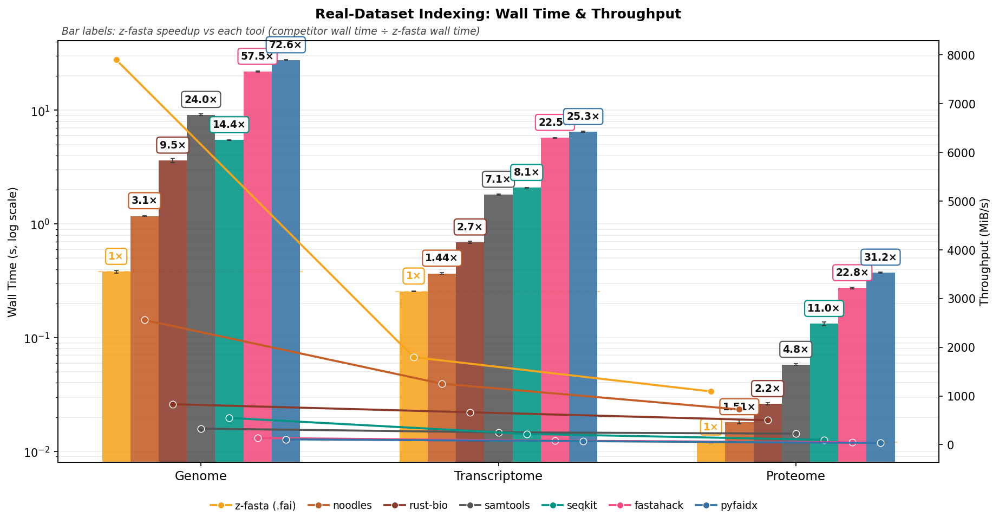

**Reading Figure 1**
- **Bars (left):** zebrac mean wall time. Error bars are one standard deviation.
- **Lines and markers (right):** input MiB/s for the same tool at each dataset.
- **Legend order:** z-fasta, noodles, rust-bio, samtools, seqkit, fastahack, pyfaidx.
- **Bar labels:** `1×` on z-fasta (baseline); competitor labels = z-fasta speedup (competitor time ÷ z-fasta time). Border color matches the tool. Dashed gold line = z-fasta wall time for that dataset. Details in Table 3.
- **z-fasta only:** this section uses the peer-comparable `.fai` lane; full I/O × format × dedup tradeoffs are in **z-fasta Mode Comparison** (before Edge Case Correctness).

## Memory Usage: Real Datasets

Same zebrac runs as **Performance: Real Datasets**. z-fasta (.fai) only; modes are in **z-fasta Mode Comparison**.

### Peak RSS

zebrac starts a new process for each sample and records peak RSS when it exits. That is the most RAM the process had in use at once (Linux `ru_maxrss` via `getrusage`). Table and figure show the mean across samples.

Use this to compare tools on the same file and host. mmap the whole FASTA and RSS often tracks file size on disk (grey dashed line on the figure). A low bar does not always mean less work: stream parsers can stay small here and show up instead under page faults.

**Table 4:** Peak RSS (MB, zebrac mean). Same tool order as Performance.

| dataset       | z-fasta (.fai)   | noodles   | rust-bio   | samtools   | seqkit    | fastahack   | pyfaidx   |
|:--------------|:-----------------|:----------|:-----------|:-----------|:----------|:------------|:----------|
| Genome        | 3005.86 MB       | 3.41 MB   | 3.38 MB    | 3.39 MB    | 193.34 MB | 3.36 MB     | 499.83 MB |
| Transcriptome | 569.43 MB        | 46.85 MB  | 3.37 MB    | 60.27 MB   | 131.26 MB | 269.63 MB   | 175.56 MB |
| Proteome      | 17.28 MB         | 3.64 MB   | 3.39 MB    | 5.27 MB    | 21.16 MB  | 15.16 MB    | 27.09 MB  |

<strong>Table 5:</strong> z-fasta vs each competitor. RSS × = competitor peak RSS / z-fasta peak RSS. Same ratios as bar labels on Figure 2.

| Dataset       | z-fasta vs   | z-fasta    | Competitor   | RSS ×   |
|:--------------|:-------------|:-----------|:-------------|:--------|
| Genome        | noodles      | 3005.86 MB | 3.41 MB      | 0.0011× |
| Genome        | rust-bio     | 3005.86 MB | 3.38 MB      | 0.0011× |
| Genome        | samtools     | 3005.86 MB | 3.39 MB      | 0.0011× |
| Genome        | seqkit       | 3005.86 MB | 193.34 MB    | 0.064×  |
| Genome        | fastahack    | 3005.86 MB | 3.36 MB      | 0.0011× |
| Genome        | pyfaidx      | 3005.86 MB | 499.83 MB    | 0.17×   |
| Transcriptome | noodles      | 569.43 MB  | 46.85 MB     | 0.082×  |
| Transcriptome | rust-bio     | 569.43 MB  | 3.37 MB      | 0.0059× |
| Transcriptome | samtools     | 569.43 MB  | 60.27 MB     | 0.11×   |
| Transcriptome | seqkit       | 569.43 MB  | 131.26 MB    | 0.23×   |
| Transcriptome | fastahack    | 569.43 MB  | 269.63 MB    | 0.47×   |
| Transcriptome | pyfaidx      | 569.43 MB  | 175.56 MB    | 0.31×   |
| Proteome      | noodles      | 17.28 MB   | 3.64 MB      | 0.21×   |
| Proteome      | rust-bio     | 17.28 MB   | 3.39 MB      | 0.20×   |
| Proteome      | samtools     | 17.28 MB   | 5.27 MB      | 0.30×   |
| Proteome      | seqkit       | 17.28 MB   | 21.16 MB     | 1.22×   |
| Proteome      | fastahack    | 17.28 MB   | 15.16 MB     | 0.88×   |
| Proteome      | pyfaidx      | 17.28 MB   | 27.09 MB     | 1.57×   |

**Figure 2:** Table 4 as grouped bars (log scale). Bar labels = RSS × (see Table 5). Gold dashed line = z-fasta RSS; grey dashed = FASTA file size on disk.

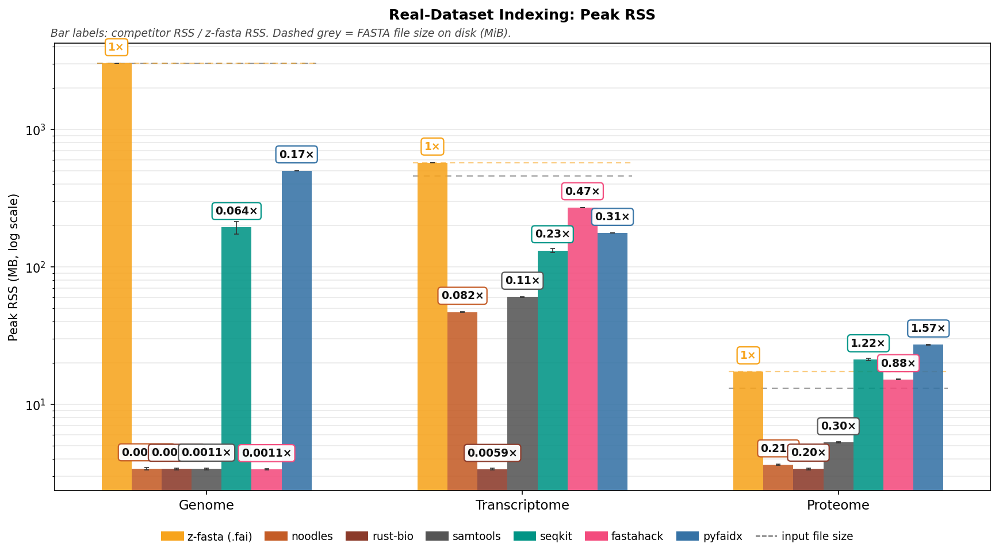

**Reading Figure 2**
- Bars: mean peak RSS. `1×` on z-fasta; other labels = competitor / z-fasta.
- Gold dashed line: z-fasta RSS for that dataset.
- Grey dashed line: file size from `input_bytes`.
- Details in Table 5.

## Page Faults: Real Datasets

Same zebrac samples again. Full counter dump is in **Zebrac Counters** below.

### Page faults

A **minor** fault maps a page without reading disk. A **major** fault reads from disk. zebrac reports both per run, like wall time. Table 8 lists major faults separately.

**Table 6:** Minor page faults (zebrac mean). Same tool order as Performance.

| dataset       | z-fasta (.fai)   | noodles   |   rust-bio | samtools   | seqkit   | fastahack   | pyfaidx   |
|:--------------|:-----------------|:----------|-----------:|:-----------|:---------|:------------|:----------|
| Genome        | 24,473           | 354       |        378 | 428        | 623,806  | 488         | 2,291,740 |
| Transcriptome | 32,329           | 11,856    |        355 | 15,157     | 33,186   | 75,970      | 46,620    |
| Proteome      | 1,496            | 800       |        352 | 1,014      | 4,394    | 4,228       | 5,873     |

<strong>Table 7:</strong> z-fasta vs each competitor. Faults × = competitor minor faults / z-fasta minor faults. Same ratios as bar labels on Figure 3.

| Dataset       | z-fasta vs   | z-fasta   | Competitor   | Faults ×   |
|:--------------|:-------------|:----------|:-------------|:-----------|
| Genome        | noodles      | 24,473    | 354          | 0.014×     |
| Genome        | rust-bio     | 24,473    | 378          | 0.015×     |
| Genome        | samtools     | 24,473    | 428          | 0.017×     |
| Genome        | seqkit       | 24,473    | 623,806      | 25.5×      |
| Genome        | fastahack    | 24,473    | 488          | 0.020×     |
| Genome        | pyfaidx      | 24,473    | 2,291,740    | 93.6×      |
| Transcriptome | noodles      | 32,329    | 11,856       | 0.37×      |
| Transcriptome | rust-bio     | 32,329    | 355          | 0.011×     |
| Transcriptome | samtools     | 32,329    | 15,157       | 0.47×      |
| Transcriptome | seqkit       | 32,329    | 33,186       | 1.03×      |
| Transcriptome | fastahack    | 32,329    | 75,970       | 2.3×       |
| Transcriptome | pyfaidx      | 32,329    | 46,620       | 1.44×      |
| Proteome      | noodles      | 1,496     | 800          | 0.53×      |
| Proteome      | rust-bio     | 1,496     | 352          | 0.24×      |
| Proteome      | samtools     | 1,496     | 1,014        | 0.68×      |
| Proteome      | seqkit       | 1,496     | 4,394        | 2.9×       |
| Proteome      | fastahack    | 1,496     | 4,228        | 2.8×       |
| Proteome      | pyfaidx      | 1,496     | 5,873        | 3.9×       |

<strong>Table 8:</strong> Major page faults.

| dataset       |   z-fasta (.fai) |   noodles |   rust-bio |   samtools |   seqkit |   fastahack |   pyfaidx |
|:--------------|-----------------:|----------:|-----------:|-----------:|---------:|------------:|----------:|
| Genome        |                0 |         0 |          0 |          0 |        0 |           0 |         0 |
| Transcriptome |                0 |         0 |          0 |          0 |        0 |           0 |         0 |
| Proteome      |                0 |         0 |          0 |          0 |        0 |           0 |         0 |

**Figure 3:** Table 6 as grouped bars (log scale). Bar labels = Faults × (see Table 7). Gold dashed line = z-fasta minor faults.

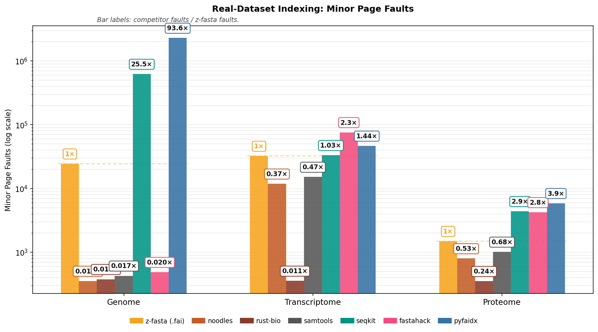

**Reading Figure 3**
- Bars: mean minor faults. `1×` on z-fasta; other labels = competitor / z-fasta.
- Gold dashed line: z-fasta count for that dataset.
- Lower bar = fewer minor faults.
- Details in Table 7.

## Zebrac Counters: Real Datasets

Same zebrac samples as **Performance: Real Datasets**. z-fasta (.fai) only; modes are in **z-fasta Mode Comparison**.

### CPU work per MiB

**Instructions per MiB** is retired CPU instructions divided by input size in MiB (zebrac counters and metadata `input_bytes`). **Lower is better**: less work to index the same file.

IPC and cache metrics are in Table 11 (collapsed). They help profiling but measure per-cycle or cache behavior, not total work per byte.

**Table 9:** Instructions per MiB (zebrac mean). Same tool order as Performance. Lower = less CPU work.

| dataset       | z-fasta (.fai)   | noodles   | rust-bio   | samtools   | seqkit   | fastahack   | pyfaidx   |
|:--------------|:-----------------|:----------|:-----------|:-----------|:---------|:------------|:----------|
| Genome        | 1.55M            | 9.53M     | 36.02M     | 98.30M     | 33.23M   | 266.42M     | 210.45M   |
| Transcriptome | 6.44M            | 16.17M    | 41.01M     | 109.50M    | 54.12M   | 323.31M     | 341.55M   |
| Proteome      | 13.46M           | 23.79M    | 44.26M     | 113.56M    | 93.84M   | 455.93M     | 620.48M   |

<strong>Table 10:</strong> z-fasta vs each competitor. Work × = competitor instructions/MiB ÷ z-fasta instructions/MiB. Same ratios as bar labels on Figure 4.

| Dataset       | z-fasta vs   | z-fasta   | Competitor   | Work ×   |
|:--------------|:-------------|:----------|:-------------|:---------|
| Genome        | noodles      | 1.55M     | 9.53M        | 6.1×     |
| Genome        | rust-bio     | 1.55M     | 36.02M       | 23.2×    |
| Genome        | samtools     | 1.55M     | 98.30M       | 63.3×    |
| Genome        | seqkit       | 1.55M     | 33.23M       | 21.4×    |
| Genome        | fastahack    | 1.55M     | 266.42M      | 171×     |
| Genome        | pyfaidx      | 1.55M     | 210.45M      | 135×     |
| Transcriptome | noodles      | 6.44M     | 16.17M       | 2.5×     |
| Transcriptome | rust-bio     | 6.44M     | 41.01M       | 6.4×     |
| Transcriptome | samtools     | 6.44M     | 109.50M      | 17.0×    |
| Transcriptome | seqkit       | 6.44M     | 54.12M       | 8.4×     |
| Transcriptome | fastahack    | 6.44M     | 323.31M      | 50.2×    |
| Transcriptome | pyfaidx      | 6.44M     | 341.55M      | 53.0×    |
| Proteome      | noodles      | 13.46M    | 23.79M       | 1.77×    |
| Proteome      | rust-bio     | 13.46M    | 44.26M       | 3.3×     |
| Proteome      | samtools     | 13.46M    | 113.56M      | 8.4×     |
| Proteome      | seqkit       | 13.46M    | 93.84M       | 7.0×     |
| Proteome      | fastahack    | 13.46M    | 455.93M      | 33.9×    |
| Proteome      | pyfaidx      | 13.46M    | 620.48M      | 46.1×    |

<strong>Table 11:</strong> Other derived metrics: IPC (instructions / CPU cycles), cache miss rate (cache misses / cache references), branch miss rate (branch misses / instructions). Profiling detail only.

| Dataset       | Tool           |   IPC | Cache miss %   | Branch miss / instr %   |
|:--------------|:---------------|------:|:---------------|:------------------------|
| Genome        | z-fasta (.fai) | 1.373 | 1.205%         | 0.003%                  |
| Genome        | noodles        | 3.426 | 11.241%        | 0.094%                  |
| Genome        | rust-bio       | 3.062 | 3.181%         | 0.038%                  |
| Genome        | samtools       | 3.061 | 1.815%         | 0.053%                  |
| Genome        | seqkit         | 1.959 | 6.587%         | 0.060%                  |
| Genome        | fastahack      | 3.392 | 5.420%         | 0.021%                  |
| Genome        | pyfaidx        | 2.669 | 1.541%         | 0.048%                  |
| Transcriptome | z-fasta (.fai) | 1.505 | 14.349%        | 0.278%                  |
| Transcriptome | noodles        | 3.104 | 2.757%         | 0.130%                  |
| Transcriptome | rust-bio       | 3.004 | 3.999%         | 0.054%                  |
| Transcriptome | samtools       | 2.775 | 19.940%        | 0.065%                  |
| Transcriptome | seqkit         | 1.55  | 8.853%         | 0.122%                  |
| Transcriptome | fastahack      | 2.795 | 13.717%        | 0.045%                  |
| Transcriptome | pyfaidx        | 2.362 | 3.939%         | 0.089%                  |
| Proteome      | z-fasta (.fai) | 2.438 | 14.875%        | 0.350%                  |
| Proteome      | noodles        | 2.681 | 7.739%         | 0.172%                  |
| Proteome      | rust-bio       | 2.7   | 10.924%        | 0.120%                  |
| Proteome      | samtools       | 2.794 | 22.199%        | 0.084%                  |
| Proteome      | seqkit         | 1.556 | 8.205%         | 0.216%                  |
| Proteome      | fastahack      | 2.641 | 12.119%        | 0.091%                  |
| Proteome      | pyfaidx        | 2.163 | 5.498%         | 0.187%                  |

<strong>Table 12:</strong> Full zebrac counter dump (all tools, including z-fasta modes).

| Dataset       | Tool                                |   Peak RSS (MB) | Minor Faults   |   Major Faults | CPU Cycles      | Instructions    | Cache References   | Cache Misses   | Branch Misses   |
|:--------------|:------------------------------------|----------------:|:---------------|---------------:|:----------------|:----------------|:-------------------|:---------------|:----------------|
| Genome        | z-fasta (.fai)                      |         3005.86 | 24,473         |              0 | 3,399,488,406   | 4,668,836,484   | 588,175,546        | 7,084,831      | 132,060         |
| Genome        | z-fasta (.fai) --no-dedup           |         3005.91 | 24,467         |              0 | 3,368,335,449   | 4,668,624,764   | 588,133,443        | 7,071,834      | 129,660         |
| Genome        | z-fasta (.fai) --low-mem            |            3.33 | 801            |              0 | 6,707,178,784   | 26,840,430,615  | 301,282,604        | 5,097,502      | 227,527         |
| Genome        | z-fasta (.fai) --low-mem --no-dedup |            3.35 | 688            |              0 | 6,776,892,496   | 26,839,879,062  | 301,298,787        | 5,099,895      | 219,348         |
| Genome        | z-fasta (.zfi)                      |         3005.91 | 24,479         |              0 | 3,304,391,369   | 4,668,636,963   | 588,142,501        | 7,003,311      | 131,315         |
| Genome        | z-fasta (.zfi) --no-dedup           |         3005.91 | 24,473         |              0 | 3,291,630,870   | 4,668,426,221   | 588,139,573        | 7,061,596      | 129,384         |
| Genome        | z-fasta (.zfi) --low-mem            |            3.38 | 761            |              0 | 6,711,007,901   | 26,685,396,757  | 302,194,179        | 5,443,435      | 258,133         |
| Genome        | z-fasta (.zfi) --low-mem --no-dedup |            3.42 | 686            |              0 | 6,727,692,690   | 26,684,954,630  | 301,541,038        | 5,349,711      | 241,527         |
| Genome        | samtools                            |            3.39 | 428            |              0 | 96,511,104,874  | 295,447,150,927 | 223,230,202        | 4,050,842      | 156,326,779     |
| Genome        | seqkit                              |          193.34 | 623,806        |              0 | 50,994,255,055  | 99,882,658,340  | 1,920,150,614      | 126,478,561    | 60,051,367      |
| Genome        | fastahack                           |            3.36 | 488            |              0 | 236,059,161,365 | 800,704,323,756 | 101,368,622        | 5,494,189      | 164,959,235     |
| Genome        | pyfaidx                             |          499.83 | 2,291,740      |              0 | 236,983,601,411 | 632,498,869,358 | 3,760,799,103      | 57,948,798     | 302,614,869     |
| Genome        | noodles                             |            3.41 | 354            |              0 | 8,360,024,958   | 28,643,228,311  | 12,704,240         | 1,428,077      | 26,948,067      |
| Genome        | rust-bio                            |            3.38 | 378            |              0 | 35,345,874,101  | 108,242,373,903 | 68,721,860         | 2,185,997      | 41,654,290      |
| Transcriptome | z-fasta (.fai)                      |          569.43 | 32,329         |              0 | 1,963,106,630   | 2,954,845,694   | 83,016,868         | 11,912,373     | 8,204,518       |
| Transcriptome | z-fasta (.fai) --no-dedup           |          529.98 | 22,233         |              0 | 946,048,773     | 2,370,501,219   | 55,054,186         | 1,113,233      | 5,622,462       |
| Transcriptome | z-fasta (.fai) --low-mem            |           37.85 | 12,073         |              0 | 2,936,294,751   | 7,737,551,304   | 84,432,521         | 12,514,569     | 5,213,686       |
| Transcriptome | z-fasta (.fai) --low-mem --no-dedup |            3.44 | 742            |              0 | 2,140,754,175   | 7,091,109,816   | 56,817,935         | 1,886,273      | 2,785,438       |
| Transcriptome | z-fasta (.zfi)                      |          609.53 | 42,590         |              0 | 1,970,679,181   | 2,564,276,270   | 88,627,647         | 12,794,090     | 7,885,659       |
| Transcriptome | z-fasta (.zfi) --no-dedup           |          592.53 | 38,236         |              0 | 983,934,237     | 1,991,741,383   | 64,538,371         | 1,973,735      | 5,322,152       |
| Transcriptome | z-fasta (.zfi) --low-mem            |           43.42 | 12,507         |              0 | 2,855,756,461   | 7,346,965,406   | 73,885,322         | 10,949,754     | 4,838,502       |
| Transcriptome | z-fasta (.zfi) --low-mem --no-dedup |           38.98 | 10,269         |              0 | 2,149,293,793   | 6,814,501,493   | 52,397,599         | 1,422,150      | 2,526,084       |
| Transcriptome | samtools                            |           60.27 | 15,157         |              0 | 18,103,007,747  | 50,227,270,362  | 101,024,556        | 20,144,677     | 32,607,080      |
| Transcriptome | seqkit                              |          131.26 | 33,186         |              0 | 16,020,013,347  | 24,826,421,322  | 976,795,820        | 86,472,773     | 30,189,232      |
| Transcriptome | fastahack                           |          269.63 | 75,970         |              0 | 53,050,193,016  | 148,301,023,066 | 1,157,625,545      | 158,793,706    | 66,714,203      |
| Transcriptome | pyfaidx                             |          175.56 | 46,620         |              0 | 66,334,277,418  | 156,669,543,742 | 6,438,082,160      | 253,592,624    | 139,189,352     |
| Transcriptome | noodles                             |           46.85 | 11,856         |              0 | 2,389,863,756   | 7,419,131,815   | 36,483,649         | 1,005,775      | 9,639,271       |
| Transcriptome | rust-bio                            |            3.37 | 355            |              0 | 6,261,828,187   | 18,810,999,842  | 35,855,981         | 1,433,836      | 10,073,215      |
| Proteome      | z-fasta (.fai)                      |           17.28 | 1,496          |              0 | 72,326,184      | 176,303,632     | 2,726,510          | 405,565        | 616,220         |
| Proteome      | z-fasta (.fai) --no-dedup           |           15.28 | 1,005          |              0 | 57,936,099      | 148,852,220     | 1,863,453          | 130,905        | 473,127         |
| Proteome      | z-fasta (.fai) --low-mem            |            3.34 | 988            |              0 | 116,901,666     | 299,185,975     | 2,475,604          | 349,537        | 343,779         |
| Proteome      | z-fasta (.fai) --low-mem --no-dedup |            3.41 | 742            |              0 | 102,640,537     | 280,447,502     | 1,861,498          | 147,296        | 297,384         |
| Proteome      | z-fasta (.zfi)                      |           18.78 | 1,867          |              0 | 68,005,169      | 145,557,937     | 2,974,805          | 413,019        | 603,333         |
| Proteome      | z-fasta (.zfi) --no-dedup           |           17.53 | 1,592          |              0 | 51,043,924      | 118,590,980     | 2,240,795          | 155,779        | 453,233         |
| Proteome      | z-fasta (.zfi) --low-mem            |            3.37 | 1,064          |              0 | 98,579,956      | 270,797,162     | 2,197,112          | 265,236        | 331,804         |
| Proteome      | z-fasta (.zfi) --low-mem --no-dedup |            3.38 | 989            |              0 | 94,046,065      | 261,027,267     | 1,867,332          | 144,265        | 290,626         |
| Proteome      | samtools                            |            5.27 | 1,014          |              0 | 532,233,010     | 1,487,205,334   | 4,504,929          | 1,000,071      | 1,245,776       |
| Proteome      | seqkit                              |           21.16 | 4,394          |              0 | 789,743,861     | 1,228,938,749   | 60,881,517         | 4,995,116      | 2,650,278       |
| Proteome      | fastahack                           |           15.16 | 4,228          |              0 | 2,261,063,534   | 5,970,747,598   | 75,300,894         | 9,125,664      | 5,423,428       |
| Proteome      | pyfaidx                             |           27.09 | 5,873          |              0 | 3,756,365,020   | 8,125,619,701   | 513,039,001        | 28,208,908     | 15,193,002      |
| Proteome      | noodles                             |            3.64 | 800            |              0 | 116,209,952     | 311,597,395     | 1,827,279          | 141,417        | 535,867         |
| Proteome      | rust-bio                            |            3.39 | 352            |              0 | 214,672,799     | 579,609,322     | 1,340,483          | 146,434        | 698,351         |

**Figure 4:** Table 9 as grouped bars (log scale). Bar labels = Work × (see Table 10). Gold dashed line = z-fasta instructions/MiB.

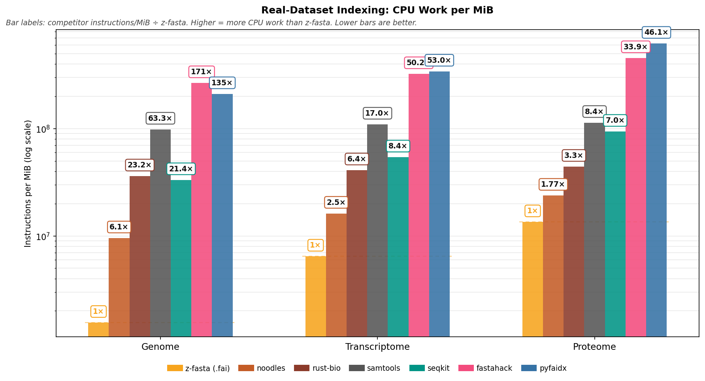

**Reading Figure 4**
- Bars: mean instructions per MiB (log scale). Lower bar = less CPU work.
- `1×` on z-fasta; other labels = competitor work / z-fasta work (Work ×; see Table 10).
- Gold dashed line: z-fasta value for that dataset.
- Details in Table 10.

## Scaling: File Size

Synthetic FASTA files from 1 MB to 1 GB (one sequence per file). Same zebrac warm-cache setup as **Performance: Real Datasets**. z-fasta (.fai) only; other modes are in **z-fasta Mode Comparison**.

### Wall time vs file size

Mean wall time (seconds, zebrac) at each file size. **Lower is better.** Sequence count stays near constant while total bytes on disk grow.

<strong>Table 13:</strong> Wall time per file size (zebrac mean, seconds). Same tool order as Performance.

| File Size   |   z-fasta (.fai) |   noodles |   rust-bio |   samtools |   seqkit |   fastahack |   pyfaidx |
|:------------|-----------------:|----------:|-----------:|-----------:|---------:|------------:|----------:|
| 1 MB        |           0.0033 |    0.0033 |     0.0038 |     0.0079 |   0.0208 |      0.0123 |    0.0737 |
| 5 MB        |           0.0033 |    0.0047 |     0.0077 |     0.0201 |   0.0264 |      0.0428 |    0.0958 |
| 10 MB       |           0.0041 |    0.0063 |     0.0124 |     0.0360 |   0.0351 |      0.0795 |    0.1257 |
| 25 MB       |           0.0060 |    0.0120 |     0.0267 |     0.0820 |   0.0570 |      0.1885 |    0.2372 |
| 50 MB       |           0.0083 |    0.0200 |     0.0491 |     0.1618 |   0.0927 |      0.3676 |    0.4102 |
| 100 MB      |           0.0144 |    0.0370 |     0.0984 |     0.3135 |   0.1665 |      0.7433 |    0.7516 |
| 250 MB      |           0.0278 |    0.0883 |     0.2413 |     0.7741 |   0.4256 |      1.8172 |    1.8224 |
| 500 MB      |           0.0551 |    0.1718 |     0.4787 |     1.5139 |   0.8510 |      3.6150 |    3.6223 |
| 1000 MB     |           0.1160 |    0.3351 |     0.9254 |     3.0265 |   1.6676 |      7.2416 |    7.3019 |

<strong>Table 14:</strong> z-fasta vs each competitor at each file size. Time × = competitor wall time / z-fasta wall time.

| File Size   | z-fasta vs   | z-fasta   | Competitor   | Time ×   |
|:------------|:-------------|:----------|:-------------|:---------|
| 1 MB        | noodles      | 0.0033s   | 0.0033s      | 1.02×    |
| 1 MB        | rust-bio     | 0.0033s   | 0.0038s      | 1.17×    |
| 1 MB        | samtools     | 0.0033s   | 0.0079s      | 2.4×     |
| 1 MB        | seqkit       | 0.0033s   | 0.0208s      | 6.4×     |
| 1 MB        | fastahack    | 0.0033s   | 0.0123s      | 3.8×     |
| 1 MB        | pyfaidx      | 0.0033s   | 0.0737s      | 22.6×    |
| 5 MB        | noodles      | 0.0033s   | 0.0047s      | 1.41×    |
| 5 MB        | rust-bio     | 0.0033s   | 0.0077s      | 2.3×     |
| 5 MB        | samtools     | 0.0033s   | 0.0201s      | 6.0×     |
| 5 MB        | seqkit       | 0.0033s   | 0.0264s      | 7.9×     |
| 5 MB        | fastahack    | 0.0033s   | 0.0428s      | 12.8×    |
| 5 MB        | pyfaidx      | 0.0033s   | 0.0958s      | 28.7×    |
| 10 MB       | noodles      | 0.0041s   | 0.0063s      | 1.55×    |
| 10 MB       | rust-bio     | 0.0041s   | 0.0124s      | 3.1×     |
| 10 MB       | samtools     | 0.0041s   | 0.0360s      | 8.8×     |
| 10 MB       | seqkit       | 0.0041s   | 0.0351s      | 8.6×     |
| 10 MB       | fastahack    | 0.0041s   | 0.0795s      | 19.5×    |
| 10 MB       | pyfaidx      | 0.0041s   | 0.1257s      | 30.9×    |
| 25 MB       | noodles      | 0.0060s   | 0.0120s      | 1.99×    |
| 25 MB       | rust-bio     | 0.0060s   | 0.0267s      | 4.4×     |
| 25 MB       | samtools     | 0.0060s   | 0.0820s      | 13.6×    |
| 25 MB       | seqkit       | 0.0060s   | 0.0570s      | 9.4×     |
| 25 MB       | fastahack    | 0.0060s   | 0.1885s      | 31.2×    |
| 25 MB       | pyfaidx      | 0.0060s   | 0.2372s      | 39.3×    |
| 50 MB       | noodles      | 0.0083s   | 0.0200s      | 2.4×     |
| 50 MB       | rust-bio     | 0.0083s   | 0.0491s      | 5.9×     |
| 50 MB       | samtools     | 0.0083s   | 0.1618s      | 19.5×    |
| 50 MB       | seqkit       | 0.0083s   | 0.0927s      | 11.2×    |
| 50 MB       | fastahack    | 0.0083s   | 0.3676s      | 44.3×    |
| 50 MB       | pyfaidx      | 0.0083s   | 0.4102s      | 49.4×    |
| 100 MB      | noodles      | 0.0144s   | 0.0370s      | 2.6×     |
| 100 MB      | rust-bio     | 0.0144s   | 0.0984s      | 6.8×     |
| 100 MB      | samtools     | 0.0144s   | 0.3135s      | 21.8×    |
| 100 MB      | seqkit       | 0.0144s   | 0.1665s      | 11.6×    |
| 100 MB      | fastahack    | 0.0144s   | 0.7433s      | 51.7×    |
| 100 MB      | pyfaidx      | 0.0144s   | 0.7516s      | 52.2×    |
| 250 MB      | noodles      | 0.0278s   | 0.0883s      | 3.2×     |
| 250 MB      | rust-bio     | 0.0278s   | 0.2413s      | 8.7×     |
| 250 MB      | samtools     | 0.0278s   | 0.7741s      | 27.9×    |
| 250 MB      | seqkit       | 0.0278s   | 0.4256s      | 15.3×    |
| 250 MB      | fastahack    | 0.0278s   | 1.8172s      | 65.5×    |
| 250 MB      | pyfaidx      | 0.0278s   | 1.8224s      | 65.6×    |
| 500 MB      | noodles      | 0.0551s   | 0.1718s      | 3.1×     |
| 500 MB      | rust-bio     | 0.0551s   | 0.4787s      | 8.7×     |
| 500 MB      | samtools     | 0.0551s   | 1.5139s      | 27.5×    |
| 500 MB      | seqkit       | 0.0551s   | 0.8510s      | 15.4×    |
| 500 MB      | fastahack    | 0.0551s   | 3.6150s      | 65.6×    |
| 500 MB      | pyfaidx      | 0.0551s   | 3.6223s      | 65.8×    |
| 1000 MB     | noodles      | 0.1160s   | 0.3351s      | 2.9×     |
| 1000 MB     | rust-bio     | 0.1160s   | 0.9254s      | 8.0×     |
| 1000 MB     | samtools     | 0.1160s   | 3.0265s      | 26.1×    |
| 1000 MB     | seqkit       | 0.1160s   | 1.6676s      | 14.4×    |
| 1000 MB     | fastahack    | 0.1160s   | 7.2416s      | 62.4×    |
| 1000 MB     | pyfaidx      | 0.1160s   | 7.3019s      | 63.0×    |

**Figure 5:** Table 13 as lines (log scales on both axes). One line per tool; absolute wall times only.

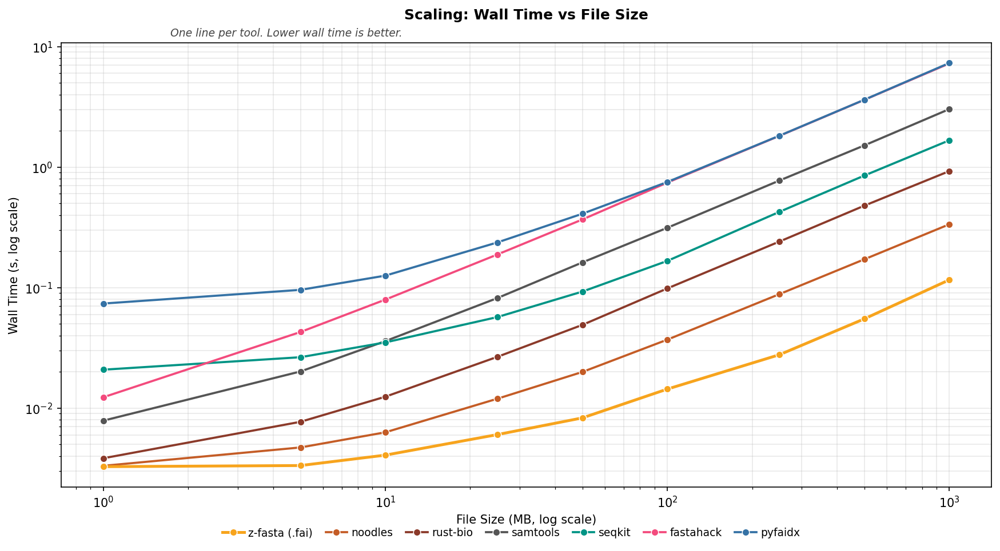

**Reading Figure 5**
- Lines: mean wall time vs file size (MB). Both axes use log scale.
- Lower on the chart = faster at that file size.
- Legend colors match **Performance: Real Datasets**.
- Time × ratios are in Table 14; the chart does not show them.

## Scaling: Sequence Count (Bounded Bytes)

Synthetic FASTA holding about **50 MiB** total per file; sequence length shrinks as record count rises. Same zebrac warm-cache setup as **Performance: Real Datasets**. z-fasta (.fai) only; other modes are in **z-fasta Mode Comparison**.

### Wall time vs sequence count (bounded bytes)

Mean wall time (seconds, zebrac) at each record count. **Lower is better.** Isolates per-record and header overhead at near-constant file size.

<strong>Table 15:</strong> Wall time per record count (zebrac mean, seconds). Same tool order as Performance.

| Sequences   |   z-fasta (.fai) |   noodles |   rust-bio |   samtools |   seqkit |   fastahack |   pyfaidx |
|:------------|-----------------:|----------:|-----------:|-----------:|---------:|------------:|----------:|
| 1,000       |           0.0085 |    0.0204 |     0.0512 |     0.1622 |   0.0990 |      0.3743 |    0.3837 |
| 10,000      |           0.0105 |    0.0236 |     0.0556 |     0.1665 |   0.1501 |      0.4292 |    0.4695 |
| 100,000     |           0.0335 |    0.0569 |     0.0810 |     0.2186 |   0.5064 |      0.9003 |    1.3447 |
| 250,000     |           0.1006 |    0.1074 |     0.1221 |     0.2952 |   1.1207 |      1.7114 |    2.7722 |

<strong>Table 16:</strong> z-fasta vs each competitor at each record count. Time × = competitor wall time / z-fasta wall time.

| Sequences   | z-fasta vs   | z-fasta   | Competitor   | Time ×   |
|:------------|:-------------|:----------|:-------------|:---------|
| 1,000       | noodles      | 0.0085s   | 0.0204s      | 2.4×     |
| 1,000       | rust-bio     | 0.0085s   | 0.0512s      | 6.0×     |
| 1,000       | samtools     | 0.0085s   | 0.1622s      | 19.0×    |
| 1,000       | seqkit       | 0.0085s   | 0.0990s      | 11.6×    |
| 1,000       | fastahack    | 0.0085s   | 0.3743s      | 43.9×    |
| 1,000       | pyfaidx      | 0.0085s   | 0.3837s      | 45.0×    |
| 10,000      | noodles      | 0.0105s   | 0.0236s      | 2.2×     |
| 10,000      | rust-bio     | 0.0105s   | 0.0556s      | 5.3×     |
| 10,000      | samtools     | 0.0105s   | 0.1665s      | 15.8×    |
| 10,000      | seqkit       | 0.0105s   | 0.1501s      | 14.3×    |
| 10,000      | fastahack    | 0.0105s   | 0.4292s      | 40.8×    |
| 10,000      | pyfaidx      | 0.0105s   | 0.4695s      | 44.6×    |
| 100,000     | noodles      | 0.0335s   | 0.0569s      | 1.70×    |
| 100,000     | rust-bio     | 0.0335s   | 0.0810s      | 2.4×     |
| 100,000     | samtools     | 0.0335s   | 0.2186s      | 6.5×     |
| 100,000     | seqkit       | 0.0335s   | 0.5064s      | 15.1×    |
| 100,000     | fastahack    | 0.0335s   | 0.9003s      | 26.9×    |
| 100,000     | pyfaidx      | 0.0335s   | 1.3447s      | 40.2×    |
| 250,000     | noodles      | 0.1006s   | 0.1074s      | 1.07×    |
| 250,000     | rust-bio     | 0.1006s   | 0.1221s      | 1.21×    |
| 250,000     | samtools     | 0.1006s   | 0.2952s      | 2.9×     |
| 250,000     | seqkit       | 0.1006s   | 1.1207s      | 11.1×    |
| 250,000     | fastahack    | 0.1006s   | 1.7114s      | 17.0×    |
| 250,000     | pyfaidx      | 0.1006s   | 2.7722s      | 27.5×    |

**Figure 6:** Table 15 as lines (log scales on both axes). One line per tool; absolute wall times only.

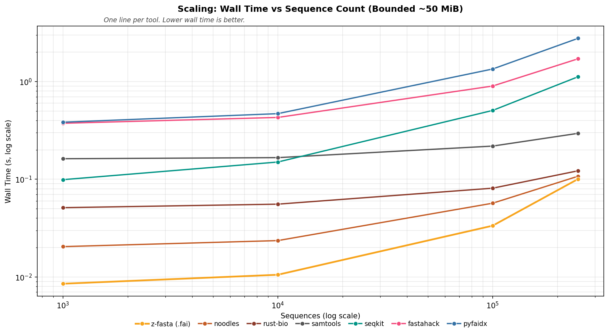

**Reading Figure 6**
- Lines: mean wall time vs sequence count. Both axes use log scale.
- Lower on the chart = faster at that record count.
- Legend colors match **Performance: Real Datasets**.
- Time × ratios are in Table 16; the chart does not show them.

## Scaling: Sequence Count (Fixed Length)

Synthetic FASTA with **1024 bp** per sequence; total file size grows with record count (100k to 1M). Same zebrac warm-cache setup as **Performance: Real Datasets**. z-fasta (.fai) only; other modes are in **z-fasta Mode Comparison**.

### Wall time vs sequence count (fixed length)

Mean wall time (seconds, zebrac) at each record count. **Lower is better.** Bytes and index entries grow together; the 1M point is about 1 GiB on disk.

<strong>Table 17:</strong> Wall time per record count (zebrac mean, seconds). Same tool order as Performance.

| Sequences   |   z-fasta (.fai) |   noodles |   rust-bio |   samtools |   seqkit |   fastahack |   pyfaidx |
|:------------|-----------------:|----------:|-----------:|-----------:|---------:|------------:|----------:|
| 100,000     |           0.0411 |    0.0725 |     0.1247 |     0.3697 |   0.6132 |      1.2559 |    1.6732 |
| 250,000     |           0.1261 |    0.1757 |     0.3098 |     0.9095 |   1.5417 |      3.1384 |    4.2059 |
| 500,000     |           0.2483 |    0.3477 |     0.6148 |     1.8154 |   3.0878 |      6.2294 |    8.5330 |
| 1,000,000   |           0.5167 |    0.6884 |     1.2169 |     3.6593 |   6.1421 |     12.5313 |   17.4532 |

<strong>Table 18:</strong> z-fasta vs each competitor at each record count. Time × = competitor wall time / z-fasta wall time.

| Sequences   | z-fasta vs   | z-fasta   | Competitor   | Time ×   |
|:------------|:-------------|:----------|:-------------|:---------|
| 100,000     | noodles      | 0.0411s   | 0.0725s      | 1.76×    |
| 100,000     | rust-bio     | 0.0411s   | 0.1247s      | 3.0×     |
| 100,000     | samtools     | 0.0411s   | 0.3697s      | 9.0×     |
| 100,000     | seqkit       | 0.0411s   | 0.6132s      | 14.9×    |
| 100,000     | fastahack    | 0.0411s   | 1.2559s      | 30.5×    |
| 100,000     | pyfaidx      | 0.0411s   | 1.6732s      | 40.7×    |
| 250,000     | noodles      | 0.1261s   | 0.1757s      | 1.39×    |
| 250,000     | rust-bio     | 0.1261s   | 0.3098s      | 2.5×     |
| 250,000     | samtools     | 0.1261s   | 0.9095s      | 7.2×     |
| 250,000     | seqkit       | 0.1261s   | 1.5417s      | 12.2×    |
| 250,000     | fastahack    | 0.1261s   | 3.1384s      | 24.9×    |
| 250,000     | pyfaidx      | 0.1261s   | 4.2059s      | 33.4×    |
| 500,000     | noodles      | 0.2483s   | 0.3477s      | 1.40×    |
| 500,000     | rust-bio     | 0.2483s   | 0.6148s      | 2.5×     |
| 500,000     | samtools     | 0.2483s   | 1.8154s      | 7.3×     |
| 500,000     | seqkit       | 0.2483s   | 3.0878s      | 12.4×    |
| 500,000     | fastahack    | 0.2483s   | 6.2294s      | 25.1×    |
| 500,000     | pyfaidx      | 0.2483s   | 8.5330s      | 34.4×    |
| 1,000,000   | noodles      | 0.5167s   | 0.6884s      | 1.33×    |
| 1,000,000   | rust-bio     | 0.5167s   | 1.2169s      | 2.4×     |
| 1,000,000   | samtools     | 0.5167s   | 3.6593s      | 7.1×     |
| 1,000,000   | seqkit       | 0.5167s   | 6.1421s      | 11.9×    |
| 1,000,000   | fastahack    | 0.5167s   | 12.5313s     | 24.3×    |
| 1,000,000   | pyfaidx      | 0.5167s   | 17.4532s     | 33.8×    |

**Figure 7:** Table 17 as lines (log scales on both axes). One line per tool; absolute wall times only.

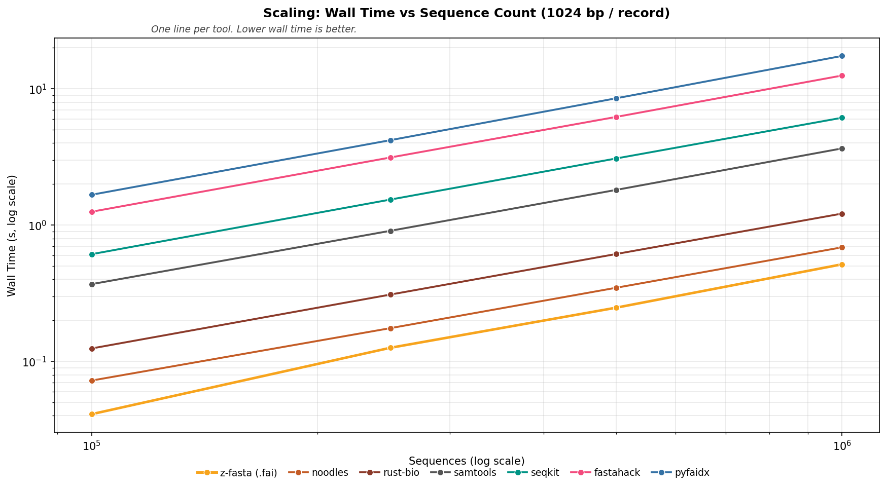

**Reading Figure 7**
- Lines: mean wall time vs sequence count. Both axes use log scale.
- Lower on the chart = faster at that record count.
- Legend colors match **Performance: Real Datasets**.
- Time × ratios are in Table 18; the chart does not show them.

## z-fasta Mode Comparison

Compares every published z-fasta index lane on the same human reference files as **Performance: Real Datasets**, with **noodles** and **samtools** as references. Axes: **I/O** (mmap vs `--low-mem`), **output** (`.fai` via `--emit-fai` vs `.zfi` via default `index`), **dedup** (on vs `--no-dedup`). Eight z-fasta commands; labels use `z-fasta (.fai)` / `z-fasta (.zfi)` plus `--low-mem` / `--no-dedup` (never `--emit-fai` in the short name). Time × / RSS × baseline is **`z-fasta (.fai)`** (peer-comparable lane).

### Wall time and throughput

Mean zebrac wall time per dataset. **Lower is better.** Tool order follows Mode Comparison columns (eight z-fasta lanes, then noodles, samtools). Bar labels and Time × use each value divided by `z-fasta (.fai)` (values below `1×` are faster than that baseline).

**Table 19:** Wall time (seconds, mean ± stddev). Same tool order as the mode figures.

| dataset       | z-fasta (.fai)   | z-fasta (.fai) --no-dedup   | z-fasta (.fai) --low-mem   | z-fasta (.fai) --low-mem --no-dedup   | z-fasta (.zfi)   | z-fasta (.zfi) --no-dedup   | z-fasta (.zfi) --low-mem   | z-fasta (.zfi) --low-mem --no-dedup   | noodles         | samtools        |
|:--------------|:-----------------|:----------------------------|:---------------------------|:--------------------------------------|:-----------------|:----------------------------|:---------------------------|:--------------------------------------|:----------------|:----------------|
| Genome        | 0.3805s ±0.0104  | 0.3742s ±0.0086             | 0.8359s ±0.0080            | 0.8424s ±0.0150                       | 0.3705s ±0.0055  | 0.3737s ±0.0130             | 0.8324s ±0.0060            | 0.8524s ±0.0256                       | 1.1748s ±0.0090 | 9.1403s ±0.1554 |
| Transcriptome | 0.2555s ±0.0014  | 0.1387s ±0.0038             | 0.3554s ±0.0055            | 0.2539s ±0.0038                       | 0.2901s ±0.0028  | 0.1923s ±0.0007             | 0.3415s ±0.0027            | 0.2733s ±0.0016                       | 0.3668s ±0.0069 | 1.8136s ±0.0106 |
| Proteome      | 0.0120s ±0.0001  | 0.0096s ±0.0002             | 0.0165s ±0.0005            | 0.0144s ±0.0002                       | 0.0130s ±0.0002  | 0.0108s ±0.0002             | 0.0150s ±0.0003            | 0.0144s ±0.0003                       | 0.0181s ±0.0007 | 0.0579s ±0.0008 |

<strong>Table 20:</strong> Input throughput (MiB/s) from metadata <code>input_bytes</code> and wall time. Higher is better. Same tools and order as Table 19.

| dataset       | z-fasta (.fai)   | z-fasta (.fai) --no-dedup   | z-fasta (.fai) --low-mem   | z-fasta (.fai) --low-mem --no-dedup   | z-fasta (.zfi)   | z-fasta (.zfi) --no-dedup   | z-fasta (.zfi) --low-mem   | z-fasta (.zfi) --low-mem --no-dedup   | noodles      | samtools    |
|:--------------|:-----------------|:----------------------------|:---------------------------|:--------------------------------------|:-----------------|:----------------------------|:---------------------------|:--------------------------------------|:-------------|:------------|
| Genome        | 7899.5 MiB/s     | 8032.2 MiB/s                | 3595.5 MiB/s               | 3567.7 MiB/s                          | 8112.8 MiB/s     | 8041.6 MiB/s                | 3610.7 MiB/s               | 3526.0 MiB/s                          | 2558.2 MiB/s | 328.8 MiB/s |
| Transcriptome | 1795.5 MiB/s     | 3306.5 MiB/s                | 1290.5 MiB/s               | 1806.9 MiB/s                          | 1581.0 MiB/s     | 2385.4 MiB/s                | 1343.2 MiB/s               | 1678.5 MiB/s                          | 1250.5 MiB/s | 252.9 MiB/s |
| Proteome      | 1091.4 MiB/s     | 1359.3 MiB/s                | 792.4 MiB/s                | 907.8 MiB/s                           | 1010.8 MiB/s     | 1210.8 MiB/s                | 875.3 MiB/s                | 908.7 MiB/s                           | 723.0 MiB/s  | 226.3 MiB/s |

<strong>Table 21:</strong> Each configuration vs `z-fasta (.fai)`. Time × = other wall time ÷ baseline wall time. Throughput × = baseline MiB/s ÷ other MiB/s. Same ratios as bar labels on Figure 8.

| Dataset       | vs z-fasta (.fai)                   | z-fasta (.fai)   | Other   | Time ×   |   (.fai) MiB/s |   Other MiB/s | Throughput ×   |
|:--------------|:------------------------------------|:-----------------|:--------|:---------|---------------:|--------------:|:---------------|
| Genome        | z-fasta (.fai) --no-dedup           | 0.3805s          | 0.3742s | 0.98×    |         7899.5 |        8032.2 | 0.98×          |
| Genome        | z-fasta (.fai) --low-mem            | 0.3805s          | 0.8359s | 2.2×     |         7899.5 |        3595.5 | 2.20×          |
| Genome        | z-fasta (.fai) --low-mem --no-dedup | 0.3805s          | 0.8424s | 2.2×     |         7899.5 |        3567.7 | 2.21×          |
| Genome        | z-fasta (.zfi)                      | 0.3805s          | 0.3705s | 0.97×    |         7899.5 |        8112.8 | 0.97×          |
| Genome        | z-fasta (.zfi) --no-dedup           | 0.3805s          | 0.3737s | 0.98×    |         7899.5 |        8041.6 | 0.98×          |
| Genome        | z-fasta (.zfi) --low-mem            | 0.3805s          | 0.8324s | 2.2×     |         7899.5 |        3610.7 | 2.19×          |
| Genome        | z-fasta (.zfi) --low-mem --no-dedup | 0.3805s          | 0.8524s | 2.2×     |         7899.5 |        3526   | 2.24×          |
| Genome        | noodles                             | 0.3805s          | 1.1748s | 3.1×     |         7899.5 |        2558.2 | 3.09×          |
| Genome        | samtools                            | 0.3805s          | 9.1403s | 24.0×    |         7899.5 |         328.8 | 24.02×         |
| Transcriptome | z-fasta (.fai) --no-dedup           | 0.2555s          | 0.1387s | 0.54×    |         1795.5 |        3306.5 | 0.54×          |
| Transcriptome | z-fasta (.fai) --low-mem            | 0.2555s          | 0.3554s | 1.39×    |         1795.5 |        1290.5 | 1.39×          |
| Transcriptome | z-fasta (.fai) --low-mem --no-dedup | 0.2555s          | 0.2539s | 0.99×    |         1795.5 |        1806.9 | 0.99×          |
| Transcriptome | z-fasta (.zfi)                      | 0.2555s          | 0.2901s | 1.14×    |         1795.5 |        1581   | 1.14×          |
| Transcriptome | z-fasta (.zfi) --no-dedup           | 0.2555s          | 0.1923s | 0.75×    |         1795.5 |        2385.4 | 0.75×          |
| Transcriptome | z-fasta (.zfi) --low-mem            | 0.2555s          | 0.3415s | 1.34×    |         1795.5 |        1343.2 | 1.34×          |
| Transcriptome | z-fasta (.zfi) --low-mem --no-dedup | 0.2555s          | 0.2733s | 1.07×    |         1795.5 |        1678.5 | 1.07×          |
| Transcriptome | noodles                             | 0.2555s          | 0.3668s | 1.44×    |         1795.5 |        1250.5 | 1.44×          |
| Transcriptome | samtools                            | 0.2555s          | 1.8136s | 7.1×     |         1795.5 |         252.9 | 7.10×          |
| Proteome      | z-fasta (.fai) --no-dedup           | 0.0120s          | 0.0096s | 0.80×    |         1091.4 |        1359.3 | 0.80×          |
| Proteome      | z-fasta (.fai) --low-mem            | 0.0120s          | 0.0165s | 1.38×    |         1091.4 |         792.4 | 1.38×          |
| Proteome      | z-fasta (.fai) --low-mem --no-dedup | 0.0120s          | 0.0144s | 1.20×    |         1091.4 |         907.8 | 1.20×          |
| Proteome      | z-fasta (.zfi)                      | 0.0120s          | 0.0130s | 1.08×    |         1091.4 |        1010.8 | 1.08×          |
| Proteome      | z-fasta (.zfi) --no-dedup           | 0.0120s          | 0.0108s | 0.90×    |         1091.4 |        1210.8 | 0.90×          |
| Proteome      | z-fasta (.zfi) --low-mem            | 0.0120s          | 0.0150s | 1.25×    |         1091.4 |         875.3 | 1.25×          |
| Proteome      | z-fasta (.zfi) --low-mem --no-dedup | 0.0120s          | 0.0144s | 1.20×    |         1091.4 |         908.7 | 1.20×          |
| Proteome      | noodles                             | 0.0120s          | 0.0181s | 1.51×    |         1091.4 |         723   | 1.51×          |
| Proteome      | samtools                            | 0.0120s          | 0.0579s | 4.8×     |         1091.4 |         226.3 | 4.82×          |

**Figure 8:** Dual-axis chart for Table 19 and Table 20. Bars show wall time (left axis, log scale). Lines show throughput (right axis). Bar labels show Time × vs `z-fasta (.fai)` (see Table 21); gold dashed line = baseline wall time per dataset.

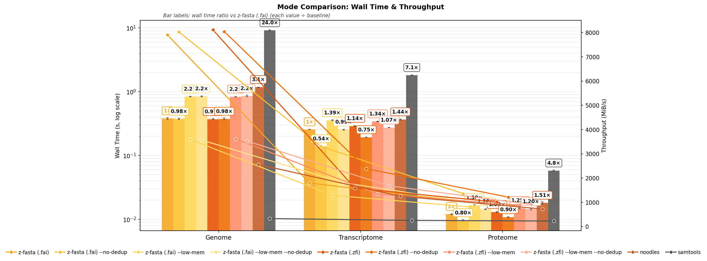

**Reading Figure 8**
- **Bars (left):** zebrac mean wall time. Error bars are one standard deviation.
- **Lines and markers (right):** input MiB/s for the same tool at each dataset.
- **Legend:** eight z-fasta lanes (`(.fai)` / `(.zfi)` × mmap / `--low-mem` × dedup / `--no-dedup`), then noodles, samtools.
- **Bar labels:** `1×` on `z-fasta (.fai)`; other labels = Time × (other ÷ baseline).
- Details in Table 21.

### Peak RSS

zebrac peak RSS when the indexer process exits (`ru_maxrss`). **Lower is better** for the same file. Grey dashed lines on the figure mark FASTA size on disk. `--low-mem` lanes stream the FASTA; mmap lanes hold the file mapping.

**Table 22:** Peak RSS (MB, zebrac mean). Same tool order as Table 19.

| dataset       | z-fasta (.fai)   | z-fasta (.fai) --no-dedup   | z-fasta (.fai) --low-mem   | z-fasta (.fai) --low-mem --no-dedup   | z-fasta (.zfi)   | z-fasta (.zfi) --no-dedup   | z-fasta (.zfi) --low-mem   | z-fasta (.zfi) --low-mem --no-dedup   | noodles   | samtools   |
|:--------------|:-----------------|:----------------------------|:---------------------------|:--------------------------------------|:-----------------|:----------------------------|:---------------------------|:--------------------------------------|:----------|:-----------|
| Genome        | 3005.86 MB       | 3005.91 MB                  | 3.33 MB                    | 3.35 MB                               | 3005.91 MB       | 3005.91 MB                  | 3.38 MB                    | 3.42 MB                               | 3.41 MB   | 3.39 MB    |
| Transcriptome | 569.43 MB        | 529.98 MB                   | 37.85 MB                   | 3.44 MB                               | 609.53 MB        | 592.53 MB                   | 43.42 MB                   | 38.98 MB                              | 46.85 MB  | 60.27 MB   |
| Proteome      | 17.28 MB         | 15.28 MB                    | 3.34 MB                    | 3.41 MB                               | 18.78 MB         | 17.53 MB                    | 3.37 MB                    | 3.38 MB                               | 3.64 MB   | 5.27 MB    |

<strong>Table 23:</strong> Each configuration vs `z-fasta (.fai)`. RSS × = other peak RSS ÷ baseline peak RSS. Same ratios as bar labels on Figure 9.

| Dataset       | vs z-fasta (.fai)                   | z-fasta (.fai)   | Other      | RSS ×   |
|:--------------|:------------------------------------|:-----------------|:-----------|:--------|
| Genome        | z-fasta (.fai) --no-dedup           | 3005.86 MB       | 3005.91 MB | 1.00×   |
| Genome        | z-fasta (.fai) --low-mem            | 3005.86 MB       | 3.33 MB    | 0.0011× |
| Genome        | z-fasta (.fai) --low-mem --no-dedup | 3005.86 MB       | 3.35 MB    | 0.0011× |
| Genome        | z-fasta (.zfi)                      | 3005.86 MB       | 3005.91 MB | 1.00×   |
| Genome        | z-fasta (.zfi) --no-dedup           | 3005.86 MB       | 3005.91 MB | 1.00×   |
| Genome        | z-fasta (.zfi) --low-mem            | 3005.86 MB       | 3.38 MB    | 0.0011× |
| Genome        | z-fasta (.zfi) --low-mem --no-dedup | 3005.86 MB       | 3.42 MB    | 0.0011× |
| Genome        | noodles                             | 3005.86 MB       | 3.41 MB    | 0.0011× |
| Genome        | samtools                            | 3005.86 MB       | 3.39 MB    | 0.0011× |
| Transcriptome | z-fasta (.fai) --no-dedup           | 569.43 MB        | 529.98 MB  | 0.93×   |
| Transcriptome | z-fasta (.fai) --low-mem            | 569.43 MB        | 37.85 MB   | 0.066×  |
| Transcriptome | z-fasta (.fai) --low-mem --no-dedup | 569.43 MB        | 3.44 MB    | 0.0060× |
| Transcriptome | z-fasta (.zfi)                      | 569.43 MB        | 609.53 MB  | 1.07×   |
| Transcriptome | z-fasta (.zfi) --no-dedup           | 569.43 MB        | 592.53 MB  | 1.04×   |
| Transcriptome | z-fasta (.zfi) --low-mem            | 569.43 MB        | 43.42 MB   | 0.076×  |
| Transcriptome | z-fasta (.zfi) --low-mem --no-dedup | 569.43 MB        | 38.98 MB   | 0.068×  |
| Transcriptome | noodles                             | 569.43 MB        | 46.85 MB   | 0.082×  |
| Transcriptome | samtools                            | 569.43 MB        | 60.27 MB   | 0.11×   |
| Proteome      | z-fasta (.fai) --no-dedup           | 17.28 MB         | 15.28 MB   | 0.88×   |
| Proteome      | z-fasta (.fai) --low-mem            | 17.28 MB         | 3.34 MB    | 0.19×   |
| Proteome      | z-fasta (.fai) --low-mem --no-dedup | 17.28 MB         | 3.41 MB    | 0.20×   |
| Proteome      | z-fasta (.zfi)                      | 17.28 MB         | 18.78 MB   | 1.09×   |
| Proteome      | z-fasta (.zfi) --no-dedup           | 17.28 MB         | 17.53 MB   | 1.01×   |
| Proteome      | z-fasta (.zfi) --low-mem            | 17.28 MB         | 3.37 MB    | 0.19×   |
| Proteome      | z-fasta (.zfi) --low-mem --no-dedup | 17.28 MB         | 3.38 MB    | 0.20×   |
| Proteome      | noodles                             | 17.28 MB         | 3.64 MB    | 0.21×   |
| Proteome      | samtools                            | 17.28 MB         | 5.27 MB    | 0.30×   |

**Figure 9:** Table 22 as grouped bars (log scale). Bar labels = RSS × (see Table 23). Gold dashed line = `z-fasta (.fai)` RSS; grey dashed = FASTA file size on disk.

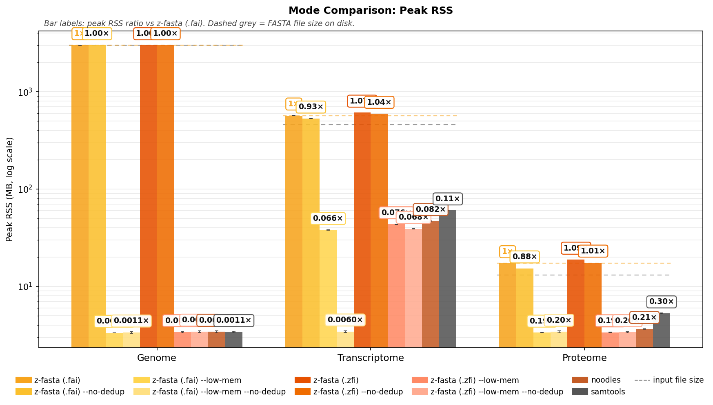

**Reading Figure 9**
- **Legend:** same eight z-fasta lanes plus noodles and samtools as Figure 8.
- Bars: mean peak RSS. `1×` on `z-fasta (.fai)`; other labels = other ÷ baseline.
- Gold dashed line: baseline RSS for that dataset.
- Grey dashed line: file size from `input_bytes`.
- Details in Table 23.

### Time vs memory tradeoff

Each panel is one real dataset. Facet titles show on-disk size and record count from **Data used**. One point per tool; both axes use log scale. **Lower-left** is faster with less RAM; **upper-right** is slower with more RAM.

**Figure 10:** Scatter of wall time (y) vs peak RSS (x) for Mode Comparison tools. Shared legend sits below the Transcriptome panel.

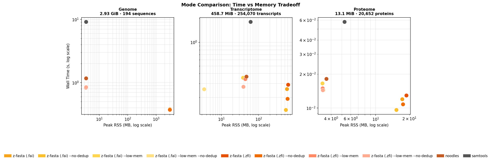

**Reading Figure 10**
- One facet per dataset (Genome, Transcriptome, Proteome).
- Facet title: dataset name, file size, and entry count when available.
- Colors match Figure 8: gold family = `.fai` lanes; orange family = `.zfi` lanes; bronze = noodles; grey = samtools.
- Legend is shared under the middle facet.

## z-fasta Production Index (.zfi)

Cross-tool **Performance** tables use **`z-fasta (.fai)`** so competitors that write text `.fai` stay format-fair. CLI default `index` writes binary `.zfi`. Build wall time and RSS for every I/O × format × dedup lane are in **z-fasta Mode Comparison**; this section is about the on-disk artifact.

### On-disk size

Each uniform entry is a fixed 40-byte `IndexRecord` (`src/index_format.zig`). FAI lines grow with sequence name length plus five tab-separated numeric fields. Non-uniform (messy) records add side-table bytes on top of the 40-byte header. On **Transcriptome** (254,070 entries), `.zfi` is 37.5 MiB vs `.fai` 32.9 MiB (FAI / ZFI = 0.88x; about 155 B per record vs 136 B per FAI line). Long GENCODE names favor the binary layout. On **Genome** (194 sequences), short chromosome names make `.fai` smaller (FAI / ZFI = 0.67x; ~33 B per FAI line vs ~49 B per record). Fixed 40-byte records carry overhead when names are only a few characters.

**Table 24:** Index file size on the three real datasets (`bench/shared/data/`). FAI / ZFI above 1.0 means the text `.fai` is larger.

| Dataset | Records | `.zfi` | `.fai` | FAI / ZFI | ZFI B/rec | FAI B/line |
| --- | --- | --- | --- | --- | --- | --- |
| Genome | 194 | 9,529 B | 6,406 B | 0.67x | 49 | 33 |
| Transcriptome | 254,070 | 37.5 MiB | 32.9 MiB | 0.88x | 155 | 136 |
| Proteome | 20,652 | 1.2 MiB | 829,743 B | 0.66x | 61 | 40 |

### Load path

`loadIndex` opens `.zfi` first, then falls back to `.fai`. For `.zfi`, the record array is a zero-copy view of mmap'd index bytes, and `lookup_full_map` builds a pointer hash over the embedded name blob. For `.fai`, the loader mmaps the text index, parses lines into a record array, and points `name_offset` / `name_len` into the mmap'd `.fai` (`tryLoadFai` in `index_format.zig`). `.zfi` entries store `name_offset` / `name_len` into the mmap'd FASTA as well. `stats --index-only` and small `get` batches can load either format in `.records_only` mode and skip the name hash; `.fai` stats scans use `.stats_scan` (on-demand name reads).

### Messy FASTA

FAI assumes one `line_bases` / `line_bytes` pair per record. z-fasta indexes irregular wrap, trailing whitespace, blank lines, and mixed CRLF/LF using per-record side tables (see **Messy FASTA Compatibility**). Emit `.fai` only with `index --emit-fai` when every record is FAI-representable; otherwise use default `.zfi`. Load still falls back to an existing `.fai` for samtools-compatible text indexes.

### Integrity

`.zfi` stores `source_size` and, on current writers, a `ZFID` embedded FASTA mtime. Load rejects size or embedded-mtime mismatch. Legacy `.zfi` without `ZFID` keeps the weaker index-file mtime check. `.fai` identity remains mtime-only (no embedded source fields).

## Edge Case Correctness

Structural edge-case fixtures from `bench/index/run.sh` (edge_cases/). Each row in the heatmap is one test file. The z-fasta columns separate the samtools-compatible FAI attempt from the production `.zfi` index. The **Contract** column marks whether z-fasta met that test's rules.

**Contract meaning:** for structural cases, `z-fasta (.fai)` must agree with samtools on FAI acceptance and bytes when both accept. If one accepts and the other rejects, the contract is `N`. For the four named messy fixtures, the `.zfi` side-table path is the contract because samtools cannot represent those layouts; the FAI rejection pair plus valid `.zfi` side table is `Y`.

**Scoring rules:**

- *Samtools parity* cases: when both z-fasta and samtools accept a file, their `.fai` output must match. When both reject it, that also counts as a match. A production `.zfi` success does not hide an FAI exit-code mismatch.

- *z-fasta-only* messy cases: z-fasta must index files where samtools rejects non-uniform wrapping (side-table `.zfi`).

**Table 25:** Comparability summary by contract class. Raw exit codes are diagnostic; `Matches` applies the class-specific comparison rule.

| Contract basis       |   Cases | Matches   | Comparison                                                 |
|:---------------------|--------:|:----------|:-----------------------------------------------------------|
| FAI parity           |      20 | 20/20     | z-fasta (.fai) vs samtools acceptance and FAI bytes        |
| ZFI messy support    |       4 | 4/4       | z-fasta (.zfi) side table; FAI peers expected incompatible |
| Invalid input review |       1 | 0/1       | raw behavior shown; no parity claim for binary input       |

**Figure 11:** Raw per-test exit codes and the composite contract result. Green = exit 0; red = non-zero exit; gray = tool not run; orange = contract mismatch.

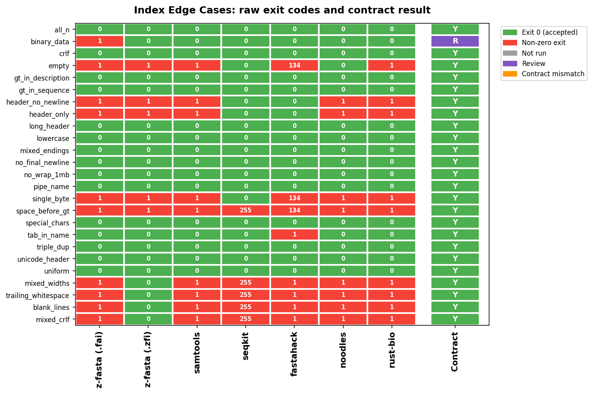

**Reading Figure 11**
- Rows: test case names from `bench/index/run.sh` edge_cases/.
- Tool columns show the numeric exit code; `n/a` means the optional tool was not run.
- **Contract:** `Y` = MATCH, `N` = mismatch vs test rules.
- Green / red / gray / orange cells match the legend on the chart.
- Aggregate counts are in Table 25.

## Messy FASTA Compatibility

Proteome-derived fixtures in `bench/shared/cache/messy_perf/`. Each cell is zebrac with `--allow-failures` (repeated samples, not a single exit check).

**z-fasta lane:** This table must use `z-fasta (.zfi)` via default `index`. The `.fai` lane is not the messy compatibility claim; variable widths, trailing whitespace, and mixed line endings require the production `.zfi` side table.

**What z-fasta handles:** irregular line wrapping, trailing whitespace on sequence lines, blank lines between records, and mixed CRLF/LF. Those are common export glitches, not arbitrary byte corruption. z-fasta records true sequence boundaries in a side-table `.zfi` instead of assuming every line in a record has the same width.

**What we still reject:** empty files, headers without sequence, malformed headers, and other cases where indexing would be meaningless (see **Edge Case Correctness** above). We do not claim to repair truncated or binary-corrupted FASTA.

`mixed_crlf` deliberately alternates LF and CRLF sequence-line endings. It is not a uniformly CRLF-wrapped control file.

**Table 26:** Indexing success per variant and tool from the messy benchmark CSV. The z-fasta `.zfi` lane is `ok` only when every sample exits 0. FAI peers are `not compatible` for these variable-width, whitespace, and mixed-ending layouts; an exit 0 alone does not prove that their index reproduces the sequence correctly.

| Variant             | z-fasta (.zfi)   | samtools       | noodles        | rust-bio       | fastahack      | pyfaidx        | seqkit         |
|:--------------------|:-----------------|:---------------|:---------------|:---------------|:---------------|:---------------|:---------------|
| all_messy           | ok               | not compatible | not compatible | not compatible | not compatible | not compatible | not compatible |
| mixed_crlf          | ok               | not compatible | not compatible | not compatible | not compatible | not compatible | not compatible |
| mixed_widths        | ok               | not compatible | not compatible | not compatible | not compatible | not compatible | not compatible |
| trailing_whitespace | ok               | not compatible | not compatible | not compatible | not compatible | not compatible | not compatible |

**Reading Table 26**
- Rows: messy variant names (`all_messy`, `mixed_crlf`, `mixed_widths`, `trailing_whitespace`).
- Columns: production `z-fasta (.zfi)` followed by FAI peers.
- `not compatible` is a layout contract result, not a raw process exit code.
- Refresh with `bash bench/index/run.sh` (messy zebrac section).

## Tools Tested

- **z-fasta (.fai) (z-fasta 0.3.0):** `index --emit-fai` (mmap, dedup). Peer-comparable lane for cross-tool tables and scaling.
- **z-fasta (.fai) --no-dedup:** `index --emit-fai --no-dedup`.
- **z-fasta (.fai) --low-mem:** `index --low-mem --emit-fai` (streaming read).
- **z-fasta (.fai) --low-mem --no-dedup:** `index --low-mem --emit-fai --no-dedup`.
- **z-fasta (.zfi):** `index` (mmap, dedup). CLI default; writes `.zfi` on disk.
- **z-fasta (.zfi) --no-dedup:** `index --no-dedup`.
- **z-fasta (.zfi) --low-mem:** `index --low-mem` (streaming read, `.zfi` out).
- **z-fasta (.zfi) --low-mem --no-dedup:** `index --low-mem --no-dedup`.
- **samtools (samtools 1.13):** `samtools faidx`, industry reference.
- **seqkit (seqkit v2.13.0):** `seqkit faidx`, Go toolkit.
- **fastahack (fastahack 1.0.0 (directory pin)):** `fastahack -i`, indexes on first access.
- **pyfaidx (0.9.0.3):** `faidx --no-output`, Python wrapper.
- **noodles (noodles-fasta 0.61 (wrapper)):** `tools/noodles_wrapper index`, Tier 2 noodles-fasta wrapper.
- **rust-bio (rust-bio 2.2 (custom indexer wrapper)):** `tools/rustbio_wrapper index`. Custom CLI because rust-bio has no standalone index command. Strict FAI rules aligned with noodles and samtools.
