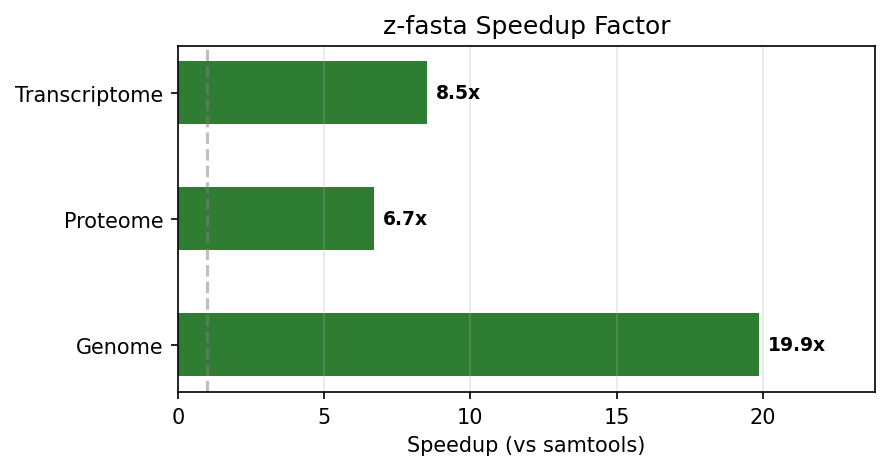

# z-fasta Benchmark Report

_Auto-generated by `generate_report.py`_

## Performance: Real Datasets

| dataset       | z-fasta-default | z-fasta-nodedup | z-fasta-lowmem  | samtools        | seqkit          | fastahack        | pyfaidx          |
| :------------ | :-------------- | :-------------- | :-------------- | :-------------- | :-------------- | :--------------- | :--------------- |
| Genome        | 0.4538s ±0.0104 | 0.4458s ±0.0022 | 2.3612s ±0.0261 | 9.0160s ±0.0278 | 5.2279s ±0.0334 | 21.7862s ±0.1160 | 27.0358s ±0.1728 |
| Proteome      | 0.0080s ±0.0003 | 0.0063s ±0.0006 | 0.0177s ±0.0001 | 0.0538s ±0.0004 | 0.1092s ±0.0002 | 0.2533s ±0.0014  | 0.3597s ±0.0021  |
| Transcriptome | 0.2097s ±0.0040 | 0.1079s ±0.0003 | 0.4923s ±0.0068 | 1.7858s ±0.0146 | 1.8039s ±0.0163 | 5.5990s ±0.0336  | 6.3608s ±0.0400  |

### Speedup vs samtools

| Dataset       | z-fasta-default vs samtools | z-fasta-nodedup vs samtools | z-fasta-lowmem vs samtools |
| :------------ | :-------------------------- | :-------------------------- | :------------------------- |
| Genome        | **19.9x**                   | **20.2x**                   | **3.8x**                   |
| Proteome      | **6.7x**                    | **8.6x**                    | **3.0x**                   |
| Transcriptome | **8.5x**                    | **16.5x**                   | **3.6x**                   |

## Memory Usage

| Tool            | Time (s) | MaxRSS (KB) | MaxRSS (MB) | Major Faults | Minor Faults |
| :-------------- | -------: | ----------: | ----------: | -----------: | -----------: |
| z-fasta-default |     0.44 |   3,077,688 |     3005.55 |            0 |       48,337 |
| z-fasta-nodedup |     0.45 |   3,077,688 |     3005.55 |            0 |       48,326 |
| z-fasta-lowmem  |     2.38 |       4,096 |        4.00 |            0 |        1,269 |
| samtools        |     9.02 |       3,468 |        3.39 |            0 |          312 |
| seqkit          |     5.27 |     218,648 |      213.52 |            0 |      633,072 |
| fastahack       |    21.81 |       3,552 |        3.47 |            0 |          386 |
| pyfaidx         |    27.25 |     511,900 |      499.90 |            0 |    2,291,616 |

> **Note:** MaxRSS from `/usr/bin/time -v` includes mmap'd pages. For mmap-based indexers (z-fasta-default, samtools), reported RSS reflects file size, not heap allocation. Use `--low-mem` for true streaming memory.
>
> **Page faults:** Major faults = blocking disk reads (should be ~0 on warm cache). Minor faults = non-blocking page mappings. A high count for mmap tools confirms the OS is seamlessly mapping file pages to RAM without blocking I/O.

## Edge Case Correctness

**z-fasta vs samtools output match: 20 / 20**

| Test Case         | z-fasta-default | samtools | seqkit | fastahack | Match |
| :---------------- | :-------------- | :------- | :----- | :-------- | :---- |
| all_n             | ✓               | ✓        | ✓      | ✓         | MATCH |
| binary_data       | ✓               | ✓        | ✓      | ✓         | MATCH |
| crlf              | ✓               | ✓        | ✓      | ✓         | MATCH |
| empty             | ✗               | ✗        | ✓      | ✗         | MATCH |
| gt_in_description | ✓               | ✓        | ✓      | ✓         | MATCH |
| gt_in_sequence    | ✓               | ✓        | ✓      | ✓         | MATCH |
| header_no_newline | ✗               | ✗        | ✓      | ✓         | MATCH |
| header_only       | ✗               | ✗        | ✓      | ✓         | MATCH |
| long_header       | ✓               | ✓        | ✓      | ✓         | MATCH |
| lowercase         | ✓               | ✓        | ✓      | ✓         | MATCH |
| mixed_endings     | ✓               | ✓        | ✓      | ✓         | MATCH |
| no_final_newline  | ✓               | ✓        | ✓      | ✓         | MATCH |
| no_wrap_1mb       | ✓               | ✓        | ✓      | ✓         | MATCH |
| pipe_name         | ✓               | ✓        | ✓      | ✓         | MATCH |
| single_byte       | ✗               | ✗        | ✓      | ✗         | MATCH |
| space_before_gt   | ✗               | ✗        | ✗      | ✗         | MATCH |
| special_chars     | ✓               | ✓        | ✓      | ✓         | MATCH |
| tab_in_name       | ✓               | ✓        | ✓      | ✗         | MATCH |
| triple_dup        | ✓               | ✓        | ✓      | ✓         | MATCH |
| unicode_header    | ✓               | ✓        | ✓      | ✓         | MATCH |

## Messy FASTA Compatibility

Real-world FASTA files often have mixed line widths or trailing whitespace that violates the fixed-width assumption in the FAI spec. z-fasta indexes all four variants correctly. samtools, fastahack, and pyfaidx reject mixed-width and trailing-whitespace files.

| Variant             | z-fasta | samtools | fastahack | pyfaidx |
| :------------------ | :------ | :------- | :-------- | :------ |
| all_messy           | ✓       | ✗        | n/a       | ✗       |
| crlf_endings        | ✓       | ✓        | ✓         | ✓       |
| mixed_widths        | ✓       | ✗        | ✗         | ✗       |
| trailing_whitespace | ✓       | ✗        | ✗         | ✗       |

> **Legend:** ✓ = all hyperfine runs exited 0 (indexing succeeded). ✗ = all runs exited non-zero (indexing failed). n/a = tool absent in this benchmark run.
>
> **Variants:** `mixed_widths` has sequences wrapped at irregular column widths. `trailing_whitespace` has spaces at the end of each line. `crlf_endings` uses Windows CRLF line endings. `all_messy` combines all three.

## Tools Tested

| Tool            | Description                                               |
| --------------- | --------------------------------------------------------- |
| z-fasta-default | Zig FASTA indexer (mmap + dedup, default)                 |
| z-fasta-nodedup | z-fasta with `--no-dedup` (skip duplicate checking)       |
| z-fasta-lowmem  | z-fasta with `--low-mem` (streaming, no mmap)             |
| samtools        | `samtools faidx`: industry standard                       |
| seqkit          | `seqkit faidx`: Go bioinformatics toolkit                 |
| fastahack       | `fastahack -i`: C++ FASTA indexer (first-access indexing) |
| pyfaidx         | `faidx --no-output`: Python pyfaidx 0.9.0.3               |
