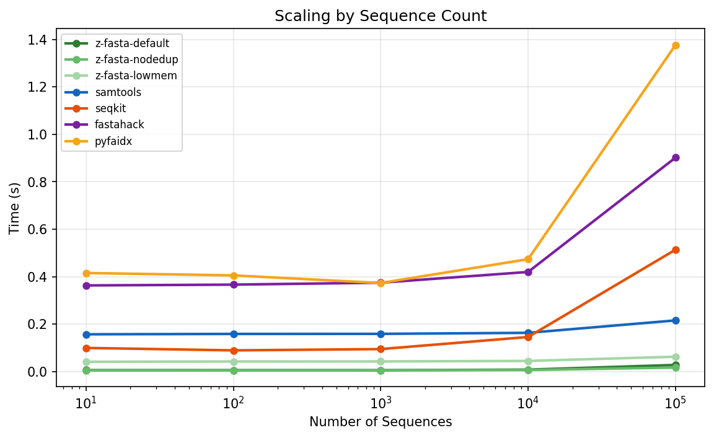

# z-fasta Benchmark Report

_Auto-generated by `generate_report.py`_

## Performance: Real Datasets

| dataset       | z-fasta-default | z-fasta-nodedup | z-fasta-lowmem  | samtools        | seqkit          | fastahack        | pyfaidx          |
| :------------ | :-------------- | :-------------- | :-------------- | :-------------- | :-------------- | :--------------- | :--------------- |
| Genome        | 0.3992s ±0.0107 | 0.3944s ±0.0046 | 2.4559s ±0.0752 | 9.0286s ±0.0249 | 5.3968s ±0.0340 | 21.7317s ±0.0912 | 27.4822s ±0.3637 |
| Proteome      | 0.0077s ±0.0002 | 0.0056s ±0.0001 | 0.0188s ±0.0003 | 0.0554s ±0.0011 | 0.1268s ±0.0031 | 0.2750s ±0.0110  | 0.3675s ±0.0045  |
| Transcriptome | 0.1960s ±0.0044 | 0.0928s ±0.0022 | 0.5362s ±0.0074 | 1.7945s ±0.0118 | 2.0842s ±0.0166 | 5.7219s ±0.0387  | 6.4964s ±0.0505  |

### Speedup vs samtools

| Dataset       | z-fasta-default vs samtools | z-fasta-nodedup vs samtools | z-fasta-lowmem vs samtools |
| :------------ | :-------------------------- | :-------------------------- | :------------------------- |
| Genome        | **22.6x**                   | **22.9x**                   | **3.7x**                   |
| Proteome      | **7.2x**                    | **10.0x**                   | **3.0x**                   |
| Transcriptome | **9.2x**                    | **19.3x**                   | **3.3x**                   |

## Scaling: File Size

| File Size | z-fasta-default | z-fasta-nodedup | z-fasta-lowmem | samtools | seqkit | fastahack | pyfaidx |
| :-------- | --------------: | --------------: | -------------: | -------: | -----: | --------: | ------: |
| 1 MB      |          0.0007 |          0.0006 |         0.0019 |   0.0057 | 0.0175 |    0.0094 |  0.0710 |
| 5 MB      |          0.0011 |          0.0009 |         0.0067 |   0.0184 | 0.0248 |    0.0399 |  0.0937 |
| 10 MB     |          0.0015 |          0.0015 |         0.0106 |   0.0332 | 0.0302 |    0.0752 |  0.1229 |
| 25 MB     |          0.0032 |          0.0033 |         0.0223 |   0.0792 | 0.0526 |    0.1842 |  0.2327 |
| 50 MB     |          0.0060 |          0.0059 |         0.0425 |   0.1590 | 0.0889 |    0.3694 |  0.4035 |
| 100 MB    |          0.0112 |          0.0113 |         0.0817 |   0.3120 | 0.1660 |    0.7359 |  0.7532 |
| 250 MB    |          0.0278 |          0.0280 |         0.2034 |   0.7624 | 0.4135 |    1.8186 |  1.8016 |
| 500 MB    |          0.0556 |          0.0560 |         0.3967 |   1.5178 | 0.8430 |    3.6259 |  3.5562 |
| 1000 MB   |          0.1176 |          0.1173 |         0.7922 |   3.0312 | 1.6413 |    7.2553 |  7.1638 |

## Scaling: Sequence Count

| Sequences | z-fasta-default | z-fasta-nodedup | z-fasta-lowmem | samtools | seqkit | fastahack | pyfaidx |
| :-------- | --------------: | --------------: | -------------: | -------: | -----: | --------: | ------: |
| 10        |          0.0062 |          0.0060 |         0.0415 |   0.1573 | 0.0999 |    0.3633 |  0.4156 |
| 100       |          0.0061 |          0.0058 |         0.0426 |   0.1589 | 0.0896 |    0.3666 |  0.4055 |
| 1,000     |          0.0060 |          0.0059 |         0.0429 |   0.1592 | 0.0950 |    0.3748 |  0.3734 |
| 10,000    |          0.0084 |          0.0069 |         0.0451 |   0.1635 | 0.1459 |    0.4200 |  0.4738 |
| 100,000   |          0.0281 |          0.0172 |         0.0628 |   0.2158 | 0.5137 |    0.9016 |  1.3763 |

## Memory Usage

| Tool            | Time (s) | MaxRSS (KB) | MaxRSS (MB) | Major Faults | Minor Faults |
| :-------------- | -------: | :---------- | ----------: | -----------: | :----------- |
| z-fasta-default |     0.38 | 3,078,148   |     3006.00 |            0 | 48,402       |
| z-fasta-nodedup |     0.38 | 3,078,148   |     3006.00 |            0 | 48,405       |
| z-fasta-lowmem  |     2.55 | 4,612       |        4.50 |            0 | 1,339        |
| samtools        |     8.98 | 3,432       |        3.35 |            0 | 315          |
| seqkit          |     5.34 | 229,224     |      223.85 |            0 | 625,537      |
| fastahack       |    21.68 | 3,416       |        3.34 |            0 | 382          |
| pyfaidx         |    26.98 | 511,896     |      499.90 |            0 | 2,291,615    |

> **Note:** MaxRSS from `/usr/bin/time -v` includes mmap'd pages. For mmap-based indexers (z-fasta-default, samtools), reported RSS reflects file size, not heap allocation. Use `--low-mem` for true streaming memory.
>
> **Page faults:** Major faults = blocking disk reads (should be ~0 on warm cache). Minor faults = non-blocking page mappings. A high count for mmap tools confirms the OS is seamlessly mapping file pages to RAM without blocking I/O.

## Edge Case Correctness

> **z-fasta vs samtools output match: 20 / 20**

| Test Case         | z-fasta-default | samtools | seqkit | fastahack | Match |
| :---------------- | :-------------- | :------- | :----- | :-------- | :---- |
| all_n             | ✓               | ✓        | ✓      | ✓         | MATCH |
| binary_data       | ✓               | ✓        | ✓      | ✓         | MATCH |
| crlf              | ✓               | ✓        | ✓      | ✓         | MATCH |
| empty             | ✗               | ✗        | ✓      | ✗         | MATCH |
| gt_in_description | ✓               | ✓        | ✓      | ✓         | MATCH |
| gt_in_sequence    | ✓               | ✓        | ✓      | ✓         | MATCH |
| header_no_newline | ✗               | ✗        | ✓      | ✓         | MATCH |
| header_only       | ✗               | ✗        | ✓      | ✓         | MATCH |
| long_header       | ✓               | ✓        | ✓      | ✓         | MATCH |
| lowercase         | ✓               | ✓        | ✓      | ✓         | MATCH |
| mixed_endings     | ✓               | ✓        | ✓      | ✓         | MATCH |
| no_final_newline  | ✓               | ✓        | ✓      | ✓         | MATCH |
| no_wrap_1mb       | ✓               | ✓        | ✓      | ✓         | MATCH |
| pipe_name         | ✓               | ✓        | ✓      | ✓         | MATCH |
| single_byte       | ✗               | ✗        | ✓      | ✗         | MATCH |
| space_before_gt   | ✗               | ✗        | ✗      | ✗         | MATCH |
| special_chars     | ✓               | ✓        | ✓      | ✓         | MATCH |
| tab_in_name       | ✓               | ✓        | ✓      | ✗         | MATCH |
| triple_dup        | ✓               | ✓        | ✓      | ✓         | MATCH |
| unicode_header    | ✓               | ✓        | ✓      | ✓         | MATCH |

## Messy FASTA Compatibility

Real-world FASTA files often have mixed line widths or trailing whitespace that violates the fixed-width assumption in the FAI spec. z-fasta indexes all four variants correctly. samtools, fastahack, and pyfaidx reject mixed-width and trailing-whitespace files.

| Variant             | z-fasta | samtools | fastahack | pyfaidx |
| :------------------ | :------ | :------- | :-------- | :------ |
| all_messy           | ✓       | ✗        | n/a       | ✗       |
| crlf_endings        | ✓       | ✓        | ✓         | ✓       |
| mixed_widths        | ✓       | ✗        | ✗         | ✗       |
| trailing_whitespace | ✓       | ✗        | ✗         | ✗       |

> **Legend:** ✓ = all hyperfine runs exited 0 (indexing succeeded). ✗ = all runs exited non-zero (indexing failed). n/a = tool absent in this benchmark run.
>
> **Variants:** `mixed_widths` has sequences wrapped at irregular column widths. `trailing_whitespace` has spaces at the end of each line. `crlf_endings` uses Windows CRLF line endings. `all_messy` combines all three.

## Tools Tested

| Tool            | Description                                               |
| --------------- | --------------------------------------------------------- |
| z-fasta-default | Zig FASTA indexer (mmap + dedup, default)                 |
| z-fasta-nodedup | z-fasta with `--no-dedup` (skip duplicate checking)       |
| z-fasta-lowmem  | z-fasta with `--low-mem` (streaming, no mmap)             |
| samtools        | `samtools faidx`: industry standard                       |
| seqkit          | `seqkit faidx`: Go bioinformatics toolkit                 |
| fastahack       | `fastahack -i`: C++ FASTA indexer (first-access indexing) |
| pyfaidx         | `faidx --no-output`: Python pyfaidx 0.9.0.3               |
