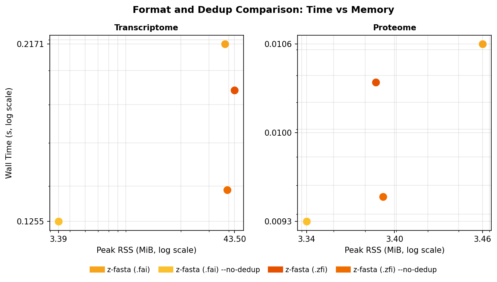

<!-- markdownlint-disable MD024 MD032 MD033 MD036 MD041 MD049 -->

# z-fasta Index Benchmark Report

_Auto-generated by `generate_report.py` from zebrac results._

## Overview

This report presents the benchmark sections captured by the selected run: correctness, real-data performance and memory, format and dedup behavior, and synthetic scaling where available.

Cross-tool tables use `z-fasta index --emit-fai` because the peer tools write samtools-compatible `.fai` indexes. The z-fasta-only comparison separately covers `.fai` and the default `.zfi`, with dedup on and off, on Transcriptome and Proteome.

The **rust-bio** label needs one clarification: rust-bio has no equivalent standalone FAI index command, so this benchmark lane uses the strict custom Rust FAI writer in the rust-bio wrapper. The label stays short in tables and figures, but the measured indexing code is custom.

Correctness covers strict FAI compatibility and z-fasta's `.zfi` support for ragged wrapping, trailing spaces, blank lines, and mixed line endings.

## Run Provenance

- **Build:** z-fasta v0.3.3; Zig 0.16.0; ReleaseFast; `x86_64-linux`.
- **Benchmark:** zebrac v0.6.2; warm cache; 5 measured samples after 3 warmups; 5000 ms budget per command.

## Datasets

- **Genome:** Homo sapiens GRCh38 primary assembly (Ensembl release 113).
- **Transcriptome:** Homo sapiens GENCODE v46 transcript sequences.
- **Proteome:** Homo sapiens UniProt reference proteome UP000005640.

## Tools Tested

- **z-fasta (v0.3.3)**
  - `.fai`, dedup: peer-comparable cross-tool and scaling lane.
  - `.fai`, no dedup: isolates duplicate-name tracking cost.
  - `.zfi`, dedup: default product mode.
  - `.zfi`, no dedup: default format without duplicate-name tracking.
- **noodles (v0.66.0)**: Rust noodles-fasta wrapper.
- **rust-bio (v4.0.1)**: Rust FASTA library.
- **samtools (v1.24)**: reference FAI indexer.
- **seqkit (v2.13.0)**: Go FASTA toolkit.
- **fastahack (v1.0.0)**: C++ FAI indexer.
- **pyfaidx (v0.9.0.4)**: Python FAI indexer.

## Edge Case Correctness

Each heatmap row is one structural FASTA edge case. The z-fasta columns separate the samtools-compatible FAI attempt from the production `.zfi` index. The **Contract** column marks whether z-fasta met that test's rules.

**Contract meaning:** for structural cases, `z-fasta (.fai)` must agree with samtools on FAI acceptance and bytes when both accept. If one accepts and the other rejects, the contract is `N`. For the four named messy fixtures, the `.zfi` side-table path is the contract because samtools cannot represent those layouts; the FAI rejection pair plus valid `.zfi` side table is `Y`.

**Scoring rules:**

- *Samtools parity* cases: when both z-fasta and samtools accept a file, their `.fai` output must match. When both reject it, that also counts as a match. A production `.zfi` success does not hide an FAI exit-code mismatch.

- *z-fasta-only* messy cases: z-fasta must index files where samtools rejects non-uniform wrapping (side-table `.zfi`).

**Table 1:** Comparability summary by contract class. Raw exit codes are diagnostic; `Result` applies the class-specific comparison rule.

| Contract basis       |   Cases | Result     | Comparison                                                 |
|:---------------------|--------:|:-----------|:-----------------------------------------------------------|
| FAI parity           |      20 | 20/20 pass | z-fasta (.fai) vs samtools acceptance and FAI bytes        |
| ZFI messy support    |       4 | 4/4 pass   | z-fasta (.zfi) side table; FAI peers expected incompatible |
| Invalid input review |       1 | 1/1 review | raw behavior shown; no parity claim for binary input       |

**Figure 1:** Raw per-test exit codes and the composite contract result. Green = exit 0; red = non-zero exit; gray = tool not run; purple = review; orange = contract mismatch.

**Reading Figure 1**
- Rows: structural FASTA edge cases.
- Tool columns show the numeric exit code; `n/a` means the optional tool was not run.
- **Contract:** `Y` = match, `R` = review, `N` = mismatch.
- Cell colors match the legend on the chart.
- Aggregate counts are in Table 1.

## Messy FASTA Compatibility

Proteome-derived messy FASTA fixtures. Each cell is zebrac with `--allow-failures` (repeated samples, not a single exit check).

**z-fasta lane:** This table must use `z-fasta (.zfi)` via default `index`. The `.fai` lane is not the messy compatibility claim; variable widths, trailing whitespace, and mixed line endings require the production `.zfi` side table.

**What z-fasta handles:** irregular line wrapping, trailing whitespace on sequence lines, blank lines between records, and mixed CRLF/LF. Those are common export glitches, not arbitrary byte corruption. z-fasta records true sequence boundaries in a side-table `.zfi` instead of assuming every line in a record has the same width.

**What we still reject:** empty files, headers without sequence, malformed headers, and other cases where indexing would be meaningless (see **Edge Case Correctness** above). We do not claim to repair truncated or binary-corrupted FASTA.

`mixed_crlf` deliberately alternates LF and CRLF sequence-line endings. It is not a uniformly CRLF-wrapped control file.

**Table 2:** Measured process result per variant and tool from the messy benchmark data. The z-fasta `.zfi` lane is `ok` only when every sample exits 0. Peer cells report only whether every measured sample exited 0; they do not claim sequence-retrieval compatibility.

| Variant             | z-fasta (.zfi)   | noodles   | rust-bio   | samtools   | seqkit   | fastahack   | pyfaidx   |
|:--------------------|:-----------------|:----------|:-----------|:-----------|:---------|:------------|:----------|
| all_messy           | ok               | nonzero   | nonzero    | nonzero    | nonzero  | nonzero     | nonzero   |
| mixed_crlf          | ok               | nonzero   | exit 0     | nonzero    | nonzero  | nonzero     | nonzero   |
| mixed_widths        | ok               | nonzero   | nonzero    | nonzero    | nonzero  | nonzero     | nonzero   |
| trailing_whitespace | ok               | nonzero   | nonzero    | nonzero    | nonzero  | nonzero     | nonzero   |

**Reading Table 2**
- Rows: messy variant names (`all_messy`, `mixed_crlf`, `mixed_widths`, `trailing_whitespace`).
- Columns: production `z-fasta (.zfi)` followed by FAI peers.
- `exit 0` and `nonzero` are measured process results, not output validation.

## Performance: Real Datasets

Headline comparison on the three human reference datasets (see **Datasets**). **z-fasta (.fai)** is `index --emit-fai` with dedup. It constructs the peer-compatible output while discarding the emitted stream; peers write sidecar files. Output destinations and duplicate-name policies therefore are not identical. The product table isolates z-fasta's dedup cost. CLI default `index` writes `.zfi`; see **z-fasta Format and Dedup Comparison**.

**Measured result:** z-fasta is faster than every reported peer on Genome, Transcriptome, and Proteome. The narrowest lead is 1.50x against noodles on Proteome.

**Table 3:** Zebrac wall time per dataset (seconds, mean ± stddev, warm cache). Lower is better. Tool order: z-fasta, noodles, rust-bio, samtools, seqkit, fastahack, pyfaidx.

| dataset       | z-fasta (.fai)   | noodles         | rust-bio        | samtools        | seqkit          | fastahack        | pyfaidx          |
|:--------------|:-----------------|:----------------|:----------------|:----------------|:----------------|:-----------------|:-----------------|
| Genome        | 0.3792s ±0.0229  | 1.1319s ±0.0429 | 3.5430s ±0.0342 | 8.0870s ±0.0145 | 5.3496s ±0.0584 | 22.0261s ±0.2338 | 27.8625s ±0.3010 |
| Transcriptome | 0.2171s ±0.0102  | 0.3373s ±0.0039 | 0.6720s ±0.0066 | 1.6615s ±0.0111 | 2.0042s ±0.0262 | 5.6302s ±0.0192  | 6.4898s ±0.0272  |
| Proteome      | 0.0106s ±0.0003  | 0.0159s ±0.0001 | 0.0245s ±0.0002 | 0.0577s ±0.0021 | 0.1259s ±0.0025 | 0.2687s ±0.0029  | 0.3710s ±0.0019  |

<strong>Table 4:</strong> Input throughput (MiB/s), calculated from input size and wall time. Higher is better. Same tools and order as Table 3.

| dataset       | z-fasta (.fai)   | noodles      | rust-bio    | samtools    | seqkit      | fastahack   | pyfaidx     |
|:--------------|:-----------------|:-------------|:------------|:------------|:------------|:------------|:------------|
| Genome        | 7925.5 MiB/s     | 2655.3 MiB/s | 848.3 MiB/s | 371.6 MiB/s | 561.8 MiB/s | 136.4 MiB/s | 107.9 MiB/s |
| Transcriptome | 2112.4 MiB/s     | 1360.0 MiB/s | 682.6 MiB/s | 276.1 MiB/s | 228.9 MiB/s | 81.5 MiB/s  | 70.7 MiB/s  |
| Proteome      | 1230.6 MiB/s     | 822.1 MiB/s  | 535.2 MiB/s | 226.8 MiB/s | 104.0 MiB/s | 48.7 MiB/s  | 35.3 MiB/s  |

<strong>Table 5:</strong> z-fasta vs each competitor. Speedup = competitor wall time / z-fasta wall time (higher = z-fasta faster). Same ratios appear as bar labels on Figure 2. Throughput ratio uses MiB/s.

| Dataset       | z-fasta vs   | z-fasta   | Competitor   | Speedup   |   z-fasta MiB/s |   Competitor MiB/s | Throughput ratio   |
|:--------------|:-------------|:----------|:-------------|:----------|----------------:|-------------------:|:-------------------|
| Genome        | noodles      | 0.3792s   | 1.1319s      | 3.0x      |          7925.5 |             2655.3 | 3.0x               |
| Genome        | rust-bio     | 0.3792s   | 3.5430s      | 9.3x      |          7925.5 |              848.3 | 9.3x               |
| Genome        | samtools     | 0.3792s   | 8.0870s      | 21.3x     |          7925.5 |              371.6 | 21.3x              |
| Genome        | seqkit       | 0.3792s   | 5.3496s      | 14.1x     |          7925.5 |              561.8 | 14.1x              |
| Genome        | fastahack    | 0.3792s   | 22.0261s     | 58.1x     |          7925.5 |              136.4 | 58.1x              |
| Genome        | pyfaidx      | 0.3792s   | 27.8625s     | 73.5x     |          7925.5 |              107.9 | 73.5x              |
| Transcriptome | noodles      | 0.2171s   | 0.3373s      | 1.55x     |          2112.4 |             1360   | 1.55x              |
| Transcriptome | rust-bio     | 0.2171s   | 0.6720s      | 3.1x      |          2112.4 |              682.6 | 3.1x               |
| Transcriptome | samtools     | 0.2171s   | 1.6615s      | 7.7x      |          2112.4 |              276.1 | 7.7x               |
| Transcriptome | seqkit       | 0.2171s   | 2.0042s      | 9.2x      |          2112.4 |              228.9 | 9.2x               |
| Transcriptome | fastahack    | 0.2171s   | 5.6302s      | 25.9x     |          2112.4 |               81.5 | 25.9x              |
| Transcriptome | pyfaidx      | 0.2171s   | 6.4898s      | 29.9x     |          2112.4 |               70.7 | 29.9x              |
| Proteome      | noodles      | 0.0106s   | 0.0159s      | 1.50x     |          1230.6 |              822.1 | 1.50x              |
| Proteome      | rust-bio     | 0.0106s   | 0.0245s      | 2.3x      |          1230.6 |              535.2 | 2.3x               |
| Proteome      | samtools     | 0.0106s   | 0.0577s      | 5.4x      |          1230.6 |              226.8 | 5.4x               |
| Proteome      | seqkit       | 0.0106s   | 0.1259s      | 11.8x     |          1230.6 |              104   | 11.8x              |
| Proteome      | fastahack    | 0.0106s   | 0.2687s      | 25.2x     |          1230.6 |               48.7 | 25.2x              |
| Proteome      | pyfaidx      | 0.0106s   | 0.3710s      | 34.9x     |          1230.6 |               35.3 | 34.9x              |

**Figure 2:** Dual-axis chart for Table 3 and Table 4. Bars show wall time (left axis, log scale). Lines and markers show throughput (right axis). Legend colors: gold = z-fasta; bronze = noodles; red-brown = rust-bio; grey = samtools; teal = seqkit; pink = fastahack; blue = pyfaidx. Bar labels show z-fasta speedup vs each tool (see Table 5); gold dashed line = z-fasta wall time per dataset.

**Reading Figure 2**
- **Bars (left):** zebrac mean wall time. Error bars are one standard deviation.
- **Lines and markers (right):** input MiB/s for the same tool at each dataset.
- **Legend order:** z-fasta, noodles, rust-bio, samtools, seqkit, fastahack, pyfaidx.
- **Bar labels:** `1x` on z-fasta (baseline); competitor labels = z-fasta speedup (competitor time / z-fasta time). Border color matches the tool. Dashed gold line = z-fasta wall time for that dataset. Details in Table 5.
- **z-fasta only:** this section uses the peer-comparable `.fai` lane; format and dedup tradeoffs are in **z-fasta Format and Dedup Comparison**.

## Memory Usage: Real Datasets

Same zebrac runs as **Performance: Real Datasets**. z-fasta (.fai) only; other product lanes are in **z-fasta Format and Dedup Comparison**.

**Measured result:** rust-bio uses less peak RSS on Transcriptome (3.40 MiB vs 37.90 MiB). The headline z-fasta lane includes default duplicate-name tracking.

### Peak RSS

zebrac starts a new process for each sample and records peak RSS when it exits. That is the most RAM the process had in use at once (Linux `ru_maxrss` via `getrusage`). Table and figure show the mean across samples.

Use this to compare tools on the same file and host. Grey dashed lines show file size as context; output and dedup state can still affect memory. A low bar does not always mean less work, so wall time and page faults provide the surrounding context.

**Table 6:** Peak RSS (MiB, zebrac mean). Same tool order as Performance.

| dataset       | z-fasta (.fai)   | noodles   | rust-bio   | samtools   | seqkit     | fastahack   | pyfaidx    |
|:--------------|:-----------------|:----------|:-----------|:-----------|:-----------|:------------|:-----------|
| Genome        | 3.37 MiB         | 3.39 MiB  | 3.40 MiB   | 9.09 MiB   | 191.92 MiB | 3.39 MiB    | 499.80 MiB |
| Transcriptome | 37.90 MiB        | 46.75 MiB | 3.40 MiB   | 66.09 MiB  | 137.19 MiB | 269.73 MiB  | 175.39 MiB |
| Proteome      | 3.46 MiB         | 3.55 MiB  | 3.40 MiB   | 10.83 MiB  | 25.45 MiB  | 15.15 MiB   | 26.92 MiB  |

<strong>Table 7:</strong> z-fasta vs each competitor. RSS ratio = competitor peak RSS / z-fasta peak RSS. Same ratios as bar labels on Figure 3.

| Dataset       | z-fasta vs   | z-fasta   | Competitor   | RSS ratio   |
|:--------------|:-------------|:----------|:-------------|:------------|
| Genome        | noodles      | 3.37 MiB  | 3.39 MiB     | 1.01x       |
| Genome        | rust-bio     | 3.37 MiB  | 3.40 MiB     | 1.01x       |
| Genome        | samtools     | 3.37 MiB  | 9.09 MiB     | 2.7x        |
| Genome        | seqkit       | 3.37 MiB  | 191.92 MiB   | 56.9x       |
| Genome        | fastahack    | 3.37 MiB  | 3.39 MiB     | 1.01x       |
| Genome        | pyfaidx      | 3.37 MiB  | 499.80 MiB   | 148x        |
| Transcriptome | noodles      | 37.90 MiB | 46.75 MiB    | 1.23x       |
| Transcriptome | rust-bio     | 37.90 MiB | 3.40 MiB     | 0.090x      |
| Transcriptome | samtools     | 37.90 MiB | 66.09 MiB    | 1.74x       |
| Transcriptome | seqkit       | 37.90 MiB | 137.19 MiB   | 3.6x        |
| Transcriptome | fastahack    | 37.90 MiB | 269.73 MiB   | 7.1x        |
| Transcriptome | pyfaidx      | 37.90 MiB | 175.39 MiB   | 4.6x        |
| Proteome      | noodles      | 3.46 MiB  | 3.55 MiB     | 1.03x       |
| Proteome      | rust-bio     | 3.46 MiB  | 3.40 MiB     | 0.98x       |
| Proteome      | samtools     | 3.46 MiB  | 10.83 MiB    | 3.1x        |
| Proteome      | seqkit       | 3.46 MiB  | 25.45 MiB    | 7.4x        |
| Proteome      | fastahack    | 3.46 MiB  | 15.15 MiB    | 4.4x        |
| Proteome      | pyfaidx      | 3.46 MiB  | 26.92 MiB    | 7.8x        |

**Figure 3:** Table 6 as grouped bars (log scale). Bar labels = RSS ratio (see Table 7). Gold dashed line = z-fasta RSS; grey dashed = FASTA file size on disk.

**Reading Figure 3**
- Bars: mean peak RSS. `1x` on z-fasta; other labels = competitor / z-fasta.
- Gold dashed line: z-fasta RSS for that dataset.
- Grey dashed line: input FASTA size.
- Details in Table 7.

## z-fasta Format and Dedup Comparison

This focused z-fasta comparison uses **Transcriptome** and **Proteome**. It isolates output format (`.fai` or `.zfi`) and duplicate-name tracking (dedup or `--no-dedup`). Peer indexers stay in the cross-tool performance sections, where they answer a different question.

**Measured result:** the largest dedup memory cost is 11.17x on Transcriptome (`.fai`).

**Table 8:** Measured wall time and peak RSS for each matched pair. Each ratio is dedup divided by no-dedup within the same dataset and output format. Values above `1x` are the measured dedup cost.

| Dataset       | Output   | Dedup wall      | No-dedup wall   | Wall ratio   | Dedup RSS   | No-dedup RSS   | RSS ratio   |
|:--------------|:---------|:----------------|:----------------|:-------------|:------------|:---------------|:------------|
| Transcriptome | .fai     | 0.2171s ±0.0102 | 0.1255s ±0.0050 | 1.73x        | 37.90 MiB   | 3.39 MiB       | 11.17x      |
| Transcriptome | .zfi     | 0.1882s ±0.0025 | 0.1384s ±0.0020 | 1.36x        | 43.50 MiB   | 39.02 MiB      | 1.11x       |
| Proteome      | .fai     | 0.0106s ±0.0003 | 0.0093s ±0.0004 | 1.14x        | 3.46 MiB    | 3.34 MiB       | 1.03x       |
| Proteome      | .zfi     | 0.0103s ±0.0004 | 0.0095s ±0.0001 | 1.09x        | 3.39 MiB    | 3.39 MiB       | 1.00x       |

**Figure 4:** The same measured configurations plotted by peak RSS and wall time. Both axes use log scale; lower-left is faster with less process memory.

**Reading Figure 4**
- Panels: Transcriptome and Proteome.
- Gold points: `.fai`; orange points: `.zfi`.
- Lighter points: `--no-dedup`; darker points: dedup.
- Exact measurements and within-format ratios are in Table 8.

## Page Faults: Real Datasets

Same zebrac samples as the real-dataset performance and memory sections.

### Page faults

A **minor** fault maps a page without reading disk. A **major** fault reads from disk. zebrac reports both per run, like wall time. Table 11 lists major faults separately.

**Table 9:** Minor page faults (zebrac mean). Same tool order as Performance.

| dataset       |   z-fasta (.fai) |   noodles |   rust-bio |   samtools |   seqkit |   fastahack |   pyfaidx |
|:--------------|-----------------:|----------:|-----------:|-----------:|---------:|------------:|----------:|
| Genome        |              805 |       351 |        373 |        829 |  642,903 |         491 | 2,291,691 |
| Transcriptome |           12,079 |    11,853 |        352 |     15,563 |   33,508 |      75,970 |    46,458 |
| Proteome      |              989 |       798 |        351 |      1,417 |    4,296 |       4,228 |     5,767 |

<strong>Table 10:</strong> z-fasta vs each competitor. Faults ratio = competitor minor faults / z-fasta minor faults. Same ratios as bar labels on Figure 5.

| Dataset       | z-fasta vs   |   z-fasta |   Competitor | Faults ratio   |
|:--------------|:-------------|----------:|-------------:|:---------------|
| Genome        | noodles      |       805 |          351 | 0.44x          |
| Genome        | rust-bio     |       805 |          373 | 0.46x          |
| Genome        | samtools     |       805 |          829 | 1.03x          |
| Genome        | seqkit       |       805 |      642,903 | 799x           |
| Genome        | fastahack    |       805 |          491 | 0.61x          |
| Genome        | pyfaidx      |       805 |    2,291,691 | 2847x          |
| Transcriptome | noodles      |    12,079 |       11,853 | 0.98x          |
| Transcriptome | rust-bio     |    12,079 |          352 | 0.029x         |
| Transcriptome | samtools     |    12,079 |       15,563 | 1.29x          |
| Transcriptome | seqkit       |    12,079 |       33,508 | 2.8x           |
| Transcriptome | fastahack    |    12,079 |       75,970 | 6.3x           |
| Transcriptome | pyfaidx      |    12,079 |       46,458 | 3.8x           |
| Proteome      | noodles      |       989 |          798 | 0.81x          |
| Proteome      | rust-bio     |       989 |          351 | 0.36x          |
| Proteome      | samtools     |       989 |        1,417 | 1.43x          |
| Proteome      | seqkit       |       989 |        4,296 | 4.3x           |
| Proteome      | fastahack    |       989 |        4,228 | 4.3x           |
| Proteome      | pyfaidx      |       989 |        5,767 | 5.8x           |

<strong>Table 11:</strong> Major page faults.

| dataset       |   z-fasta (.fai) |   noodles |   rust-bio |   samtools |   seqkit |   fastahack |   pyfaidx |
|:--------------|-----------------:|----------:|-----------:|-----------:|---------:|------------:|----------:|
| Genome        |                0 |         0 |          0 |          0 |        0 |           0 |         0 |
| Transcriptome |                0 |         0 |          0 |          0 |        0 |           0 |         0 |
| Proteome      |                0 |         0 |          0 |          0 |        0 |           0 |         0 |

**Figure 5:** Table 9 as grouped bars (log scale). Bar labels = Faults ratio (see Table 10). Gold dashed line = z-fasta minor faults.

**Reading Figure 5**
- Bars: mean minor faults. `1x` on z-fasta; other labels = competitor / z-fasta.
- Gold dashed line: z-fasta count for that dataset.
- Lower bar = fewer minor faults.
- Details in Table 10.

## Scaling: File Size

Synthetic FASTA files from 1 MiB to 1000 MiB with 100 sequences per file. Uses the zebrac warm-cache setup in **Run Provenance** and the peer-comparable z-fasta `.fai` lane.

**Measured result:** faster than z-fasta: noodles and rust-bio at 1 MiB; noodles at 5 MiB.

### Wall time vs file size

Mean wall time (seconds, zebrac) at each file size. **Lower is better.** Record count stays fixed at 100 while total bytes on disk grow.

<strong>Table 12:</strong> Wall time per file size (zebrac mean, seconds). Tool order: z-fasta, noodles, rust-bio, samtools, seqkit, fastahack, pyfaidx.

| File Size   |   z-fasta (.fai) |   noodles |   rust-bio |   samtools |   seqkit |   fastahack |   pyfaidx |
|:------------|-----------------:|----------:|-----------:|-----------:|---------:|------------:|----------:|
| 1 MiB       |           0.0041 |    0.0033 |     0.0041 |     0.0138 |   0.0202 |      0.0122 |    0.0666 |
| 5 MiB       |           0.0046 |    0.0044 |     0.0075 |     0.0248 |   0.0256 |      0.0423 |    0.0901 |
| 10 MiB      |           0.0054 |    0.0061 |     0.0121 |     0.0389 |   0.0343 |      0.0798 |    0.1254 |
| 25 MiB      |           0.0072 |    0.0108 |     0.0259 |     0.0787 |   0.0546 |      0.1889 |    0.2321 |
| 50 MiB      |           0.0103 |    0.0193 |     0.0486 |     0.1451 |   0.0893 |      0.3782 |    0.4073 |
| 100 MiB     |           0.0162 |    0.0339 |     0.0955 |     0.2798 |   0.1671 |      0.7339 |    0.7543 |
| 250 MiB     |           0.0379 |    0.0802 |     0.2297 |     0.6881 |   0.4016 |      1.8307 |    1.8067 |
| 500 MiB     |           0.0626 |    0.1579 |     0.4576 |     1.3662 |   0.8442 |      3.6396 |    3.5908 |
| 1000 MiB    |           0.1247 |    0.3167 |     0.9230 |     2.7260 |   1.6533 |      7.4936 |    7.2597 |

<strong>Table 13:</strong> z-fasta vs each competitor at each file size. Time ratio = competitor wall time / z-fasta wall time.

| File Size   | z-fasta vs   | z-fasta   | Competitor   | Time ratio   |
|:------------|:-------------|:----------|:-------------|:-------------|
| 1 MiB       | noodles      | 0.0041s   | 0.0033s      | 0.80x        |
| 1 MiB       | rust-bio     | 0.0041s   | 0.0041s      | 1.00x        |
| 1 MiB       | samtools     | 0.0041s   | 0.0138s      | 3.4x         |
| 1 MiB       | seqkit       | 0.0041s   | 0.0202s      | 5.0x         |
| 1 MiB       | fastahack    | 0.0041s   | 0.0122s      | 3.0x         |
| 1 MiB       | pyfaidx      | 0.0041s   | 0.0666s      | 16.4x        |
| 5 MiB       | noodles      | 0.0046s   | 0.0044s      | 0.96x        |
| 5 MiB       | rust-bio     | 0.0046s   | 0.0075s      | 1.63x        |
| 5 MiB       | samtools     | 0.0046s   | 0.0248s      | 5.4x         |
| 5 MiB       | seqkit       | 0.0046s   | 0.0256s      | 5.5x         |
| 5 MiB       | fastahack    | 0.0046s   | 0.0423s      | 9.2x         |
| 5 MiB       | pyfaidx      | 0.0046s   | 0.0901s      | 19.5x        |
| 10 MiB      | noodles      | 0.0054s   | 0.0061s      | 1.13x        |
| 10 MiB      | rust-bio     | 0.0054s   | 0.0121s      | 2.3x         |
| 10 MiB      | samtools     | 0.0054s   | 0.0389s      | 7.2x         |
| 10 MiB      | seqkit       | 0.0054s   | 0.0343s      | 6.4x         |
| 10 MiB      | fastahack    | 0.0054s   | 0.0798s      | 14.8x        |
| 10 MiB      | pyfaidx      | 0.0054s   | 0.1254s      | 23.3x        |
| 25 MiB      | noodles      | 0.0072s   | 0.0108s      | 1.49x        |
| 25 MiB      | rust-bio     | 0.0072s   | 0.0259s      | 3.6x         |
| 25 MiB      | samtools     | 0.0072s   | 0.0787s      | 10.9x        |
| 25 MiB      | seqkit       | 0.0072s   | 0.0546s      | 7.5x         |
| 25 MiB      | fastahack    | 0.0072s   | 0.1889s      | 26.1x        |
| 25 MiB      | pyfaidx      | 0.0072s   | 0.2321s      | 32.0x        |
| 50 MiB      | noodles      | 0.0103s   | 0.0193s      | 1.87x        |
| 50 MiB      | rust-bio     | 0.0103s   | 0.0486s      | 4.7x         |
| 50 MiB      | samtools     | 0.0103s   | 0.1451s      | 14.1x        |
| 50 MiB      | seqkit       | 0.0103s   | 0.0893s      | 8.7x         |
| 50 MiB      | fastahack    | 0.0103s   | 0.3782s      | 36.6x        |
| 50 MiB      | pyfaidx      | 0.0103s   | 0.4073s      | 39.5x        |
| 100 MiB     | noodles      | 0.0162s   | 0.0339s      | 2.1x         |
| 100 MiB     | rust-bio     | 0.0162s   | 0.0955s      | 5.9x         |
| 100 MiB     | samtools     | 0.0162s   | 0.2798s      | 17.2x        |
| 100 MiB     | seqkit       | 0.0162s   | 0.1671s      | 10.3x        |
| 100 MiB     | fastahack    | 0.0162s   | 0.7339s      | 45.2x        |
| 100 MiB     | pyfaidx      | 0.0162s   | 0.7543s      | 46.4x        |
| 250 MiB     | noodles      | 0.0379s   | 0.0802s      | 2.1x         |
| 250 MiB     | rust-bio     | 0.0379s   | 0.2297s      | 6.1x         |
| 250 MiB     | samtools     | 0.0379s   | 0.6881s      | 18.2x        |
| 250 MiB     | seqkit       | 0.0379s   | 0.4016s      | 10.6x        |
| 250 MiB     | fastahack    | 0.0379s   | 1.8307s      | 48.3x        |
| 250 MiB     | pyfaidx      | 0.0379s   | 1.8067s      | 47.7x        |
| 500 MiB     | noodles      | 0.0626s   | 0.1579s      | 2.5x         |
| 500 MiB     | rust-bio     | 0.0626s   | 0.4576s      | 7.3x         |
| 500 MiB     | samtools     | 0.0626s   | 1.3662s      | 21.8x        |
| 500 MiB     | seqkit       | 0.0626s   | 0.8442s      | 13.5x        |
| 500 MiB     | fastahack    | 0.0626s   | 3.6396s      | 58.1x        |
| 500 MiB     | pyfaidx      | 0.0626s   | 3.5908s      | 57.3x        |
| 1000 MiB    | noodles      | 0.1247s   | 0.3167s      | 2.5x         |
| 1000 MiB    | rust-bio     | 0.1247s   | 0.9230s      | 7.4x         |
| 1000 MiB    | samtools     | 0.1247s   | 2.7260s      | 21.9x        |
| 1000 MiB    | seqkit       | 0.1247s   | 1.6533s      | 13.3x        |
| 1000 MiB    | fastahack    | 0.1247s   | 7.4936s      | 60.1x        |
| 1000 MiB    | pyfaidx      | 0.1247s   | 7.2597s      | 58.2x        |

<strong>Table 14:</strong> z-fasta peak RSS across the same file size sweep.

| File Size   |   Peak RSS (MiB) |   RSS spread (MiB) |
|:------------|-----------------:|-------------------:|
| 1 MiB       |             3.4  |               0.12 |
| 5 MiB       |             3.41 |               0.19 |
| 10 MiB      |             3.41 |               0.22 |
| 25 MiB      |             3.38 |               0.1  |
| 50 MiB      |             3.39 |               0.17 |
| 100 MiB     |             3.38 |               0.11 |
| 250 MiB     |             3.37 |               0.1  |
| 500 MiB     |             3.35 |               0.04 |
| 1000 MiB    |             3.37 |               0.18 |

**Figure 6:** Table 12 as lines (log scales on both axes). One line per tool; absolute wall times only.

**Reading Figure 6**
- Lines: mean wall time vs file size (MiB). Both axes use log scale.
- Lower on the chart = faster at that file size.
- Legend order: z-fasta, noodles, rust-bio, samtools, seqkit, fastahack, pyfaidx.
- Time ratios are in Table 13; the chart does not show them.

## Scaling: Sequence Count (Constant File Size)

Synthetic FASTA holding about **50 MiB** total per file; sequence length shrinks as record count rises. Uses the zebrac warm-cache setup in **Run Provenance** and the peer-comparable z-fasta `.fai` lane.

**Measured result:** z-fasta is fastest at every measured point.

### Wall time vs sequence count (constant file size)

Mean wall time (seconds, zebrac) at each record count. **Lower is better.** Isolates per-record and header overhead at near-constant file size.

<strong>Table 15:</strong> Wall time per record count (zebrac mean, seconds). Tool order: z-fasta, noodles, rust-bio, samtools, seqkit, fastahack, pyfaidx.

|   Sequences |   z-fasta (.fai) |   noodles |   rust-bio |   samtools |   seqkit |   fastahack |   pyfaidx |
|------------:|-----------------:|----------:|-----------:|-----------:|---------:|------------:|----------:|
|       1,000 |           0.0112 |    0.0191 |     0.0508 |     0.1451 |   0.0941 |      0.3925 |    0.3714 |
|      10,000 |           0.0111 |    0.0225 |     0.0526 |     0.1506 |   0.1445 |      0.4310 |    0.4798 |
|     100,000 |           0.0328 |    0.0534 |     0.0832 |     0.1998 |   0.5033 |      0.8903 |    1.4064 |
|     250,000 |           0.0836 |    0.0978 |     0.1252 |     0.3123 |   1.0996 |      1.6966 |    2.8319 |

<strong>Table 16:</strong> z-fasta vs each competitor at each record count. Time ratio = competitor wall time / z-fasta wall time.

|   Sequences | z-fasta vs   | z-fasta   | Competitor   | Time ratio   |
|------------:|:-------------|:----------|:-------------|:-------------|
|       1,000 | noodles      | 0.0112s   | 0.0191s      | 1.71x        |
|       1,000 | rust-bio     | 0.0112s   | 0.0508s      | 4.5x         |
|       1,000 | samtools     | 0.0112s   | 0.1451s      | 13.0x        |
|       1,000 | seqkit       | 0.0112s   | 0.0941s      | 8.4x         |
|       1,000 | fastahack    | 0.0112s   | 0.3925s      | 35.1x        |
|       1,000 | pyfaidx      | 0.0112s   | 0.3714s      | 33.2x        |
|      10,000 | noodles      | 0.0111s   | 0.0225s      | 2.0x         |
|      10,000 | rust-bio     | 0.0111s   | 0.0526s      | 4.8x         |
|      10,000 | samtools     | 0.0111s   | 0.1506s      | 13.6x        |
|      10,000 | seqkit       | 0.0111s   | 0.1445s      | 13.1x        |
|      10,000 | fastahack    | 0.0111s   | 0.4310s      | 39.0x        |
|      10,000 | pyfaidx      | 0.0111s   | 0.4798s      | 43.4x        |
|     100,000 | noodles      | 0.0328s   | 0.0534s      | 1.63x        |
|     100,000 | rust-bio     | 0.0328s   | 0.0832s      | 2.5x         |
|     100,000 | samtools     | 0.0328s   | 0.1998s      | 6.1x         |
|     100,000 | seqkit       | 0.0328s   | 0.5033s      | 15.3x        |
|     100,000 | fastahack    | 0.0328s   | 0.8903s      | 27.1x        |
|     100,000 | pyfaidx      | 0.0328s   | 1.4064s      | 42.9x        |
|     250,000 | noodles      | 0.0836s   | 0.0978s      | 1.17x        |
|     250,000 | rust-bio     | 0.0836s   | 0.1252s      | 1.50x        |
|     250,000 | samtools     | 0.0836s   | 0.3123s      | 3.7x         |
|     250,000 | seqkit       | 0.0836s   | 1.0996s      | 13.2x        |
|     250,000 | fastahack    | 0.0836s   | 1.6966s      | 20.3x        |
|     250,000 | pyfaidx      | 0.0836s   | 2.8319s      | 33.9x        |

<strong>Table 17:</strong> z-fasta peak RSS across the same record count sweep.

|   Sequences |   Peak RSS (MiB) |   RSS spread (MiB) |
|------------:|-----------------:|-------------------:|
|       1,000 |             3.36 |               0.12 |
|      10,000 |             3.4  |               0.12 |
|     100,000 |             5.23 |               0    |
|     250,000 |            16.02 |               0.01 |

**Figure 7:** Table 15 as lines (log scales on both axes). One line per tool; absolute wall times only.

**Reading Figure 7**
- Lines: mean wall time vs sequence count. Both axes use log scale.
- Lower on the chart = faster at that record count.
- Legend order: z-fasta, noodles, rust-bio, samtools, seqkit, fastahack, pyfaidx.
- Time ratios are in Table 16; the chart does not show them.

## Scaling: Sequence Count (Fixed Length)

Synthetic FASTA with **1024 bp** per sequence; total file size grows with record count (100k to 1M). Uses the zebrac warm-cache setup in **Run Provenance** and the peer-comparable z-fasta `.fai` lane.

**Measured result:** z-fasta is fastest at every measured point.

### Wall time vs sequence count (fixed length)

Mean wall time (seconds, zebrac) at each record count. **Lower is better.** Bytes and index entries grow together; the 1M point is about 1 GiB on disk.

<strong>Table 18:</strong> Wall time per record count (zebrac mean, seconds). Tool order: z-fasta, noodles, rust-bio, samtools, seqkit, fastahack, pyfaidx.

|   Sequences |   z-fasta (.fai) |   noodles |   rust-bio |   samtools |   seqkit |   fastahack |   pyfaidx |
|------------:|-----------------:|----------:|-----------:|-----------:|---------:|------------:|----------:|
|     100,000 |           0.0365 |    0.0675 |     0.1243 |     0.3348 |   0.5962 |      1.2547 |    1.7132 |
|     250,000 |           0.0962 |    0.1635 |     0.3016 |     0.8672 |   1.5028 |      3.1481 |    4.2497 |
|     500,000 |           0.2001 |    0.3233 |     0.6039 |     1.7465 |   2.9812 |      6.3008 |    8.7673 |
|   1,000,000 |           0.4904 |    0.6718 |     1.2196 |     3.5683 |   6.0320 |     12.7944 |   18.0186 |

<strong>Table 19:</strong> z-fasta vs each competitor at each record count. Time ratio = competitor wall time / z-fasta wall time.

|   Sequences | z-fasta vs   | z-fasta   | Competitor   | Time ratio   |
|------------:|:-------------|:----------|:-------------|:-------------|
|     100,000 | noodles      | 0.0365s   | 0.0675s      | 1.85x        |
|     100,000 | rust-bio     | 0.0365s   | 0.1243s      | 3.4x         |
|     100,000 | samtools     | 0.0365s   | 0.3348s      | 9.2x         |
|     100,000 | seqkit       | 0.0365s   | 0.5962s      | 16.3x        |
|     100,000 | fastahack    | 0.0365s   | 1.2547s      | 34.4x        |
|     100,000 | pyfaidx      | 0.0365s   | 1.7132s      | 46.9x        |
|     250,000 | noodles      | 0.0962s   | 0.1635s      | 1.70x        |
|     250,000 | rust-bio     | 0.0962s   | 0.3016s      | 3.1x         |
|     250,000 | samtools     | 0.0962s   | 0.8672s      | 9.0x         |
|     250,000 | seqkit       | 0.0962s   | 1.5028s      | 15.6x        |
|     250,000 | fastahack    | 0.0962s   | 3.1481s      | 32.7x        |
|     250,000 | pyfaidx      | 0.0962s   | 4.2497s      | 44.2x        |
|     500,000 | noodles      | 0.2001s   | 0.3233s      | 1.62x        |
|     500,000 | rust-bio     | 0.2001s   | 0.6039s      | 3.0x         |
|     500,000 | samtools     | 0.2001s   | 1.7465s      | 8.7x         |
|     500,000 | seqkit       | 0.2001s   | 2.9812s      | 14.9x        |
|     500,000 | fastahack    | 0.2001s   | 6.3008s      | 31.5x        |
|     500,000 | pyfaidx      | 0.2001s   | 8.7673s      | 43.8x        |
|   1,000,000 | noodles      | 0.4904s   | 0.6718s      | 1.37x        |
|   1,000,000 | rust-bio     | 0.4904s   | 1.2196s      | 2.5x         |
|   1,000,000 | samtools     | 0.4904s   | 3.5683s      | 7.3x         |
|   1,000,000 | seqkit       | 0.4904s   | 6.0320s      | 12.3x        |
|   1,000,000 | fastahack    | 0.4904s   | 12.7944s     | 26.1x        |
|   1,000,000 | pyfaidx      | 0.4904s   | 18.0186s     | 36.7x        |

<strong>Table 20:</strong> z-fasta peak RSS across the same record count sweep.

|   Sequences |   Peak RSS (MiB) |   RSS spread (MiB) |
|------------:|-----------------:|-------------------:|
|     100,000 |             5.22 |               0.01 |
|     250,000 |            16.02 |               0    |
|     500,000 |            30.64 |               0.2  |
|   1,000,000 |            59.66 |               0.38 |

**Figure 8:** Table 18 as lines (log scales on both axes). One line per tool; absolute wall times only.

**Reading Figure 8**
- Lines: mean wall time vs sequence count. Both axes use log scale.
- Lower on the chart = faster at that record count.
- Legend order: z-fasta, noodles, rust-bio, samtools, seqkit, fastahack, pyfaidx.
- Time ratios are in Table 19; the chart does not show them.
