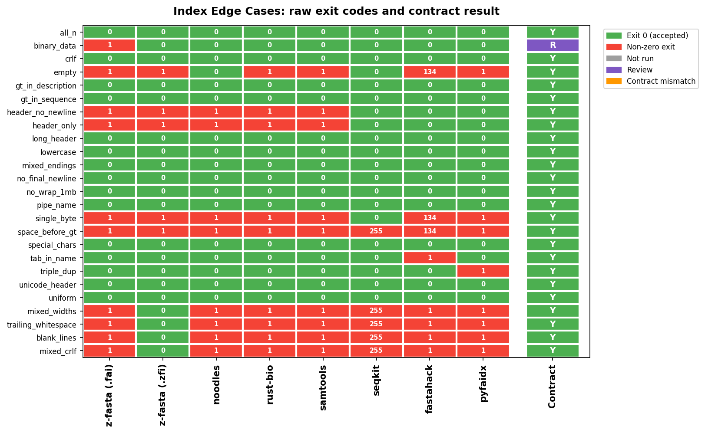
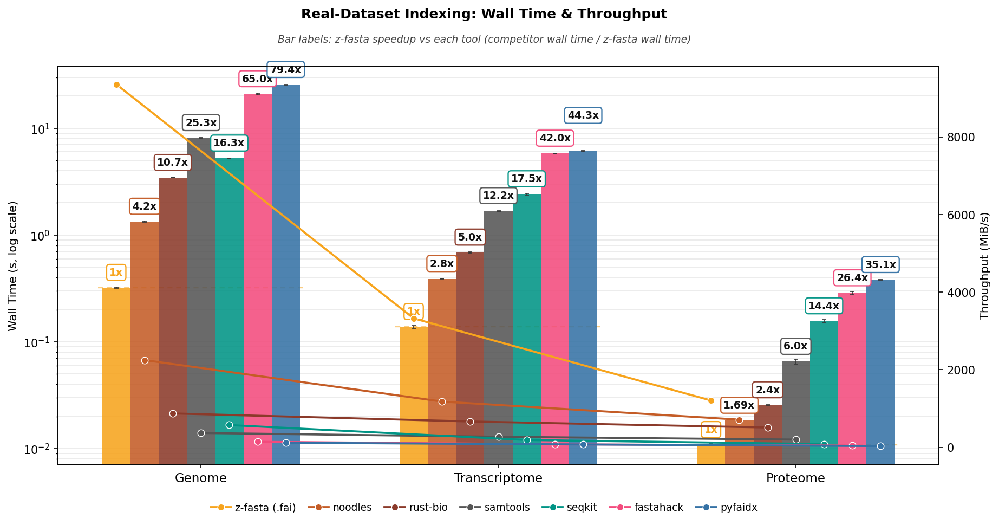
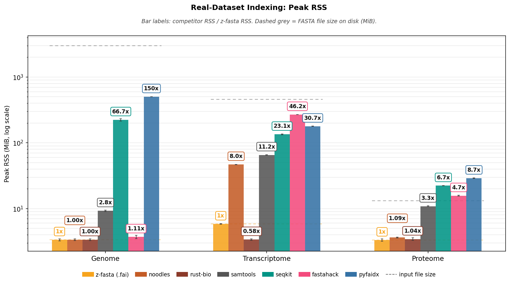
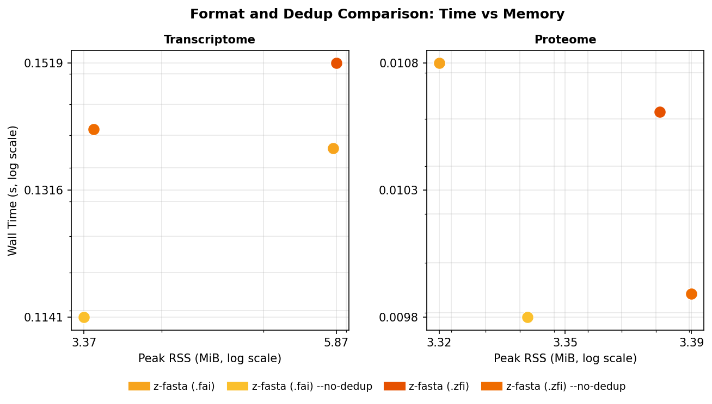
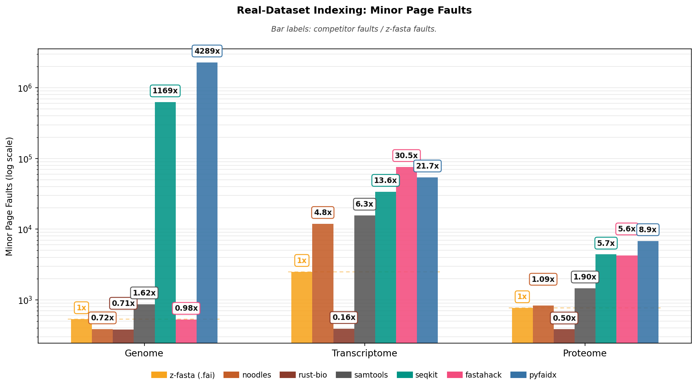
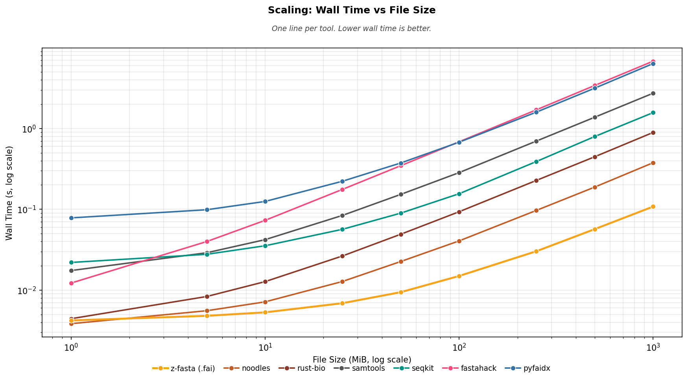
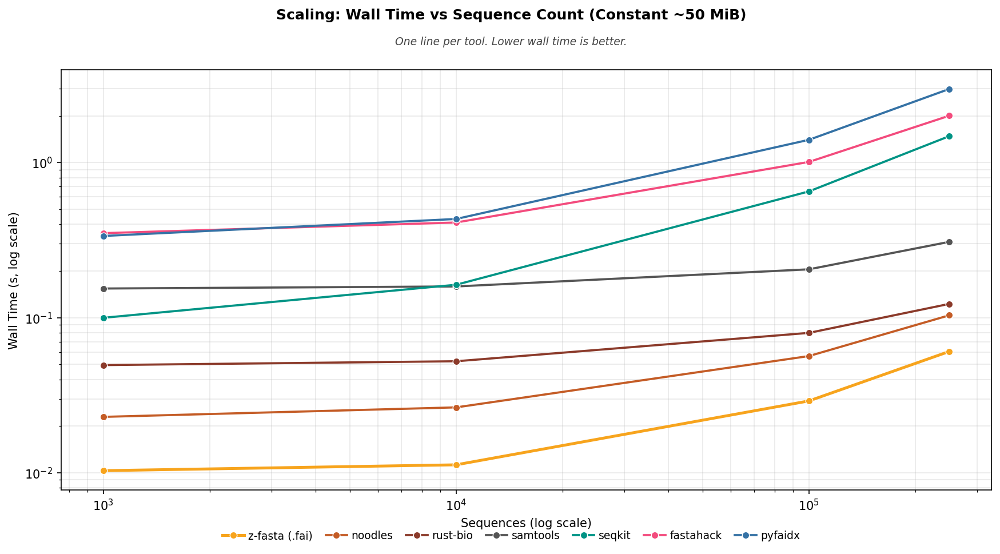
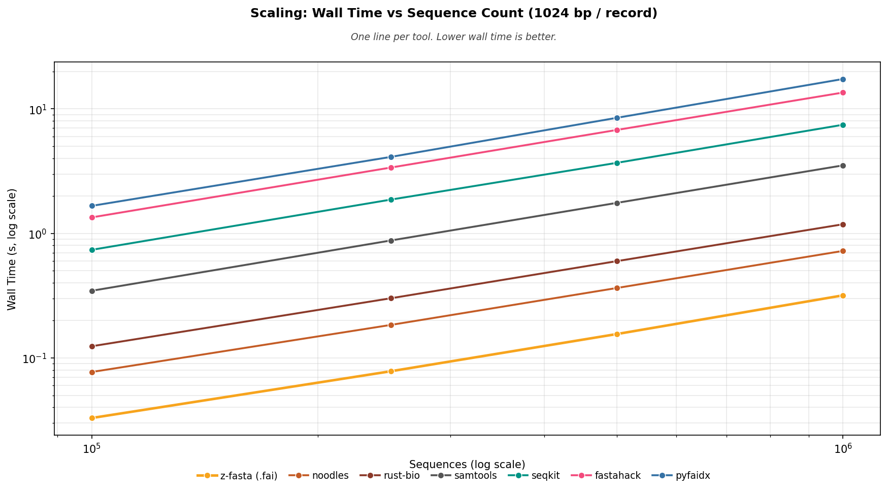

<!-- markdownlint-disable MD024 MD032 MD033 MD036 MD041 MD049 -->

# z-fasta Index Benchmark Report

_Auto-generated by `generate_report.py` from zebrac results._

## Overview

This report presents the benchmark sections captured by the selected run: correctness, real-data performance and memory, format and dedup behavior, and synthetic scaling where available.

Cross-tool tables use `z-fasta index --emit-fai` because the peer tools write samtools-compatible `.fai` indexes. The z-fasta-only comparison separately covers `.fai` and the default `.zfi`, with dedup on and off, on Transcriptome and Proteome.

The **rust-bio** label needs one clarification: rust-bio has no equivalent standalone FAI index command, so this benchmark lane uses the strict custom Rust FAI writer in the rust-bio wrapper. The label stays short in tables and figures, but the measured indexing code is custom.

Correctness covers strict FAI compatibility and z-fasta's `.zfi` support for ragged wrapping, trailing spaces, blank lines, and mixed line endings.

## Run Provenance

- **Build:** z-fasta v0.3.4; Zig 0.16.0; ReleaseFast; `x86_64-linux`.
- **Benchmark:** zebrac v0.6.2; warm cache; 5 measured samples after 3 warmups; 5000 ms budget per command.

## Datasets

- **Genome:** Homo sapiens GRCh38 primary assembly (Ensembl release 113).
- **Transcriptome:** Homo sapiens GENCODE v46 transcript sequences.
- **Proteome:** Homo sapiens UniProt reference proteome UP000005640.

## Tools Tested

- **z-fasta (v0.3.4)**
  - `.fai`, dedup: peer-comparable cross-tool and scaling lane.
  - `.fai`, no dedup: isolates duplicate-name tracking cost.
  - `.zfi`, dedup: default product mode.
  - `.zfi`, no dedup: default format without duplicate-name tracking.
- **noodles (v0.66.0)**: Rust noodles-fasta wrapper.
- **rust-bio (v4.0.1)**: Rust FASTA library.
- **samtools (v1.24)**: reference FAI indexer.
- **seqkit (v2.13.0)**: Go FASTA toolkit.
- **fastahack (v1.0.0)**: C++ FAI indexer.
- **pyfaidx (v0.9.0.4)**: Python FAI indexer.

## Edge Case Correctness

Each heatmap row is one structural FASTA edge case. The z-fasta columns separate the samtools-compatible FAI attempt from the production `.zfi` index. The **Contract** column marks whether z-fasta met that test's rules.

**Contract meaning:** for structural cases, `z-fasta (.fai)` must agree with samtools on FAI acceptance and bytes when both accept. If one accepts and the other rejects, the contract is `N`. For the four named messy fixtures, the `.zfi` side-table path is the contract because samtools cannot represent those layouts; the FAI rejection pair plus valid `.zfi` side table is `Y`.

**Scoring rules:**

- *Samtools parity* cases: when both z-fasta and samtools accept a file, their `.fai` output must match. When both reject it, that also counts as a match. A production `.zfi` success does not hide an FAI exit-code mismatch.

- *z-fasta-only* messy cases: z-fasta must index files where samtools rejects non-uniform wrapping (side-table `.zfi`).

**Table 1:** Comparability summary by contract class. Raw exit codes are diagnostic; `Result` applies the class-specific comparison rule.

| Contract basis       |   Cases | Result     | Comparison                                                 |
|:---------------------|--------:|:-----------|:-----------------------------------------------------------|
| FAI parity           |      20 | 20/20 pass | z-fasta (.fai) vs samtools acceptance and FAI bytes        |
| ZFI messy support    |       4 | 4/4 pass   | z-fasta (.zfi) side table; FAI peers expected incompatible |
| Invalid input review |       1 | 1/1 review | raw behavior shown; no parity claim for binary input       |

**Figure 1:** Raw per-test exit codes and the composite contract result. Green = exit 0; red = non-zero exit; gray = tool not run; purple = review; orange = contract mismatch.

**Reading Figure 1**
- Rows: structural FASTA edge cases.
- Tool columns show the numeric exit code; `n/a` means the optional tool was not run.
- **Contract:** `Y` = match, `R` = review, `N` = mismatch.
- Cell colors match the legend on the chart.
- Aggregate counts are in Table 1.

## Messy FASTA Compatibility

Proteome-derived messy FASTA fixtures. Each cell is zebrac with `--allow-failures` (repeated samples, not a single exit check).

**z-fasta lane:** This table must use `z-fasta (.zfi)` via default `index`. The `.fai` lane is not the messy compatibility claim; variable widths, trailing whitespace, and mixed line endings require the production `.zfi` side table.

**What z-fasta handles:** irregular line wrapping, trailing whitespace on sequence lines, blank lines between records, and mixed CRLF/LF. Those are common export glitches, not arbitrary byte corruption. z-fasta records true sequence boundaries in a side-table `.zfi` instead of assuming every line in a record has the same width.

**What we still reject:** empty files, headers without sequence, malformed headers, and other cases where indexing would be meaningless (see **Edge Case Correctness** above). We do not claim to repair truncated or binary-corrupted FASTA.

`mixed_crlf` deliberately alternates LF and CRLF sequence-line endings. It is not a uniformly CRLF-wrapped control file.

**Table 2:** Measured process result per variant and tool from the messy benchmark data. The z-fasta `.zfi` lane is `ok` only when every sample exits 0. Peer cells report only whether every measured sample exited 0; they do not claim sequence-retrieval compatibility.

| Variant             | z-fasta (.zfi)   | noodles   | rust-bio   | samtools   | seqkit   | fastahack   | pyfaidx   |
|:--------------------|:-----------------|:----------|:-----------|:-----------|:---------|:------------|:----------|
| all_messy           | ok               | nonzero   | nonzero    | nonzero    | nonzero  | nonzero     | nonzero   |
| mixed_crlf          | ok               | nonzero   | exit 0     | nonzero    | nonzero  | nonzero     | nonzero   |
| mixed_widths        | ok               | nonzero   | nonzero    | nonzero    | nonzero  | nonzero     | nonzero   |
| trailing_whitespace | ok               | nonzero   | nonzero    | nonzero    | nonzero  | nonzero     | nonzero   |

**Reading Table 2**
- Rows: messy variant names (`all_messy`, `mixed_crlf`, `mixed_widths`, `trailing_whitespace`).
- Columns: production `z-fasta (.zfi)` followed by FAI peers.
- `exit 0` and `nonzero` are measured process results, not output validation.

## Performance: Real Datasets

Headline comparison on the three human reference datasets (see **Datasets**). **z-fasta (.fai)** is `index --emit-fai` with dedup. It constructs the peer-compatible output while discarding the emitted stream; peers write sidecar files. Output destinations and duplicate-name policies therefore are not identical. The product table isolates z-fasta's dedup cost. CLI default `index` writes `.zfi`; see **z-fasta Format and Dedup Comparison**.

**Measured result:** z-fasta is faster than every reported peer on Genome, Transcriptome, and Proteome. The narrowest lead is 1.69x against noodles on Proteome.

**Table 3:** Zebrac wall time per dataset (seconds, mean ± stddev, warm cache). Lower is better. Tool order: z-fasta, noodles, rust-bio, samtools, seqkit, fastahack, pyfaidx.

| dataset       | z-fasta (.fai)   | noodles         | rust-bio        | samtools        | seqkit          | fastahack        | pyfaidx          |
|:--------------|:-----------------|:----------------|:----------------|:----------------|:----------------|:-----------------|:-----------------|
| Genome        | 0.3212s ±0.0031  | 1.3365s ±0.0152 | 3.4361s ±0.0135 | 8.1131s ±0.0901 | 5.2208s ±0.0434 | 20.8872s ±0.3260 | 25.4992s ±0.2630 |
| Transcriptome | 0.1380s ±0.0040  | 0.3885s ±0.0019 | 0.6877s ±0.0073 | 1.6801s ±0.0105 | 2.4148s ±0.0358 | 5.7967s ±0.0228  | 6.1207s ±0.0624  |
| Proteome      | 0.0108s ±0.0003  | 0.0183s ±0.0007 | 0.0256s ±0.0001 | 0.0653s ±0.0031 | 0.1563s ±0.0049 | 0.2860s ±0.0084  | 0.3805s ±0.0031  |

<strong>Table 4:</strong> Input throughput (MiB/s), calculated from input size and wall time. Higher is better. Same tools and order as Table 3.

| dataset       | z-fasta (.fai)   | noodles      | rust-bio    | samtools    | seqkit      | fastahack   | pyfaidx     |
|:--------------|:-----------------|:-------------|:------------|:------------|:------------|:------------|:------------|
| Genome        | 9355.9 MiB/s     | 2248.8 MiB/s | 874.7 MiB/s | 370.4 MiB/s | 575.7 MiB/s | 143.9 MiB/s | 117.9 MiB/s |
| Transcriptome | 3323.3 MiB/s     | 1180.8 MiB/s | 667.0 MiB/s | 273.0 MiB/s | 190.0 MiB/s | 79.1 MiB/s  | 74.9 MiB/s  |
| Proteome      | 1207.8 MiB/s     | 714.6 MiB/s  | 512.0 MiB/s | 200.7 MiB/s | 83.8 MiB/s  | 45.8 MiB/s  | 34.4 MiB/s  |

<strong>Table 5:</strong> z-fasta vs each competitor. Speedup = competitor wall time / z-fasta wall time (higher = z-fasta faster). Same ratios appear as bar labels on Figure 2. Throughput ratio uses MiB/s.

| Dataset       | z-fasta vs   | z-fasta   | Competitor   | Speedup   |   z-fasta MiB/s |   Competitor MiB/s | Throughput ratio   |
|:--------------|:-------------|:----------|:-------------|:----------|----------------:|-------------------:|:-------------------|
| Genome        | noodles      | 0.3212s   | 1.3365s      | 4.2x      |          9355.9 |             2248.8 | 4.2x               |
| Genome        | rust-bio     | 0.3212s   | 3.4361s      | 10.7x     |          9355.9 |              874.7 | 10.7x              |
| Genome        | samtools     | 0.3212s   | 8.1131s      | 25.3x     |          9355.9 |              370.4 | 25.3x              |
| Genome        | seqkit       | 0.3212s   | 5.2208s      | 16.3x     |          9355.9 |              575.7 | 16.3x              |
| Genome        | fastahack    | 0.3212s   | 20.8872s     | 65.0x     |          9355.9 |              143.9 | 65.0x              |
| Genome        | pyfaidx      | 0.3212s   | 25.4992s     | 79.4x     |          9355.9 |              117.9 | 79.4x              |
| Transcriptome | noodles      | 0.1380s   | 0.3885s      | 2.8x      |          3323.3 |             1180.8 | 2.8x               |
| Transcriptome | rust-bio     | 0.1380s   | 0.6877s      | 5.0x      |          3323.3 |              667   | 5.0x               |
| Transcriptome | samtools     | 0.1380s   | 1.6801s      | 12.2x     |          3323.3 |              273   | 12.2x              |
| Transcriptome | seqkit       | 0.1380s   | 2.4148s      | 17.5x     |          3323.3 |              190   | 17.5x              |
| Transcriptome | fastahack    | 0.1380s   | 5.7967s      | 42.0x     |          3323.3 |               79.1 | 42.0x              |
| Transcriptome | pyfaidx      | 0.1380s   | 6.1207s      | 44.3x     |          3323.3 |               74.9 | 44.3x              |
| Proteome      | noodles      | 0.0108s   | 0.0183s      | 1.69x     |          1207.8 |              714.6 | 1.69x              |
| Proteome      | rust-bio     | 0.0108s   | 0.0256s      | 2.4x      |          1207.8 |              512   | 2.4x               |
| Proteome      | samtools     | 0.0108s   | 0.0653s      | 6.0x      |          1207.8 |              200.7 | 6.0x               |
| Proteome      | seqkit       | 0.0108s   | 0.1563s      | 14.4x     |          1207.8 |               83.8 | 14.4x              |
| Proteome      | fastahack    | 0.0108s   | 0.2860s      | 26.4x     |          1207.8 |               45.8 | 26.4x              |
| Proteome      | pyfaidx      | 0.0108s   | 0.3805s      | 35.1x     |          1207.8 |               34.4 | 35.1x              |

**Figure 2:** Dual-axis chart for Table 3 and Table 4. Bars show wall time (left axis, log scale). Lines and markers show throughput (right axis). Legend colors: gold = z-fasta; bronze = noodles; red-brown = rust-bio; grey = samtools; teal = seqkit; pink = fastahack; blue = pyfaidx. Bar labels show z-fasta speedup vs each tool (see Table 5); gold dashed line = z-fasta wall time per dataset.

**Reading Figure 2**
- **Bars (left):** zebrac mean wall time. Error bars are one standard deviation.
- **Lines and markers (right):** input MiB/s for the same tool at each dataset.
- **Legend order:** z-fasta, noodles, rust-bio, samtools, seqkit, fastahack, pyfaidx.
- **Bar labels:** `1x` on z-fasta (baseline); competitor labels = z-fasta speedup (competitor time / z-fasta time). Border color matches the tool. Dashed gold line = z-fasta wall time for that dataset. Details in Table 5.
- **z-fasta only:** this section uses the peer-comparable `.fai` lane; format and dedup tradeoffs are in **z-fasta Format and Dedup Comparison**.

## Memory Usage: Real Datasets

Same zebrac runs as **Performance: Real Datasets**. z-fasta (.fai) only; other product lanes are in **z-fasta Format and Dedup Comparison**.

**Measured result:** rust-bio uses less peak RSS on Transcriptome (3.38 MiB vs 5.83 MiB). The headline z-fasta lane includes default duplicate-name tracking.

### Peak RSS

zebrac starts a new process for each sample and records peak RSS when it exits. That is the most RAM the process had in use at once (Linux `ru_maxrss` via `getrusage`). Table and figure show the mean across samples.

Use this to compare tools on the same file and host. Grey dashed lines show file size as context; output and dedup state can still affect memory. A low bar does not always mean less work, so wall time and page faults provide the surrounding context.

**Table 6:** Peak RSS (MiB, zebrac mean). Same tool order as Performance.

| dataset       | z-fasta (.fai)   | noodles   | rust-bio   | samtools   | seqkit     | fastahack   | pyfaidx    |
|:--------------|:-----------------|:----------|:-----------|:-----------|:-----------|:------------|:-----------|
| Genome        | 3.35 MiB         | 3.37 MiB  | 3.35 MiB   | 9.26 MiB   | 223.79 MiB | 3.71 MiB    | 501.35 MiB |
| Transcriptome | 5.83 MiB         | 46.79 MiB | 3.38 MiB   | 65.47 MiB  | 134.45 MiB | 269.19 MiB  | 178.98 MiB |
| Proteome      | 3.32 MiB         | 3.63 MiB  | 3.44 MiB   | 10.88 MiB  | 22.31 MiB  | 15.71 MiB   | 28.99 MiB  |

<strong>Table 7:</strong> z-fasta vs each competitor. RSS ratio = competitor peak RSS / z-fasta peak RSS. Same ratios as bar labels on Figure 3.

| Dataset       | z-fasta vs   | z-fasta   | Competitor   | RSS ratio   |
|:--------------|:-------------|:----------|:-------------|:------------|
| Genome        | noodles      | 3.35 MiB  | 3.37 MiB     | 1.00x       |
| Genome        | rust-bio     | 3.35 MiB  | 3.35 MiB     | 1.00x       |
| Genome        | samtools     | 3.35 MiB  | 9.26 MiB     | 2.8x        |
| Genome        | seqkit       | 3.35 MiB  | 223.79 MiB   | 66.7x       |
| Genome        | fastahack    | 3.35 MiB  | 3.71 MiB     | 1.11x       |
| Genome        | pyfaidx      | 3.35 MiB  | 501.35 MiB   | 150x        |
| Transcriptome | noodles      | 5.83 MiB  | 46.79 MiB    | 8.0x        |
| Transcriptome | rust-bio     | 5.83 MiB  | 3.38 MiB     | 0.58x       |
| Transcriptome | samtools     | 5.83 MiB  | 65.47 MiB    | 11.2x       |
| Transcriptome | seqkit       | 5.83 MiB  | 134.45 MiB   | 23.1x       |
| Transcriptome | fastahack    | 5.83 MiB  | 269.19 MiB   | 46.2x       |
| Transcriptome | pyfaidx      | 5.83 MiB  | 178.98 MiB   | 30.7x       |
| Proteome      | noodles      | 3.32 MiB  | 3.63 MiB     | 1.09x       |
| Proteome      | rust-bio     | 3.32 MiB  | 3.44 MiB     | 1.04x       |
| Proteome      | samtools     | 3.32 MiB  | 10.88 MiB    | 3.3x        |
| Proteome      | seqkit       | 3.32 MiB  | 22.31 MiB    | 6.7x        |
| Proteome      | fastahack    | 3.32 MiB  | 15.71 MiB    | 4.7x        |
| Proteome      | pyfaidx      | 3.32 MiB  | 28.99 MiB    | 8.7x        |

**Figure 3:** Table 6 as grouped bars (log scale). Bar labels = RSS ratio (see Table 7). Gold dashed line = z-fasta RSS; grey dashed = FASTA file size on disk.

**Reading Figure 3**
- Bars: mean peak RSS. `1x` on z-fasta; other labels = competitor / z-fasta.
- Gold dashed line: z-fasta RSS for that dataset.
- Grey dashed line: input FASTA size.
- Details in Table 7.

## z-fasta Format and Dedup Comparison

This focused z-fasta comparison uses **Transcriptome** and **Proteome**. It isolates output format (`.fai` or `.zfi`) and duplicate-name tracking (dedup or `--no-dedup`). Peer indexers stay in the cross-tool performance sections, where they answer a different question.

**Measured result:** the largest dedup memory cost is 1.73x on Transcriptome (`.fai`).

**Table 8:** Measured wall time and peak RSS for each matched pair. Each ratio is dedup divided by no-dedup within the same dataset and output format. Values above `1x` are the measured dedup cost.

| Dataset       | Output   | Dedup wall      | No-dedup wall   | Wall ratio   | Dedup RSS   | No-dedup RSS   | RSS ratio   |
|:--------------|:---------|:----------------|:----------------|:-------------|:------------|:---------------|:------------|
| Transcriptome | .fai     | 0.1380s ±0.0040 | 0.1141s ±0.0051 | 1.21x        | 5.83 MiB    | 3.37 MiB       | 1.73x       |
| Transcriptome | .zfi     | 0.1519s ±0.0092 | 0.1410s ±0.0094 | 1.08x        | 5.87 MiB    | 3.45 MiB       | 1.70x       |
| Proteome      | .fai     | 0.0108s ±0.0003 | 0.0098s ±0.0004 | 1.11x        | 3.32 MiB    | 3.34 MiB       | 0.99x       |
| Proteome      | .zfi     | 0.0106s ±0.0003 | 0.0099s ±0.0002 | 1.08x        | 3.38 MiB    | 3.39 MiB       | 1.00x       |

**Figure 4:** The same measured configurations plotted by peak RSS and wall time. Both axes use log scale; lower-left is faster with less process memory.

**Reading Figure 4**
- Panels: Transcriptome and Proteome.
- Gold points: `.fai`; orange points: `.zfi`.
- Lighter points: `--no-dedup`; darker points: dedup.
- Exact measurements and within-format ratios are in Table 8.

## Page Faults: Real Datasets

Same zebrac samples as the real-dataset performance and memory sections.

### Page faults

A **minor** fault maps a page without reading disk. A **major** fault reads from disk. zebrac reports both per run, like wall time. Table 11 lists major faults separately.

**Table 9:** Minor page faults (zebrac mean). Same tool order as Performance.

| dataset       |   z-fasta (.fai) |   noodles |   rust-bio |   samtools |   seqkit |   fastahack |   pyfaidx |
|:--------------|-----------------:|----------:|-----------:|-----------:|---------:|------------:|----------:|
| Genome        |              534 |       384 |        378 |        866 |  624,732 |         524 | 2,292,175 |
| Transcriptome |            2,494 |    11,888 |        388 |     15,600 |   33,861 |      76,012 |    54,096 |
| Proteome      |              763 |       829 |        382 |      1,455 |    4,383 |       4,269 |     6,792 |

<strong>Table 10:</strong> z-fasta vs each competitor. Faults ratio = competitor minor faults / z-fasta minor faults. Same ratios as bar labels on Figure 5.

| Dataset       | z-fasta vs   |   z-fasta |   Competitor | Faults ratio   |
|:--------------|:-------------|----------:|-------------:|:---------------|
| Genome        | noodles      |       534 |          384 | 0.72x          |
| Genome        | rust-bio     |       534 |          378 | 0.71x          |
| Genome        | samtools     |       534 |          866 | 1.62x          |
| Genome        | seqkit       |       534 |      624,732 | 1169x          |
| Genome        | fastahack    |       534 |          524 | 0.98x          |
| Genome        | pyfaidx      |       534 |    2,292,175 | 4289x          |
| Transcriptome | noodles      |     2,494 |       11,888 | 4.8x           |
| Transcriptome | rust-bio     |     2,494 |          388 | 0.16x          |
| Transcriptome | samtools     |     2,494 |       15,600 | 6.3x           |
| Transcriptome | seqkit       |     2,494 |       33,861 | 13.6x          |
| Transcriptome | fastahack    |     2,494 |       76,012 | 30.5x          |
| Transcriptome | pyfaidx      |     2,494 |       54,096 | 21.7x          |
| Proteome      | noodles      |       763 |          829 | 1.09x          |
| Proteome      | rust-bio     |       763 |          382 | 0.50x          |
| Proteome      | samtools     |       763 |        1,455 | 1.90x          |
| Proteome      | seqkit       |       763 |        4,383 | 5.7x           |
| Proteome      | fastahack    |       763 |        4,269 | 5.6x           |
| Proteome      | pyfaidx      |       763 |        6,792 | 8.9x           |

<strong>Table 11:</strong> Major page faults.

| dataset       |   z-fasta (.fai) |   noodles |   rust-bio |   samtools |   seqkit |   fastahack |   pyfaidx |
|:--------------|-----------------:|----------:|-----------:|-----------:|---------:|------------:|----------:|
| Genome        |                0 |         0 |          0 |          0 |        0 |           0 |         0 |
| Transcriptome |                0 |         0 |          0 |          0 |        0 |           0 |         0 |
| Proteome      |                0 |         0 |          0 |          0 |        0 |           0 |         0 |

**Figure 5:** Table 9 as grouped bars (log scale). Bar labels = Faults ratio (see Table 10). Gold dashed line = z-fasta minor faults.

**Reading Figure 5**
- Bars: mean minor faults. `1x` on z-fasta; other labels = competitor / z-fasta.
- Gold dashed line: z-fasta count for that dataset.
- Lower bar = fewer minor faults.
- Details in Table 10.

## Scaling: File Size

Synthetic FASTA files from 1 MiB to 1000 MiB with 100 sequences per file. Uses the zebrac warm-cache setup in **Run Provenance** and the peer-comparable z-fasta `.fai` lane.

**Measured result:** faster than z-fasta: noodles at 1 MiB.

### Wall time vs file size

Mean wall time (seconds, zebrac) at each file size. **Lower is better.** Record count stays fixed at 100 while total bytes on disk grow.

<strong>Table 12:</strong> Wall time per file size (zebrac mean, seconds). Tool order: z-fasta, noodles, rust-bio, samtools, seqkit, fastahack, pyfaidx.

| File Size   |   z-fasta (.fai) |   noodles |   rust-bio |   samtools |   seqkit |   fastahack |   pyfaidx |
|:------------|-----------------:|----------:|-----------:|-----------:|---------:|------------:|----------:|
| 1 MiB       |           0.0042 |    0.0038 |     0.0044 |     0.0175 |   0.0220 |      0.0122 |    0.0783 |
| 5 MiB       |           0.0048 |    0.0056 |     0.0083 |     0.0290 |   0.0277 |      0.0399 |    0.0988 |
| 10 MiB      |           0.0053 |    0.0072 |     0.0127 |     0.0421 |   0.0354 |      0.0730 |    0.1251 |
| 25 MiB      |           0.0069 |    0.0128 |     0.0264 |     0.0839 |   0.0565 |      0.1760 |    0.2222 |
| 50 MiB      |           0.0094 |    0.0226 |     0.0491 |     0.1529 |   0.0896 |      0.3463 |    0.3741 |
| 100 MiB     |           0.0150 |    0.0406 |     0.0933 |     0.2844 |   0.1558 |      0.6846 |    0.6769 |
| 250 MiB     |           0.0302 |    0.0968 |     0.2276 |     0.6984 |   0.3899 |      1.7006 |    1.5928 |
| 500 MiB     |           0.0568 |    0.1883 |     0.4469 |     1.3784 |   0.7953 |      3.4070 |    3.1551 |
| 1000 MiB    |           0.1080 |    0.3770 |     0.8935 |     2.7321 |   1.5715 |      6.8053 |    6.3582 |

<strong>Table 13:</strong> z-fasta vs each competitor at each file size. Time ratio = competitor wall time / z-fasta wall time.

| File Size   | z-fasta vs   | z-fasta   | Competitor   | Time ratio   |
|:------------|:-------------|:----------|:-------------|:-------------|
| 1 MiB       | noodles      | 0.0042s   | 0.0038s      | 0.91x        |
| 1 MiB       | rust-bio     | 0.0042s   | 0.0044s      | 1.05x        |
| 1 MiB       | samtools     | 0.0042s   | 0.0175s      | 4.1x         |
| 1 MiB       | seqkit       | 0.0042s   | 0.0220s      | 5.2x         |
| 1 MiB       | fastahack    | 0.0042s   | 0.0122s      | 2.9x         |
| 1 MiB       | pyfaidx      | 0.0042s   | 0.0783s      | 18.6x        |
| 5 MiB       | noodles      | 0.0048s   | 0.0056s      | 1.16x        |
| 5 MiB       | rust-bio     | 0.0048s   | 0.0083s      | 1.73x        |
| 5 MiB       | samtools     | 0.0048s   | 0.0290s      | 6.0x         |
| 5 MiB       | seqkit       | 0.0048s   | 0.0277s      | 5.8x         |
| 5 MiB       | fastahack    | 0.0048s   | 0.0399s      | 8.3x         |
| 5 MiB       | pyfaidx      | 0.0048s   | 0.0988s      | 20.5x        |
| 10 MiB      | noodles      | 0.0053s   | 0.0072s      | 1.35x        |
| 10 MiB      | rust-bio     | 0.0053s   | 0.0127s      | 2.4x         |
| 10 MiB      | samtools     | 0.0053s   | 0.0421s      | 7.9x         |
| 10 MiB      | seqkit       | 0.0053s   | 0.0354s      | 6.7x         |
| 10 MiB      | fastahack    | 0.0053s   | 0.0730s      | 13.8x        |
| 10 MiB      | pyfaidx      | 0.0053s   | 0.1251s      | 23.6x        |
| 25 MiB      | noodles      | 0.0069s   | 0.0128s      | 1.86x        |
| 25 MiB      | rust-bio     | 0.0069s   | 0.0264s      | 3.8x         |
| 25 MiB      | samtools     | 0.0069s   | 0.0839s      | 12.2x        |
| 25 MiB      | seqkit       | 0.0069s   | 0.0565s      | 8.2x         |
| 25 MiB      | fastahack    | 0.0069s   | 0.1760s      | 25.6x        |
| 25 MiB      | pyfaidx      | 0.0069s   | 0.2222s      | 32.3x        |
| 50 MiB      | noodles      | 0.0094s   | 0.0226s      | 2.4x         |
| 50 MiB      | rust-bio     | 0.0094s   | 0.0491s      | 5.2x         |
| 50 MiB      | samtools     | 0.0094s   | 0.1529s      | 16.2x        |
| 50 MiB      | seqkit       | 0.0094s   | 0.0896s      | 9.5x         |
| 50 MiB      | fastahack    | 0.0094s   | 0.3463s      | 36.8x        |
| 50 MiB      | pyfaidx      | 0.0094s   | 0.3741s      | 39.7x        |
| 100 MiB     | noodles      | 0.0150s   | 0.0406s      | 2.7x         |
| 100 MiB     | rust-bio     | 0.0150s   | 0.0933s      | 6.2x         |
| 100 MiB     | samtools     | 0.0150s   | 0.2844s      | 19.0x        |
| 100 MiB     | seqkit       | 0.0150s   | 0.1558s      | 10.4x        |
| 100 MiB     | fastahack    | 0.0150s   | 0.6846s      | 45.8x        |
| 100 MiB     | pyfaidx      | 0.0150s   | 0.6769s      | 45.3x        |
| 250 MiB     | noodles      | 0.0302s   | 0.0968s      | 3.2x         |
| 250 MiB     | rust-bio     | 0.0302s   | 0.2276s      | 7.5x         |
| 250 MiB     | samtools     | 0.0302s   | 0.6984s      | 23.1x        |
| 250 MiB     | seqkit       | 0.0302s   | 0.3899s      | 12.9x        |
| 250 MiB     | fastahack    | 0.0302s   | 1.7006s      | 56.2x        |
| 250 MiB     | pyfaidx      | 0.0302s   | 1.5928s      | 52.7x        |
| 500 MiB     | noodles      | 0.0568s   | 0.1883s      | 3.3x         |
| 500 MiB     | rust-bio     | 0.0568s   | 0.4469s      | 7.9x         |
| 500 MiB     | samtools     | 0.0568s   | 1.3784s      | 24.3x        |
| 500 MiB     | seqkit       | 0.0568s   | 0.7953s      | 14.0x        |
| 500 MiB     | fastahack    | 0.0568s   | 3.4070s      | 60.0x        |
| 500 MiB     | pyfaidx      | 0.0568s   | 3.1551s      | 55.5x        |
| 1000 MiB    | noodles      | 0.1080s   | 0.3770s      | 3.5x         |
| 1000 MiB    | rust-bio     | 0.1080s   | 0.8935s      | 8.3x         |
| 1000 MiB    | samtools     | 0.1080s   | 2.7321s      | 25.3x        |
| 1000 MiB    | seqkit       | 0.1080s   | 1.5715s      | 14.6x        |
| 1000 MiB    | fastahack    | 0.1080s   | 6.8053s      | 63.0x        |
| 1000 MiB    | pyfaidx      | 0.1080s   | 6.3582s      | 58.9x        |

<strong>Table 14:</strong> z-fasta peak RSS across the same file size sweep.

| File Size   |   Peak RSS (MiB) |   RSS spread (MiB) |
|:------------|-----------------:|-------------------:|
| 1 MiB       |             3.36 |               0.29 |
| 5 MiB       |             3.39 |               0.5  |
| 10 MiB      |             3.3  |               0.22 |
| 25 MiB      |             3.4  |               0.41 |
| 50 MiB      |             3.34 |               0.23 |
| 100 MiB     |             3.38 |               0.12 |
| 250 MiB     |             3.34 |               0.44 |
| 500 MiB     |             3.36 |               0.26 |
| 1000 MiB    |             3.45 |               0.32 |

**Figure 6:** Table 12 as lines (log scales on both axes). One line per tool; absolute wall times only.

**Reading Figure 6**
- Lines: mean wall time vs file size (MiB). Both axes use log scale.
- Lower on the chart = faster at that file size.
- Legend order: z-fasta, noodles, rust-bio, samtools, seqkit, fastahack, pyfaidx.
- Time ratios are in Table 13; the chart does not show them.

## Scaling: Sequence Count (Constant File Size)

Synthetic FASTA holding about **50 MiB** total per file; sequence length shrinks as record count rises. Uses the zebrac warm-cache setup in **Run Provenance** and the peer-comparable z-fasta `.fai` lane.

**Measured result:** z-fasta is fastest at every measured point.

### Wall time vs sequence count (constant file size)

Mean wall time (seconds, zebrac) at each record count. **Lower is better.** Isolates per-record and header overhead at near-constant file size.

<strong>Table 15:</strong> Wall time per record count (zebrac mean, seconds). Tool order: z-fasta, noodles, rust-bio, samtools, seqkit, fastahack, pyfaidx.

|   Sequences |   z-fasta (.fai) |   noodles |   rust-bio |   samtools |   seqkit |   fastahack |   pyfaidx |
|------------:|-----------------:|----------:|-----------:|-----------:|---------:|------------:|----------:|
|       1,000 |           0.0103 |    0.0229 |     0.0495 |     0.1541 |   0.0998 |      0.3506 |    0.3362 |
|      10,000 |           0.0113 |    0.0264 |     0.0524 |     0.1589 |   0.1630 |      0.4106 |    0.4326 |
|     100,000 |           0.0291 |    0.0566 |     0.0798 |     0.2050 |   0.6515 |      1.0089 |    1.4011 |
|     250,000 |           0.0606 |    0.1036 |     0.1227 |     0.3081 |   1.4792 |      2.0038 |    2.9802 |

<strong>Table 16:</strong> z-fasta vs each competitor at each record count. Time ratio = competitor wall time / z-fasta wall time.

|   Sequences | z-fasta vs   | z-fasta   | Competitor   | Time ratio   |
|------------:|:-------------|:----------|:-------------|:-------------|
|       1,000 | noodles      | 0.0103s   | 0.0229s      | 2.2x         |
|       1,000 | rust-bio     | 0.0103s   | 0.0495s      | 4.8x         |
|       1,000 | samtools     | 0.0103s   | 0.1541s      | 14.9x        |
|       1,000 | seqkit       | 0.0103s   | 0.0998s      | 9.7x         |
|       1,000 | fastahack    | 0.0103s   | 0.3506s      | 34.0x        |
|       1,000 | pyfaidx      | 0.0103s   | 0.3362s      | 32.6x        |
|      10,000 | noodles      | 0.0113s   | 0.0264s      | 2.3x         |
|      10,000 | rust-bio     | 0.0113s   | 0.0524s      | 4.7x         |
|      10,000 | samtools     | 0.0113s   | 0.1589s      | 14.1x        |
|      10,000 | seqkit       | 0.0113s   | 0.1630s      | 14.5x        |
|      10,000 | fastahack    | 0.0113s   | 0.4106s      | 36.5x        |
|      10,000 | pyfaidx      | 0.0113s   | 0.4326s      | 38.4x        |
|     100,000 | noodles      | 0.0291s   | 0.0566s      | 1.95x        |
|     100,000 | rust-bio     | 0.0291s   | 0.0798s      | 2.7x         |
|     100,000 | samtools     | 0.0291s   | 0.2050s      | 7.1x         |
|     100,000 | seqkit       | 0.0291s   | 0.6515s      | 22.4x        |
|     100,000 | fastahack    | 0.0291s   | 1.0089s      | 34.7x        |
|     100,000 | pyfaidx      | 0.0291s   | 1.4011s      | 48.2x        |
|     250,000 | noodles      | 0.0606s   | 0.1036s      | 1.71x        |
|     250,000 | rust-bio     | 0.0606s   | 0.1227s      | 2.0x         |
|     250,000 | samtools     | 0.0606s   | 0.3081s      | 5.1x         |
|     250,000 | seqkit       | 0.0606s   | 1.4792s      | 24.4x        |
|     250,000 | fastahack    | 0.0606s   | 2.0038s      | 33.1x        |
|     250,000 | pyfaidx      | 0.0606s   | 2.9802s      | 49.2x        |

<strong>Table 17:</strong> z-fasta peak RSS across the same record count sweep.

|   Sequences |   Peak RSS (MiB) |   RSS spread (MiB) |
|------------:|-----------------:|-------------------:|
|       1,000 |             3.38 |               0.53 |
|      10,000 |             3.32 |               0.28 |
|     100,000 |             3.38 |               0.25 |
|     250,000 |             5.83 |               0.09 |

**Figure 7:** Table 15 as lines (log scales on both axes). One line per tool; absolute wall times only.

**Reading Figure 7**
- Lines: mean wall time vs sequence count. Both axes use log scale.
- Lower on the chart = faster at that record count.
- Legend order: z-fasta, noodles, rust-bio, samtools, seqkit, fastahack, pyfaidx.
- Time ratios are in Table 16; the chart does not show them.

## Scaling: Sequence Count (Fixed Length)

Synthetic FASTA with **1024 bp** per sequence; total file size grows with record count (100k to 1M). Uses the zebrac warm-cache setup in **Run Provenance** and the peer-comparable z-fasta `.fai` lane.

**Measured result:** z-fasta is fastest at every measured point.

### Wall time vs sequence count (fixed length)

Mean wall time (seconds, zebrac) at each record count. **Lower is better.** Bytes and index entries grow together; the 1M point is about 1 GiB on disk.

<strong>Table 18:</strong> Wall time per record count (zebrac mean, seconds). Tool order: z-fasta, noodles, rust-bio, samtools, seqkit, fastahack, pyfaidx.

|   Sequences |   z-fasta (.fai) |   noodles |   rust-bio |   samtools |   seqkit |   fastahack |   pyfaidx |
|------------:|-----------------:|----------:|-----------:|-----------:|---------:|------------:|----------:|
|     100,000 |           0.0329 |    0.0770 |     0.1239 |     0.3457 |   0.7372 |      1.3433 |    1.6621 |
|     250,000 |           0.0780 |    0.1837 |     0.3008 |     0.8759 |   1.8655 |      3.3746 |    4.1091 |
|     500,000 |           0.1553 |    0.3638 |     0.5979 |     1.7563 |   3.6833 |      6.7682 |    8.4701 |
|   1,000,000 |           0.3175 |    0.7225 |     1.1825 |     3.5133 |   7.4481 |     13.5166 |   17.3634 |

<strong>Table 19:</strong> z-fasta vs each competitor at each record count. Time ratio = competitor wall time / z-fasta wall time.

|   Sequences | z-fasta vs   | z-fasta   | Competitor   | Time ratio   |
|------------:|:-------------|:----------|:-------------|:-------------|
|     100,000 | noodles      | 0.0329s   | 0.0770s      | 2.3x         |
|     100,000 | rust-bio     | 0.0329s   | 0.1239s      | 3.8x         |
|     100,000 | samtools     | 0.0329s   | 0.3457s      | 10.5x        |
|     100,000 | seqkit       | 0.0329s   | 0.7372s      | 22.4x        |
|     100,000 | fastahack    | 0.0329s   | 1.3433s      | 40.9x        |
|     100,000 | pyfaidx      | 0.0329s   | 1.6621s      | 50.6x        |
|     250,000 | noodles      | 0.0780s   | 0.1837s      | 2.4x         |
|     250,000 | rust-bio     | 0.0780s   | 0.3008s      | 3.9x         |
|     250,000 | samtools     | 0.0780s   | 0.8759s      | 11.2x        |
|     250,000 | seqkit       | 0.0780s   | 1.8655s      | 23.9x        |
|     250,000 | fastahack    | 0.0780s   | 3.3746s      | 43.3x        |
|     250,000 | pyfaidx      | 0.0780s   | 4.1091s      | 52.7x        |
|     500,000 | noodles      | 0.1553s   | 0.3638s      | 2.3x         |
|     500,000 | rust-bio     | 0.1553s   | 0.5979s      | 3.9x         |
|     500,000 | samtools     | 0.1553s   | 1.7563s      | 11.3x        |
|     500,000 | seqkit       | 0.1553s   | 3.6833s      | 23.7x        |
|     500,000 | fastahack    | 0.1553s   | 6.7682s      | 43.6x        |
|     500,000 | pyfaidx      | 0.1553s   | 8.4701s      | 54.6x        |
|   1,000,000 | noodles      | 0.3175s   | 0.7225s      | 2.3x         |
|   1,000,000 | rust-bio     | 0.3175s   | 1.1825s      | 3.7x         |
|   1,000,000 | samtools     | 0.3175s   | 3.5133s      | 11.1x        |
|   1,000,000 | seqkit       | 0.3175s   | 7.4481s      | 23.5x        |
|   1,000,000 | fastahack    | 0.3175s   | 13.5166s     | 42.6x        |
|   1,000,000 | pyfaidx      | 0.3175s   | 17.3634s     | 54.7x        |

<strong>Table 20:</strong> z-fasta peak RSS across the same record count sweep.

|   Sequences |   Peak RSS (MiB) |   RSS spread (MiB) |
|------------:|-----------------:|-------------------:|
|     100,000 |             3.38 |               0.3  |
|     250,000 |             5.85 |               0.05 |
|     500,000 |            10.01 |               0.49 |
|   1,000,000 |            19.05 |               0.38 |

**Figure 8:** Table 18 as lines (log scales on both axes). One line per tool; absolute wall times only.

**Reading Figure 8**
- Lines: mean wall time vs sequence count. Both axes use log scale.
- Lower on the chart = faster at that record count.
- Legend order: z-fasta, noodles, rust-bio, samtools, seqkit, fastahack, pyfaidx.
- Time ratios are in Table 19; the chart does not show them.
