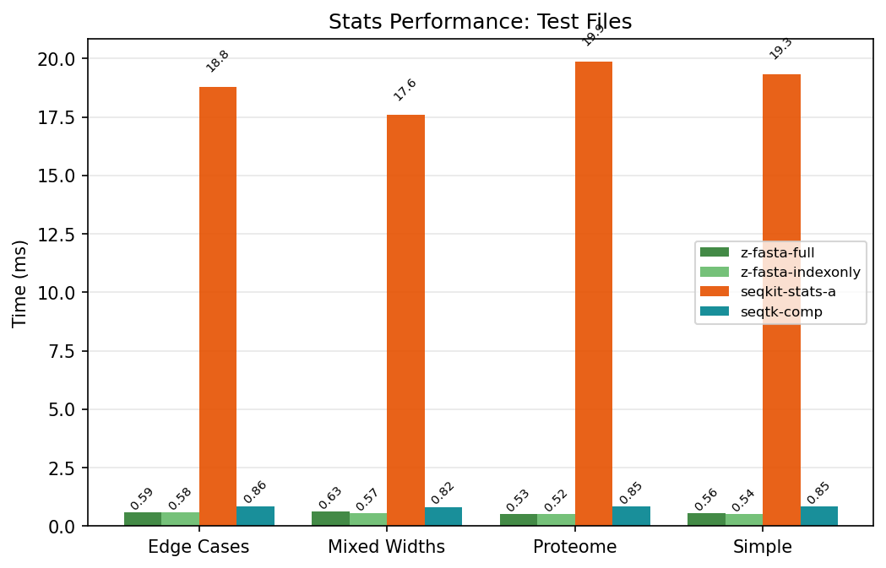
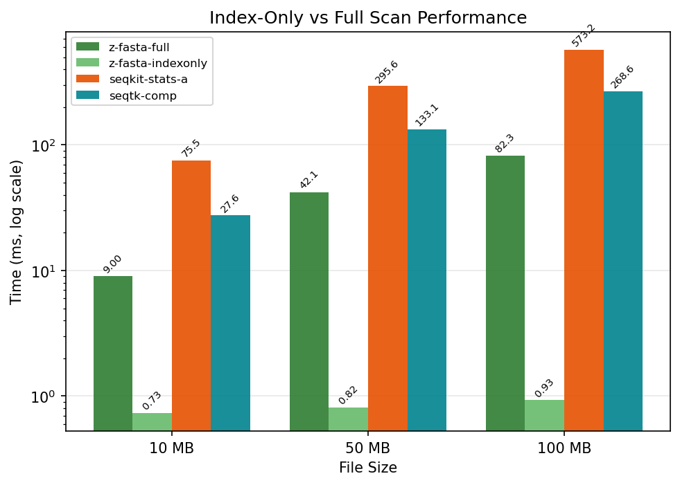
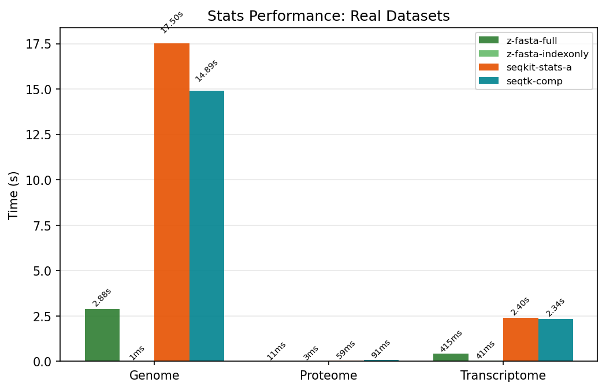
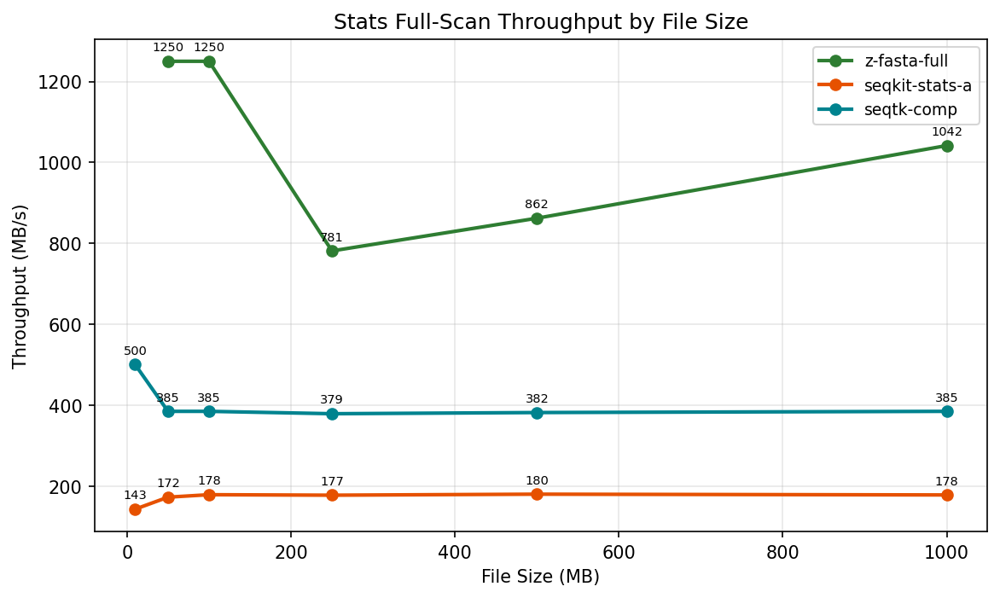

# z-fasta STATS Benchmark Report

_Auto-generated by `generate_report.py`_

## Test File Stats Performance

> Small test files with pre-existing `.zfi` indexes. Measures end-to-end CLI overhead.

| benchmark    | z-fasta-full    | z-fasta-indexonly   | seqkit-stats-a   | seqtk-comp      |
|:-------------|:----------------|:--------------------|:-----------------|:----------------|
| Edge Cases   | 0.0006s ±0.0001 | 0.0006s ±0.0002     | 0.0188s ±0.0032  | 0.0009s ±0.0001 |
| Mixed Widths | 0.0006s ±0.0000 | 0.0006s ±0.0001     | 0.0176s ±0.0021  | 0.0008s ±0.0001 |
| Proteome     | 0.0005s ±0.0000 | 0.0005s ±0.0000     | 0.0199s ±0.0026  | 0.0008s ±0.0001 |
| Simple       | 0.0006s ±0.0001 | 0.0005s ±0.0000     | 0.0193s ±0.0032  | 0.0008s ±0.0001 |

## Index-Only vs Full Scan

| benchmark   | z-fasta-full    | z-fasta-indexonly   | seqkit-stats-a   | seqtk-comp      |
|:------------|:----------------|:--------------------|:-----------------|:----------------|
| 10 MB       | 0.0090s ±0.0002 | 0.0007s ±0.0001     | 0.0755s ±0.0032  | 0.0276s ±0.0011 |
| 100 MB      | 0.0823s ±0.0012 | 0.0009s ±0.0000     | 0.5732s ±0.0037  | 0.2686s ±0.0058 |
| 50 MB       | 0.0421s ±0.0029 | 0.0008s ±0.0001     | 0.2956s ±0.0035  | 0.1331s ±0.0045 |

### Index-Only Speedup

| File   | Full Scan   | Index-Only   | Speedup (full vs index-only)   | seqkit-stats-a   |
|:-------|:------------|:-------------|:-------------------------------|:-----------------|
| 10 MB  | 0.0090s     | 734 μs       | **12×**                        | 0.0755s          |
| 50 MB  | 0.0421s     | 816 μs       | **52×**                        | 0.2956s          |
| 100 MB | 0.0823s     | 930 μs       | **89×**                        | 0.5732s          |

> **Interpretation:** Index-only mode reads `.zfi` index data and computes length-derived metrics without scanning FASTA sequence bytes. Time is dominated by process startup and is constant regardless of file size. This makes it suitable for interactive assembly QC where waiting seconds for N50 is unacceptable.

## Real Dataset Stats

| benchmark     | z-fasta-full    | z-fasta-indexonly   | seqkit-stats-a   | seqtk-comp       |
|:--------------|:----------------|:--------------------|:-----------------|:-----------------|
| Genome        | 2.8801s ±0.0081 | 0.0009s ±0.0001     | 17.5033s ±0.0739 | 14.8928s ±0.0682 |
| Proteome      | 0.0109s ±0.0001 | 0.0027s ±0.0001     | 0.0590s ±0.0036  | 0.0912s ±0.0003  |
| Transcriptome | 0.4152s ±0.0021 | 0.0409s ±0.0002     | 2.4022s ±0.0048  | 2.3368s ±0.0167  |

## Memory Usage

> RSS measured with `/usr/bin/time -v`. z-fasta-full uses mmap for reading. RSS reflects file pages mapped by OS. z-fasta-indexonly reads only the tiny `.zfi` header, so RSS stays nearly constant.

| Tool              |   File (MB) |   Time (s) |   MaxRSS (KB) |
|:------------------|------------:|-----------:|--------------:|
| z-fasta-full      |          10 |     0.0100 |        10,864 |
| seqkit-stats-a    |          10 |     0.0700 |        18,684 |
| seqtk-comp        |          10 |     0.0300 |         3,632 |
| z-fasta-indexonly |          10 |     0.0000 |        10,864 |
| z-fasta-full      |          50 |     0.0400 |        52,336 |
| seqkit-stats-a    |          50 |     0.2900 |        18,664 |
| seqtk-comp        |          50 |     0.1300 |         3,480 |
| z-fasta-indexonly |          50 |     0.0000 |        13,360 |
| z-fasta-full      |         100 |     0.0800 |       104,304 |
| seqkit-stats-a    |         100 |     0.5700 |        29,528 |
| seqtk-comp        |         100 |     0.2600 |         3,484 |
| z-fasta-indexonly |         100 |     0.0000 |        13,360 |

## Throughput (Full Scan)

| File Size   |   z-fasta-full |   seqkit-stats-a |   seqtk-comp |
|:------------|---------------:|-----------------:|-------------:|
| 10 MB       |          nan   |            142.8 |        500.0 |
| 50 MB       |         1250.0 |            172.4 |        384.6 |
| 100 MB      |         1250.0 |            178.5 |        384.6 |
| 250 MB      |          781.2 |            177.3 |        378.7 |
| 500 MB      |          862.0 |            179.8 |        381.6 |
| 1000 MB     |         1041.6 |            177.9 |        384.6 |

> z-fasta-full throughput is ~1.3 GB/s on synthetic single-sequence files in the current run, ahead of seqkit-stats and seqtk-comp. z-fasta's advantage is the additional statistics computed (N50, L50, N90, L90, AU, GC%, per-base composition) that seqkit-stats does not provide.

## Tool Comparison Notes

| Tool | Stats Support | Notes |
| :--- | :------------ | :---- |
| z-fasta stats | Full (Tier 1 + Tier 2) | Index-only mode for startup-dominated stats from `.zfi` |
| seqkit stats | Basic counts/sizes | No N50/GC/composition breakdown |
| samtools | No stats command | Index-only; no sequence statistics |
| fastahack | No stats command | Index-only; no sequence statistics |

