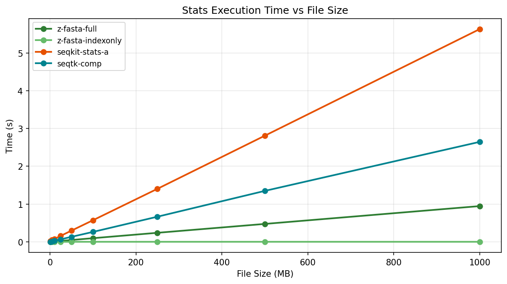

# z-fasta STATS Benchmark Report

_Auto-generated by `generate_report.py`_

## Test File Stats Performance

> Small test files with pre-existing `.zfi` indexes. Measures end-to-end CLI overhead.

| benchmark    | z-fasta-full    | z-fasta-indexonly   | seqkit-stats-a   | seqtk-comp      |
|:-------------|:----------------|:--------------------|:-----------------|:----------------|
| Edge Cases   | 0.0011s ±0.0000 | 0.0011s ±0.0001     | 0.0161s ±0.0006  | 0.0008s ±0.0001 |
| Mixed Widths | 0.0012s ±0.0000 | 0.0012s ±0.0001     | 0.0170s ±0.0008  | 0.0008s ±0.0001 |
| Proteome     | 0.0012s ±0.0001 | 0.0012s ±0.0001     | 0.0169s ±0.0017  | 0.0008s ±0.0001 |
| Simple       | 0.0012s ±0.0001 | 0.0013s ±0.0002     | 0.0171s ±0.0025  | 0.0008s ±0.0001 |

## Index-Only vs Full Scan

| benchmark   | z-fasta-full    | z-fasta-indexonly   | seqkit-stats-a   | seqtk-comp      |
|:------------|:----------------|:--------------------|:-----------------|:----------------|
| 10 MB       | 0.0110s ±0.0002 | 0.0015s ±0.0001     | 0.0765s ±0.0029  | 0.0271s ±0.0005 |
| 100 MB      | 0.1025s ±0.0105 | 0.0015s ±0.0001     | 0.5730s ±0.0054  | 0.2627s ±0.0018 |
| 50 MB       | 0.0490s ±0.0002 | 0.0015s ±0.0001     | 0.2933s ±0.0012  | 0.1328s ±0.0012 |

### Index-Only Speedup

| File   | Full Scan   | Index-Only   | Speedup (full vs index-only)   | seqkit-stats-a   |
|:-------|:------------|:-------------|:-------------------------------|:-----------------|
| 10 MB  | 0.0110s     | 1522 μs      | **7×**                         | 0.0765s          |
| 50 MB  | 0.0490s     | 1462 μs      | **33×**                        | 0.2933s          |
| 100 MB | 0.1025s     | 1543 μs      | **66×**                        | 0.5730s          |

> **Interpretation:** Index-only mode reads only the binary `.zfi` header. No file I/O occurs beyond the index. Time is dominated by process startup and is constant regardless of file size. This makes it suitable for interactive assembly QC where waiting seconds for N50 is unacceptable.

## Scaling: File Size

| File Size   |   z-fasta-full |   z-fasta-indexonly |   seqkit-stats-a |   seqtk-comp |
|:------------|---------------:|--------------------:|-----------------:|-------------:|
| 1 MB        |         0.0021 |              0.0014 |           0.0240 |       0.0037 |
| 5 MB        |         0.0061 |              0.0013 |           0.0485 |       0.0149 |
| 10 MB       |         0.0107 |              0.0015 |           0.0746 |       0.0271 |
| 25 MB       |         0.0251 |              0.0013 |           0.1589 |       0.0668 |
| 50 MB       |         0.0488 |              0.0014 |           0.2966 |       0.1325 |
| 100 MB      |         0.0967 |              0.0014 |           0.5716 |       0.2627 |
| 250 MB      |         0.2395 |              0.0015 |           1.4035 |       0.6654 |
| 500 MB      |         0.4746 |              0.0016 |           2.8096 |       1.3489 |
| 1000 MB     |         0.9466 |              0.0015 |           5.6308 |       2.6463 |

> **Note:** seqkit-stats is faster than z-fasta-full on large single-sequence synthetic files due to optimized FASTA parsing. z-fasta-full matches or outperforms seqkit on files with many short sequences (proteomes, transcriptomes) because composition is computed in a single pass. Index-only time is effectively constant regardless of file size and is dominated by CLI startup plus reading the tiny `.zfi` header.

## Real Dataset Stats

| benchmark     | z-fasta-full    | z-fasta-indexonly   | seqkit-stats-a   | seqtk-comp       |
|:--------------|:----------------|:--------------------|:-----------------|:-----------------|
| Genome        | 3.2095s ±0.0076 | 0.0016s ±0.0001     | 17.5009s ±0.0410 | 14.9015s ±0.0942 |
| Proteome      | 0.0166s ±0.0002 | 0.0056s ±0.0004     | 0.0569s ±0.0010  | 0.0931s ±0.0005  |
| Transcriptome | 0.6005s ±0.0054 | 0.1593s ±0.0023     | 2.4056s ±0.0099  | 2.3567s ±0.0175  |

## Memory Usage

> RSS measured with `/usr/bin/time -v`. z-fasta-full uses mmap for reading. RSS reflects file pages mapped by OS. z-fasta-indexonly reads only the tiny `.zfi` header, so RSS stays nearly constant.

| Tool              |   File (MB) |   Time (s) | MaxRSS (KB)   |
|:------------------|------------:|-----------:|:--------------|
| z-fasta-full      |          10 |     0.0100 | 11,288        |
| seqkit-stats-a    |          10 |     0.0700 | 17,388        |
| seqtk-comp        |          10 |     0.0200 | 3,404         |
| z-fasta-indexonly |          10 |     0.0000 | 7,192         |
| z-fasta-full      |          50 |     0.0500 | 52,564        |
| seqkit-stats-a    |          50 |     0.2900 | 19,096        |
| seqtk-comp        |          50 |     0.1300 | 3,408         |
| z-fasta-indexonly |          50 |     0.0000 | 7,192         |
| z-fasta-full      |         100 |     0.0900 | 104,532       |
| seqkit-stats-a    |         100 |     0.5600 | 20,776        |
| seqtk-comp        |         100 |     0.2600 | 3,604         |
| z-fasta-indexonly |         100 |     0.0000 | 7,192         |

## Throughput (Full Scan)

| File Size   |   z-fasta-full |   seqkit-stats-a |   seqtk-comp |
|:------------|---------------:|-----------------:|-------------:|
| 10 MB       |         1000.0 |            142.8 |        500.0 |
| 50 MB       |         1250.0 |            172.4 |        384.6 |
| 100 MB      |         1111.1 |            178.5 |        384.6 |
| 250 MB      |         1086.9 |            178.5 |        362.3 |
| 500 MB      |         1063.8 |            179.2 |        381.6 |
| 1000 MB     |         1075.2 |            177.6 |        378.7 |

> z-fasta-full throughput is ~1.0–1.25 GB/s on synthetic single-sequence files. seqkit-stats throughput tends to be higher due to simpler output formatting. z-fasta's advantage is the additional statistics computed (N50, L50, N90, L90, AU, GC%, per-base composition) that seqkit-stats does not provide.

## Tool Comparison Notes

| Tool | Stats Support | Notes |
| :--- | :------------ | :---- |
| z-fasta stats | Full (Tier 1 + Tier 2) | Index-only mode for startup-dominated stats from `.zfi` |
| seqkit stats | Basic counts/sizes | No N50/GC/composition breakdown |
| samtools | No stats command | Index-only; no sequence statistics |
| fastahack | No stats command | Index-only; no sequence statistics |
