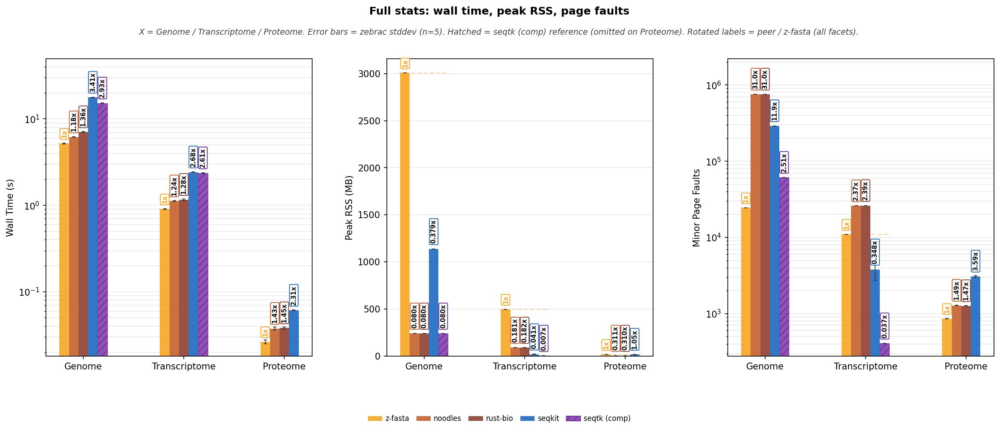
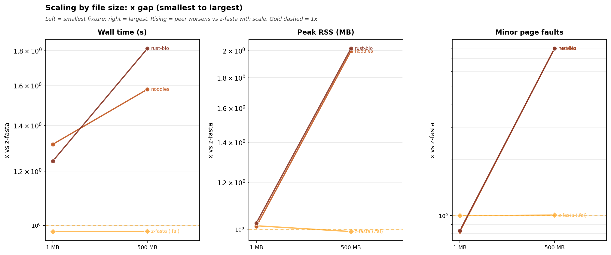
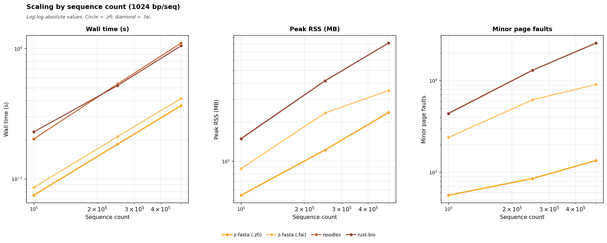
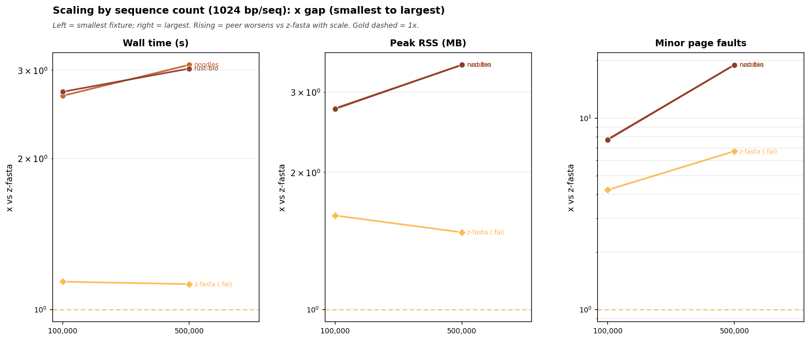
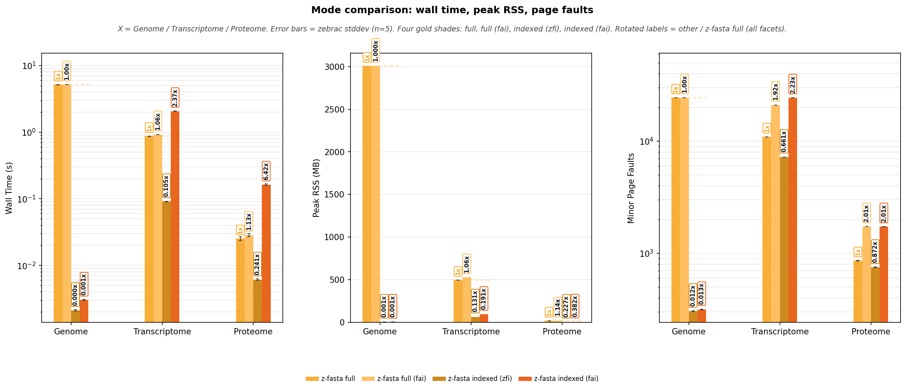

<!-- markdownlint-disable MD024 MD032 MD033 MD036 MD041 MD049 -->

# z-fasta Stats Benchmark Report

_Auto-generated by `bench/stats/generate_report.py` from zebrac results._

## Overview

This report times `z-fasta stats` against clean-FASTA peers on the shared REAL datasets (Genome, Transcriptome, Proteome) and on synthetic size / sequence-count sweeps.

**What is timed**

- **Full stats (peers):** `z-fasta stats` with `.zfi` (lengths + composition scan) vs noodles / rust-bio wrappers, seqkit `stats -a`, and seqtk `comp` (nucleotide only; hatched reference).
- **Scaling:** composition peers only (no `--index-only`): wall / RSS / page faults vs file size and vs sequence count (absolute facets + min->max x slopes; x tables in details).
- **z-fasta modes (2x2):** full and `--index-only`, each with `.zfi` and with `.fai` (`.zfi` stashed). Indexed skips composition; same assembly surface for both index formats.

**Index policy:** sidecars are preloaded once. Timed commands only run `stats` / peer tools; index _build_ is outside this wall (see `bench/index/REPORT.md`).

L2 verify reported **92** passing checks before perf (see `bench/stats/verify.sh`).

Correctness values (N50, GC, ...) are gated by verify against BioPython (`bench/stats/oracle.py`), not re-tabulated here.

## What each tool reports

z-fasta has two stats modes. **Full** (`z-fasta stats`) prints assembly metrics from the sidecar, then mmap-scans sequence bytes for composition. **Indexed** (`z-fasta stats --index-only`) prints assembly metrics only (no composition scan). Peers re-parse the FASTA every time; they have no `.zfi` / `.fai` shortcut.

### Assembly metrics (lengths / index)

| Metric                    | z-fasta full | z-fasta indexed | noodles | rust-bio | seqkit `-a` | seqtk `comp` |
| ------------------------- | ------------ | --------------- | ------- | -------- | ----------- | ------------ |
| Sequences / total bases   | yes          | yes             | yes     | yes      | yes         | totals       |
| Min / max / mean / median | yes          | yes             | yes     | yes      | yes         | -            |
| N50 / L50                 | yes          | yes             | yes     | yes      | yes         | -            |
| N90 / L90 / AU            | yes          | yes             | yes     | yes      | -           | -            |
| Shortest / longest names  | yes          | yes             | yes     | yes      | -           | -            |

### Composition (sequence scan)

| Metric                    | z-fasta full | z-fasta indexed | noodles | rust-bio | seqkit `-a` | seqtk `comp` |
| ------------------------- | ------------ | --------------- | ------- | -------- | ----------- | ------------ |
| GC / GC skew / soft-mask  | yes          | -               | yes     | yes      | GC          | partial      |
| A / C / G / T / N / Other | yes          | -               | yes     | yes      | -           | yes          |
| Top amino acids (protein) | yes          | -               | yes     | yes      | -           | -            |

**How to read the benches:** Full-stats peers are fair for composition work. Indexed lanes in mode / scaling charts are lengths-only (near-flat vs file size). seqkit also reports Q1/Q3/gaps/Q20 (FASTA/Q QC); those are out of scope for z-fasta. Wrappers are clean-FASTA peers only (no messy / side-table path).

Oracle: [`bench/stats/oracle.py`](oracle.py). Verify: [`bench/stats/verify.sh`](verify.sh).

## Run Provenance

- **Timestamp:** `20260709_122247`
- **Runner:** zebrac (warm)
- **zebrac:** zebrac 0.6.0
- **z-fasta:** z-fasta 0.2.9
- **Samples:** runs=5, warmup=5, duration_ms=5000
- **Metadata:** `metadata_20260709_122247.jsonl`
- **Index preload:** True (build time not included in stats wall)

**Sections**

- `perf_full` -> `perf_full_20260709_122247`
- `perf_mode` -> `perf_mode_20260709_122247`
- `scale_size` -> `scale_size_20260709_122247`
- `scale_seqs_fixed` -> `scale_seqs_fixed_20260709_122247`

**Peer versions**

- **seqkit:** seqkit v2.13.0
- **seqtk:** seqtk 1.5-r133
- **noodles:** noodles-fasta 0.61 (wrapper)
- **rustbio:** rust-bio 2.3 (custom indexer wrapper)
- **samtools:** samtools 1.13

**Data used** (human reference files in `bench/shared/data/`; fetch with `bench/shared/download_data.sh`):

- **Genome** (`REAL_Genome.fa`): Homo sapiens GRCh38 primary assembly (Ensembl release 113). 194 sequences, 3.10 Gbp total, 2.93 GiB on disk.
- **Transcriptome** (`REAL_Transcriptome.fa`): Homo sapiens GENCODE v46 transcript sequences. 254,070 transcripts, 444 Mbp total, 458.7 MiB on disk.
- **Proteome** (`REAL_Proteome.fasta`): Homo sapiens UniProt reference proteome UP000005640. 20,659 proteins, 11.5 M residues total, 13.1 MiB on disk.

## Performance: Full stats

Peers re-parse the FASTA. z-fasta full loads `.zfi`, emits length metrics from the index, then mmap-scans sequence bytes for composition. Baseline for ratios: **z-fasta full**. **Figure facets** are wall time, peak RSS, and minor page faults; **x-axis** is dataset; **bar color** is tool (GET RC layout).

## Wall time

Zebrac mean wall time (seconds) for one `stats` / peer process with stdout discarded.

**Table 1:** Mean ± stddev by dataset and tool.

| dataset       | z-fasta       | noodles       | rust-bio      | seqkit         | seqtk (comp)   |
| :------------ | :------------ | :------------ | :------------ | :------------- | :------------- |
| Genome        | 2.714±0.005 s | 6.024±0.059 s | 6.879±0.073 s | 17.433±0.024 s | 14.922±0.171 s |
| Transcriptome | 0.374±0.000 s | 1.078±0.019 s | 1.117±0.008 s | 2.409±0.011 s  | 2.339±0.012 s  |
| Proteome      | 0.011±0.000 s | 0.037±0.000 s | 0.037±0.000 s | 0.060±0.003 s  |                |

<strong>Table 2:</strong> Time x = peer wall / z-fasta full. Same ratios as bar labels.

| Dataset       | z-fasta vs   | z-fasta | Peer     | Time x |
| :------------ | :----------- | :------ | :------- | :----- |
| Genome        | noodles      | 2.7144s | 6.0237s  | 2.22x  |
| Genome        | rust-bio     | 2.7144s | 6.8790s  | 2.53x  |
| Genome        | seqkit       | 2.7144s | 17.4326s | 6.42x  |
| Genome        | seqtk (comp) | 2.7144s | 14.9220s | 5.50x  |
| Transcriptome | noodles      | 0.3742s | 1.0776s  | 2.88x  |
| Transcriptome | rust-bio     | 0.3742s | 1.1166s  | 2.98x  |
| Transcriptome | seqkit       | 0.3742s | 2.4087s  | 6.44x  |
| Transcriptome | seqtk (comp) | 0.3742s | 2.3392s  | 6.25x  |
| Proteome      | noodles      | 0.0112s | 0.0366s  | 3.26x  |
| Proteome      | rust-bio     | 0.0112s | 0.0369s  | 3.30x  |
| Proteome      | seqkit       | 0.0112s | 0.0600s  | 5.36x  |

## Memory Usage

Peak RSS from zebrac samples for the same full-stats commands.

**Table 3:** Mean ± stddev by dataset and tool.

| dataset       | z-fasta       | noodles      | rust-bio     | seqkit        | seqtk (comp) |
| :------------ | :------------ | :----------- | :----------- | :------------ | :----------- |
| Genome        | 3006.1±0.2 MB | 239.2±0.1 MB | 239.4±0.0 MB | 1139.6±1.0 MB | 239.3±0.2 MB |
| Transcriptome | 473.5±0.0 MB  | 89.7±0.2 MB  | 90.5±0.0 MB  | 21.8±5.0 MB   | 3.3±0.1 MB   |
| Proteome      | 15.1±0.0 MB   | 5.1±0.0 MB   | 5.1±0.0 MB   | 19.4±4.1 MB   |              |

<strong>Table 4:</strong> RSS x = peer peak RSS / z-fasta full.

| Dataset       | z-fasta vs   | z-fasta   | Peer      | RSS x  |
| :------------ | :----------- | :-------- | :-------- | :----- |
| Genome        | noodles      | 3006.1 MB | 239.2 MB  | 0.080x |
| Genome        | rust-bio     | 3006.1 MB | 239.4 MB  | 0.080x |
| Genome        | seqkit       | 3006.1 MB | 1139.6 MB | 0.379x |
| Genome        | seqtk (comp) | 3006.1 MB | 239.3 MB  | 0.080x |
| Transcriptome | noodles      | 473.5 MB  | 89.7 MB   | 0.189x |
| Transcriptome | rust-bio     | 473.5 MB  | 90.5 MB   | 0.191x |
| Transcriptome | seqkit       | 473.5 MB  | 21.8 MB   | 0.046x |
| Transcriptome | seqtk (comp) | 473.5 MB  | 3.3 MB    | 0.007x |
| Proteome      | noodles      | 15.1 MB   | 5.1 MB    | 0.340x |
| Proteome      | rust-bio     | 15.1 MB   | 5.1 MB    | 0.337x |
| Proteome      | seqkit       | 15.1 MB   | 19.4 MB   | 1.28x  |

## Page Faults

Minor page faults for the same full-stats commands.

**Table 5:** Mean ± stddev by dataset and tool.

| dataset       | z-fasta | noodles  | rust-bio | seqkit     | seqtk (comp) |
| :------------ | :------ | :------- | :------- | :--------- | :----------- |
| Genome        | 24353±2 | 754911±2 | 754914±1 | 290212±142 | 61104±1      |
| Transcriptome | 4487±1  | 25948±2  | 26112±0  | 4384±1486  | 409±2        |
| Proteome      | 460±2   | 1290±2   | 1266±3   | 3553±1113  |              |

<strong>Table 6:</strong> Faults x = peer minor faults / z-fasta full.

| Dataset       | z-fasta vs   | z-fasta |   Peer | Faults x |
| :------------ | :----------- | ------: | -----: | :------- |
| Genome        | noodles      |   24353 | 754911 | 31.0x    |
| Genome        | rust-bio     |   24353 | 754914 | 31.0x    |
| Genome        | seqkit       |   24353 | 290212 | 11.9x    |
| Genome        | seqtk (comp) |   24353 |  61104 | 2.51x    |
| Transcriptome | noodles      |    4487 |  25948 | 5.78x    |
| Transcriptome | rust-bio     |    4487 |  26112 | 5.82x    |
| Transcriptome | seqkit       |    4487 |   4384 | 0.977x   |
| Transcriptome | seqtk (comp) |    4487 |    409 | 0.091x   |
| Proteome      | noodles      |     460 |   1290 | 2.80x    |
| Proteome      | rust-bio     |     460 |   1266 | 2.75x    |
| Proteome      | seqkit       |     460 |   3553 | 7.72x    |

**Figure 1:** Tables 1, 3, and 5 as grouped bars (datasets on x-axis; tool color from legend).

**Reading Figure 1**

- **Facets:** wall time (log y) | peak RSS (linear) | minor page faults (log y).
- **X-axis:** Genome, Transcriptome, Proteome.
- **Bar colors:** one lane per tool (legend below figure).
- **Bar labels (rotated):** `1x` on z-fasta; peers = peer / z-fasta. Same ratio rules on wall, RSS, and page faults.
- **Hatched bars:** seqtk `comp` (composition-only reference; omitted on Proteome).
- Gold = z-fasta full (`.zfi`). Error bars = 1σ across measured samples.

## Scaling: file size

Synthetic FASTAs under `bench/stats/data/` (generated on demand). Indexes preloaded; timed work is composition `stats` / peers only (no `--index-only` here; that lives in Mode Comparison). Two figures per sweep: absolute wall / RSS / faults, then whether the x vs z-fasta gap grows from the smallest fixture to the largest. Per-point x values stay in the collapsible tables.

**Table 7:** Mean ± stddev wall time by File size (MB) and tool.

| File size (MB) | z-fasta       | z-fasta (fai) | noodles       | rust-bio      | seqkit        | seqtk (comp)  |
| :------------- | :------------ | :------------ | :------------ | :------------ | :------------ | :------------ |
| 1 MB           | 2.80±0.12 ms  | 2.84±0.05 ms  | 3.58±0.04 ms  | 3.72±0.03 ms  | 0.026±0.003 s | 4.98±0.04 ms  |
| 5 MB           | 5.61±0.10 ms  | 5.51±0.04 ms  | 8.06±0.10 ms  | 8.87±0.07 ms  | 0.050±0.003 s | 0.015±0.000 s |
| 10 MB          | 9.04±0.09 ms  | 8.90±0.08 ms  | 0.015±0.002 s | 0.016±0.001 s | 0.077±0.003 s | 0.028±0.000 s |
| 25 MB          | 0.019±0.000 s | 0.019±0.000 s | 0.031±0.002 s | 0.034±0.000 s | 0.161±0.003 s | 0.067±0.000 s |
| 50 MB          | 0.036±0.000 s | 0.036±0.000 s | 0.064±0.005 s | 0.066±0.002 s | 0.298±0.004 s | 0.132±0.000 s |
| 100 MB         | 0.070±0.000 s | 0.070±0.001 s | 0.115±0.003 s | 0.131±0.004 s | 0.569±0.001 s | 0.262±0.001 s |
| 250 MB         | 0.171±0.000 s | 0.171±0.000 s | 0.284±0.008 s | 0.333±0.011 s | 1.391±0.001 s | 0.649±0.001 s |
| 500 MB         | 0.339±0.002 s | 0.339±0.000 s | 0.568±0.014 s | 0.651±0.011 s | 2.769±0.006 s | 1.300±0.005 s |
| 1000 MB        | 0.675±0.000 s | 0.677±0.002 s | 1.162±0.017 s | 1.309±0.011 s | 5.605±0.020 s | 2.615±0.015 s |

<strong>Table 8:</strong> Time x = peer / z-fasta at each point.

| File size (MB) | z-fasta vs    | z-fasta | Peer    | Time x |
| :------------- | :------------ | :------ | :------ | :----- |
| 1 MB           | z-fasta (fai) | 0.0028s | 0.0028s | 1.01x  |
| 1 MB           | noodles       | 0.0028s | 0.0036s | 1.28x  |
| 1 MB           | rust-bio      | 0.0028s | 0.0037s | 1.33x  |
| 1 MB           | seqkit        | 0.0028s | 0.0257s | 9.19x  |
| 1 MB           | seqtk (comp)  | 0.0028s | 0.0050s | 1.78x  |
| 5 MB           | z-fasta (fai) | 0.0056s | 0.0055s | 0.983x |
| 5 MB           | noodles       | 0.0056s | 0.0081s | 1.44x  |
| 5 MB           | rust-bio      | 0.0056s | 0.0089s | 1.58x  |
| 5 MB           | seqkit        | 0.0056s | 0.0497s | 8.87x  |
| 5 MB           | seqtk (comp)  | 0.0056s | 0.0154s | 2.75x  |
| 10 MB          | z-fasta (fai) | 0.0090s | 0.0089s | 0.984x |
| 10 MB          | noodles       | 0.0090s | 0.0148s | 1.64x  |
| 10 MB          | rust-bio      | 0.0090s | 0.0155s | 1.71x  |
| 10 MB          | seqkit        | 0.0090s | 0.0770s | 8.52x  |
| 10 MB          | seqtk (comp)  | 0.0090s | 0.0284s | 3.14x  |
| 25 MB          | z-fasta (fai) | 0.0192s | 0.0192s | 0.998x |
| 25 MB          | noodles       | 0.0192s | 0.0312s | 1.62x  |
| 25 MB          | rust-bio      | 0.0192s | 0.0338s | 1.76x  |
| 25 MB          | seqkit        | 0.0192s | 0.1606s | 8.36x  |
| 25 MB          | seqtk (comp)  | 0.0192s | 0.0673s | 3.50x  |
| 50 MB          | z-fasta (fai) | 0.0360s | 0.0362s | 1.01x  |
| 50 MB          | noodles       | 0.0360s | 0.0637s | 1.77x  |
| 50 MB          | rust-bio      | 0.0360s | 0.0664s | 1.84x  |
| 50 MB          | seqkit        | 0.0360s | 0.2983s | 8.29x  |
| 50 MB          | seqtk (comp)  | 0.0360s | 0.1321s | 3.67x  |
| 100 MB         | z-fasta (fai) | 0.0696s | 0.0700s | 1.01x  |
| 100 MB         | noodles       | 0.0696s | 0.1154s | 1.66x  |
| 100 MB         | rust-bio      | 0.0696s | 0.1310s | 1.88x  |
| 100 MB         | seqkit        | 0.0696s | 0.5689s | 8.17x  |
| 100 MB         | seqtk (comp)  | 0.0696s | 0.2617s | 3.76x  |
| 250 MB         | z-fasta (fai) | 0.1705s | 0.1706s | 1.00x  |
| 250 MB         | noodles       | 0.1705s | 0.2839s | 1.66x  |
| 250 MB         | rust-bio      | 0.1705s | 0.3326s | 1.95x  |
| 250 MB         | seqkit        | 0.1705s | 1.3908s | 8.16x  |
| 250 MB         | seqtk (comp)  | 0.1705s | 0.6491s | 3.81x  |
| 500 MB         | z-fasta (fai) | 0.3391s | 0.3385s | 0.998x |
| 500 MB         | noodles       | 0.3391s | 0.5684s | 1.68x  |
| 500 MB         | rust-bio      | 0.3391s | 0.6512s | 1.92x  |
| 500 MB         | seqkit        | 0.3391s | 2.7693s | 8.17x  |
| 500 MB         | seqtk (comp)  | 0.3391s | 1.3001s | 3.83x  |
| 1000 MB        | z-fasta (fai) | 0.6746s | 0.6770s | 1.00x  |
| 1000 MB        | noodles       | 0.6746s | 1.1615s | 1.72x  |
| 1000 MB        | rust-bio      | 0.6746s | 1.3094s | 1.94x  |
| 1000 MB        | seqkit        | 0.6746s | 5.6047s | 8.31x  |
| 1000 MB        | seqtk (comp)  | 0.6746s | 2.6153s | 3.88x  |

<strong>Table 9:</strong> Peak RSS (MB) by File size (MB).

| File size (MB) | z-fasta       | z-fasta (fai) | noodles     | rust-bio    | seqkit      | seqtk (comp) |
| :------------- | :------------ | :------------ | :---------- | :---------- | :---------- | :----------- |
| 1 MB           | 3.4±0.1 MB    | 3.3±0.1 MB    | 3.4±0.1 MB  | 3.4±0.1 MB  | 21.2±5.5 MB | 3.3±0.0 MB   |
| 5 MB           | 5.8±0.0 MB    | 5.8±0.0 MB    | 3.3±0.0 MB  | 3.4±0.1 MB  | 21.6±4.7 MB | 3.4±0.1 MB   |
| 10 MB          | 10.8±0.0 MB   | 10.8±0.0 MB   | 3.4±0.1 MB  | 3.5±0.1 MB  | 21.3±5.6 MB | 3.4±0.1 MB   |
| 25 MB          | 26.0±0.0 MB   | 26.0±0.0 MB   | 3.4±0.1 MB  | 3.3±0.0 MB  | 23.5±5.3 MB | 3.4±0.1 MB   |
| 50 MB          | 51.3±0.0 MB   | 51.3±0.0 MB   | 3.3±0.0 MB  | 3.4±0.1 MB  | 23.6±5.5 MB | 3.4±0.1 MB   |
| 100 MB         | 102.1±0.0 MB  | 102.1±0.0 MB  | 3.4±0.1 MB  | 3.3±0.0 MB  | 19.4±0.5 MB | 3.4±0.1 MB   |
| 250 MB         | 253.8±0.0 MB  | 253.8±0.0 MB  | 4.3±0.0 MB  | 4.5±0.1 MB  | 22.9±1.0 MB | 4.5±0.1 MB   |
| 500 MB         | 507.0±0.1 MB  | 507.0±0.1 MB  | 6.9±0.0 MB  | 6.9±0.0 MB  | 28.9±2.7 MB | 7.0±0.1 MB   |
| 1000 MB        | 1013.1±0.1 MB | 1013.3±0.1 MB | 11.8±0.1 MB | 11.9±0.0 MB | 56.7±0.4 MB | 11.9±0.1 MB  |

<strong>Table 10:</strong> RSS x = peer / z-fasta.

| File size (MB) | z-fasta vs    | z-fasta   | Peer      | RSS x  |
| :------------- | :------------ | :-------- | :-------- | :----- |
| 1 MB           | z-fasta (fai) | 3.4 MB    | 3.3 MB    | 0.985x |
| 1 MB           | noodles       | 3.4 MB    | 3.4 MB    | 1.02x  |
| 1 MB           | rust-bio      | 3.4 MB    | 3.4 MB    | 1.00x  |
| 1 MB           | seqkit        | 3.4 MB    | 21.2 MB   | 6.27x  |
| 1 MB           | seqtk (comp)  | 3.4 MB    | 3.3 MB    | 0.985x |
| 5 MB           | z-fasta (fai) | 5.8 MB    | 5.8 MB    | 0.999x |
| 5 MB           | noodles       | 5.8 MB    | 3.3 MB    | 0.579x |
| 5 MB           | rust-bio      | 5.8 MB    | 3.4 MB    | 0.585x |
| 5 MB           | seqkit        | 5.8 MB    | 21.6 MB   | 3.75x  |
| 5 MB           | seqtk (comp)  | 5.8 MB    | 3.4 MB    | 0.593x |
| 10 MB          | z-fasta (fai) | 10.8 MB   | 10.8 MB   | 1.000x |
| 10 MB          | noodles       | 10.8 MB   | 3.4 MB    | 0.315x |
| 10 MB          | rust-bio      | 10.8 MB   | 3.5 MB    | 0.325x |
| 10 MB          | seqkit        | 10.8 MB   | 21.3 MB   | 1.98x  |
| 10 MB          | seqtk (comp)  | 10.8 MB   | 3.4 MB    | 0.315x |
| 25 MB          | z-fasta (fai) | 26.0 MB   | 26.0 MB   | 1.000x |
| 25 MB          | noodles       | 26.0 MB   | 3.4 MB    | 0.129x |
| 25 MB          | rust-bio      | 26.0 MB   | 3.3 MB    | 0.129x |
| 25 MB          | seqkit        | 26.0 MB   | 23.5 MB   | 0.905x |
| 25 MB          | seqtk (comp)  | 26.0 MB   | 3.4 MB    | 0.131x |
| 50 MB          | z-fasta (fai) | 51.3 MB   | 51.3 MB   | 1.000x |
| 50 MB          | noodles       | 51.3 MB   | 3.3 MB    | 0.065x |
| 50 MB          | rust-bio      | 51.3 MB   | 3.4 MB    | 0.066x |
| 50 MB          | seqkit        | 51.3 MB   | 23.6 MB   | 0.461x |
| 50 MB          | seqtk (comp)  | 51.3 MB   | 3.4 MB    | 0.066x |
| 100 MB         | z-fasta (fai) | 102.1 MB  | 102.1 MB  | 1.000x |
| 100 MB         | noodles       | 102.1 MB  | 3.4 MB    | 0.033x |
| 100 MB         | rust-bio      | 102.1 MB  | 3.3 MB    | 0.033x |
| 100 MB         | seqkit        | 102.1 MB  | 19.4 MB   | 0.190x |
| 100 MB         | seqtk (comp)  | 102.1 MB  | 3.4 MB    | 0.033x |
| 250 MB         | z-fasta (fai) | 253.8 MB  | 253.8 MB  | 1.000x |
| 250 MB         | noodles       | 253.8 MB  | 4.3 MB    | 0.017x |
| 250 MB         | rust-bio      | 253.8 MB  | 4.5 MB    | 0.018x |
| 250 MB         | seqkit        | 253.8 MB  | 22.9 MB   | 0.090x |
| 250 MB         | seqtk (comp)  | 253.8 MB  | 4.5 MB    | 0.018x |
| 500 MB         | z-fasta (fai) | 507.0 MB  | 507.0 MB  | 1.000x |
| 500 MB         | noodles       | 507.0 MB  | 6.9 MB    | 0.014x |
| 500 MB         | rust-bio      | 507.0 MB  | 6.9 MB    | 0.014x |
| 500 MB         | seqkit        | 507.0 MB  | 28.9 MB   | 0.057x |
| 500 MB         | seqtk (comp)  | 507.0 MB  | 7.0 MB    | 0.014x |
| 1000 MB        | z-fasta (fai) | 1013.1 MB | 1013.3 MB | 1.00x  |
| 1000 MB        | noodles       | 1013.1 MB | 11.8 MB   | 0.012x |
| 1000 MB        | rust-bio      | 1013.1 MB | 11.9 MB   | 0.012x |
| 1000 MB        | seqkit        | 1013.1 MB | 56.7 MB   | 0.056x |
| 1000 MB        | seqtk (comp)  | 1013.1 MB | 11.9 MB   | 0.012x |

<strong>Table 11:</strong> Minor page faults by File size (MB).

| File size (MB) | z-fasta | z-fasta (fai) | noodles | rust-bio | seqkit    | seqtk (comp) |
| :------------- | :------ | :------------ | :------ | :------- | :-------- | :----------- |
| 1 MB           | 318±1   | 318±1         | 305±2   | 306±2    | 4062±1398 | 309±2        |
| 5 MB           | 349±2   | 349±2         | 316±2   | 316±3    | 4040±1419 | 321±2        |
| 10 MB          | 389±1   | 392±1         | 357±2   | 358±1    | 4096±1345 | 349±3        |
| 25 MB          | 510±1   | 512±3         | 428±3   | 430±1    | 4723±1331 | 387±1        |
| 50 MB          | 714±2   | 716±2         | 559±1   | 561±1    | 4768±1323 | 450±1        |
| 100 MB         | 1118±3  | 1120±2        | 814±2   | 817±2    | 3604±104  | 579±1        |
| 250 MB         | 2333±3  | 2334±2        | 1587±2  | 1584±2   | 4311±135  | 963±1        |
| 500 MB         | 4358±1  | 4359±1        | 2866±2  | 2864±2   | 5836±539  | 1602±2       |
| 1000 MB        | 8408±1  | 8410±2        | 5426±3  | 5424±1   | 13226±186 | 2883±3       |

<strong>Table 12:</strong> Faults x = peer / z-fasta.

| File size (MB) | z-fasta vs    | z-fasta |  Peer | Faults x |
| :------------- | :------------ | ------: | ----: | :------- |
| 1 MB           | z-fasta (fai) |     318 |   318 | 1.00x    |
| 1 MB           | noodles       |     318 |   305 | 0.962x   |
| 1 MB           | rust-bio      |     318 |   306 | 0.964x   |
| 1 MB           | seqkit        |     318 |  4062 | 12.8x    |
| 1 MB           | seqtk (comp)  |     318 |   309 | 0.974x   |
| 5 MB           | z-fasta (fai) |     349 |   349 | 1.00x    |
| 5 MB           | noodles       |     349 |   316 | 0.908x   |
| 5 MB           | rust-bio      |     349 |   316 | 0.906x   |
| 5 MB           | seqkit        |     349 |  4040 | 11.6x    |
| 5 MB           | seqtk (comp)  |     349 |   321 | 0.921x   |
| 10 MB          | z-fasta (fai) |     389 |   392 | 1.01x    |
| 10 MB          | noodles       |     389 |   357 | 0.917x   |
| 10 MB          | rust-bio      |     389 |   358 | 0.920x   |
| 10 MB          | seqkit        |     389 |  4096 | 10.5x    |
| 10 MB          | seqtk (comp)  |     389 |   349 | 0.898x   |
| 25 MB          | z-fasta (fai) |     510 |   512 | 1.00x    |
| 25 MB          | noodles       |     510 |   428 | 0.840x   |
| 25 MB          | rust-bio      |     510 |   430 | 0.843x   |
| 25 MB          | seqkit        |     510 |  4723 | 9.26x    |
| 25 MB          | seqtk (comp)  |     510 |   387 | 0.759x   |
| 50 MB          | z-fasta (fai) |     714 |   716 | 1.00x    |
| 50 MB          | noodles       |     714 |   559 | 0.783x   |
| 50 MB          | rust-bio      |     714 |   561 | 0.786x   |
| 50 MB          | seqkit        |     714 |  4768 | 6.68x    |
| 50 MB          | seqtk (comp)  |     714 |   450 | 0.631x   |
| 100 MB         | z-fasta (fai) |    1118 |  1120 | 1.00x    |
| 100 MB         | noodles       |    1118 |   814 | 0.728x   |
| 100 MB         | rust-bio      |    1118 |   817 | 0.731x   |
| 100 MB         | seqkit        |    1118 |  3604 | 3.22x    |
| 100 MB         | seqtk (comp)  |    1118 |   579 | 0.518x   |
| 250 MB         | z-fasta (fai) |    2333 |  2334 | 1.00x    |
| 250 MB         | noodles       |    2333 |  1587 | 0.680x   |
| 250 MB         | rust-bio      |    2333 |  1584 | 0.679x   |
| 250 MB         | seqkit        |    2333 |  4311 | 1.85x    |
| 250 MB         | seqtk (comp)  |    2333 |   963 | 0.413x   |
| 500 MB         | z-fasta (fai) |    4358 |  4359 | 1.00x    |
| 500 MB         | noodles       |    4358 |  2866 | 0.658x   |
| 500 MB         | rust-bio      |    4358 |  2864 | 0.657x   |
| 500 MB         | seqkit        |    4358 |  5836 | 1.34x    |
| 500 MB         | seqtk (comp)  |    4358 |  1602 | 0.368x   |
| 1000 MB        | z-fasta (fai) |    8408 |  8410 | 1.00x    |
| 1000 MB        | noodles       |    8408 |  5426 | 0.645x   |
| 1000 MB        | rust-bio      |    8408 |  5424 | 0.645x   |
| 1000 MB        | seqkit        |    8408 | 13226 | 1.57x    |
| 1000 MB        | seqtk (comp)  |    8408 |  2883 | 0.343x   |

**Figure 2:** Absolute wall / RSS / page faults vs File size (MB) (log-log).

**Reading Figure 2**

- **Facets:** wall time | peak RSS | minor page faults (log-log).
- **X:** File size (MB). Gold = z-fasta (`.zfi`); diamond = z-fasta (`.fai`); dashed = seqtk (comp).
- RSS is log-scaled so peer lines stay readable next to mmap-full.
- Per-point x vs z-fasta: open the Time / RSS / Faults x tables above.

**Figure 3:** x vs z-fasta at the smallest vs largest fixture.

**Reading Figure 3**

- Left = smallest fixture; right = largest. Gold dashed = 1x.
- Rising = peer gets relatively worse with scale; falling = relatively better.

## Scaling: sequence count (fixed 1024 bp)

Synthetic FASTAs under `bench/stats/data/` (generated on demand). Indexes preloaded; timed work is composition `stats` / peers only (no `--index-only` here; that lives in Mode Comparison). Two figures per sweep: absolute wall / RSS / faults, then whether the x vs z-fasta gap grows from the smallest fixture to the largest. Per-point x values stay in the collapsible tables.

**Table 13:** Mean ± stddev wall time by Sequence count and tool.

| Sequence count | z-fasta       | z-fasta (fai) | noodles       | rust-bio      | seqkit        | seqtk (comp)  |
| -------------: | :------------ | :------------ | :------------ | :------------ | :------------ | :------------ |
|        100,000 | 0.070±0.000 s | 0.076±0.000 s | 0.197±0.001 s | 0.195±0.000 s | 0.563±0.003 s | 0.367±0.001 s |
|        250,000 | 0.173±0.002 s | 0.189±0.002 s | 0.527±0.002 s | 0.518±0.001 s | 1.377±0.003 s | 0.917±0.004 s |
|        500,000 | 0.340±0.001 s | 0.375±0.001 s | 1.085±0.003 s | 1.059±0.004 s | 2.734±0.005 s | 1.835±0.010 s |
|      1,000,000 | 0.681±0.003 s | 0.748±0.002 s | 2.253±0.033 s | 2.202±0.023 s | 5.445±0.005 s | 3.678±0.021 s |

<strong>Table 14:</strong> Time x = peer / z-fasta at each point.

| Sequence count | z-fasta vs    | z-fasta | Peer    | Time x |
| -------------: | :------------ | :------ | :------ | :----- |
|        100,000 | z-fasta (fai) | 0.0698s | 0.0763s | 1.09x  |
|        100,000 | noodles       | 0.0698s | 0.1967s | 2.82x  |
|        100,000 | rust-bio      | 0.0698s | 0.1952s | 2.80x  |
|        100,000 | seqkit        | 0.0698s | 0.5634s | 8.07x  |
|        100,000 | seqtk (comp)  | 0.0698s | 0.3667s | 5.25x  |
|        250,000 | z-fasta (fai) | 0.1733s | 0.1890s | 1.09x  |
|        250,000 | noodles       | 0.1733s | 0.5265s | 3.04x  |
|        250,000 | rust-bio      | 0.1733s | 0.5177s | 2.99x  |
|        250,000 | seqkit        | 0.1733s | 1.3768s | 7.94x  |
|        250,000 | seqtk (comp)  | 0.1733s | 0.9168s | 5.29x  |
|        500,000 | z-fasta (fai) | 0.3405s | 0.3750s | 1.10x  |
|        500,000 | noodles       | 0.3405s | 1.0853s | 3.19x  |
|        500,000 | rust-bio      | 0.3405s | 1.0590s | 3.11x  |
|        500,000 | seqkit        | 0.3405s | 2.7339s | 8.03x  |
|        500,000 | seqtk (comp)  | 0.3405s | 1.8352s | 5.39x  |
|      1,000,000 | z-fasta (fai) | 0.6807s | 0.7485s | 1.10x  |
|      1,000,000 | noodles       | 0.6807s | 2.2532s | 3.31x  |
|      1,000,000 | rust-bio      | 0.6807s | 2.2024s | 3.24x  |
|      1,000,000 | seqkit        | 0.6807s | 5.4446s | 8.00x  |
|      1,000,000 | seqtk (comp)  | 0.6807s | 3.6783s | 5.40x  |

<strong>Table 15:</strong> Peak RSS (MB) by Sequence count.

| Sequence count | z-fasta       | z-fasta (fai) | noodles      | rust-bio     | seqkit      | seqtk (comp) |
| -------------: | :------------ | :------------ | :----------- | :----------- | :---------- | :----------- |
|        100,000 | 105.3±0.0 MB  | 107.8±0.0 MB  | 15.1±0.0 MB  | 15.0±0.0 MB  | 19.8±4.1 MB | 3.4±0.1 MB   |
|        250,000 | 261.8±0.0 MB  | 269.1±0.0 MB  | 41.6±0.1 MB  | 41.8±0.1 MB  | 17.8±0.6 MB | 3.4±0.1 MB   |
|        500,000 | 523.3±0.1 MB  | 537.6±0.0 MB  | 81.3±0.1 MB  | 81.5±0.1 MB  | 20.0±4.7 MB | 3.4±0.1 MB   |
|      1,000,000 | 1045.9±0.0 MB | 1075.3±0.0 MB | 160.8±0.1 MB | 160.9±0.2 MB | 18.1±0.4 MB | 3.5±0.1 MB   |

<strong>Table 16:</strong> RSS x = peer / z-fasta.

| Sequence count | z-fasta vs    | z-fasta   | Peer      | RSS x  |
| -------------: | :------------ | :-------- | :-------- | :----- |
|        100,000 | z-fasta (fai) | 105.3 MB  | 107.8 MB  | 1.02x  |
|        100,000 | noodles       | 105.3 MB  | 15.1 MB   | 0.143x |
|        100,000 | rust-bio      | 105.3 MB  | 15.0 MB   | 0.143x |
|        100,000 | seqkit        | 105.3 MB  | 19.8 MB   | 0.188x |
|        100,000 | seqtk (comp)  | 105.3 MB  | 3.4 MB    | 0.032x |
|        250,000 | z-fasta (fai) | 261.8 MB  | 269.1 MB  | 1.03x  |
|        250,000 | noodles       | 261.8 MB  | 41.6 MB   | 0.159x |
|        250,000 | rust-bio      | 261.8 MB  | 41.8 MB   | 0.160x |
|        250,000 | seqkit        | 261.8 MB  | 17.8 MB   | 0.068x |
|        250,000 | seqtk (comp)  | 261.8 MB  | 3.4 MB    | 0.013x |
|        500,000 | z-fasta (fai) | 523.3 MB  | 537.6 MB  | 1.03x  |
|        500,000 | noodles       | 523.3 MB  | 81.3 MB   | 0.155x |
|        500,000 | rust-bio      | 523.3 MB  | 81.5 MB   | 0.156x |
|        500,000 | seqkit        | 523.3 MB  | 20.0 MB   | 0.038x |
|        500,000 | seqtk (comp)  | 523.3 MB  | 3.4 MB    | 0.006x |
|      1,000,000 | z-fasta (fai) | 1045.9 MB | 1075.3 MB | 1.03x  |
|      1,000,000 | noodles       | 1045.9 MB | 160.8 MB  | 0.154x |
|      1,000,000 | rust-bio      | 1045.9 MB | 160.9 MB  | 0.154x |
|      1,000,000 | seqkit        | 1045.9 MB | 18.1 MB   | 0.017x |
|      1,000,000 | seqtk (comp)  | 1045.9 MB | 3.5 MB    | 0.003x |

<strong>Table 17:</strong> Minor page faults by Sequence count.

| Sequence count | z-fasta | z-fasta (fai) | noodles | rust-bio | seqkit    | seqtk (comp) |
| -------------: | :------ | :------------ | :------ | :------- | :-------- | :----------- |
|        100,000 | 1309±2  | 2304±2        | 4437±2  | 4404±2   | 3516±1058 | 309±2        |
|        250,000 | 2801±4  | 5297±1        | 13050±1 | 13016±1  | 3146±97   | 308±2        |
|        500,000 | 5292±2  | 10284±2       | 25799±3 | 25762±2  | 3610±1186 | 309±2        |
|      1,000,000 | 10277±2 | 20264±1       | 51304±1 | 51263±1  | 3045±143  | 307±3        |

<strong>Table 18:</strong> Faults x = peer / z-fasta.

| Sequence count | z-fasta vs    | z-fasta |  Peer | Faults x |
| -------------: | :------------ | ------: | ----: | :------- |
|        100,000 | z-fasta (fai) |    1309 |  2304 | 1.76x    |
|        100,000 | noodles       |    1309 |  4437 | 3.39x    |
|        100,000 | rust-bio      |    1309 |  4404 | 3.36x    |
|        100,000 | seqkit        |    1309 |  3516 | 2.69x    |
|        100,000 | seqtk (comp)  |    1309 |   309 | 0.236x   |
|        250,000 | z-fasta (fai) |    2801 |  5297 | 1.89x    |
|        250,000 | noodles       |    2801 | 13050 | 4.66x    |
|        250,000 | rust-bio      |    2801 | 13016 | 4.65x    |
|        250,000 | seqkit        |    2801 |  3146 | 1.12x    |
|        250,000 | seqtk (comp)  |    2801 |   308 | 0.110x   |
|        500,000 | z-fasta (fai) |    5292 | 10284 | 1.94x    |
|        500,000 | noodles       |    5292 | 25799 | 4.87x    |
|        500,000 | rust-bio      |    5292 | 25762 | 4.87x    |
|        500,000 | seqkit        |    5292 |  3610 | 0.682x   |
|        500,000 | seqtk (comp)  |    5292 |   309 | 0.058x   |
|      1,000,000 | z-fasta (fai) |   10277 | 20264 | 1.97x    |
|      1,000,000 | noodles       |   10277 | 51304 | 4.99x    |
|      1,000,000 | rust-bio      |   10277 | 51263 | 4.99x    |
|      1,000,000 | seqkit        |   10277 |  3045 | 0.296x   |
|      1,000,000 | seqtk (comp)  |   10277 |   307 | 0.030x   |

**Figure 4:** Absolute wall / RSS / page faults vs Sequence count (log-log).

**Reading Figure 4**

- **Facets:** wall time | peak RSS | minor page faults (log-log).
- **X:** Sequence count. Gold = z-fasta (`.zfi`); diamond = z-fasta (`.fai`); dashed = seqtk (comp).
- RSS is log-scaled so peer lines stay readable next to mmap-full.
- Per-point x vs z-fasta: open the Time / RSS / Faults x tables above.

**Figure 5:** x vs z-fasta at the smallest vs largest fixture.

**Reading Figure 5**

- Left = smallest fixture; right = largest. Gold dashed = 1x.
- Rising = peer gets relatively worse with scale; falling = relatively better.

## z-fasta Mode Comparison

Four lanes: **full** and **indexed** (`--index-only`), each with `.zfi` and with `.fai` (`.zfi` stashed outside the timed window). Indexed skips the composition mmap scan. `.fai` is first-class for users who skip `.zfi` (messy side tables still need `.zfi`). **Figure facets** are wall time, peak RSS, and minor page faults; **x-axis** is dataset; **bar color** is mode lane (same layout as Full stats).

**Table 19:** Composition tax. Fraction of full wall explained by the mmap scan: `(full - indexed(zfi)) / full`.

| Dataset       | full (s) | indexed zfi (s) | composition fraction |
| :------------ | -------: | --------------: | :------------------- |
| Genome        |   2.7143 |          0.0021 | 99.92%               |
| Transcriptome |   0.3732 |           0.025 | 93.30%               |
| Proteome      |   0.0109 |          0.0037 | 65.58%               |

## Mode wall time

Wall time for the four z-fasta lanes on REAL datasets.

**Table 20:** Mean ± stddev by dataset and tool.

| dataset       | z-fasta full  | z-fasta full (fai) | z-fasta indexed (zfi) | z-fasta indexed (fai) |
| :------------ | :------------ | :----------------- | :-------------------- | :-------------------- |
| Genome        | 2.714±0.016 s | 2.709±0.005 s      | 2.12±0.07 ms          | 2.04±0.02 ms          |
| Transcriptome | 0.373±0.001 s | 0.396±0.000 s      | 0.025±0.000 s         | 0.048±0.000 s         |
| Proteome      | 0.011±0.000 s | 0.012±0.000 s      | 3.75±0.05 ms          | 5.15±0.12 ms          |

<strong>Table 21:</strong> Time x = other lane / z-fasta full.

| Dataset       | z-fasta vs            | z-fasta full | Other   | Time x |
| :------------ | :-------------------- | :----------- | :------ | :----- |
| Genome        | z-fasta full (fai)    | 2.7143s      | 2.7087s | 0.998x |
| Genome        | z-fasta indexed (zfi) | 2.7143s      | 0.0021s | 0.001x |
| Genome        | z-fasta indexed (fai) | 2.7143s      | 0.0020s | 0.001x |
| Transcriptome | z-fasta full (fai)    | 0.3732s      | 0.3962s | 1.06x  |
| Transcriptome | z-fasta indexed (zfi) | 0.3732s      | 0.0250s | 0.067x |
| Transcriptome | z-fasta indexed (fai) | 0.3732s      | 0.0481s | 0.129x |
| Proteome      | z-fasta full (fai)    | 0.0109s      | 0.0124s | 1.14x  |
| Proteome      | z-fasta indexed (zfi) | 0.0109s      | 0.0037s | 0.344x |
| Proteome      | z-fasta indexed (fai) | 0.0109s      | 0.0052s | 0.473x |

## Mode memory

Peak RSS for the four z-fasta lanes.

**Table 22:** Mean ± stddev by dataset and tool.

| dataset       | z-fasta full  | z-fasta full (fai) | z-fasta indexed (zfi) | z-fasta indexed (fai) |
| :------------ | :------------ | :----------------- | :-------------------- | :-------------------- |
| Genome        | 3006.2±0.1 MB | 3006.2±0.1 MB      | 3.4±0.1 MB            | 3.4±0.1 MB            |
| Transcriptome | 473.5±0.1 MB  | 503.8±0.0 MB       | 14.8±0.0 MB           | 45.0±0.0 MB           |
| Proteome      | 15.1±0.1 MB   | 15.6±0.0 MB        | 3.5±0.1 MB            | 3.4±0.1 MB            |

<strong>Table 23:</strong> RSS x = other lane / z-fasta full.

| Dataset       | z-fasta vs            | z-fasta full | Other     | RSS x  |
| :------------ | :-------------------- | :----------- | :-------- | :----- |
| Genome        | z-fasta full (fai)    | 3006.2 MB    | 3006.2 MB | 1.000x |
| Genome        | z-fasta indexed (zfi) | 3006.2 MB    | 3.4 MB    | 0.001x |
| Genome        | z-fasta indexed (fai) | 3006.2 MB    | 3.4 MB    | 0.001x |
| Transcriptome | z-fasta full (fai)    | 473.5 MB     | 503.8 MB  | 1.06x  |
| Transcriptome | z-fasta indexed (zfi) | 473.5 MB     | 14.8 MB   | 0.031x |
| Transcriptome | z-fasta indexed (fai) | 473.5 MB     | 45.0 MB   | 0.095x |
| Proteome      | z-fasta full (fai)    | 15.1 MB      | 15.6 MB   | 1.03x  |
| Proteome      | z-fasta indexed (zfi) | 15.1 MB      | 3.5 MB    | 0.230x |
| Proteome      | z-fasta indexed (fai) | 15.1 MB      | 3.4 MB    | 0.228x |

## Mode page faults

Minor page faults for the four z-fasta lanes.

**Table 24:** Mean ± stddev by dataset and tool.

| dataset       | z-fasta full | z-fasta full (fai) | z-fasta indexed (zfi) | z-fasta indexed (fai) |
| :------------ | :----------- | :----------------- | :-------------------- | :-------------------- |
| Genome        | 24351±2      | 24354±2            | 305±3                 | 305±3                 |
| Transcriptome | 4486±2       | 7222±2             | 810±1                 | 3548±1                |
| Proteome      | 458±1        | 664±1              | 353±3                 | 554±4                 |

<strong>Table 25:</strong> Faults x = other lane / z-fasta full.

| Dataset       | z-fasta vs            | z-fasta full | Other | Faults x |
| :------------ | :-------------------- | -----------: | ----: | :------- |
| Genome        | z-fasta full (fai)    |        24351 | 24354 | 1.00x    |
| Genome        | z-fasta indexed (zfi) |        24351 |   305 | 0.013x   |
| Genome        | z-fasta indexed (fai) |        24351 |   305 | 0.013x   |
| Transcriptome | z-fasta full (fai)    |         4486 |  7222 | 1.61x    |
| Transcriptome | z-fasta indexed (zfi) |         4486 |   810 | 0.181x   |
| Transcriptome | z-fasta indexed (fai) |         4486 |  3548 | 0.791x   |
| Proteome      | z-fasta full (fai)    |          458 |   664 | 1.45x    |
| Proteome      | z-fasta indexed (zfi) |          458 |   353 | 0.770x   |
| Proteome      | z-fasta indexed (fai) |          458 |   554 | 1.21x    |

**Figure 6:** Tables 20, 22, and 24 as grouped bars (datasets on x-axis; mode color from legend).

**Reading Figure 6**

- **Facets:** wall time (log y) | peak RSS (linear) | minor page faults (log y).
- **X-axis:** Genome, Transcriptome, Proteome.
- **Bar colors:** full, full (fai), indexed (zfi), indexed (fai).
- **Bar labels (rotated):** `1x` on full (`.zfi`); other labels = lane / full. Same ratio rules on wall, RSS, and page faults.
- Indexed lanes should be near-instant (lengths only). FAI tax shows most on many-record files.

