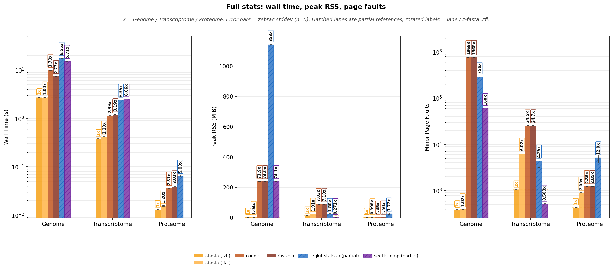
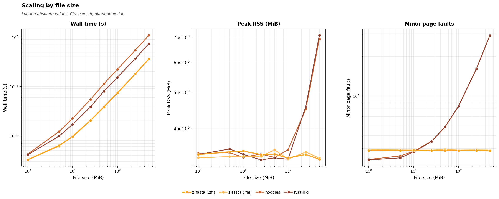
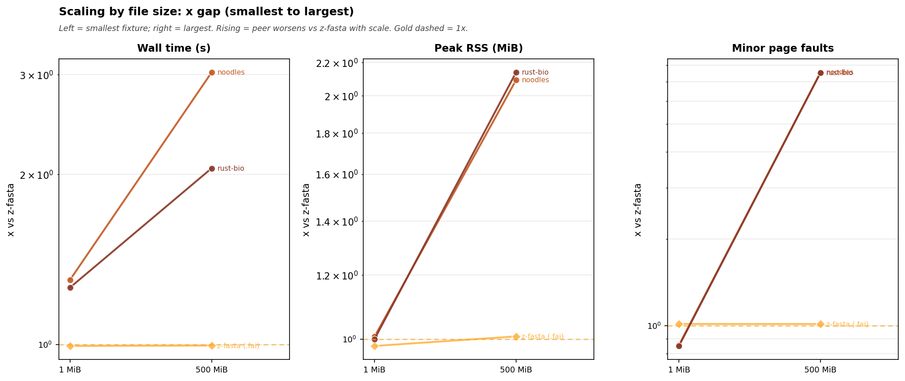
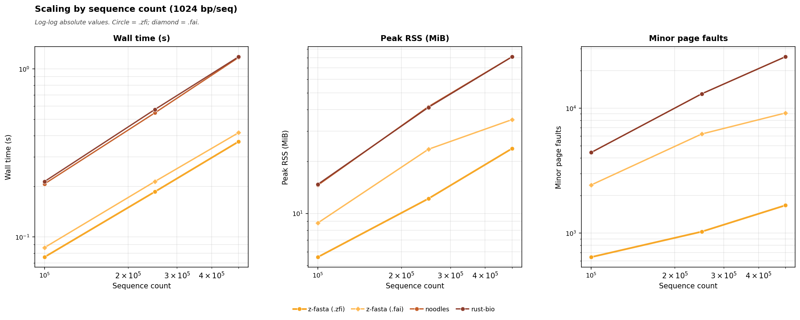
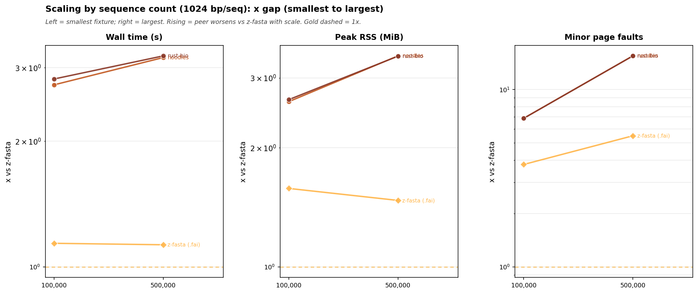

<!-- markdownlint-disable MD024 MD032 MD033 MD036 MD041 MD049 -->

# z-fasta Stats Benchmark Report

_Auto-generated by `bench/stats/generate_report.py` from zebrac results._

## Overview

This report times `z-fasta stats` against clean-FASTA peers on the shared REAL datasets (Genome, Transcriptome, Proteome) and on synthetic size / sequence-count sweeps.

**What is timed**

- **Complete stats:** `z-fasta stats` through `.zfi` and `.fai` vs noodles and rust-bio wrappers that emit the same agreed fields.
- **Partial references:** SeqKit `stats -a` covers assembly summaries and selected DNA composition; Seqtk `comp` covers per-record A/C/G/T/N composition on nucleotide data.
- **Scaling:** the two z-fasta formats plus the two complete Rust peers; partial references are intentionally excluded.

**Index policy:** sidecars are preloaded once. Timed commands only run `stats` / peer tools; index *build* is outside this wall (see `bench/index/REPORT.md`).

Correctness reported **57** passing checks before perf (see `bench/stats/run.sh`).

Correctness values are gated by the independent exact oracle in `bench/stats/oracle.py`, not re-tabulated here.

## What each tool reports

`z-fasta stats` reads length metadata from the selected sidecar, then scans sequence bytes for composition. Peers re-parse the FASTA every time.

### Assembly metrics (lengths / index)

| Metric | z-fasta | noodles | rust-bio | SeqKit `stats -a` | Seqtk `comp` |
| --- | --- | --- | --- | --- | --- |
| Records / total symbols | yes | yes | yes | yes | per-record lengths |
| Shortest / longest / mean / quartiles / median / range | yes | yes | yes | lengths except range | no |
| N50 / L50 / N90 / L90 / auN | yes | yes | yes | N50/L50 only | no |
| Shortest / longest names | yes | yes | yes | no | record names only |

### Composition (sequence scan)

| Metric | z-fasta | noodles | rust-bio | SeqKit `stats -a` | Seqtk `comp` |
| --- | --- | --- | --- | --- | --- |
| Nucleotide type / canonical bases / ambiguity / invalid | yes | yes | yes | type, N/gap totals | A/C/G/T/N plus other columns |
| GC / GC skew / lowercase | yes | yes | yes | GC only | GC derivable, no skew/lowercase |
| Complete protein symbols / stop / invalid / lowercase | yes | yes | yes | type only | no |

**How to read the benches:** Noodles and rust-bio are equivalent-work peers. SeqKit and Seqtk are useful ecosystem references but do less work and are never used for dominance claims. Wrappers are clean-FASTA peers only; messy side-table behavior is a z-fasta correctness gate.

Oracle: [`bench/stats/oracle.py`](oracle.py). Verify: [`bench/stats/run.sh`](run.sh) correctness (`run_tests`).

## Run Provenance

- **Timestamp:** `20261007_092810`
- **Runner:** zebrac (warm)
- **zebrac:** zebrac 0.6.2
- **z-fasta:** z-fasta 0.3.4
- **Samples:** runs=5, warmup=3, duration_ms=5000
- **Metadata:** `metadata_20261007_092810.jsonl`
- **Index preload:** True (build time not included in stats wall)

**Sections**

- `perf_full` -> `perf_full_20261007_092810`
- `scale_size` -> `scale_size_20261007_092810`
- `scale_seqs_fixed` -> `scale_seqs_fixed_20261007_092810`

**Peer versions**

- **seqkit:** seqkit v2.13.0
- **seqtk:** seqtk 1.5-r133
- **noodles:** noodles-fasta 0.66.0 (wrapper)
- **rustbio:** rust-bio 4.0.1 (custom indexer wrapper)
- **samtools:** samtools 1.24

- **Genome:** Homo sapiens GRCh38 primary assembly (Ensembl release 113).
- **Transcriptome:** Homo sapiens GENCODE v46 transcript sequences.
- **Proteome:** Homo sapiens UniProt reference proteome UP000005640.

## Performance: Full stats

Peers re-parse the FASTA. z-fasta loads one selected sidecar and performs a bounded FASTA scan for composition. Baseline for ratios: **z-fasta (.zfi)**. **Figure facets** are wall time, peak RSS, and minor page faults; **x-axis** is dataset; **bar color** is tool (GET RC layout).

## Wall time

Zebrac mean wall time (seconds) for one `stats` / peer process with stdout discarded.

**Table 1:** Mean ± stddev by dataset and tool.

| dataset       | z-fasta (.zfi)   | z-fasta (.fai)   | noodles        | rust-bio      | seqkit stats -a (partial)   | seqtk comp (partial)   |
|:--------------|:-----------------|:-----------------|:---------------|:--------------|:----------------------------|:-----------------------|
| Genome        | 2.685±0.002 s    | 2.687±0.010 s    | 10.012±0.046 s | 7.452±0.019 s | 17.576±0.106 s              | 15.339±0.201 s         |
| Transcriptome | 0.379±0.001 s    | 0.415±0.004 s    | 1.135±0.016 s  | 1.210±0.015 s | 2.406±0.004 s               | 2.526±0.020 s          |
| Proteome      | 0.013±0.000 s    | 0.016±0.000 s    | 0.036±0.000 s  | 0.039±0.000 s | 0.065±0.003 s               |                     |

<strong>Table 2:</strong> Time x = lane wall / z-fasta .zfi. Same ratios as bar labels.

| Dataset       | z-fasta vs                | z-fasta   | Peer     | Time x   |
|:--------------|:--------------------------|:----------|:---------|:---------|
| Genome        | z-fasta (.fai)            | 2.6854s   | 2.6865s  | 1.00x    |
| Genome        | noodles                   | 2.6854s   | 10.0119s | 3.73x    |
| Genome        | rust-bio                  | 2.6854s   | 7.4517s  | 2.77x    |
| Genome        | seqkit stats -a (partial) | 2.6854s   | 17.5758s | 6.55x    |
| Genome        | seqtk comp (partial)      | 2.6854s   | 15.3386s | 5.71x    |
| Transcriptome | z-fasta (.fai)            | 0.3791s   | 0.4154s  | 1.10x    |
| Transcriptome | noodles                   | 0.3791s   | 1.1352s  | 2.99x    |
| Transcriptome | rust-bio                  | 0.3791s   | 1.2104s  | 3.19x    |
| Transcriptome | seqkit stats -a (partial) | 0.3791s   | 2.4064s  | 6.35x    |
| Transcriptome | seqtk comp (partial)      | 0.3791s   | 2.5260s  | 6.66x    |
| Proteome      | z-fasta (.fai)            | 0.0129s   | 0.0155s  | 1.20x    |
| Proteome      | noodles                   | 0.0129s   | 0.0362s  | 2.81x    |
| Proteome      | rust-bio                  | 0.0129s   | 0.0390s  | 3.02x    |
| Proteome      | seqkit stats -a (partial) | 0.0129s   | 0.0646s  | 5.00x    |

## Memory Usage

Peak RSS from zebrac samples for the same full-stats commands.

**Table 3:** Mean ± stddev by dataset and tool.

| dataset       | z-fasta (.zfi)   | z-fasta (.fai)   | noodles       | rust-bio      | seqkit stats -a (partial)   | seqtk comp (partial)   |
|:--------------|:-----------------|:-----------------|:--------------|:--------------|:----------------------------|:-----------------------|
| Genome        | 3.2±0.1 MiB      | 3.4±0.2 MiB      | 239.1±0.2 MiB | 239.1±0.4 MiB | 1141.6±0.4 MiB              | 239.6±0.4 MiB          |
| Transcriptome | 12.4±0.1 MiB     | 23.7±0.1 MiB     | 87.3±0.4 MiB  | 88.2±0.3 MiB  | 22.4±5.0 MiB                | 3.4±0.2 MiB            |
| Proteome      | 3.4±0.1 MiB      | 3.4±0.2 MiB      | 5.0±0.0 MiB   | 5.1±0.1 MiB   | 26.4±4.3 MiB                |                     |

<strong>Table 4:</strong> RSS x = lane peak RSS / z-fasta .zfi.

| Dataset       | z-fasta vs                | z-fasta   | Peer       | RSS x   |
|:--------------|:--------------------------|:----------|:-----------|:--------|
| Genome        | z-fasta (.fai)            | 3.2 MiB   | 3.4 MiB    | 1.04x   |
| Genome        | noodles                   | 3.2 MiB   | 239.1 MiB  | 73.9x   |
| Genome        | rust-bio                  | 3.2 MiB   | 239.1 MiB  | 74.0x   |
| Genome        | seqkit stats -a (partial) | 3.2 MiB   | 1141.6 MiB | 353x    |
| Genome        | seqtk comp (partial)      | 3.2 MiB   | 239.6 MiB  | 74.1x   |
| Transcriptome | z-fasta (.fai)            | 12.4 MiB  | 23.7 MiB   | 1.91x   |
| Transcriptome | noodles                   | 12.4 MiB  | 87.3 MiB   | 7.03x   |
| Transcriptome | rust-bio                  | 12.4 MiB  | 88.2 MiB   | 7.10x   |
| Transcriptome | seqkit stats -a (partial) | 12.4 MiB  | 22.4 MiB   | 1.80x   |
| Transcriptome | seqtk comp (partial)      | 12.4 MiB  | 3.4 MiB    | 0.271x  |
| Proteome      | z-fasta (.fai)            | 3.4 MiB   | 3.4 MiB    | 0.998x  |
| Proteome      | noodles                   | 3.4 MiB   | 5.0 MiB    | 1.45x   |
| Proteome      | rust-bio                  | 3.4 MiB   | 5.1 MiB    | 1.50x   |
| Proteome      | seqkit stats -a (partial) | 3.4 MiB   | 26.4 MiB   | 7.72x   |

## Page Faults

Minor page faults for the same full-stats commands.

**Table 5:** Mean ± stddev by dataset and tool.

| dataset       | z-fasta (.zfi)   | z-fasta (.fai)   | noodles   | rust-bio   | seqkit stats -a (partial)   | seqtk comp (partial)   |
|:--------------|:-----------------|:-----------------|:----------|:-----------|:----------------------------|:-----------------------|
| Genome        | 384±3            | 393±2            | 754932±2  | 754933±1   | 290152±135                  | 61216±4                |
| Transcriptome | 1040±1           | 6260±1           | 25483±3   | 25633±2    | 4417±1287                   | 520±3                  |
| Proteome      | 433±2            | 898±3            | 1236±3    | 1234±2     | 5203±1256                   |                     |

<strong>Table 6:</strong> Faults x = lane minor faults / z-fasta .zfi.

| Dataset       | z-fasta vs                |   z-fasta |   Peer | Faults x   |
|:--------------|:--------------------------|----------:|-------:|:-----------|
| Genome        | z-fasta (.fai)            |       384 |    393 | 1.02x      |
| Genome        | noodles                   |       384 | 754932 | 1968x      |
| Genome        | rust-bio                  |       384 | 754933 | 1968x      |
| Genome        | seqkit stats -a (partial) |       384 | 290152 | 756x       |
| Genome        | seqtk comp (partial)      |       384 |  61216 | 160x       |
| Transcriptome | z-fasta (.fai)            |      1040 |   6260 | 6.02x      |
| Transcriptome | noodles                   |      1040 |  25483 | 24.5x      |
| Transcriptome | rust-bio                  |      1040 |  25633 | 24.7x      |
| Transcriptome | seqkit stats -a (partial) |      1040 |   4417 | 4.25x      |
| Transcriptome | seqtk comp (partial)      |      1040 |    520 | 0.500x     |
| Proteome      | z-fasta (.fai)            |       433 |    898 | 2.08x      |
| Proteome      | noodles                   |       433 |   1236 | 2.86x      |
| Proteome      | rust-bio                  |       433 |   1234 | 2.85x      |
| Proteome      | seqkit stats -a (partial) |       433 |   5203 | 12.0x      |

**Figure 1:** Tables 1, 3, and 5 as grouped bars (datasets on x-axis; tool color from legend).

**Reading Figure 1**

- **Facets:** wall time (log y) | peak RSS (linear) | minor page faults (log y).
- **X-axis:** Genome, Transcriptome, Proteome.
- **Bar colors:** one lane per tool (legend below figure).
- **Bar labels (rotated):** `1x` on z-fasta; peers = peer / z-fasta. Same ratio rules on wall, RSS, and page faults.
- **Hatched bars:** partial-coverage SeqKit and Seqtk references; not equivalent-work dominance comparisons.
- Gold = z-fasta (`.zfi`); orange = z-fasta (`.fai`). Error bars show standard deviation.

## Scaling: file size

Synthetic FASTAs under `bench/shared/cache/scaling/` (generated on demand). Indexes are preloaded; timed work is complete `stats` only. Two figures per sweep: absolute wall / RSS / faults, then whether the x vs z-fasta gap grows from the smallest fixture to the largest. Per-point x values stay in the collapsible tables.

**Table 7:** Mean ± stddev wall time by File size (MiB) and tool.

| File size (MiB)   | z-fasta (.zfi)   | z-fasta (.fai)   | noodles       | rust-bio      |
|:------------------|:-----------------|:-----------------|:--------------|:--------------|
| 1 MiB             | 3.27±0.06 ms     | 3.25±0.06 ms     | 4.25±0.16 ms  | 4.12±0.08 ms  |
| 5 MiB             | 6.35±0.14 ms     | 6.17±0.16 ms     | 0.012±0.000 s | 9.87±0.12 ms  |
| 10 MiB            | 9.58±0.03 ms     | 9.87±0.17 ms     | 0.023±0.000 s | 0.017±0.000 s |
| 25 MiB            | 0.020±0.000 s    | 0.021±0.000 s    | 0.054±0.001 s | 0.039±0.001 s |
| 50 MiB            | 0.038±0.000 s    | 0.039±0.001 s    | 0.114±0.006 s | 0.080±0.007 s |
| 100 MiB           | 0.074±0.000 s    | 0.075±0.002 s    | 0.223±0.005 s | 0.154±0.012 s |
| 250 MiB           | 0.180±0.001 s    | 0.181±0.000 s    | 0.546±0.008 s | 0.368±0.006 s |
| 500 MiB           | 0.361±0.001 s    | 0.359±0.002 s    | 1.093±0.007 s | 0.740±0.026 s |

<strong>Table 8:</strong> Time x = peer / z-fasta at each point.

| File size (MiB)   | z-fasta vs     | z-fasta   | Peer    | Time x   |
|:------------------|:---------------|:----------|:--------|:---------|
| 1 MiB             | z-fasta (.fai) | 0.0033s   | 0.0032s | 0.994x   |
| 1 MiB             | noodles        | 0.0033s   | 0.0042s | 1.30x    |
| 1 MiB             | rust-bio       | 0.0033s   | 0.0041s | 1.26x    |
| 5 MiB             | z-fasta (.fai) | 0.0064s   | 0.0062s | 0.972x   |
| 5 MiB             | noodles        | 0.0064s   | 0.0122s | 1.92x    |
| 5 MiB             | rust-bio       | 0.0064s   | 0.0099s | 1.55x    |
| 10 MiB            | z-fasta (.fai) | 0.0096s   | 0.0099s | 1.03x    |
| 10 MiB            | noodles        | 0.0096s   | 0.0226s | 2.36x    |
| 10 MiB            | rust-bio       | 0.0096s   | 0.0170s | 1.77x    |
| 25 MiB            | z-fasta (.fai) | 0.0205s   | 0.0205s | 1.00x    |
| 25 MiB            | noodles        | 0.0205s   | 0.0544s | 2.65x    |
| 25 MiB            | rust-bio       | 0.0205s   | 0.0386s | 1.88x    |
| 50 MiB            | z-fasta (.fai) | 0.0384s   | 0.0390s | 1.02x    |
| 50 MiB            | noodles        | 0.0384s   | 0.1138s | 2.96x    |
| 50 MiB            | rust-bio       | 0.0384s   | 0.0804s | 2.09x    |
| 100 MiB           | z-fasta (.fai) | 0.0740s   | 0.0748s | 1.01x    |
| 100 MiB           | noodles        | 0.0740s   | 0.2234s | 3.02x    |
| 100 MiB           | rust-bio       | 0.0740s   | 0.1539s | 2.08x    |
| 250 MiB           | z-fasta (.fai) | 0.1805s   | 0.1810s | 1.00x    |
| 250 MiB           | noodles        | 0.1805s   | 0.5461s | 3.03x    |
| 250 MiB           | rust-bio       | 0.1805s   | 0.3682s | 2.04x    |
| 500 MiB           | z-fasta (.fai) | 0.3610s   | 0.3594s | 0.995x   |
| 500 MiB           | noodles        | 0.3610s   | 1.0930s | 3.03x    |
| 500 MiB           | rust-bio       | 0.3610s   | 0.7397s | 2.05x    |

<strong>Table 9:</strong> Peak RSS (MiB) by File size (MiB).

| File size (MiB)   | z-fasta (.zfi)   | z-fasta (.fai)   | noodles     | rust-bio    |
|:------------------|:-----------------|:-----------------|:------------|:------------|
| 1 MiB             | 3.4±0.2 MiB      | 3.3±0.2 MiB      | 3.4±0.2 MiB | 3.4±0.0 MiB |
| 5 MiB             | 3.5±0.2 MiB      | 3.4±0.2 MiB      | 3.4±0.2 MiB | 3.5±0.1 MiB |
| 10 MiB            | 3.5±0.1 MiB      | 3.4±0.1 MiB      | 3.3±0.2 MiB | 3.4±0.2 MiB |
| 25 MiB            | 3.4±0.0 MiB      | 3.4±0.2 MiB      | 3.4±0.1 MiB | 3.3±0.1 MiB |
| 50 MiB            | 3.4±0.2 MiB      | 3.5±0.1 MiB      | 3.3±0.2 MiB | 3.3±0.1 MiB |
| 100 MiB           | 3.3±0.1 MiB      | 3.3±0.2 MiB      | 3.5±0.1 MiB | 3.3±0.1 MiB |
| 250 MiB           | 3.4±0.1 MiB      | 3.5±0.1 MiB      | 4.5±0.1 MiB | 4.6±0.1 MiB |
| 500 MiB           | 3.3±0.1 MiB      | 3.3±0.1 MiB      | 6.9±0.1 MiB | 7.1±0.1 MiB |

<strong>Table 10:</strong> RSS x = peer / z-fasta.

| File size (MiB)   | z-fasta vs     | z-fasta   | Peer    | RSS x   |
|:------------------|:---------------|:----------|:--------|:--------|
| 1 MiB             | z-fasta (.fai) | 3.4 MiB   | 3.3 MiB | 0.981x  |
| 1 MiB             | noodles        | 3.4 MiB   | 3.4 MiB | 1.01x   |
| 1 MiB             | rust-bio       | 3.4 MiB   | 3.4 MiB | 1.000x  |
| 5 MiB             | z-fasta (.fai) | 3.5 MiB   | 3.4 MiB | 0.971x  |
| 5 MiB             | noodles        | 3.5 MiB   | 3.4 MiB | 0.995x  |
| 5 MiB             | rust-bio       | 3.5 MiB   | 3.5 MiB | 1.02x   |
| 10 MiB            | z-fasta (.fai) | 3.5 MiB   | 3.4 MiB | 0.967x  |
| 10 MiB            | noodles        | 3.5 MiB   | 3.3 MiB | 0.963x  |
| 10 MiB            | rust-bio       | 3.5 MiB   | 3.4 MiB | 0.980x  |
| 25 MiB            | z-fasta (.fai) | 3.4 MiB   | 3.4 MiB | 0.989x  |
| 25 MiB            | noodles        | 3.4 MiB   | 3.4 MiB | 1.00x   |
| 25 MiB            | rust-bio       | 3.4 MiB   | 3.3 MiB | 0.968x  |
| 50 MiB            | z-fasta (.fai) | 3.4 MiB   | 3.5 MiB | 1.03x   |
| 50 MiB            | noodles        | 3.4 MiB   | 3.3 MiB | 0.981x  |
| 50 MiB            | rust-bio       | 3.4 MiB   | 3.3 MiB | 0.978x  |
| 100 MiB           | z-fasta (.fai) | 3.3 MiB   | 3.3 MiB | 0.993x  |
| 100 MiB           | noodles        | 3.3 MiB   | 3.5 MiB | 1.05x   |
| 100 MiB           | rust-bio       | 3.3 MiB   | 3.3 MiB | 0.992x  |
| 250 MiB           | z-fasta (.fai) | 3.4 MiB   | 3.5 MiB | 1.02x   |
| 250 MiB           | noodles        | 3.4 MiB   | 4.5 MiB | 1.32x   |
| 250 MiB           | rust-bio       | 3.4 MiB   | 4.6 MiB | 1.34x   |
| 500 MiB           | z-fasta (.fai) | 3.3 MiB   | 3.3 MiB | 1.01x   |
| 500 MiB           | noodles        | 3.3 MiB   | 6.9 MiB | 2.09x   |
| 500 MiB           | rust-bio       | 3.3 MiB   | 7.1 MiB | 2.14x   |

<strong>Table 11:</strong> Minor page faults by File size (MiB).

| File size (MiB)   | z-fasta (.zfi)   | z-fasta (.fai)   | noodles   | rust-bio   |
|:------------------|:-----------------|:-----------------|:----------|:-----------|
| 1 MiB             | 385±2            | 390±2            | 330±1     | 327±3      |
| 5 MiB             | 386±3            | 390±2            | 351±3     | 339±2      |
| 10 MiB            | 387±2            | 389±2            | 380±2     | 376±3      |
| 25 MiB            | 385±1            | 389±3            | 454±5     | 452±3      |
| 50 MiB            | 385±3            | 392±1            | 581±3     | 583±1      |
| 100 MiB           | 385±3            | 389±2            | 839±3     | 838±1      |
| 250 MiB           | 385±2            | 390±3            | 1611±5    | 1607±2     |
| 500 MiB           | 383±1            | 389±3            | 2892±6    | 2886±2     |

<strong>Table 12:</strong> Faults x = peer / z-fasta.

| File size (MiB)   | z-fasta vs     |   z-fasta |   Peer | Faults x   |
|:------------------|:---------------|----------:|-------:|:-----------|
| 1 MiB             | z-fasta (.fai) |       385 |    390 | 1.01x      |
| 1 MiB             | noodles        |       385 |    330 | 0.857x     |
| 1 MiB             | rust-bio       |       385 |    327 | 0.851x     |
| 5 MiB             | z-fasta (.fai) |       386 |    390 | 1.01x      |
| 5 MiB             | noodles        |       386 |    351 | 0.910x     |
| 5 MiB             | rust-bio       |       386 |    339 | 0.880x     |
| 10 MiB            | z-fasta (.fai) |       387 |    389 | 1.00x      |
| 10 MiB            | noodles        |       387 |    380 | 0.981x     |
| 10 MiB            | rust-bio       |       387 |    376 | 0.970x     |
| 25 MiB            | z-fasta (.fai) |       385 |    389 | 1.01x      |
| 25 MiB            | noodles        |       385 |    454 | 1.18x      |
| 25 MiB            | rust-bio       |       385 |    452 | 1.17x      |
| 50 MiB            | z-fasta (.fai) |       385 |    392 | 1.02x      |
| 50 MiB            | noodles        |       385 |    581 | 1.51x      |
| 50 MiB            | rust-bio       |       385 |    583 | 1.51x      |
| 100 MiB           | z-fasta (.fai) |       385 |    389 | 1.01x      |
| 100 MiB           | noodles        |       385 |    839 | 2.18x      |
| 100 MiB           | rust-bio       |       385 |    838 | 2.18x      |
| 250 MiB           | z-fasta (.fai) |       385 |    390 | 1.01x      |
| 250 MiB           | noodles        |       385 |   1611 | 4.18x      |
| 250 MiB           | rust-bio       |       385 |   1607 | 4.17x      |
| 500 MiB           | z-fasta (.fai) |       383 |    389 | 1.01x      |
| 500 MiB           | noodles        |       383 |   2892 | 7.54x      |
| 500 MiB           | rust-bio       |       383 |   2886 | 7.53x      |

**Figure 2:** Absolute wall / RSS / page faults vs File size (MiB) (log-log).

**Reading Figure 2**

- **Facets:** wall time | peak RSS | minor page faults (log-log).
- **X:** File size (MiB). Gold circle = `.zfi`; orange diamond = `.fai`.
- RSS is log-scaled to show both index formats clearly.
- Per-point x vs z-fasta: open the Time / RSS / Faults x tables above.

**Figure 3:** x vs z-fasta at the smallest vs largest fixture.

**Reading Figure 3**

- Left = smallest fixture; right = largest. Gold dashed = 1x.
- Rising = peer gets relatively worse with scale; falling = relatively better.

## Scaling: sequence count (fixed 1024 bp)

Synthetic FASTAs under `bench/shared/cache/scaling/` (generated on demand). Indexes are preloaded; timed work is complete `stats` only. Two figures per sweep: absolute wall / RSS / faults, then whether the x vs z-fasta gap grows from the smallest fixture to the largest. Per-point x values stay in the collapsible tables.

**Table 13:** Mean ± stddev wall time by Sequence count and tool.

|   Sequence count | z-fasta (.zfi)   | z-fasta (.fai)   | noodles       | rust-bio      |
|-----------------:|:-----------------|:-----------------|:--------------|:--------------|
|          100,000 | 0.076±0.000 s    | 0.086±0.000 s    | 0.207±0.004 s | 0.213±0.003 s |
|          250,000 | 0.186±0.001 s    | 0.214±0.002 s    | 0.548±0.007 s | 0.574±0.009 s |
|          500,000 | 0.369±0.002 s    | 0.417±0.001 s    | 1.170±0.028 s | 1.181±0.013 s |

<strong>Table 14:</strong> Time x = peer / z-fasta at each point.

|   Sequence count | z-fasta vs     | z-fasta   | Peer    | Time x   |
|-----------------:|:---------------|:----------|:--------|:---------|
|          100,000 | z-fasta (.fai) | 0.0758s   | 0.0863s | 1.14x    |
|          100,000 | noodles        | 0.0758s   | 0.2067s | 2.73x    |
|          100,000 | rust-bio       | 0.0758s   | 0.2135s | 2.82x    |
|          250,000 | z-fasta (.fai) | 0.1858s   | 0.2138s | 1.15x    |
|          250,000 | noodles        | 0.1858s   | 0.5480s | 2.95x    |
|          250,000 | rust-bio       | 0.1858s   | 0.5739s | 3.09x    |
|          500,000 | z-fasta (.fai) | 0.3692s   | 0.4171s | 1.13x    |
|          500,000 | noodles        | 0.3692s   | 1.1700s | 3.17x    |
|          500,000 | rust-bio       | 0.3692s   | 1.1807s | 3.20x    |

<strong>Table 15:</strong> Peak RSS (MiB) by Sequence count.

|   Sequence count | z-fasta (.zfi)   | z-fasta (.fai)   | noodles      | rust-bio     |
|-----------------:|:-----------------|:-----------------|:-------------|:-------------|
|          100,000 | 5.6±0.0 MiB      | 8.8±0.0 MiB      | 14.6±0.2 MiB | 14.8±0.2 MiB |
|          250,000 | 12.2±0.1 MiB     | 23.6±0.0 MiB     | 41.6±0.2 MiB | 41.2±0.2 MiB |
|          500,000 | 23.8±0.1 MiB     | 35.0±0.1 MiB     | 81.1±0.3 MiB | 80.9±0.5 MiB |

<strong>Table 16:</strong> RSS x = peer / z-fasta.

|   Sequence count | z-fasta vs     | z-fasta   | Peer     | RSS x   |
|-----------------:|:---------------|:----------|:---------|:--------|
|          100,000 | z-fasta (.fai) | 5.6 MiB   | 8.8 MiB  | 1.58x   |
|          100,000 | noodles        | 5.6 MiB   | 14.6 MiB | 2.61x   |
|          100,000 | rust-bio       | 5.6 MiB   | 14.8 MiB | 2.64x   |
|          250,000 | z-fasta (.fai) | 12.2 MiB  | 23.6 MiB | 1.93x   |
|          250,000 | noodles        | 12.2 MiB  | 41.6 MiB | 3.42x   |
|          250,000 | rust-bio       | 12.2 MiB  | 41.2 MiB | 3.38x   |
|          500,000 | z-fasta (.fai) | 23.8 MiB  | 35.0 MiB | 1.47x   |
|          500,000 | noodles        | 23.8 MiB  | 81.1 MiB | 3.41x   |
|          500,000 | rust-bio       | 23.8 MiB  | 80.9 MiB | 3.40x   |

<strong>Table 17:</strong> Minor page faults by Sequence count.

|   Sequence count | z-fasta (.zfi)   | z-fasta (.fai)   | noodles   | rust-bio   |
|-----------------:|:-----------------|:-----------------|:----------|:-----------|
|          100,000 | 642±2            | 2427±3           | 4419±3    | 4417±4     |
|          250,000 | 1027±3           | 6211±4           | 13030±5   | 13027±3    |
|          500,000 | 1667±2           | 9143±2           | 25783±4   | 25775±4    |

<strong>Table 18:</strong> Faults x = peer / z-fasta.

|   Sequence count | z-fasta vs     |   z-fasta |   Peer | Faults x   |
|-----------------:|:---------------|----------:|-------:|:-----------|
|          100,000 | z-fasta (.fai) |       642 |   2427 | 3.78x      |
|          100,000 | noodles        |       642 |   4419 | 6.88x      |
|          100,000 | rust-bio       |       642 |   4417 | 6.88x      |
|          250,000 | z-fasta (.fai) |      1027 |   6211 | 6.05x      |
|          250,000 | noodles        |      1027 |  13030 | 12.7x      |
|          250,000 | rust-bio       |      1027 |  13027 | 12.7x      |
|          500,000 | z-fasta (.fai) |      1667 |   9143 | 5.48x      |
|          500,000 | noodles        |      1667 |  25783 | 15.5x      |
|          500,000 | rust-bio       |      1667 |  25775 | 15.5x      |

**Figure 4:** Absolute wall / RSS / page faults vs Sequence count (log-log).

**Reading Figure 4**

- **Facets:** wall time | peak RSS | minor page faults (log-log).
- **X:** Sequence count. Gold circle = `.zfi`; orange diamond = `.fai`.
- RSS is log-scaled to show both index formats clearly.
- Per-point x vs z-fasta: open the Time / RSS / Faults x tables above.

**Figure 5:** x vs z-fasta at the smallest vs largest fixture.

**Reading Figure 5**

- Left = smallest fixture; right = largest. Gold dashed = 1x.
- Rising = peer gets relatively worse with scale; falling = relatively better.

